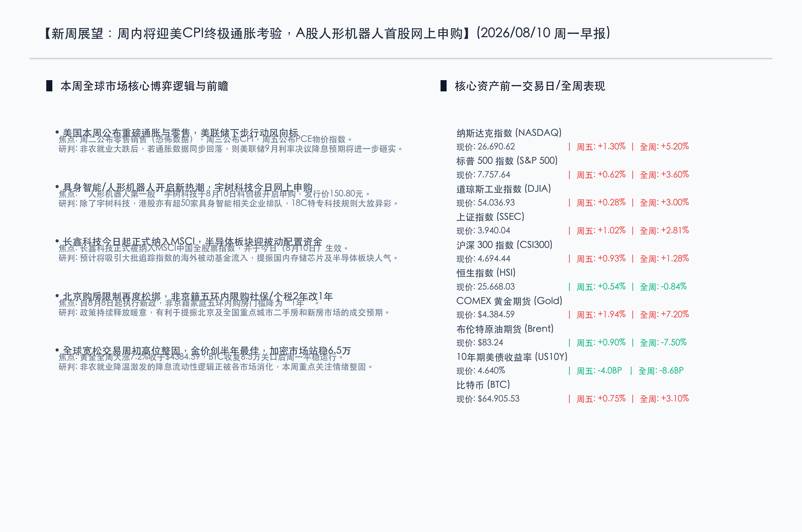

# 终极数据周前瞻：美联储降息逻辑迎CPI大考，人形机器人与半导体双翼齐飞

**日期：2026年08月10日 (星期一)** &nbsp; **时段：周一早报 (新周展望模式)**

> **核心摘要**：本周全球市场迎来关键性博弈。非农爆冷带来的降息预期重燃将面临本周二“恐怖数据”零售销售、周三CPI及周五PCE物价指数的连续印证。国内市场方面，7月CPI温和上涨0.5%，北京五环内非京籍限购社保/个税年限正式由2年缩减为1年，长鑫科技今日正式纳入MSCI，且“人形机器人第一股”宇树科技于今日开启申购。流动性宽松与新兴科技浪潮共振，有望为新一周市场开盘注入强劲动能。

## 周末财经要闻终极汇总

*   **国家统计局发布7月CPI同比上涨0.5%**：国家统计局发布数据，7月份全国居民消费价格（CPI）同比上涨 **0.5%**，总体保持温和上涨态势；工业生产者出厂价格（PPI）同比上涨 **3.5%**，涨幅较上月回落 **0.6个百分点**，显示物价整体运行平稳，宏观政策仍有充裕的施策空间。
*   **北京楼市调控再现优化，非京籍五环内限购减半**：北京市住建委等部门发文，自8月8日起，非京籍家庭购买五环内商品住房的社保或个税缴纳年限由 **“2年”** 调减为 **“1年”**。这是北京落实“因城施策”的又一重磅举措，将有效提振北京及重点城市群的二手房与新房成交预期。
*   **中国央行黄金储备实现连续21个月增持**：中国央行公布数据，7月末黄金储备为 **7608万盎司**（6月末为7544万盎司），连续第21个月实现增持，体现了官方储备多元化和抗风险资产配置的长期逻辑。
*   **沪深交易所拟完善LOF退出机制**：交易所就《退市规则》公开征求意见，拟明确商品期货LOF、QDII LOF以及连续60个交易日场内资产净值均低于 **1000万元** 的小规模LOF应当终止上市，旨在出清绩差小微产品，保护投资者利益。
*   **全球非农爆冷激活降息预期，比特币ETF吸金能力强劲**：受美国7月非农就业大跌2.3万刺激，美元指数偏软，黄金大涨7.2%创半年最佳单周表现，比特币站稳 **6.5万美元** 关口。上周美股 spot 比特币 ETF 录得 **2.52亿美元** 净流入，显示出机构配置资金稳步回补。

## 新一周市场核心博弈逻辑

> **美联储货币政策“终局裁判”逼近**：非农就业超预期爆冷确立了美联储下半年政策的底线，但鲍威尔在降息前仍需确凿的通胀回落证据。本周的CPI与零售数据将成为核心博弈点。如果CPI数据确认通胀下行轨道无虞，市场关于9月降息的博弈将彻底尘埃落定；若通胀数据超预期反弹，市场将再度面临流动性预期的剧烈摇摆。

> **人形机器人商用化浪潮提速**：国内“人形机器人第一股”宇树科技于8月10日（今日）正式在科创板开启申购，发行价格高达 **150.80元/股**。结合港股市场超50家具身智能相关企业排队等待18C特专科技规则上市，人形机器人产业将成为本周市场高景气度、高情绪的绝对焦点。

> **半导体与芯片板块迎外资配置增量**：长鑫科技（CXMT）正式被纳入MSCI中国全股票指数，该调整于8月10日（今日）正式生效。追踪指数的被动配置资金预计将集中流入，利好以长鑫科技为代表的国产存储芯片、半导体封测及算力硬件产业链。

## 本周重磅经济数据与会议前瞻

新一周是今年下半年最密集的宏观超级周之一，经济指标、利率决议与科技事件多重交织：

*   **周一（08月10日）**：美国将公布 **PMI 终值数据**（包含制造业与服务业），观察实体经济活跃度；长鑫科技纳入MSCI正式生效。
*   **周二（08月11日）**：美国公布7月 **零售销售数据 (Retail Sales)**（俗称“恐怖数据”）；**澳大利亚联储 (RBA)** 将公布最新利率决议。
*   **周三（08月12日）**：**美国7月未季调CPI同比/环比**数据公布，为本周最重要的宏观数据；德国公布HICP终值；港股腾讯控股（00700）披露最新财报。
*   **周四（08月13日）**：**英国央行 (BoE)**、**日本央行 (BoJ)** 陆续公布利率决议；美国公布7月PPI及二季度GDP修正值；谷歌将召开 Made by Google 硬件新品发布会。
*   **周五（08月14日）**：美国公布最受美联储青睐的通胀指标—— **7月核心PCE物价指数**，为本轮政策大考收官。

## 头部券商/投行开盘策略点睛

*   **中信证券 (Citing Securities)**：近期政策“组合拳”力度不减，北京限制性政策优化和央行增持黄金显示出呵护市场和稳健的宏观思路。当前市场风格正经历重构，红利高股息板块仍是底仓压舱石，但以人形机器人、芯片为代表的科技成长风格在流动性宽松预期下具备更强弹性。
*   **中金公司 (CICC)**：外资流入是本周A/H两市的核心变量。长鑫科技正式纳入MSCI及非农降温带来的美债收益率下挫，有望吸引海外被动和主动型外汇基金回补中国优质资产。建议聚焦半导体、先进制造成长赛道以及港股互联网龙头。
*   **华泰证券 (Huatai Securities)**：具身智能赛道迎里程碑事件。宇树科技的发行申购将对A股人形机器人板块产生强烈的情绪催化作用。随着港股18C章规则发力，具身智能产业链的核心零部件（电机、减速器、传感器等）将迎来估值和基本面的双重重构。

## 今日市场情绪：人形启航，晨光初现

在今日的市场情绪图景中，一个线条流畅的铬合金人形机器人静静矗立在巍峨的蓝色水晶悬崖边缘。它的右手托起一枚散发着耀眼翠绿色光芒的半透明水晶球，球体内部有无数由金色二进制代码与晶体管线路交织而成的流动数据。机器人将目光投向远方的地平线，在那里，一轮巨大的初升旭日正在将金黄色的温暖晨光洒向深蓝色的天际。背景中，代表着全球金融与科技精密运作的巨大金色齿轮正静静咬合并顺畅旋转，几张半透明的金色经济K线图表如同云雾般在天际中轻盈漂浮。画面中没有人类的踪迹，但处处洋溢着由具身智能科技带给市场的无限希望，以及降息流动性逻辑带来的温暖春意。

> Prompt: Surrealism style, Subject: A sleek, chrome humanoid robot standing on a soaring crystalline cliffside, holding a glowing crystal orb filled with swirling binary data. The robot is looking towards the horizon where a warm, bright dawn breaks. In the background, massive golden gears of a global clockwork mechanism are turning smoothly, and floating glowing sheets of economic charts drift like clouds in a deep blue sky. No humans. No text., masterpiece, high detail, intricate composition, cinematic lighting, 8k resolution

---

*免责声明：内容仅供参考，不构成投资建议。*
