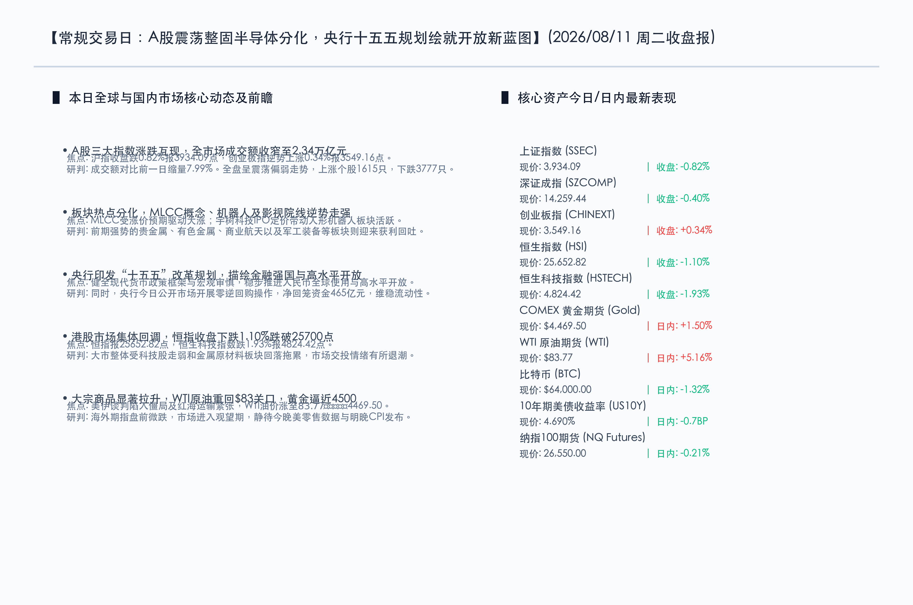

# 央行“十五五”规划绘就金融强国蓝图，A股震荡整固机器人与MLCC逆势走强，WTI原油拉升重回$83关口

**日期：2026年08月11日 (星期二)** &nbsp; **时段：晚报 (常规交易日模式 A)**

> **核心摘要**：今日A股市场呈现震荡调整态势，上证指数收跌0.82%报3934.09点，全市场成交额收窄至2.34万亿元。宏观政策面迎来重磅指引，央行印发《“十五五”改革发展规划》确立金融强国与高水平双向开放的新格局。大宗商品表现强势，在地缘政治不确定性及供应紧缺推动下，WTI原油大涨超5%重回83美元上方，黄金亦高位偏强逼近4500美元大关，全球流动性在静待美联储CPI验证前维持整固期。

## 核心行情复盘

*   **三大指数表现**：上证指数全天震荡调整，收盘下跌 **0.82%** 报 **3,934.09点**；深证成指收盘下跌 **0.40%** 报 **14,259.44点**；创业板指表现相对偏强，收盘逆势上涨 **0.34%** 报 **3,549.16点**；北证50指数收盘下跌 **0.86%** 报 **1,113.22点**。
*   **港股市场表现**：港股主要指数震荡下行，恒生指数收跌 **1.10%** 报 **25,652.82点**，恒生科技指数收跌 **1.93%** 报 **4,824.42点**，大市整体受科技股与原材料板块回落压制。
*   **成交额与资金面**：沪深京三市全天成交总额约 **2.34万亿元**，较前一交易日的2.52万亿元缩量约 **7.99%**（约2031亿元）。市场跌多涨少，上涨个股1615只，下跌3777只，赚钱效应约为 **29.95%**。
*   **行业板块表现**：
    *   **领涨行业**：MLCC（多层陶瓷电容器）概念、影视院线、人形机器人、创新药、油气开采、药店及逆变器板块表现活跃，超纯应材（C超纯）在创业板首发上市交投活跃。
    *   **领跌行业**：贵金属、有色金属（包括小金属、钨、钴）、商业航天及军工装备等板块跌幅居前，高位板块面临一定的获利回吐压力，爱丽家居因异常波动停牌。

## 核心解读与市场逻辑

1.  **MLCC涨价预期催化电子元器件板块逆势活跃**：
    > MLCC（多层陶瓷电容器）板块今日表现亮眼，受供需紧缺及涨价预期双重驱动。随着AI终端渗透、新能源车电子化率提升以及手机链温和复苏，MLCC作为基础电子元器件的库存周期见底向上。主力资金在行情调整期寻找确定性，推升了以MLCC为首的硬件零组件板块。
2.  **宇树科技IPO定价点燃人形机器人具身智能热情**：
    > 人形机器人概念板块今日逆势活跃，主要受宇树科技IPO定价公布并开启申购的事件催化。具身智能作为AI与物理世界交互的终极载体，其代表性企业的上市极大地丰富了A股AI硬件的投资坐标，提振了资金对于产业链中精密减速器、伺服电机和力控传感器等核心零部件商业化落地的信心。
3.  **前期强势板块高低轮动，黄金有色阶段性降温**：
    > 前期较为强势的贵金属、有色金属、商业航天等板块今日集体回调。虽然地缘政治紧张局势未解，且美联储宽松逻辑不改，但由于相关资产短期获利筹码拥挤，遭遇了阶段性的获利了结与高低切换。资金在震荡市中向相对低位的创业板科技成长股及医药消费板块分流。

## 政策脉动

1.  **央行印发“十五五”改革规划，确立金融强国与高水平双向开放新蓝图**：
    > 中国人民银行印发《“十五五”改革发展规划》，并配套9份细分行动方案。该规划强调健全中国特色现代货币政策框架与宏观审慎，增强总量和结构功能；稳步推进人民币全球使用，深化金融市场双向开放，巩固香港国际金融中心地位，为我国实体经济的转型升级提供了长期稳定的顶层金融制度框架。
2.  **央行公开市场逆回购操作量归零，资金面合理充裕基调未改**：
    > 2026年8月11日，央行根据一级交易商需求，当日7天期逆回购操作量为零，伴随465亿元逆回购到期，实现单日净回笼465亿元。机构研判，央行当前公开市场调控体现“锁短放长”特征，总体流动性宽松底座依然稳固，资金利率中枢有望维持稳中略降。
3.  **地缘政治博弈加剧，大宗商品强劲拉升推高输入性通胀预期**：
    > 美伊在霍尔木兹海峡的谈判陷入僵局，地缘政治冲突担忧再次推高国际油价，WTI原油暴涨重回$83/桶关口。避险资产COMEX黄金期货受流动性宽松预期叠加支撑，亦强劲拉升至$4469.50/盎司，创下近期高点。这在巩固能源金属估值的同时，也对全球通胀回落路径和各主要经济体利率决策带来一定扰动。

## 最新机构观点

*   **中信证券 (CITIC)**：
    > 建议投资者当前在配置上应逐步转向均衡化，降低对边缘资产的暴露，进一步向具备核心竞争力的科技硬件龙头及估值合理的顺周期景气方向靠拢。随着中报密集披露，市场的博弈逻辑将向“现实验证”进行重构。
*   **中国银河证券 (Galaxy Securities)**：
    > 指出8月市场逻辑正由“预期博弈”向“现实验证”过渡，中报窗口期的业绩兑现将决定后续个股反弹的斜率与成色。当前A股在筹码清洗和估值调整后修复基础坚实，但后续行情的分化将更加聚焦中报绩优股。
*   **高盛 (Goldman Sachs)**：
    > 认为虽然科技股和部分资源板块短期由于高估值面临获利回吐压力，但全球AI基础设施建设与具身智能机器人领域的长期资本开支周期仍将延续。建议投资者除单一赛道外关注有核心壁垒的硬科技龙头，并警惕过度拥挤带来的短期波动。

## 今日市场情绪：金钥开门，铁骑负重

在今日的市场情绪图景中，一柄巨大的金色钥匙悬浮在布满雷电的暮色天际，其钥匙身由复杂的集成电路和金币符号组成，正缓缓转动以解锁一扇高耸入云的古老石造避难所大门。大门缓缓移开，露出了内部满载绿光的科技山谷，象征着央行“十五五”规划所开启的金融高水平对外开放与科技金融发展蓝图。背景中，一片由黏稠黑色石油汇聚成的黑暗海洋正掀起滔天巨浪，波浪的尖端呈现出锯齿状的红色K线形态，体现了WTI原油的大幅暴涨和地缘局势的紧绷。在海岸线上，一尊巨大的高精密度机械人形机器人静静伫立，它的金属外壳上反射着晚霞的红光，双手平稳地端着一杆金色的天平，一侧是碧绿的芯片叶片，另一侧是闪闪发光的金币，展示着具身智能与市场在高低切换中的力量均衡。

> Prompt: Surrealism style, Subject: A giant glowing golden key woven from shiny silicon circuits unlocks a colossal stone vault door on a mountain peak, revealing a glowing valley of emerald light. Background: In the background, a stormy dark ocean of liquid black crude oil has waves shaped like red K-line candlesticks. A giant mechanical humanoid robot stands on the shore holding a golden balance scale. No text. No humans., masterpiece, high detail, intricate composition, cinematic lighting, 8k resolution

---

*免责声明：内容仅供参考，不构成投资建议。*

---
*Powered by Finance-Auto-Gen Pipeline (v3)*
