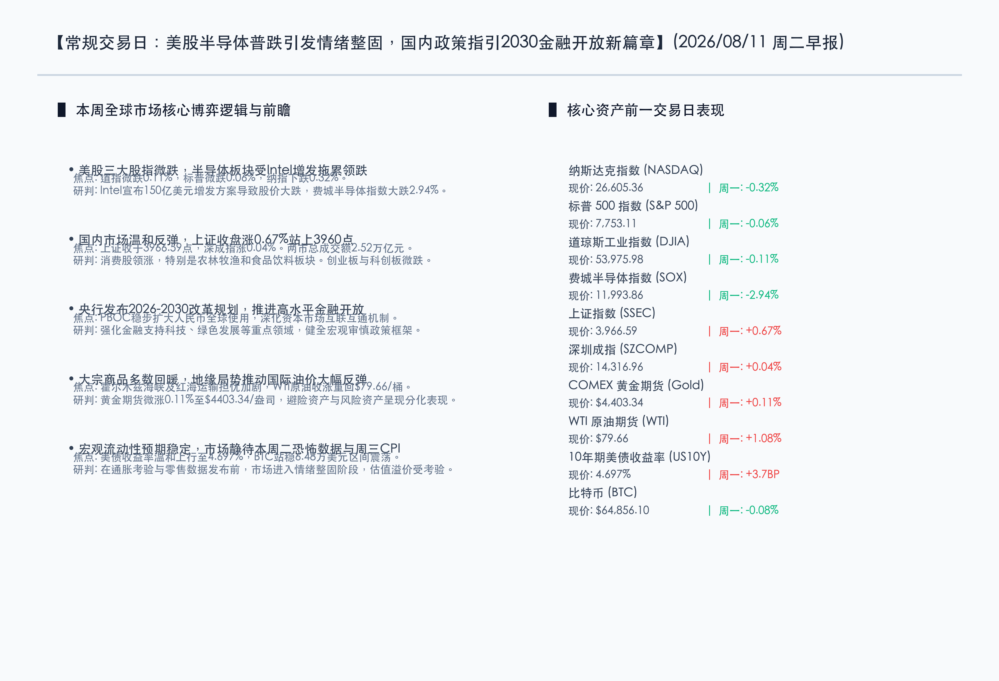

# 半导体普跌致指数震荡整理，央行指引金融高水平开放，油价地缘反弹

**日期：2026年08月11日 (星期二)** &nbsp; **时段：周二早报 (常规交易日模式)**

> **核心摘要**：昨日全球市场进入盘整偏弱格局，受英特尔公布150亿美元增发方案拖累，美股半导体板块集体回调，费城半导体指数跌幅近3%。国内市场表现稳健，上证指数逆势微涨0.67%，农林牧渔与贵金属领涨。政策端，央行发布2026-2030改革发展规划，明确指出将审慎推进高水平金融双向开放与人民币国际化。

## 核心行情复盘

周一全球市场表现分化。美股在科技股拖累下普遍低迷，而国内A股市场则录得平稳反弹：

*   **美股三大股指收跌**：道琼斯工业指数微跌 **0.11%**（收于53,975.98点）；标普500指数微跌 **0.06%**（收于7,753.11点）；纳斯达克指数下跌 **0.32%**（收于26,605.36点）。
*   **半导体及芯片板块领跌**：费城半导体指数（SOX）大跌 **2.94%**，收于11,993.86点。英特尔（Intel）因宣布150亿美元普通股增发方案，股价重挫超过4.6%，导致半导体行业情绪普遍走低。
*   **国内A股逆势走强**：上证指数上涨 **0.67%**，收报3,966.59点；深证成指微涨 **0.04%**，收报14,316.96点。两市成交额维持在 **2.52万亿元**。板块方面，家禽、乳制品及贵金属行业领涨，而共封装光学（CPO）和非金属材料板块跌幅居前。
*   **避险与商品资产走强**：受中东局势及霍尔木兹海峡/红海地缘冲突引发的供应担忧推动，WTI原油期货大幅收涨 **1.08%**，报 **$79.66/桶**。COMEX黄金期货微升 **0.11%**，收于 **$4,403.34/盎司**。
*   **债市与加密市场整固**：10年期美国国债收益率小幅上行3.7个基点至 **4.697%**。比特币表现平稳，微跌 **0.08%** 至 **$64,856.10** 附近。

## 核心解读与市场逻辑

> **英特尔增发激起科技板块泡沫担忧**：英特尔本次宣布的150亿美元巨额公募增发，直接刺痛了本已高度敏感的市场神经。为了支撑其晶圆代工业务（Foundry）及技术转型，英特尔对资金的持续渴求加深了投资者对其短期现金流的担忧，稀释效应也导致股价大幅下滑。同时，这再次触发了华尔街关于“AI硬件投资回报率（ROI）”的激烈辩论，使费城半导体指数承压大跌2.94%。

> **地缘政治溢价重返能源市场**：红海及霍尔木兹海峡附近的最新冲突加剧了原油供应链的紧张预期。由于这些关键航道承担了全球主要的海运石油运输，局势的恶化使得WTI原油回升至79.66美元/桶。尽管美联储紧缩政策周期预期稳定，但供应端的扰动再次成为了油价反弹的主导力量。

## 政策脉动

*   **中国人民银行发布2026-2030年改革与发展规划**：规划的核心任务包括“审慎推进”高水平的金融开放，稳步扩大人民币的跨境及全球使用，深化境内外市场的互联互通机制。同时，央行强调要继续完善现代货币政策框架，提供合理的流动性以支持实体经济，并进一步加强宏观审慎政策以抵御系统性金融风险，优先导向科技创新、绿色转型及普惠金融。
*   **监管重申市场稳定与严打内幕交易**：证监会持续推进维护市场秩序的常态化沟通机制，并重申了自7月27日施行的内幕交易认定新规。新规将内幕信息泄露的监管节点前移至“初步意向阶段”，意在构筑更为公平透明的制度防线，呵护资本市场的长期健康运行。

## 最新机构观点

*   **摩根大通 (J.P. Morgan)**：在美联储7月会议将利率维持在3.50%–3.75%之后，委员会内出现多名鹰派成员倾向于加息的投票偏好。我们更新了政策展望，预计美联储不仅在短期内不会降息，反而可能由于顽固的通胀压力，在2026年12月会议上面临加息25个基点的决策窗口。
*   **高盛 (Goldman Sachs)**：当前的通胀在很大程度上是结构性和供给端扰动造成的，传统的利率政策在应对此类成本推动型通胀时存在局限。预计美联储将长期维持“更高更久”的观望态度，并谨慎评估关税传导及能源价格波动带来的负面外溢效应。
*   **摩根士丹利 (Morgan Stanley)**：债券市场长期高企的收益率已经对金融市场起到了事实上的紧缩作用，这在一定程度上替代了美联储进一步加息的必要性。宏观层面，随着关税及供应链重组的边际影响逐步落地，政策利率在一段时期内维持现行水平将是大概率事件。

## 今日市场情绪：情绪整固，静候指引

在今日的市场情绪图景中，一个线条流畅、洁白如玉的微芯片状大理石灯塔巍然屹立于黑色的金属服务器机架悬崖之上。它在深沉而压抑的暗红色暴风雨云层中，投射出一道明亮且令人振奋的翡翠绿激光束，穿透了重重迷雾。在灯塔下方，是一片汹涌澎湃的黑色原油海洋，海浪之上跳跃并闪烁着明暗交错的红色与绿色霓虹K线指标。天际的边缘，一轮温暖的金黄色旭日正缓缓升起，将柔和的曙光洒向逐渐放晴的夜空，一只白色的光纤和平鸽正在这股晨光中展翅翱翔。画面中没有任何人类的痕迹，冷峻而精密的科技元素与地缘大宗商品的汹涌动能相互交织，传递着市场在经历半导体板块大幅整固后，对后续宏观通胀大考的谨慎期盼与坚定坚守。

> Prompt: Subject: A sleek white marble lighthouse shaped like a microchip, standing on a dark cliff made of silver server racks. The lighthouse casts a bright emerald-green beam of light through thick red storm clouds. Background: In the background, a warm golden sun rises, reflecting on a turbulent sea of black liquid crude oil with neon candlestick patterns. A single white dove glides peacefully through the clearing sky. No humans. No text., masterpiece, high detail, intricate composition, cinematic lighting, 8k resolution

---

*免责声明：内容仅供参考，不构成投资建议。*
