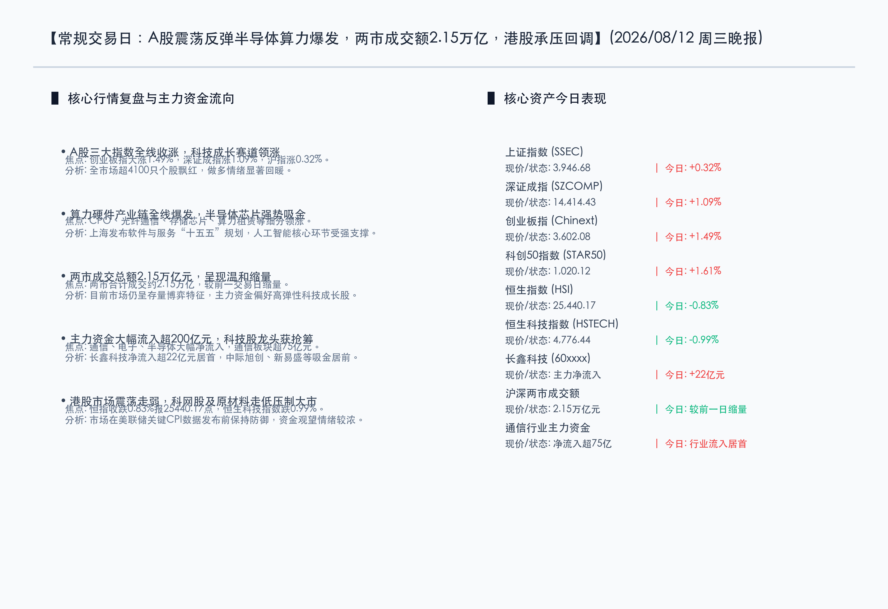

# A股反弹创业板涨1.49%半导体算力全线爆发，上海印发“十五五”软件规划，港股逆势调整科技股走弱

**日期：2026年08月12日 (星期三)** &nbsp; **时段：晚报 (常规交易日模式 A)**

> **核心摘要**：今日A股市场呈现震荡反弹态态势，科技成长赛道全线爆发，创业板指大涨1.49%，全市场超4100只个股上涨，两市成交额温和缩量至2.15万亿元。上海市印发“十五五”软件与信息服务业规划，强力提振人工智能算力与芯片本土化信心。港股市场则逆势震荡走弱，恒生指数收跌0.83%报25440.17点，科技与资源板块表现低迷，在美联储关键CPI数据公布前，全球资金维持防御性防御。

## 核心行情复盘

*   **三大指数表现**：A股市场今日震荡走强，科创及成长股引领反弹。上证指数全天宽幅震荡，收盘上涨 **0.32%** 报 **3,946.68点**；深证成指收盘上涨 **1.09%** 报 **14,414.43点**；创业板指表现强劲，收盘上涨 **1.49%** 报 **3,602.08点**；科创50指数大涨 **1.61%** 报 **1,020.12点**。
*   **港股市场表现**：港股主要指数弱势整理，恒生指数收跌 **0.83%** 报 **25,440.17点**，恒生科技指数收跌 **0.99%** 报 **4,776.44点**，科网股及原材料板块表现疲软压制大盘。
*   **成交额与资金面**：沪深两市全天成交额合计约 **2.15万亿元**，较前一交易日有所缩量，呈现存量博弈特征。市场做多氛围较浓，上涨个股超4100只，呈现小型普涨行情。主力资金全天净流入超 **200亿元**，其中科技硬件赛道获大幅增仓。
*   **行业板块表现**：
    *   **领涨行业**：科技板块成为核心主线，算力硬件全线爆发。CPO（共封装光学）、光纤通信、存储芯片、半导体及算力租赁等细分领域领涨。大消费、房地产、医药生物等板块亦表现活跃。
    *   **领跌行业**：油气概念等部分周期板块呈现震荡调整，油气、煤炭、电力等板块走弱。医药、建筑工程、生物制品等板块主力资金呈现净流出。

## 核心解读与市场逻辑

1.  **算力硬件产业链全线爆发，CPO与存储芯片吸金显著**：
    > 今日科技硬件板块特别是CPO、存储芯片与光模块板块涨幅居前。全球AI算力需求持续旺盛，美股AI巨头（如CoreWeave等）强劲的财报数据打消了市场对于短期AI硬件投资泡沫的疑虑，进一步修复了全球科技赛道的风险偏好。主力资金大规模向电子和通信板块转移，通信板块单日吸金超75亿元，长鑫科技净流入超22亿元居个股首位。
2.  **存量资金博弈特征显著，小盘与成长股风格占优**：
    > 虽然两市超过4100只个股上涨，展现出良好的赚钱效应，但全天成交额缩量至2.15万亿元。在无明显增量资金入场的背景下，市场呈现显著的“高弹性成长股对周期资源股”的虹吸效应，油气、电力、煤炭等红利防御板块走弱，资金流入弹性更高的半导体及具身智能相关概念股。
3.  **港股走势受阻，科网股及避险观望情绪压制**：
    > 港股今日并未跟随A股反弹，恒指及恒生科技指数双双收跌。主要由于美联储货币政策去前瞻化引导后，市场正密切关注即将公布的美国7月CPI数据。在此重要宏观数据揭晓前，外资及港股本土资金普遍采取防御和观望态度，大型科网股与周期股因缺乏资金支持而走势低迷。

## 政策脉动

1.  **上海发布软件和信息服务业“十五五”规划，人工智能迎顶层支撑**：
    > 上海市印发《上海市软件和信息服务业发展“十五五”规划》，明确提出将聚力人工智能技术攻关，重点布局物理智能、算力集群及自主芯片等核心环节。该规划的发布为本地科技企业开辟了长期政策绿灯，强化了算力基础设施和半导体本土化链条的成长预期。
2.  **市场消化逆周期调节红利，稳增长政策预期提供底部支撑**：
    > 近期监管部门连续释放“加大逆周期调节力度”及促消费、促科技创新政策红利，市场正处于政策效力消化期。政策对于科技成长赛道和数字经济的定向呵护，为A股在当前关键技术突破期提供了坚实的制度和情绪底座。
3.  **市场静待美国7月CPI数据，全球流动性预期面临关键验证**：
    > 宏观层面，全球市场目前维持高位整固。美联储9月利率决议的走向在很大程度上取决于即将公布的美国7月CPI通胀数据。尽管全球地缘政治紧张仍推高大宗商品溢价，但流动性宽松方向未改，数据揭晓将是确定后续全球流动性斜率的试金石。

## 最新机构观点

*   **主流机构分析**：
    > 美股AI巨头的财报表现强劲，带动了全球科技风险偏好的修复，直接利好A股相关算力与硬件赛道。不过，需要警惕短期科技板块拥挤度快速提升带来的获利盘兑现压力。
*   **中信建投/中金公司等券商**：
    > 随着中报披露进入密集期，8月市场逻辑正由“预期博弈”向“现实验证”过渡。建议投资者均衡配置，一方面聚焦于上半年业绩预增、海外订单充足的科技硬件及出口链龙头；另一方面，可适度配置资源和红利板块作为防御对冲。

## 今日市场情绪：科技展翼，碧玉春回

在今日的市场情绪图景中，一尊由绿色晶体芯片精密构建的机械凤凰在天空中展翅翱翔，它的羽翼上流淌着代表数据和算力的亮绿光芒，象征着A股半导体与算力硬件的全面爆发。凤凰的下方，是一座古老数字城市的遗迹，巨大的集成电路柱体与斑驳的石门交织在一起，正向外散发着科技突破的勃勃生机。而在城市的背景中，由黑色石油汇聚成的深邃海洋上，冰封着呈锯齿状的红色K线形态波浪，体现出周期资源股回调及港股走弱所带来的市场博弈和冷酷环境。整个画面呈现出一幅在挣扎与蜕变中，硬科技如凤凰涅槃般的超现实宏大科幻场景。

> Prompt: Surrealism style, Subject: An advanced digital city rises with vibrant green laser beams glowing from data circuits, symbolizing technology breakthrough. Background: In the background, waves of dark water are frozen like jagged red K-line candlesticks, depicting the struggling stock market. In the foreground, a detailed mechanical phoenix spreads its wings. No text. No humans., masterpiece, high detail, intricate composition, cinematic lighting, 8k resolution

---

*免责声明：内容仅供参考，不构成投资建议。*

---
*Powered by Finance-Auto-Gen Pipeline (v3)*
