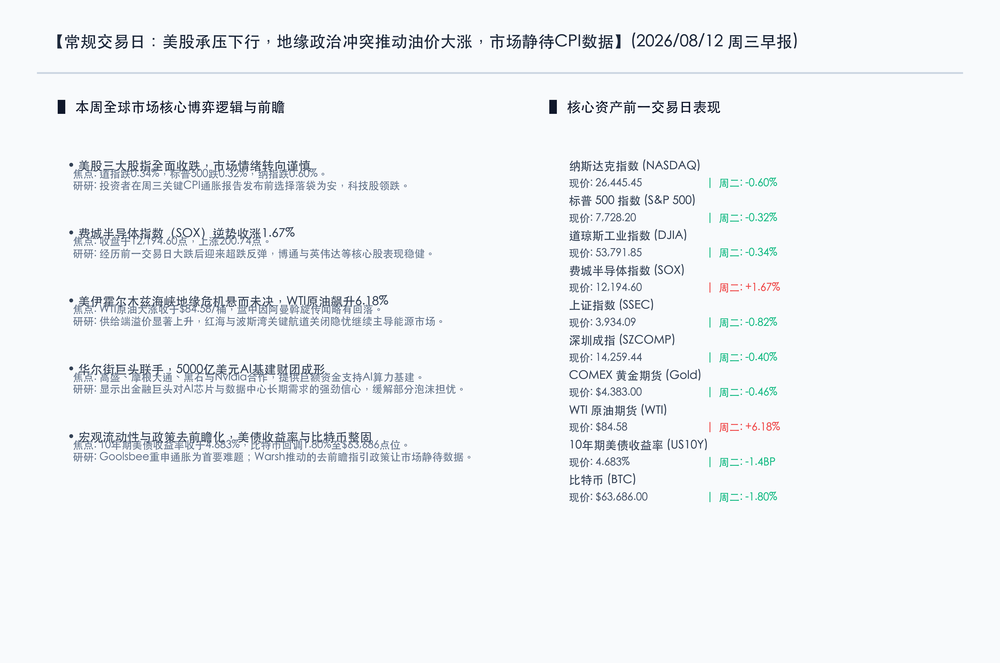
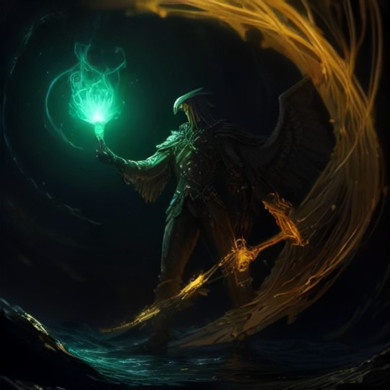

# 华尔街筹组五千亿AI基建基金，地缘博弈助推油价暴涨，市场静待CPI大考

**日期：2026年08月12日 (星期三)** &nbsp; **时段：周三早报 (常规交易日模式)**

> **核心摘要**：昨日美股三大指数在关键CPI通胀数据发布前全线收跌，科技股领跌。但费城半导体指数逆势反弹1.67%，高盛、摩根大通等多家华尔街巨头联手英伟达组建5000亿美元AI基建基金，提振了芯片板块情绪。地缘政治方面，美伊在波斯湾及霍尔木兹海峡的对峙导致原油供应担忧剧增，WTI原油飙升6.18%至84.58美元/桶，成为大宗商品最大焦点。

## 核心行情复盘

周二全球主要金融市场呈现出明显的避险与板块分化特征，美股全线收低，大宗商品大幅波动：

*   **美股三大股指全面收跌**：道琼斯工业指数下跌 **181.59点**，跌幅 **0.34%**（收于53,791.85点）；标普500指数下跌 **24.54点**，跌幅 **0.32%**（收于7,728.20点）；纳斯达克指数下跌 **159.36点**，跌幅 **0.60%**（收于26,445.45点）。小盘股表现略好，罗素2000指数逆势微涨 **0.27%**。
*   **半导体板块超跌反弹**：费城半导体指数（SOX）收涨 **1.67%**，收报12,194.60点，抹去了前一交易日的大部分跌幅。英特尔（Intel）增发恐慌稍歇，在AI算力长期高额资本开支（Capex）的预期支撑下，博通与英伟达等核心股在盘中探底回升。
*   **A股市场三大指数涨跌不一**：昨日上证指数下跌 **0.82%**，收报3,934.09点；深证成指下跌 **0.40%**，收报14,259.44点。沪深两市全天成交额约为 **2.34万亿元**。
*   **大宗商品地缘溢价飙升**：美伊霍尔木兹海峡冲突风险悬而未决，WTI原油期货暴涨 **6.18%**，收于 **$84.58/桶**；尽管盘中传出阿曼正处于调停“高级阶段”的消息，但供给阻断忧虑仍占上风。COMEX黄金期货小幅回调 **0.46%**，收于 **$4,383.00/盎司**。
*   **美债与加密市场保持整固**：10年期美国国债收益率微跌1.4个基点，收报 **4.683%**。比特币震荡走软，下跌 **1.80%**，收报 **$63,686.00**。

## 核心解读与市场逻辑

> **五千亿AI基建财团成形，构筑算力长期估值底座**：由高盛、摩根大通、黑石等华尔街金融巨头与英伟达（Nvidia）联合发起筹组的5000亿美元AI基础设施基金成为市场最大亮色。该项目的推出表明，尽管目前市场对“AI投资回报率（ROI）”充满争议，但传统资本巨头对芯片、数据中心及能源基建等长期硬科技资本开支依然抱有绝对信心，这也是昨日SOX半导体指数能够逆势上行1.67%的底层驱动力。

> **波斯湾地缘危机发酵，原油供给侧二次通胀担忧抬头**：伊朗方面表态若美方不答应其和平协议条件，将继续关闭每日承载全球五分之一原油运力的霍尔木兹海峡。这一“切断大动脉”的隐忧直接刺激WTI原油单日飙升超6%。虽然阿曼等国在积极调停，但在地缘博弈常态化的背景下，原油的高地缘溢价极易传导至全球运输链，给即将出炉的CPI数据蒙上了一层供给端二次通胀的阴影。

## 政策脉动

*   **美联储重申抗通胀决心，去“前瞻指引”增加市场波动性**：芝加哥联储主席古尔斯比（Austan Goolsbee）在讲话中重申，通胀和家庭承受力依旧是联储面临的“头号难题”，在降息前必须看到持续的通胀向2%回落的证据。与此同时，新任主席凯文·沃什（Kevin Warsh）推行的“去前瞻指引（Forward Guidance）”框架正在重塑华尔街。美联储不再预先向市场暗示未来的加息/降息路径，要求投资者直接根据宏观数据做出定价，这使得周三的CPI数据成为了决定九月利率决议绝对的“风向标”。
*   **美联储五大工作组推进重大货币框架重组**：美联储当前通过五大工作组（涉及通胀框架、数据、生产力与就业、沟通及资产负债表政策）展开政策审查。此举旨在应对长期超出通胀目标造成的信誉流失，是2012年以来最重大的框架评估。

## 最新机构观点

*   **摩根大通 (J.P. Morgan)**：AI基础设施的建设正在转入“重资产”阶段。我们参与了这次5000亿美元的融资财团，预计2026年全球AI相关总开支将轻易突破1万亿美元。虽然高利率增加了项目融资成本，但硬算力作为科技主权核心资产，其需求增长的确定性远远高于普通商业板块。
*   **高盛 (Goldman Sachs)**：我们正在作为联席账簿管理人积极协助英特尔完成upsized后的200亿美元普通股增发。虽然这在短期内对半导体行业估值造成了稀释压力，但从长期来看，制造本土化是半导体产业的必然路径。我们认为美联储在沃什的领导下，货币政策会更显“数据驱动”，投资者在配置上应保持现金流健康。
*   **摩根士丹利 (Morgan Stanley)**：美联储停止利率前瞻指引后，债券市场波动率（MOVE指数）将保持在历史高位。没有了联储的口头抚慰，每一次通胀和就业数据的偏差都将引发市场的剧烈重估。周三的CPI若高于预期，市场对9月份加息的隐性担忧将快速重返台面。

## 今日市场情绪：地缘红光与硬科技金钥交织

在今日的市场情绪图景中，一把由闪耀的硅片电路与绿色霓虹光纤交织而成的巨大金色钥匙（象征着华尔街5000亿基建资金），巍然悬浮在一片由黑色原油构成的汹涌怒涛之上。在背景里，一座由银灰色服务器机架砌筑而成的巨型天平在深邃夜空中静静矗立，一端是散发着危险红色警示光的CPI通胀文档，另一端则是闪烁着温暖翡翠绿光芒的半导体芯片。天际边缘，一道赤红色的地缘冲突雷电正劈开重重迷雾，但地平线处一轮金色的初阳正喷薄而出，将希望的微光洒向逐渐放晴的夜空，一只金色的机械和平鸽正扇动着齿轮羽翼，迎着朝阳翱翔。

> Prompt: Surrealism style, Subject: A massive golden key woven from glowing silicon microchips and neon fiber-optic cables, representing a massive AI funding package, floats above a turbulent sea of dark crude oil. Background: In the background, a giant scales of justice made of silver server racks balances a glowing red document against a glowing green semiconductor chip. A mechanical eagle made of golden gears and circuit boards glides through a stormy sky with red lightning as a warm golden sun rises on the horizon. No humans. No text., masterpiece, high detail, intricate composition, cinematic lighting, 8k resolution

---

*免责声明：内容仅供参考，不构成投资建议。*
