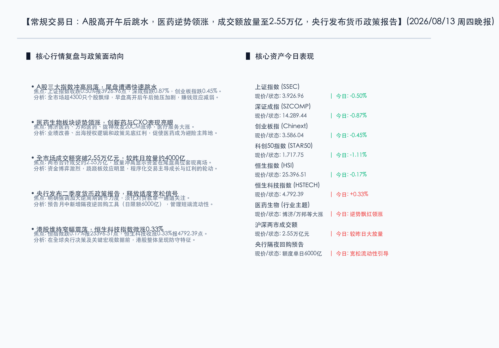

# A股高开午后跳水沪指跌0.5%，医药生物板块逆势领涨，两市成交额大放量至2.55万亿，央行重磅发布二季度货币政策报告

**日期：2026年08月13日 (星期四)** &nbsp; **时段：晚报 (常规交易日模式 A)**

> **核心摘要**：今日A股市场冲高回落，三大指数午后快速跳水集体收绿，全市场超4300只个股下跌，但两市成交额显著放量至2.55万亿元，呈现出冲高过程中资金获利了结的特征。医药生物板块（尤其是创新药与CXO概念）在业绩改善和出海授权预期提振下逆势爆发，成为市场最强避风港。政策面上，央行重磅发布二季度货币政策报告，释放加大逆周期调节及月中创设隔夜逆回购等流动性维稳红利，为市场提供坚实底部支撑。

## 核心行情复盘

*   **三大指数表现**：今日A股三大指数全天震荡下行，尾盘跳水加剧。上证指数收盘下跌 **0.50%** 报 **3,926.96点**；深证成指收盘下跌 **0.87%** 报 **14,289.44点**；创业板指收盘下跌 **0.45%** 报 **3,586.04点**；科创50指数收盘下跌 **1.11%** 报 **1,717.75点**。
*   **港股市场表现**：港股主要指数呈现分化和窄幅震荡态势，恒生指数收跌 **0.17%** 报 **25,396.51点**，恒生科技指数逆势微涨 **0.33%** 报 **4,792.39点**，整体受外围地缘及流动性预期博弈压制。
*   **成交额与资金面**：沪深两市全天成交额合计约 **2.55万亿元**，较前一交易日大幅放量约 **3,985亿元**。市场震荡加剧，尾盘抛压较重导致盘中追高资金被套，整体呈现出明显的存量资金博弈和快节奏轮动特征。
*   **行业板块表现**：
    *   **领涨行业**：医药生物板块一枝独秀，创新药、CXO（合同研发外包）及医药商业等细分领域震荡走强，博济医药、万邦医药、陇神戎发“20CM”涨停，体现出极强的避险属性。电力板块和食品饮料板块午后也有所活跃。
    *   **领跌行业**：贵金属板块领跌，黄金、白银冲高回落；有色金属（铝等）、房地产、石油石化等周期及权重板块跌幅居前。

## 核心解读与市场逻辑

1.  **冲高回落与尾盘跳水，大放量折射获利盘兑现压力**：
    > 今日大盘高开后一路走弱，午后更出现快速跳水，最终收跌。两市成交额大放量至2.55万亿元，意味着在早盘高开时有部分买入力量，但在震荡下行及午后跳水过程中，短线获利盘与解套盘涌出，导致资金高位结账离场。这种放量下跌反映出市场在4000点关口附近情绪较为敏感。
2.  **医药板块逆势爆发，避险属性与出海红利双重驱动**：
    > 在成长与周期板块集体回调时，医药生物板块逆势领涨，多股20CM涨停。这一方面是由于大盘走弱时的资金避险需求，另一方面是行业基本面出现拐点，2026上半年创新药海外License-out成交踊跃，叠加中报业绩改善预期，扭转了此前市场对政策压制的悲观情绪，资金流入CXO及创新药进行防御性配置。
3.  **资金博弈极其剧烈，程序化交易主导跷跷板效应**：
    > 盘面显示，在AI科技、半导体等“科技硬件阵营”和煤炭、电力、银行等“红利权重阵营”之间，量化程序化交易主导了极快的行业轮动与吸金跷跷板。由于缺乏持续的大量增量资金入场，资金快速从昨日大涨的算力硬件等科技概念流出，转向医药及防御板块。

## 政策脉动

1.  **央行二季度货币政策报告发布，强调加大逆周期调节力度**：
    > 中国人民银行发布了《2026年第二季度中国货币政策执行报告》，重申实施“适度宽松”的政策基调，加大逆周期调节力度。报告明确提出淡化贷款单一指标关注，推动融资结构优化，定向呵护科技创新与中小微企业。
2.  **隔夜逆回购首次年中开展，短端流动性管理工具升级**：
    > 央行预告将在8月14日和17日至19日开展每日不超过6000亿元的隔夜逆回购操作。这是隔夜操作工具首次在月中实施，标志着央行对银行体系流动性需求的主动定向补充，保障金融系统流动性合理充裕，有效稳定短端利率预期。
3.  **外部通胀数据公布在即，全球流动性斜率面临重定价**：
    > 宏观上，市场正密切关注美国关键CPI通胀数据的披露。全球资金在地缘溢价与流动性预期之间反复拉锯，这也导致港股等离岸市场在今日表现得更为审慎防御，静待美联储后续政策信号的明朗。

## 最新机构观点

*   **中信建投证券**：
    > 2026年上半年医药行业已逐步筑底。当前创新药正进入“商业化与全球化出海”双轮驱动的新阶段，具有差异化管线和海外商业化落地能力的企业具备强成长韧性。此外，虽然AI算力硬件短期出现分化，但AI在医药研发、制药全链条的赋能作用正在加速落地。
*   **中金公司**：
    > 建议投资者重点关注生命科学上游行业。在双抗、ADC等新分子模态迭代及License-out频频落地的催化下，国内创新药研发生态改善，将持续拉动上游研发工具的资本支出。国产具备核心技术和出海潜力的一体化龙头企业有望率先迎来估值与利润双升。

## 今日市场情绪：绿野仙踪，灵药仙樽

在今日震荡调整的市场情绪中，一樽巨大的半透明晶体药剂樽置于画面中央，其内部交织编织着代表生物科技的亮绿色叶脉与金色的双螺旋DNA结构，象征着医药生物板块在乱市中逆势爆发，扮演着生命力盎然的“避风港”角色。而在背景中，由黑色石油汇聚而成的波涛汹涌的海洋上，结着参差不齐的红色K线形态冰晶波浪，代表着A股冲高回落的动荡大市。在昏暗的暴雨天空中，一尊Colossal（巨大的）黄金天平秤悬浮在雷云之间，正向下投射出一束温暖的金色防守性光罩，将晶体樽牢牢护在其中，寓意着央行货币政策执行报告所释放的逆周期调节红利及隔夜回购资金，为市场提供坚实流动性底座的政策呵护。

> Prompt: Surrealism style, Subject: A glowing transparent crystal flask containing vibrant green leafy vines and golden double-helix DNA structures, symbolizing defensive bio-medicine. Background: In the background, a turbulent dark ocean of black crude oil has waves shaped like jagged red K-line candlesticks. A colossal golden scales of justice floats in the stormy sky, casting a warm protective golden light onto the flask. No humans. No text., masterpiece, high detail, intricate composition, cinematic lighting, 8k resolution

---

*免责声明：内容仅供参考，不构成投资建议。*

---
*Powered by Finance-Auto-Gen Pipeline (v3)*
