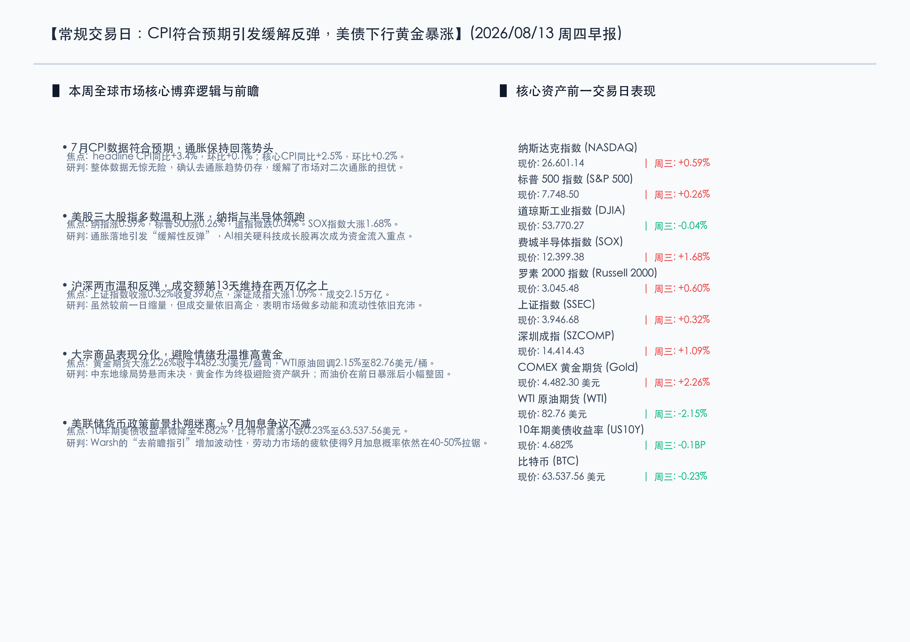

# CPI通胀如期降温点燃缓解行情，避险黄金飙涨创高，美联储9月决策悬念犹存

**日期：2026年08月13日 (星期四)** &nbsp; **时段：周四早报 (常规交易日模式)**

> **核心摘要**：美国7月CPI数据如期降温，整体与核心通胀指标均符合市场预期，确认全球第一大经济体的去通胀（Disinflation）进程依然完好，引燃市场“缓解性反弹”。美股多数温和收涨，费半指数飙涨1.68%领跑。大宗商品方面，中东地缘博弈悬而未决持续提振黄金避险需求，COMEX黄金大涨2.26%创下历史新高；油价在前期暴涨后小幅整固。然而，劳动力市场走弱与通胀韧性博弈，使美联储在“去前瞻指引”下的9月决策依旧被市场视作一场硬币正反面的拉锯战。

## 核心行情复盘

周三全球主要金融市场在重磅CPI数据公布后展开缓解反弹，美股及A股指数普遍上扬，避险金价大涨：

*   **美股多数温和上涨**：纳斯达克指数上涨 **155.70点**，涨幅 **0.59%**（收于26,601.14点）；标普500指数上涨 **20.30点**，涨幅 **0.26%**（收于7,748.50点）；道琼斯工业指数微跌 **21.58点**，跌幅 **0.04%**（收于53,770.27点）。代表小盘股的罗素2000指数上涨 **0.60%**，收报3,045.48点。
*   **科技与半导体领跑反弹**：费城半导体指数（SOX）大涨 **1.68%**，收报12,399.38点，芯片板块在通胀压力缓解与AI硬件基建中长期开支信心的支撑下延续强势。
*   **A股市场温和普涨**：昨日上证指数上涨 **0.32%**，收报3,946.68点，收复3940点关口；深证成指大涨 **1.09%**，收报14,414.43点。沪深两市全天成交额合计为 **2.15万亿元**，较上一交易日缩量1,685.63亿元，但仍为连续第13个交易日突破2万亿元。
*   **黄金创高而油价整固**：避险情绪与利率下行双重推动下，COMEX黄金期货暴涨 **2.26%**，收于 **4,482.30美元/盎司**，创历史新高。WTI原油期货在周二大涨逾6%后迎来整固，回调 **2.15%**，收报 **82.76美元/桶**。
*   **债市收益率走低，加密货币整固**：10年期美国国债收益率微降0.1个基点，收报 **4.682%**。比特币表现平淡，小幅下跌 **0.23%**，收于 **63,537.56美元**。

## 核心解读与市场逻辑

> **CPI通胀如期降温，消解二次通胀恐慌**：美国7月整体CPI同比上涨3.4%，环比上涨0.1%；核心CPI同比上涨2.5%，环比上涨0.2%，各项数据均完美符合市场普遍预期。随着通胀指标创下近年新低，市场此前因大宗商品及供应链摩擦引发的二次通胀担忧被证伪。这种“无惊无险”的数据表现极大地安抚了华尔街的焦虑情绪，引发了全球成长股与芯片板块的“缓解性买盘”。

> **美联储9月利率博弈成“硬币拉锯战”**：尽管去通胀轨迹明确，但7月通胀报告并未给9月降息或加息路径盖棺定论。由于美联储近期采取了“去前瞻指引”的政策框架，货币政策决策完全变成“数据驱动”。一方面， sticky 的服务业通胀和部分进口商品（如电子设备与车配零部件）的“黄牌预警”让鹰派保持警惕；另一方面，上周初请失业金及非农数据（减少2.3万个工作岗位）显露出就业疲软，这让鸽派担忧紧缩过度。目前市场预计9月决策处于硬币正反面拉锯的“悬念期”。

> **避险金羽展翅，地缘与通胀周期的完美对冲**：中东波斯湾局势和霍尔木兹海峡的航道冲突风险并未实质消退，这构成了黄金等硬实物资产的底层溢价支撑。加之美债收益率温和下行，黄金昨日飙升逾2.2%刷新历史纪录。这反映出市场在消化温和通胀数据（利好流动性）的同时，依然高度警惕潜在的地缘尾部风险，以黄金完成了风险对冲。

## 政策脉动

*   **美联储去前瞻指引让渡定价权，宏观事件敏感度激增**：在凯文·沃什（Kevin Warsh）的去前瞻指引治理下，美联储委员不再对未来政策做出明确暗示。这种框架逼迫市场投资者必须直接根据宏观数据自发定价，这也是为什么本次CPI数据落地后，债市波动率（MOVE指数）依旧高企。美债收益率的窄幅震荡反映出在缺乏政策抚慰的背景下，投资者对于每一次数据的公布都抱持着“开盲盒”般的谨慎。
*   **国内资金面宽裕，连续突破两万亿交易额提供坚实底部**：国内A股市场在缩量至2.15万亿的背景下依然维持强势上涨，沪深两市成交额已连续13个交易日维持在2万亿元以上。政策面上，针对科技创新和新质生产力的定向呵护政策持续消化，充沛的流动性成为A股科技成长赛道不断突破的坚实保障。

## 最新机构观点

*   **高盛 (Goldman Sachs)**：7月CPI数据证实，美国长达五年的去通胀轨迹并未脱轨，但这也并非“宣称胜利”的时刻。服务业通胀仍然存在一定粘性，加之进口商品通胀潜伏的不确定性，美联储的决策会高度敏感于接下来的就业和高频经济指标。我们建议投资者维持在科技硬件与优质现金流企业上的超额配置。
*   **摩根士丹利 (Morgan Stanley)**：美联储9月加息的隐性担忧并未被彻底扫除。由于沃什废除了前瞻指引，未来几个月的每次宏观数据落地都将变成“悬念事件”。债券市场的波动将常态化维持高位，短期内美债收益率在4.6%-4.7%的窄幅整固可能是主基调，大宗商品的波动也正成为宏观对冲的新战场。
*   **中金公司 (CICC)**：A股近期在2万亿成交量上方的持续震荡并走高，本质上是在消化近期的逆周期调节政策。科技硬件和半导体设备本土化依然是阻力最小、确定性最高的成长方向。随着中报披露进入深水区，资金将加快向业绩预增和海外订单充足的科技龙头倾斜，短期缩量并不改变多头结构。

## 今日市场情绪：金羽拂天，指针待明

在今日的市场情绪图景中，一枚代表着美联储货币政策指针的巨大金色硬币正悬立在钢丝般的绿色荧光光轨（象征着CPI降温的缓解路径）边缘，呈现出摇摇欲坠的平衡状态。硬币的左侧，一只由灿烂金羽和集成电路组合而成的凤凰正拍打着双翼，迎着漫天璀璨的星辰振翅翱翔，将黄金价格的历史新高投射在天幕之上；硬币的右侧，漫天由黑色原油化成的雨水渐渐收敛，落在长满红色与绿色K线晶体植被的硅质地表。在深邃背景中，一座巨大的由服务器机架铸造的银色天平在天际静默伫立，指针悬停在中点，等待着未来的经济指针做出抉择，整幅画面透露出对降温数据的释怀与对政策终极去向的探求交织而成的宏大科幻张力。

> Prompt: Surrealism style, Subject: A giant golden coin representing the Federal Reserve's policy is poised on its edge, balancing on a narrow bridge of glowing green light. On one side of the bridge, a majestic golden phoenix representing surging gold prices rises toward a clear sky. On the other side, a dark storm of oil-like rain dissipates into the horizon, with green and red candlestick patterns on the ground. Background: A colossal scales of justice made of glowing silver server racks is balanced perfectly. No text. No humans., masterpiece, high detail, intricate composition, cinematic lighting, 8k resolution

---

*免责声明：内容仅供参考，不构成投资建议。*

---
*Powered by Finance-Auto-Gen Pipeline (v3)*
