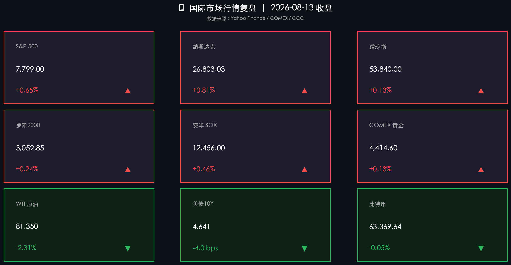

# 科技领涨全面回暖，油价跳水债市松绑，美股延续反弹至7800点关口

**日期：2026年08月14日 (星期五)** &nbsp; **时段：周五早报 (常规交易日·国际市场)**

> **核心摘要**：美股周三延续反弹势头，标普500强势突破7,800点大关，科技与半导体板块领衔冲锋，纳斯达克综合指数大涨0.81%。国际油价急挫2.31%至81.35美元/桶，市场将供应预期转向宽松，对通胀路径构成正面缓解效应。与此同时，美债10年期收益率单日大幅下行4.1个基点至4.641%，为近两周新低，债市的松绑与股市的亢奋形成共振，宏观"软着陆+降息期权"叙事再度升温。

## 核心行情复盘

周三（8月13日）美国市场全面回暖，股市、债市、大宗商品之间的跷跷板呈现"股涨油跌债收益率降"的"理想降息预期组合"：

*   **纳斯达克领跑科技牛市**：纳斯达克综合指数大涨 **214.54点**，涨幅 **+0.81%**，收于 **26,803.03点**，创近期新高区间，科技股全面解冻，AI算力与云计算概念持续获得资金追捧。
*   **标普500突破7800整数关口**：标普500指数上涨 **50.50点**，涨幅 **+0.65%**，收于 **7,799.00点**，盘中一度触及 **7,816.70点** 的历史新高，多头气势如虹，创年内最强收盘之一。
*   **道琼斯维持强势整固**：道琼斯工业指数小幅上涨 **69.73点**，涨幅 **+0.13%**，收于 **53,840.00点**，传统蓝筹在标普和纳指创新高之际保持稳健跟涨。
*   **费半SOX指数年内加速反弹**：费城半导体指数（SOX）上涨 **+0.46%**，收于 **12,456.00点**，较本轮低点已累计反弹逾127%；AI大算力基建的庞大订单预期支撑芯片股中长期估值扩张。
*   **罗素2000小盘股同步补涨**：罗素2000指数上涨 **+0.24%**，收于 **3,052.85点**，小盘股在利率下行预期催化下持续受益，表明本轮反弹正向风险资产的宽广层面扩散。
*   **黄金高位盘整，维持强势结构**：COMEX黄金期货微涨 **+0.13%**，收于 **4,414.60美元/盎司**，在历史高位区间保持强势震荡，避险需求与实际利率下行双重逻辑依然成立。
*   **WTI原油急跌，通胀预期收窄**：WTI原油期货大跌 **1.92美元**，跌幅 **-2.31%**，收于 **81.35美元/桶**，IEA月报下调全球石油需求增速预期，叠加美元边际走强，令原油单日大幅承压。
*   **美债10年期收益率大幅下行**：10年期美国国债收益率下行 **4.1个基点**，收于 **4.641%**，为本轮债市松绑的重要信号，直接带动成长股估值修复。
*   **比特币维持震荡横盘**：比特币小幅微跌 **-0.05%**，收于 **63,369美元**，加密货币市场在美股乐观情绪中保持中性，短期缺乏独立驱动催化剂。

## 核心解读与市场逻辑

> **"软着陆+降息预期"叙事重掌方向盘**：美债10年期收益率单日4.1bps的回落，是驱动本轮反弹的核心变量。近期宏观数据呈现令市场满意的"温和衰退"信号：就业数据适度走弱，CPI温和去化，PPI亦未出现超预期反弹。这一组合令市场形成"通胀可控、经济软着陆、美联储9月有望启动降息准备期"的价格共识，资金旋即涌入对利率高度敏感的科技成长与半导体板块。标普500盘中触及历史新高7,816.70点，正是上述预期的集中验证。

> **油价急跌为通胀降温加持，"完美降息环境"拼图趋于完整**：WTI原油在IEA月报大幅下调全球需求增长预测后重挫2.31%。石油价格是美国通胀的"最后一道防线"——能源成本的系统性回落，将在未来1-2个月的CPI数据中形成可观的下拉效应，有效夯实美联储年内政策转向的基础。高盛、美银均已将能源回落视为"为降息打开空间的关键外部力量"。

> **费半年内大幅领涨，AI基建周期继续定价**：SOX指数自本年初低点的大幅累积反弹，反映了全球AI芯片产业供应链从震荡期进入确定性扩张周期的深刻判断。英伟达、博通、台积电ADR等核心持仓在资金的轮番加持下不断刷新估值上限，背后是数据中心资本开支从"试探性部署"向"规模化基建"跃迁的逻辑演进。

## 政策脉动

*   **美联储"软着陆策略窗口"正在打开**：美债收益率走低叠加油价回落，令美联储政策压力显著减轻。市场对今年年底前首次降息的定价概率已升至较高区间。沃什（Kevin Warsh）领导的美联储委员会虽未做出前瞻承诺，但多位地区主席近期措辞明显趋向鸽派，为政策转向留出余地。
*   **IEA月报下调石油需求，能源博弈格局转变**：国际能源署（IEA）将2026年全球石油需求增速下调至约85万桶/日，低于OPEC+预期的110万桶/日，供需预期差扩大，短期利空原油、中长期利多通胀降温与风险资产估值。
*   **美财政部债务融资动态**：本周美财政部在3年期、10年期、30年期国债的联合拍卖中，均实现"需求超额认购"，间接竞标者比例升至历史高位，显示海外机构投资者对美元资产的配置需求依然旺盛，为美债市场的稳定提供支撑。

## 最新机构观点

*   **高盛 (Goldman Sachs)**：本周美股的"债收益率下行+科技领涨"组合堪称近年来最为高效的风险资产定价范式。我们维持年底标普500目标价7,900点不变，并强调在降息预期主导叙事的阶段，科技、半导体与医疗成长是最值得超配的三大赛道。随着能源价格系统性回落，核心PCE数据的超预期下行将是触发下一波估值扩张的最重要催化剂。

*   **摩根大通 (JP Morgan)**：我们对当前市场的乐观情绪保持审慎。标普500盘中触及历史新高7,816点固然提振人心，但在美联储未正式启动降息窗口之前，任何超买信号都需要密切警惕。我们关注下周公布的美国7月核心PCE数据：若该数据再度低于预期，将确认市场的降息时间线押注，届时多头动能有望再次加速；若数据偏强，则需要小心阶段性的均值回归压力。

*   **中信证券 (CITIC Securities)**：美股本轮反弹的"成色"高于预期——从单纯的情绪修复演变为业绩与预期的双轮驱动。这对A股科技成长板块构成持续的正向溢出效应，港股AI算力相关龙头股有望在今日开盘后承接此前美股上涨的外溢效应，建议投资者关注英伟达产业链中的国内受益标的，以及以国产算力芯片为核心的AI基础设施配置机会。

## 今日市场情绪：量子占星，星河涨落

在漫无边际的宇宙图书馆中，一位身披量子星辰织成长袍的神秘占卜者正手持银色罗盘，仰望苍穹中漂浮的九颗发光水晶球——每一颗都是一个市场指数，内部晶体折射出绿色与红色的K线图案，有的升腾，有的坠落。半导体星座在远方的虚空中闪烁排列，宛如AI星际文明的地图。在背景的深海之中，一个巨型油桶正缓缓沉没于暗红色的流动曲线之下，而来自更高维度的金色光芒却从穹顶倾泻而来，照亮了所有上涨的水晶球，令整幅画面弥漫着一股宏大而神秘的"理性与信念交织"的史诗气质。

> Prompt: Surrealism sci-fi style, Subject: A robed quantum oracle standing in a vast cosmic library filled with floating glowing orbs representing stock indices, each orb shows rising green or falling red candlestick patterns. The oracle holds a shimmering silver compass pointing skyward toward a constellation of semiconductor chips. In the background, a colossal oil barrel slowly sinks into a dark ocean of red lines, while golden light from above signifies rising equity markets. No humans with realistic faces, the oracle wears a mask. No text. Masterpiece, 8k, ultra detail, cinematic lighting.

---

*免责声明：内容仅供参考，不构成投资建议。*

---
*Powered by Finance-Auto-Gen Pipeline (v3)*
