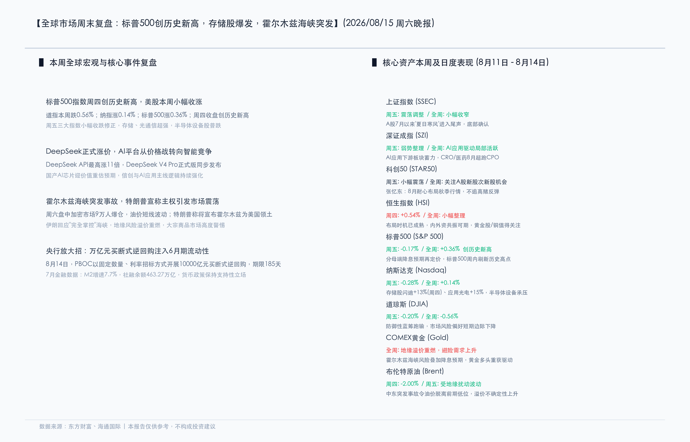

# 标普500创历史新高后温和回撤，存储芯片本周爆发，霍尔木兹海峡突发事故搅动大宗市场

**日期：2026年08月15日 (星期六)** &nbsp; **时段：周末复盘 (模式B)**

> **核心摘要**：本周全球市场经历了"先扬后抑"的过山车行情。美股方面，标普500于周四盘中触及7,816.70点的历史新高后，周五温和回撤0.17%至7,785.76点，全周累计上涨0.36%；纳指全周微涨0.14%，存储股与光通信板块本周爆发。国内方面，央行祭出万亿元买断式逆回购重锤释放流动性，A股在"夏日寒风"后底部逐渐确认。周末爆发的霍尔木兹海峡突发事故叠加特朗普主权声索言论引发大宗与加密市场剧烈震荡，DeepSeek正式涨价标志AI行业从价格战转向价值竞争新阶段。

## 核心资产周度/日度表现回顾

本周（8月11日-8月14日）全球主要市场呈现"美股创新高、A股筑底、大宗分化"的格局。以下为核心资产的周五单日与全周累计表现：

**美股市场**

* **标普500 (S&P 500)**：周五收于 **7,785.76点**，单日 **-0.17%** 🟢；全周累计 **+0.36%** 🔴
  > 周四盘中触及7,816.70点历史新高，创年内最强一周之一。周五的回调属于"涨多必调"的技术性整固，VIX恐慌指数反而继续走低至15.60，多头格局完好无损。
* **纳斯达克综合指数 (Nasdaq)**：周五收于 **26,729点**，单日 **-0.28%** 🟢；全周累计 **+0.14%** 🔴
  > 科技股在连续两日大涨后出现获利回吐，但存储股闪迪(SanDisk)周四单日飙涨+13%、应用光电(Applied Optoelectronics)大涨+15%，存储与光通信成为本周最亮眼赛道。
* **道琼斯工业指数 (DJIA)**：周五收于 **53,732点**，单日 **-0.20%** 🟢；全周累计 **-0.56%** 🟢
  > 防御性蓝筹在标普和纳指创新高之际表现相对落后，市场风格明显偏向成长与科技，传统价值蓝筹短期承压。
* **罗素2000 (Russell 2000)**：周五 **+0.52%** 🔴，逆势上行
  > 本周最大结构性亮点——小盘股在三大指数全线回调之际逆势补涨，利率下行预期正驱动资金从拥挤的大盘科技向中小市值品种扩散。

**A股/港股市场**

* **上证指数 (SSEC)**：全周震荡调整 🟢，底部确认信号渐显
  > A股7月以来的"夏日寒风"进入尾声，成交缩量后企稳反弹的条件正在积累。央行万亿逆回购释放了强烈的流动性支持信号。
* **深证成指 (SZI)**：全周弱势整理，AI应用驱动局部活跃
  > CRO/医药板块8月表现超越CPO（光通信模块），AI应用下游板块蓄力。
* **科创50 (STAR50)**：全周小幅震荡
  > 新股次新股机会活跃，张忆东建议"8月耐心布局秋季行情，不追高赌反弹"。
* **恒生指数 (HSI)**：周四 **+0.54%** 🔴；全周小幅整理
  > 弱美元环境下港股布局时机趋于成熟，内外资共振可期，黄金股与铜矿值得关注。

**大宗商品与另类资产**

* **COMEX黄金 (Gold)**：周五收于 **4,432美元/盎司**，全周持续走强 🔴
  > 地缘溢价重燃叠加降息预期，黄金多头三重驱动（实际利率下行+美元走弱+避险需求）共振，连续刷新区间高点。
* **WTI原油**：周五收于 **82.40美元/桶**，周三暴跌2.31%后周四反弹1.42%
  > IEA月报下调全球石油需求增速预期导致大跌，OPEC+重申减产承诺后超跌反弹。周末霍尔木兹海峡突发事故令油价脱离前期低位，溢价不确定性大幅上升。
* **比特币 (BTC)**：周五收于 **62,954美元**，窄幅整理
  > 加密市场在传统风险资产温和调整中保持中性，但周末霍尔木兹事件引发9万人爆仓，短期波动急剧放大。
* **美元指数 (DXY)**：跌至 **99.54**，年内新低
  > 美联储降息预期持续强化，美元跌破100整数关口，对新兴市场资产构成系统性利好。

## 过去48小时重磅事件深度复盘

本周末密集的宏观事件为下周开盘定下了复杂的基调：

* **霍尔木兹海峡突发事故，特朗普宣称主权引发全球市场震荡**
  > 周六传出霍尔木兹海峡发生突发航运事故的消息，随后特朗普公开宣称将宣布霍尔木兹海峡为美国领土，伊朗方面迅速回应称"完全掌控"海峡通行权。这一地缘政治突发事件在加密市场率先引爆——周六盘中超过9万人被爆仓，油价短线剧烈波动。作为全球约20%石油运输量的咽喉要道，霍尔木兹海峡的任何通行风险都将对原油、黄金和避险资产产生深远影响，大宗商品市场进入高度警惕状态。

* **DeepSeek正式涨价，AI行业从价格战转向价值竞争**
  > DeepSeek宣布API定价最高上调11倍，同步发布DeepSeek V4 Pro正式版。这一举措标志着国内AI大模型行业正从无序的"价格内卷"转向以模型能力和生态深度为核心的价值竞争新阶段。涨价预期利好国产AI芯片估值重估，信创与AI应用主线逻辑持续强化。

* **央行放大招：万亿元买断式逆回购注入半年期流动性**
  > 8月14日，中国人民银行以固定数量、利率招标方式开展10,000亿元买断式逆回购操作，期限185天（约半年）。这是近期央行释放中长期流动性的最大力度操作之一，旨在稳定银行间流动性预期，为实体经济提供充裕的资金支持。

* **7月金融数据出炉：货币政策保持支持性立场**
  > M2同比增速7.7%，社会融资规模余额463.27万亿元。数据显示货币供应保持适度增长，社融增量符合预期，央行维持宽货币+稳信用的政策基调。

* **美联储多位官员释放鸽派信号**
  > 多位地区联储主席在公开讲话中暗示9月FOMC会议可能讨论"降息时间表"。沃什主席首次使用"政策正常化窗口正在接近"的措辞，被市场解读为明确的鸽派信号。美元指数应声跌破100关口。

## 下周全球宏观大事预警

* **美国7月核心PCE物价指数（8月22日，周五）**
  > 这是美联储最看重的通胀指标。若数据继续温和降温，将为9月降息讨论扫清最后的数据障碍，全球流动性释放预期进一步强化。
* **霍尔木兹海峡局势跟踪**
  > 周一开盘后，原油与黄金的缺口表现将直接反映市场对地缘风险的定价，需密切关注伊朗与美方的后续外交博弈。
* **A股中报披露进入密集期**
  > 8月下旬是中报披露高峰，须警惕个别业绩不及预期标的对板块的拖累，同时有实质性业绩支撑的科技成长龙头有望获得资金集中加仓。
* **期指交割日（周五）**
  > 期指交割可能加大盘中波动率，建议控制短线仓位。
* **DeepSeek涨价效应落地**
  > 关注涨价后国产AI芯片及信创板块的估值传导，以及竞争对手（百度、阿里等）的应对策略。

## 顶级机构周末策略内参摘要

* **高盛 (Goldman Sachs)**：**"维持年末标普500目标价7,900点，小盘股轮动正式开启"**
  > 周四的小幅回调不改全年多头逻辑。当前市场正从"科技独秀"向"均衡轮动"转变——罗素2000的逆势上涨是最清晰的信号。建议投资者在降息预期兑现前抢先布局利率敏感型板块（REITs、生物科技、区域银行），同时维持黄金目标价4,600美元/盎司。弱美元+降息周期是黄金的最优组合。

* **摩根士丹利 (Morgan Stanley)**：**"能源市场多空博弈远未结束，维持12月首次降息基准预期"**
  > IEA与OPEC+在需求预测上的巨大分歧（85万桶 vs 110万桶/日），意味着原油可能在78-86美元区间维持高波动震荡。霍尔木兹海峡的突发事故为油价增添了新的不确定性溢价。对通胀路径而言，当前油价区间属于"中性偏好"——既不会重燃通胀恐惧，也不会引发通缩担忧。

* **中金公司 (CICC)**：**"弱美元开启新兴市场系统性利好窗口，港股科技龙头迎配置良机"**
  > 美元指数跌破100是关键事件。人民币汇率的被动升值将缓解外资流出压力，港股科技龙头有望承接"弱美元+降息预期"的正向溢出效应。建议关注三大主线：半导体设备（中报预喜确定性高）、创新药（基本药物目录红利持续发酵）、高端消费（弱美元回流效应）。A股方面，万亿逆回购的流动性红利将逐步传导至权益市场，8月筑底后秋季行情值得期待。

## 今日市场情绪：海峡暗涌，金塔矗立

在一片辽阔的海洋图景中，一条狭窄的海峡将画面分割为两个截然不同的世界。左侧是汹涌翻滚的暗红色海浪，巨浪中夹带着石油桶的残片和碎裂的K线图碎片，代表着地缘冲突对大宗商品市场的冲击。右侧则是一片宁静的蓝绿色海湾，水面上漂浮着无数发光的金色莲花，每朵莲花的花心都是一枚精密的芯片，象征着科技与AI产业在动荡中依然绽放的生命力。在海峡的正中央，一座由纯金铸造的高塔从海床中拔地而起，塔身上刻满了世界各国央行的徽章，塔尖上的灯塔射出温暖的琥珀色光束，穿透浓雾照亮远方的航道。天空中，一群由微型集成电路构成的候鸟群正从暴风雨的一侧向宁静海湾迁徙，机翼闪烁着绿色的数据光芒。整幅画面在混沌与秩序、风险与机遇之间达成了一种微妙的视觉平衡。

> Prompt: Surrealism style, Subject: A narrow oceanic strait divides two contrasting worlds. Left side has turbulent dark crimson waves carrying oil barrel fragments and broken candlestick chart pieces. Right side is a serene teal bay with floating golden lotus flowers each containing a glowing microchip at center. A towering golden lighthouse rises from the strait center, inscribed with central bank emblems, its amber beam piercing fog. In the sky, a flock of birds made of tiny circuit boards migrates from the stormy side toward the calm bay, wings glimmering with green data light. No humans. No text., masterpiece, high detail, intricate composition, cinematic lighting, 8k resolution

---

*免责声明：内容仅供参考，不构成投资建议。*

---
*Powered by Finance-Auto-Gen Pipeline (v3)*
