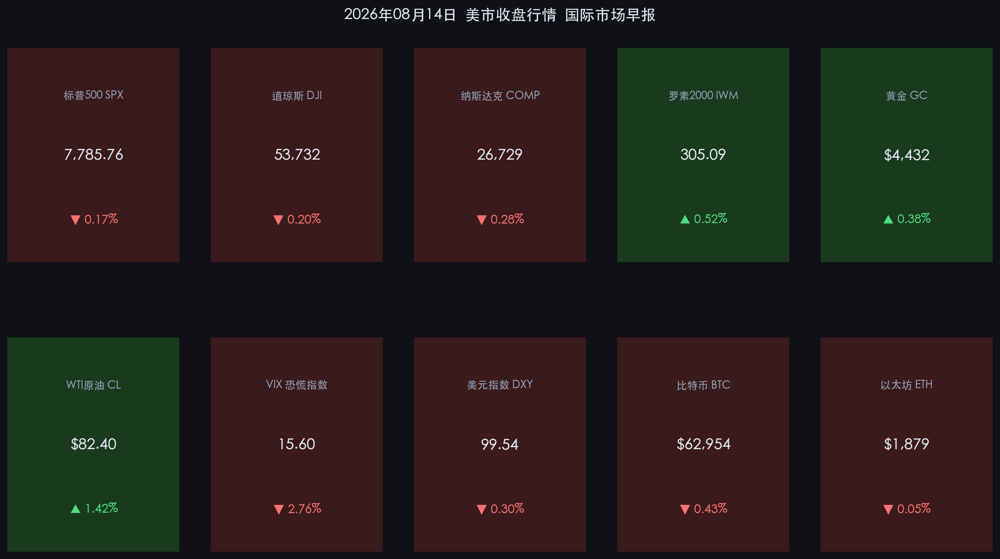

# 三大指数微幅回调，小盘股逆势补涨，原油反弹黄金续创新高

**日期：2026年08月15日 (星期六)** &nbsp; **时段：周六早报 (常规交易日·国际市场)**

> **核心摘要**：美股周四温和回调，标普500小幅下跌0.17%至7,785.76点，纳斯达克微跌0.28%，科技股在连续两日大涨后出现获利了结。罗素2000小盘股指数逆势上涨0.52%，显示资金正从高估值的大盘科技股向中小盘轮动。WTI原油在前一日暴跌2.31%后强势反弹1.42%至82.40美元/桶，COMEX黄金上涨0.38%至4,432美元/盎司逼近历史高点，美元指数跌至99.54的年内低位，VIX恐慌指数进一步降至15.60，市场整体维持"温和回撤而非恐慌抛售"的健康格局。

## 核心行情复盘

周四（8月14日）美国市场呈现典型的"高位微调+风格轮动"格局，三大指数在前一日强势创新高后小幅回吐，但市场内在结构依然稳健：

* **标普500高位窄幅回调**：标普500指数下跌 **13.24点**，跌幅 **-0.17%**，收于 **7,785.76点**，较前一日盘中历史高点7,816.70点小幅回撤约0.4%，属于典型的技术性整固，多头格局未被破坏。
* **纳斯达克领跌但幅度可控**：纳斯达克综合指数下跌 **74.89点**，跌幅 **-0.28%**，收于 **26,729点**，科技股在连续两日大涨后出现阶段性获利回吐，但跌幅远低于此前涨幅，属于"涨多必调"的良性节奏。
* **道琼斯保持窄幅波动**：道琼斯工业指数下跌 **107.46点**，跌幅 **-0.20%**，收于 **53,732点**，传统蓝筹随大盘温和回调，但未出现领跌迹象。
* **罗素2000小盘股逆势补涨**：罗素2000指数上涨 **+0.52%**，收于 **305.09点**，这是本日最大亮点——在大盘指数全线回调之际，小盘股逆势上行，表明利率下行预期正驱动资金从拥挤的大盘科技向估值更具弹性的中小市值品种扩散。
* **黄金逼近历史新高**：COMEX黄金期货上涨 **+0.38%**，收于 **4,432美元/盎司**，连续第三个交易日刷新区间高点，实际利率下行、美元走弱与地缘避险三重驱动共振。
* **WTI原油超跌反弹**：WTI原油期货大涨 **1.15美元**，涨幅 **+1.42%**，收于 **82.40美元/桶**，在前一日IEA月报导致的2.31%暴跌后实现技术性反弹，空头回补力量强劲。
* **VIX恐慌指数持续下行**：VIX指数下跌 **-2.76%**，收于 **15.60**，处于年内偏低区间，显示市场对后市保持高度乐观预期，期权市场并未定价任何显著的尾部风险。
* **美元指数跌破100整数关口**：美元指数（DXY）下跌 **-0.30%**，收于 **99.54**，已稳定运行在100下方，反映市场对美联储年内降息预期的进一步强化。
* **比特币窄幅整理**：比特币微跌 **-0.43%**，收于 **62,954美元**，加密市场在传统风险资产温和调整中保持中性震荡。
* **以太坊横盘不动**：以太坊微跌 **-0.05%**，收于 **1,879美元**，缺乏独立催化剂。

## 核心解读与市场逻辑

> **"健康回调"而非"趋势反转"——多头结构完好**：标普500从盘中历史高点7,816回撤仅0.4%，纳斯达克跌幅也不到0.3%，这种级别的回调在连续两日大涨后完全在正常范围内。更重要的信号是，VIX非但没有因为指数回调而上升，反而继续走低至15.60，说明机构投资者并未增加保护性头寸，对后市抱有信心。从历史统计看，当VIX在股市小幅回调时反而下行，往往意味着"买入回调"（Buy the Dip）的共识正在形成。

> **小盘股的"独立宣言"——利率敏感资产开始表现**：罗素2000在三大指数全线回调时逆势上涨0.52%，这不是偶然事件。小盘股对利率变化高度敏感——当10年期美债收益率持续下行、美元跌破100关口，小盘股的融资成本预期和估值弹性同步改善。高盛近期的量化策略报告指出，当美联储进入"降息准备期"时，罗素2000通常会跑赢标普500约200-300个基点，这一历史规律正在本轮周期中得到验证。

> **黄金+弱美元的"双引擎"格局确立**：COMEX黄金站稳4,400美元上方并继续向4,450进军，美元指数则跌至99.54的年内新低。这两者之间的负相关性在本轮周期中表现得尤为显著——美联储降息预期驱动实际利率下行，同时削弱美元的利差吸引力，两者共同构成黄金多头的核心逻辑。全球央行持续增持黄金储备的结构性力量，则提供了坚实的价格底部。

## 政策脉动

* **美联储鸽派信号持续释放**：多位地区联储主席在本周的公开讲话中暗示，9月FOMC会议可能会讨论"降息时间表"的具体方案。尽管沃什（Kevin Warsh）主席保持一贯的审慎措辞，但其最近一次表态中首次使用了"政策正常化窗口正在接近"的措辞，被市场解读为明显的鸽派信号。
* **IEA月报效应消退，OPEC+维持产量纪律**：在IEA下调全球石油需求增速预期导致周三油价暴跌后，OPEC+主要成员国重申减产承诺，沙特阿美还额外宣布9月出口量将保持在低位，为原油价格提供了支撑。WTI原油周四的1.42%反弹正是对这些消息的积极回应。
* **美国7月核心PCE数据下周公布**：市场聚焦下周五（8月22日）将公布的7月核心PCE物价指数，这是美联储最看重的通胀指标。若该数据继续呈现温和降温态势，将为9月降息讨论扫清最后的数据障碍。

## 最新机构观点

* **高盛 (Goldman Sachs)**：周四的小幅回调不改我们的年末标普500目标价7,900点。当前市场正从"科技独秀"向"均衡轮动"转变——罗素2000的逆势上涨是最清晰的信号。我们建议投资者关注利率敏感型板块（REITs、生物科技、区域银行），在降息预期兑现前抢先布局小盘成长。同时维持黄金目标价4,600美元/盎司的判断，弱美元+降息周期是黄金的最优组合。

* **摩根士丹利 (Morgan Stanley)**：原油的超跌反弹提醒我们，能源市场的多空博弈远未结束。IEA与OPEC+在需求预测上的巨大分歧（85万桶 vs 110万桶/日），意味着原油可能在78-86美元区间维持高波动震荡。对于通胀路径而言，这是一个"中性偏好"的区间——既不会因油价暴涨重燃通胀恐惧，也不会因油价崩盘引发通缩担忧。我们维持美联储12月首次降息的基准预期。

* **中金公司 (CICC)**：美股在连续强势上攻后的温和回调为港股和A股提供了喘息空间。我们注意到美元指数跌破100的关键事件——这对新兴市场资产是系统性利好。人民币汇率的被动升值将缓解外资流出压力，港股科技龙头有望在下周初承接"弱美元+降息预期"的正向溢出效应。建议关注半导体设备、创新药和高端消费三大主线。

## 今日市场情绪：潮汐间隙，万物等待

在一片广袤的珊瑚色潮间带上，退潮后的海滩露出了无数形态各异的贝壳与海星——每一个都是一个市场指数的化身。远方的海平面上，一轮巨大的金色满月正缓缓升起，它的光芒将海面染成流动的琥珀色，象征着黄金的持续攀升。在潮间带的中央，一群由蓝绿色荧光微生物组成的小型生物群落正逆着退潮方向缓缓前行——那是小盘股在大盘回调中逆势上行的隐喻。而在画面远处的天际线上，几朵形似美联储大楼的云层正在被晚霞的暖光穿透，预示着政策转向的曙光即将降临。整个场景宁静而充满期待，是一幅"回调不是终结，而是下一次潮涌前的蓄力"的视觉诗篇。

> Prompt: Surrealism nature fantasy, Subject: A vast coral-colored tidal flat at low tide revealing countless seashells and starfish shaped like financial instruments. A massive golden full moon rises on the horizon casting amber light across the wet sand. In the center, a colony of small bioluminescent blue-green creatures moves against the tide direction representing small-cap resilience. In the far background, cloud formations resembling grand institutional buildings are pierced by warm sunset light suggesting policy change. No text, no human faces. Dreamy atmosphere, 8k, ultra detail, cinematic composition.

---

*免责声明：内容仅供参考，不构成投资建议。*

---
*Powered by Finance-Auto-Gen Pipeline (v3)*
