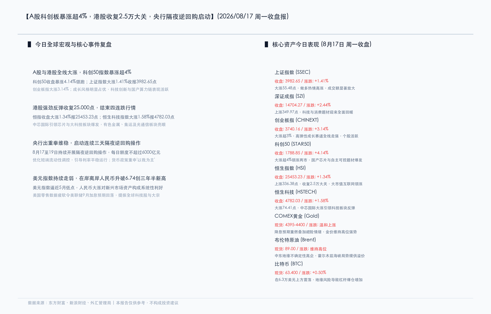
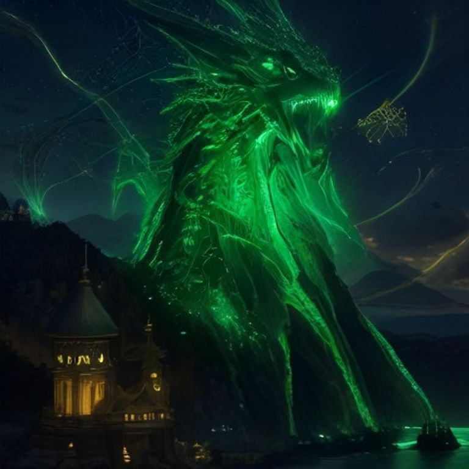

# 科创板暴涨超4%领跑硬科技，A股成交量能放大，央行首启连续隔夜逆回购平抑利率波动

**日期：2026年08月17日 (星期一)** &nbsp; **时段：常规交易日 (模式A)**

> **核心摘要**：今日A股与港股市场全线大涨，科创50指数暴涨4.14%领跑两市，创业板指大涨3.14%，恒生指数大涨1.34%成功收复25,000点大关，市场做多氛围极其浓厚。政策面上，央行首次启动连续三日的隔夜逆回购操作，进一步完善短端利率调控框架以平抑市场波动。外围宏观方面，美国疲软的经济数据打压美元并推升降息预期，人民币汇率强劲升破6.74关口，刷新三年半以来的高点，为新兴市场资产提供了系统性的上行红利。

## 核心行情复盘

今日全球主要市场中，国内A股与港股展现出极其强劲的“多头共振”格局，科技创新和成长赛道全线爆发。

**A股/港股市场表现**

*   **科创50指数 (STAR50)**：收报 **1788.85点**，单日大涨 **+4.14%** 🔴
    *   作为今日全场最亮眼的指数，科创50放量单边上行。国产芯片、自主可控和半导体设备概念股掀起涨停潮，科技龙头中芯国际与华虹半导体表现极其优异。
*   **创业板指 (CHINEXT)**：收报 **3740.16点**，单日大涨 **+3.14%** 🔴
    *   大涨超113点，新能源、先进制造及高弹性科技成长股全线走强，个股呈现普涨态势。
*   **深证成指 (SZI)**：收报 **14704.27点**，单日上涨 **+2.44%** 🔴
    *   上涨349.97点，科技与消费题材回暖，主力资金明显流入成长方向。
*   **上证指数 (SSEC)**：收报 **3982.65点**，单日上涨 **+1.41%** 🔴
    *   指数大涨55.48点，逼近4000点整数关口。沪深两市全天成交额达 **2.4万亿元**，较前一交易日显著放量，做多热情高涨，全市场上涨个股超过4300只。
*   **恒生指数 (HSI)**：收报 **25453.23点**，单日大涨 **+1.34%** 🔴
    *   结束了此前的四连跌行情，一举收复25,000点关口。
*   **恒生科技指数 (HSTECH)**：收报 **4782.03点**，单日大涨 **+1.58%** 🔴
    *   大型互联网平台及芯片龙头股普遍走强，主板全日成交额达 **2107.7亿港元**，交投活跃度明显回升。

**大宗商品与另类资产**

*   **COMEX黄金 (Gold)**：现货金价交投于 **4395 - 4400美元/盎司** 附近 🔴
    *   避险情绪叠加美元走软、美联储9月降息预期强化的三重驱动，为黄金提供了极强的底部支撑。
*   **布伦特/WTI原油**：布油在 **89.00美元/桶** 左右波动，WTI原油报 **82.00美元/桶** 左右 🔴
    *   地缘政治风险（尤其是霍尔木兹海峡的持续紧张局势）依然是油价的“核心溢价源”，虽然全球经济数据对需求端带来部分压制，但供给中断隐忧令油价维持高位震荡。
*   **比特币 (BTC)**：现报 **63,400美元** 左右，微涨 **+0.50%** 🔴
    *   加密货币市场随宏观环境转暖而回升，但在高波动下爆仓人数依然较多。
*   **美元指数 (DXY) 与人民币**：美元指数走软至近期低位；在岸及离岸人民币汇率双双突破 **6.74** 关口，创下三年半以来的历史新高 🔴

**领涨/领跌板块分析**

*   **领涨板块**：
    *   **芯片与硬科技**：A股半导体设备、先进封装、存储芯片全线暴涨。代表性半导体企业表现强劲，中芯国际、华虹半导体等龙头带头大涨。港股长飞光纤光缆、原材料电子材料板块表现抢眼。
    *   **算力与CPO**：AI基础设施业绩预期向好，光模块、PCB以及CPO（光电共封装）概念股持续活跃。
    *   **有色金属**：受全球降息预期带来的大宗商品反弹影响，贵金属与工业金属股全线走高。
*   **领跌板块**：
    *   大消费板块表现相对低迷，白酒股领跌（贵州茅台跌超3.5%），传媒、银行以及部分防守性强的电力、煤炭板块跌幅居前；港股方面内房股整体受压走弱。

---

## 核心解读与市场逻辑

1.  **硬科技“业绩与政策”双重共振，长鑫科技市值表现抢眼**
    > 今日硬科技板块的全面爆发，背后有清晰的逻辑驱动。一方面，全球AI硬件及存储芯片需求的爆发式增长已在业绩端得到持续验证；另一方面，国家针对集成电路、工业母机等高技术产业出台了新一轮的税收优惠政策，极大提振了中长期资金对自主可控板块的布局信心。今日硬科技概念股创下历史新高，总市值表现反映了主力资金在经历此前调整后，对成长主线的坚定回流。
2.  **人民币汇率升破6.74，奠定资本流入基础**
    > 美国最新零售数据疲软，导致美联储9月加息的预期大幅降温（降至25%-30%左右），美元指数应声走软。受此影响，人民币汇率强劲升破6.74，创出近三年半新高。这不仅减轻了国内货币政策操作的外部约束，同时也为外资（尤其是长线配置外资）流入A股和港股优质资产打通了汇率增值逻辑。
3.  **大宗商品高波动，地缘风险充当“底线支撑”**
    > 尽管近期全球石油需求增长预期有所下调，但由于中东霍尔木兹海峡局势的不确定性持续高企，原油供应端的地缘风险溢价仍在持续发酵。这使得WTI油价牢牢固守在82美元上方，与现货金价的高位震荡形成呼应。避险资产与风险资产呈现了少见的“同涨”特征。

---

## 政策脉动

1.  **央行启动连续三天隔夜逆回购，完善利率调控路径**
    > 8月17日，人民银行公告，于8月17日至8月19日持续开展隔夜逆回购操作，每日限额6000亿元。这是央行公开市场操作的重要创新，旨在精准匹配短期流动性需求，并将市场短端利率更紧密地引导在政策合意区间内。央行在此前公布的第二季度货币政策报告中指出，将坚持“以我为主”的调控立场，适度充裕的流动性基调在下半年不会发生方向性变化。
2.  **央行、外汇局发文便利跨国公司本外币本一体化运营**
    > 8月17日两部门联合发布通知，进一步优化和放宽了跨国公司本外币跨境资金集中运营政策，极大地便利了企业跨国归集与调拨资金。新政策将于9月14日正式实施，有望吸引更多跨国集团在国内设立区域资金中心，增强中国金融市场吸纳力。
3.  **发改委加快投放2026年新型政策性金融工具**
    > 国家发改委部署，加快8000亿元新型政策性金融工具投放，引入财政贴息机制，重点支持民间投资和产业制造业项目，旨在发挥财政金融协同作用，在三季度末形成更多实物工作量。

---

## 最新机构观点

*   **中信证券**：**“关注中报业绩确定性，硬科技关注‘量的增长’”**
    > 随着中报披露进入密集期，估值重估将从概念炒作转向业绩验证。建议投资者在半导体设备、晶圆代工等有国产替代“确定性业务量”支撑的硬科技子板块进行深耕。在非科技领域，建议向具备业绩韧性的能化、有色金属和创新药龙头调仓，保持合理回报预期。
*   **华泰证券**：**“A股震荡底渐实，围绕景气扩散线索均衡布局”**
    > A股目前正处于底部构筑的最后阶段，向下空间有限。短期波动提供了极佳的布局窗口。首选配置依然是受AI拉动的通信设备、国产算力以及AI电力设施；同时，CXO、有色以及有出海实力的制造龙头在中报期具备较好的性价比，可适当作为组合的平衡底仓。
*   **申万宏源**：**“消化微观结构问题后，反弹有望在九月延续”**
    > 当前A股市场正通过震荡消化结构性抛压，科创50今日的爆发显示超跌科技股有极强的修复弹性。国产算力、科技中小盘是目前的高弹性主线，非科技板块中则首推CXO和贵金属，并提示注意规避中报爆雷板块。

---

## 今日市场情绪：翡翠之影，金钟定澜

在一片宁静祥和的硅基海湾上，一条由无数发光的翡翠绿光纤与半导体芯片织成的巨龙正盘旋而起，它的双翼闪烁着代表数字代码与繁荣成长的翠绿光芒，预示着硬科技与科创板块的强劲觉醒。在海湾的正中央，一座古老庄严的金色钟楼稳稳矗立于水面之上，钟楼投射出温暖而稳固的琥珀色光晕护盾，平抑了水面的每一丝微澜，象征着央行流动性平抑利率波动的维稳力量。天空中，一枚代表着美元的银色符号正在晨曦中渐渐暗淡、溶解为漫天的绿色星尘，而一群由绿色纸币折叠而成的千羽鹤正扇动翅膀，迎着初升的红日，飞向光明的彼岸。画面在宏观稳定的金色暖意与科技爆发的翠绿生机之间，构筑了完美的超现实平衡。

> Prompt: Surrealism style, Subject: A majestic, glowing emerald dragon woven from fiber-optic cables and glowing green microchips soaring up from a serene silicon bay. Background: In the background, a massive golden clocktower stands on a solid foundation, casting a warm amber protective shield over the bay. In the sky, a fading silver dollar symbol dissolves into glittering green stardust, while a flock of glowing cranes made of green currency notes flies towards a rising golden sun. No humans. No text., masterpiece, high detail, intricate composition, cinematic lighting, 8k resolution

---

*免责声明：内容仅供参考，不构成投资建议。*

---
*Powered by Finance-Auto-Gen Pipeline (v3)*
