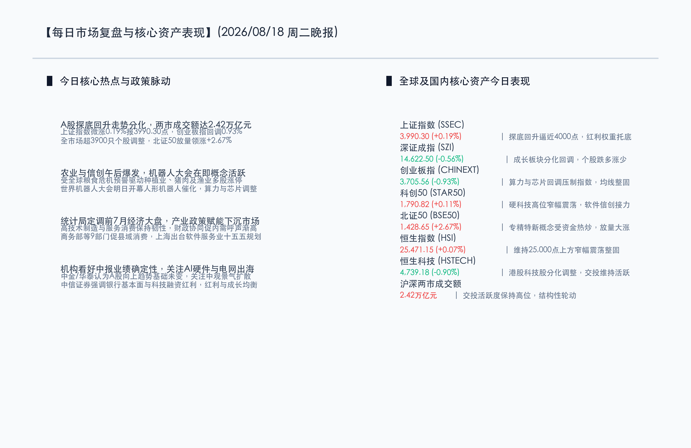

# A股探底回升沪指微涨逼近4000点，农业与信创板块逆势爆发，机器人大会前夕概念活跃

**日期：2026年08月18日 (星期二)** &nbsp; **时段：常规交易日 (模式A)**

> **核心摘要**：今日A股市场呈现震荡分化、探底回升格局，沪深两市全天成交额达2.42万亿元，交投活跃度持续保持高位。盘面上，大宗与防御属性兼具的农业种植、渔业与猪肉板块受全球粮食危机预警驱动掀起涨停潮；午后信创及国产软件板块快速拉升，世界机器人大会前夕人形机器人赛道表现活跃；算力与部分高位半导体芯片经历连涨后迎来技术性休整。宏观与政策面上，统计局确认前7月国民经济“动能向新、结构向优”，商务部等九部门多措并举激发下沉市场活力，头部机构普遍认为A股中长期向上趋势基础稳固，建议在AI硬件、电网出海及稳健红利资产中寻求均衡配置。

## 核心行情复盘

今日国内A股与港股主要指数呈现结构性震荡，资金在高低估值板块间进行轮动调仓，北证50指数放量领涨。

**A股/港股市场表现**

*   **上证指数 (SSEC)**：收报 **3990.30点**，单日上涨 **+0.19%** 🔴
    *   全天探底回升，盘中虽受成长板块回落扰动，但在红利权重与防守板块支撑下翻红，稳步逼近4000点整数大关。
*   **北证50指数 (BSE50)**：收报 **1428.65点**，单日大涨 **+2.67%** 🔴
    *   北交所专精特新概念股受资金热捧，呈现放量拉升走势，领跑各主要市场指数。
*   **科创50指数 (STAR50)**：收报 **1790.82点**，单日微涨 **+0.11%** 🔴
    *   在昨日暴涨超4%的背景下，今日高位窄幅震荡整固，午后国产软件与信创个股发力支撑指数红盘收官。
*   **深证成指 (SZI)**：收报 **14622.50点**，单日下跌 **-0.56%** 🟢
    *   下跌82.37点，部分高弹性赛道与成长股调整对指数造成一定压制。
*   **创业板指 (CHINEXT)**：收报 **3705.56点**，单日下跌 **-0.93%** 🟢
    *   算力租赁及部分芯片硬件权重股回调，指数全天弱势震荡，但回踩过程中下档承接力依然良好。
*   **恒生指数 (HSI)**：收报 **25471.15点**，单日微涨 **+0.07%** 🔴
    *   继续巩固在25,000点整数关口上方，全天振幅有限，维持缩量整理。
*   **恒生科技指数 (HSTECH)**：收报 **4739.18点**，单日下跌 **-0.90%** 🟢
    *   科网龙头股走势分化，外围市场震荡影响下港股科技股略显承压。

**领涨/领跌板块分析**

*   **领涨板块**：
    *   **农业种植与大宗农品**：受海外机构全球粮食安全预警驱动，种植业、农产品加工、渔业及养殖猪肉概念全天强势领跑，多只概念龙头股强势封涨停。
    *   **信创与国产软件**：午后在产业政策规划预期提振下，基础软件、国产办公软件及数据安全板块快速放量拉升。
    *   **机器人产业链**：2026世界机器人大会（WRC）将于8月19日正式开幕，人形机器人本体、核心减速器及传感器产业链表现活跃。
*   **领跌板块**：
    *   **算力与芯片硬件**：算力租赁、光模块及部分先进制程半导体个股经历短期大涨后获利回吐，跌幅居前。
    *   **传媒与影视院线**：消费与院线板块表现相对疲弱，全天缺乏增量资金承接。

---

## 核心解读与市场逻辑

1.  **两市成交稳守2.4万亿，高低切换展开健康轮动**
    > 今日沪深两市全天成交达2.42万亿元，全市场超3900只个股处于调整状态，但这主要体现为昨日暴涨后的良性获利回吐与板块间高低切换。资金从短期涨幅过大的硬科技硬件流出，迅速承接了估值处于相对低位的农业消费与机器人等前沿催化板块，显示增量流动性并未离场，市场多头承接格局依旧健康。
2.  **事件驱动型板块接力，机器人大会成为关键催化剂**
    > 随着8月19日“2026世界机器人大会”的召开，多家人形机器人头部企业将发布全新一代灵巧手与运动控制算法。产业落地节奏加快吸引了活跃资金的深度博弈，成为科技主线中极具防御与进攻双重属性的细分分支。
3.  **宏观结构“向新向优”，政策工具箱储备充足**
    > 7月宏观经济数据显示，高技术制造业与绿色智能产品依然是拉动经济的核心动能。面对部分传统需求端的波动，市场对三季度新型政策性金融工具加速投放、财政逆周期调节的预期持续增强，构成了下半年权益资产的坚实托底力量。

---

## 政策脉动

1.  **国家统计局定调前7月经济大盘：新动能稳步壮大**
    > 统计局发布最新经济运行回顾，指出1-7月国民经济总体平稳，尽管7月份受到外部复杂环境及部分极端天气影响，但高技术制造业增加值与现代服务业消费均保持较高景气，高质量发展大势未变。
2.  **商务部等9部门印发《关于进一步激发下沉市场活力活跃县域消费的意见》**
    > 政策明确支持新能源汽车、绿色智能家电以及优质消费品下沉拓展，完善县域商业体系与物流基础设施，旨在挖掘广阔下沉市场的消费潜力。
3.  **上海出台软件和信息服务业“十五五”发展规划导向**
    > 规划强调加大对核心基础软件、工业软件和人工智能底层平台的攻关支持，强化信创产业生态培育，为国产软件板块提供了清晰的中长期政策指引。

---

## 最新机构观点

*   **中信证券**：**“银行基本面企稳，聚焦科技融资结构性红利”**
    > 中信证券研报指出，上市银行二季度息差与资产质量保持稳定，盈利增速企稳回升，全年具备坚实的防御与绝对收益价值；同时科技金融与高端制造的融资需求将为资本市场龙头机构带来中长期结构性业务增量。
*   **华泰证券**：**“A股向上趋势基础未变，关注中观景气扩散”**
    > 华泰证券认为，当前A股市场向上趋势的大逻辑未变。配置策略上，建议优先把握AI链（通信设备、国产算力、AI电力底座）、盈利预期明朗的CXO与有色金属龙头，并将稳健红利资产作为长期底仓。
*   **中金公司**：**“中报业绩迎来分化检验，布局AI基建与电网出海”**
    > 中金公司预计2026年中报A股非金融企业盈利有望呈现温和修复态势。科技板块在拥挤度出清后将重回业绩主导，重点推荐特高压配电网出海、光通信PCB以及具备中长期景气度的创新药板块。

---

## 今日市场情绪：金穗翻浪，机枢合鸣

在金黄色的广袤麦浪之上，夕阳的余晖洒下温暖的琥珀光晕。数台智能机械收割机正在麦田中稳健穿行，数字化的绿色光流在饱满的金色麦穗间缓缓流淌，象征着农业板块的生机勃勃与大宗资产的强劲支撑。远方地平线上，现代化的玻璃穹顶与高耸的算力塔台在暮色中静静矗立，蓝绿色的数据流如微风般掠过麦浪，将高科技前沿与厚重的丰收大地和谐相融。整幅画面在丰饶的金色沃野与静谧的科技之光之间，构筑了兼具丰收底蕴与智能律动的超现实画卷。

> Prompt: Surrealism style, Subject: A magnificent golden wheat field glowing under the late afternoon sun, where robotic farming harvesters and digital cyber-sheaves of grain hum with green luminous energy. Background: In the background, modern glass architecture and server towers rise against a dusk sky, with gentle data streams weaving through the golden stalks. No humans. No text., masterpiece, high detail, intricate composition, cinematic lighting, 8k resolution

---

*免责声明：内容仅供参考，不构成投资建议。*

---
*Powered by Finance-Auto-Gen Pipeline (v3)*
