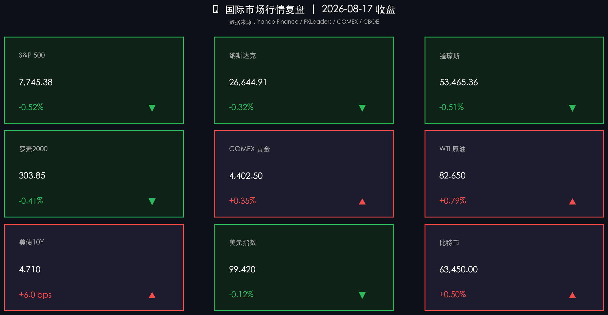

# 美股高位温和承压，油价地缘溢价推升美债收益率，黄金避险坚挺美元维持低位

**日期：2026年08月18日 (星期二)** &nbsp; **时段：周二早报 (常规交易日·国际市场)**

> **核心摘要**：隔夜美股三大指数集体温和收跌，标普500下跌0.52%至7,745.38点，纳斯达克微跌0.32%，道指下跌0.51%。受中东霍尔木兹海峡地缘局势不确定性扰动，国际原油价格高位震荡推升通胀担忧，带动美国10年期国债收益率上行至4.71%。大宗商品方面，避险情绪与弱美元共振支撑COMEX黄金稳守4,400美元/盎司上方；VIX恐慌指数维持在14.5附近的历史低位区间，显示市场处于良性技术整固而非系统性抛售。

## 核心行情复盘

周一（8月17日）美股市场在前期创下历史新高后迎来窄幅整固，能源价格反弹与美债收益率走高对大盘成长股估值构成短期扰动，但避险与大宗商品呈现结构性韧性：

*   **标普500高位温和回踩**：标普500指数下跌 **40.37点**，跌幅 **-0.52%**，收于 **7,745.38点**，在前期历史高位区域展开良性技术性消化。
*   **纳斯达克小幅收跌**：纳斯达克综合指数下跌 **84.25点**，跌幅 **-0.32%**，收于 **26,644.91点**，大型科技权重股表现分化，整体跌幅相对可控。
*   **道琼斯工业指数承压调整**：道琼斯指数下跌 **272.03点**，跌幅 **-0.51%**，收于 **53,465.36点**，传统周期与金融权重板块受美债收益率上升压制。
*   **罗素2000小盘股同步回调**：罗素2000指数下跌 **-0.41%**，收报 **303.85点**，高利率敏感资产在收益率回弹背景下阶段性整固。
*   **COMEX黄金坚挺攀升**：COMEX黄金期货上涨 **+0.35%**，收于 **4,402.50美元/盎司**，在地缘溢价与弱美元的双重驱动下继续稳立于4,400美元上方。
*   **WTI原油受地缘扰动走高**：WTI原油期货上涨 **0.65美元**，涨幅 **+0.79%**，收于 **82.65美元/桶**，霍尔木兹海峡航运局势隐忧为油价提供持续风险溢价。
*   **美债10年期收益率上行**：美国10年期国债收益率上升约 **6.0 bps** 至 **4.710%**，油价反弹引发通胀韧性博弈。
*   **美元指数延续低位整理**：美元指数（DXY）微跌 **-0.12%**，收于 **99.42**，维持在100整数关口下方运行。
*   **比特币与加密资产小幅回暖**：比特币上涨 **+0.50%**，收于 **63,450美元**，在宏观震荡环境中保持区间盘整。

## 核心解读与市场逻辑

> **油价地缘溢价引发利率博弈，高位美股迎技术性整固**：隔夜市场的核心扰动源于大宗商品与利率端的联动。霍尔木兹海峡的持续地缘局势隐忧推升原油风险溢价，油价反弹在一定程度上重燃了短期通胀预期，带动10年期美债收益率升破4.70%。美股在前期连创新高后出现获利盘回吐，三大指数同步回撤，但跌幅均控制在0.5%左右，属于健康的估值整固。

> **VIX维持年内低位，尾部风险定价平稳**：尽管指数小幅下跌，CBOE波动率指数（VIX）仍平稳运行在14.2–15.0区间，未出现任何恐慌性飙升。这表明期权市场和大型机构投资者并未对当下的回调进行防御性抛售，市场对中长期宏观软着陆及科技基本面依然具备较强信心。

> **黄金与弱美元共振，新兴资产迎来溢出红利**：美元指数持续徘徊在99.5附近的年内低位，叠加避险需求，助推现货金价稳居4,400美元上方。弱美元环境显著减轻了全球非美市场的货币压力，结合国内此前人民币汇率强势突破6.74，为港股及亚太新兴市场资产提供了充裕的流动性缓冲垫。

## 政策脉动

*   **美联储9月加息预期大幅降温**：受此前公布的走弱零售销售数据及降温通胀信号影响，联邦基金利率期货定价显示市场对9月加息的预期概率已回落至25%-30%的低位区间。
*   **中东地缘海运安全再引关注**：国际能源署（IEA）与多国航运部门持续跟踪中东原油运输通道安全，虽然商业库存目前起到平抑作用，但供给端潜在风险仍为油价提供坚实底部。
*   **零售财报季与经济数据前瞻**：市场本周聚焦美股零售巨头中报及下周即将公布的7月核心PCE数据，投资者试图从中寻找美国居民消费韧性与物价回落节奏的最新线索。

## 最新机构观点

*   **高盛 (Goldman Sachs)**：市场对美联储政策收紧的预期显得“过度鹰派（Too Hawkish）”。在零售销售与就业数据走软的背景下，9月进一步收紧货币政策的概率极低。通胀大概率将维持改善趋势，近期的美股回调属于高位健康换手，继续维持对美股中长期乐观展望。

*   **摩根士丹利 (Morgan Stanley)**：维持美联储在2026年剩余时间内保持利率不变（Fed Pause）的基准判断。当前紧缩的金融条件与高借贷利率已经起到了替代加息的效果，去通胀进程正在关税效应减退与能源供给博弈中推进，2027年有望迎来政策降息窗口。

*   **中金公司 (CICC)**：美股短期震荡不改全球资产风格轮动趋势。美元指数跌破100关口并持续承压，将直接改善新兴市场的资金面环境。伴随人民币汇率创下近年新高，具备估值优势与成长确定性的硬科技、半导体及优质高股息资产将持续吸引中长期增量资金配置。

## 今日市场情绪：风暴与天平的平衡

在一片由起伏的红色K线与黑色原油桶构成的波涛海面上，一艘孤独坚韧的木船正在暗色风暴中破浪前行。在遥远的天际线上，一座由闪电照亮的雄伟机械天平悬浮在群山之上，天平的一端托举着一轮穿透乌云的金色烈日，将耀眼的金色光芒洒向汹涌的海面，隐喻着黄金在通胀风暴与地缘迷雾中绽放的避险光芒。

> Prompt: Surrealism style, Subject: A solitary wooden ship sailing through a turbulent sea made of glowing red candlestick charts and towering black oil barrels under a stormy dark sky. Background: In the background, a massive golden mechanical scales balances above distant lightning-lit mountains, with one side bearing a heavy golden sun that pierces through dark clouds. No humans, no text., masterpiece, high detail, intricate composition, cinematic lighting, 8k resolution

---

*免责声明：内容仅供参考，不构成投资建议。*

---
*Powered by Finance-Auto-Gen Pipeline (v3)*
