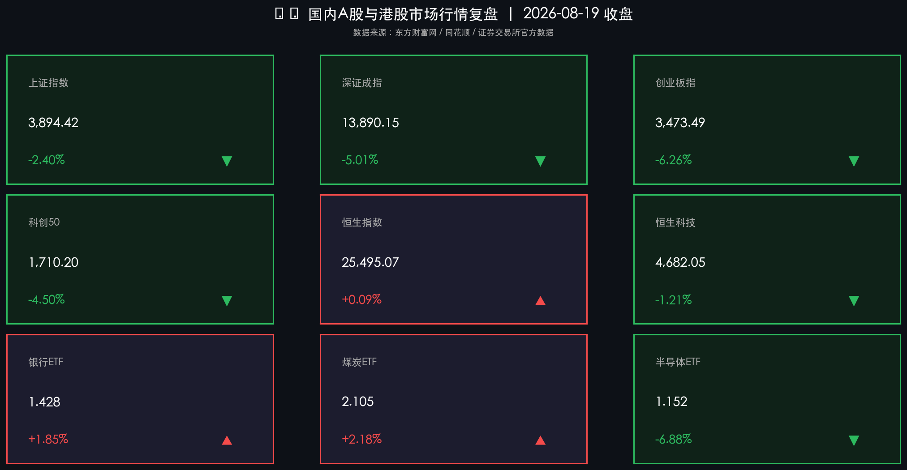

# 全球科技股震荡波及A股调整放量2.5万亿，银行煤炭逆势走强，宇树科技上市首日大涨

**日期：2026年08月19日 (星期三)** &nbsp; **时段：常规交易日 (模式A)**

> **核心摘要**：今日国内A股市场受隔夜外围科技股重挫及美债收益率攀升影响深度回调，两市全天成交放量至2.53万亿元，呈现防御高股息与成长赛道极致分化格局。盘面上，银行、煤炭等低估值高股息资产逆势走强支撑大盘，而算力芯片、半导体及前期高位科技板块普遍承压调整；人形机器人领军企业宇树科技今日正式挂牌上市，首日涨幅超460%引发产业关注。央行今日精准开展3274亿元隔夜逆回购呵护流动性，头部机构指出短期外溢扰动不改中长期基本面修复态势，建议在业绩确定性与稳健红利资产中寻求均衡配置。

## 核心行情复盘

今日国内A股与港股主要指数呈现结构性深度调整，外围科技股暴跌引发避险情绪蔓延，高股息防御板块逆市上行。

**A股/港股市场表现**

*   **上证指数 (SSEC)**：收报 **3894.42点**，单日下跌 **-2.40%** 🟢
    *   全天低开低走，虽有银行、煤炭等权重板块逆势托底，但在科技与成长股普遍承压下失守3900点整数关口。
*   **深证成指 (SZI)**：收报 **13890.15点**，单日下跌 **-5.01%** 🟢
    *   受成长赛道大面积回调拖累，跌幅达5.01%，盘中多只高估值成长股遭遇获利盘快速出清。
*   **创业板指 (CHINEXT)**：收报 **3473.49点**，单日大跌 **-6.26%** 🟢
    *   权重科技股普遍调整，芯片硬件与新能源赛道承压显著。
*   **科创50指数 (STAR50)**：收报 **1710.20点**，单日下跌 **-4.50%** 🟢
    *   半导体先进制程及算力产业链调整幅度较大，但尾盘部分核心标的展现韧性。
*   **恒生指数 (HSI)**：收报 **25495.07点**，单日微涨 **+0.09%** 🔴
    *   微涨23.92点，展现较强外围风险防御韧性，高股息红利股与部分消费龙头形成支撑。
*   **恒生科技指数 (HSTECH)**：收报 **4682.05点**，单日下跌 **-1.21%** 🟢
    *   大型科网股走势分化，受美股中概与海外科技股波动影响窄幅下探。

**领涨/领跌板块分析**

*   **领涨板块**：
    *   **银行与高股息金融**：中信银行涨超4%，江苏银行再创新高，大行及优质股份行逆势走强，成为避险资金的核心港湾。
    *   **煤炭与传统能源**：高股息属性凸显，多只煤炭龙头股全天稳步走强，逆市收红。
    *   **港股石油与电信**：高分红中字头资产在港股市场表现抢眼，支撑恒生指数微幅收涨。
*   **领跌板块**：
    *   **算力硬件与芯片半导体**：受隔夜美股费城半导体指数重挫外溢冲击，算力租赁、存储芯片与封测板块跌幅居前。
    *   **机器人概念（分化）**：宇树科技上市首日暴涨超460%，带动概念成交活跃，但前期大幅炒作的部分细分产业链个股迎来阶段性估值修正。

---

## 核心解读与市场逻辑

1.  **海外科技重挫引发外溢效应，市场风格切换至防御**
    > 隔夜美债长端收益率处于高位，美股科技股特别是费城半导体指数大跌，导致全球风险资产风险偏好显著收缩。A股前期获利丰厚的成长赛道出现集中了结潮，但全天成交额放大至2.53万亿元，显示场内流动性充裕，资金迅速向银行、煤炭等低估值、高股息板块转移。
2.  **宇树科技挂牌催化产业关注，赛道进入“看业绩”新阶段**
    > 人形机器人标杆企业宇树科技今日正式上市交易，首日涨幅超460%，成为资本市场关注焦点。随着产业化进程加速，市场对于机器人和AI硬件的关注点正从“概念题材炒作”向“真实订单与业绩兑现”加速过渡。
3.  **市场流动性整体充沛，中长期修复逻辑坚实**
    > 尽管指数单日调整幅度较大，但两市成交突破2.5万亿表明多空博弈充分，而非流动性枯竭。政策面逆周期调节工具丰富，资本市场高水平开放与科技金融深化布局将为中长期行情提供有力支撑。

---

## 政策脉动

1.  **央行开展3274亿元隔夜逆回购，精准平抑短期流动性**
    > 中国人民银行今日开展了3274亿元隔夜逆回购操作，公开市场操作灵活适度，有力匹配了银行体系的短期流动性需求，呵护资金面平稳跨月。
2.  **监管部门持续深化“稳市组合拳”，护航高质量发展**
    > 证监会及相关金融监管部门近期持续推动中长期资金入市，强化上市公司分红回报机制，优化并购重组支持政策，进一步巩固资本市场稳健运行的制度基石。
3.  **“十五五”科技金融规划加速落地实施**
    > 相关部委正加快落实科技创新金融支持体系，引导更多耐心资本投向硬科技、高端装备制造与绿色低碳领域，为实体经济注入长远动能。

---

## 最新机构观点

*   **中信证券**：**“防御资产性价比凸显，关注机器人产业链估值重塑”**
    > 中信证券指出，在外部波动加剧背景下，银行等高股息、低波动资产具备极强的避险与配置价值；同时宇树科技上市后将加速人形机器人行业商业化落地进程，建议关注具备核心壁垒的产业链龙头。
*   **中金公司**：**“盈利修复趋势温和，聚焦科技金融与高水平开放主线”**
    > 中金公司研报认为，A股非金融企业盈利在中报阶段有望保持稳步修复，外部短期扰动不改中长期向上趋势，科技金融与高水平制度型开放将带来持续的结构性机会。
*   **高盛 (Goldman Sachs)**：**“战略性平衡投资组合，重点关注AI应用与盈利兑现”**
    > 高盛强调，在当前全球宏观利率与地缘复杂环境下，投资者应采取审慎而积极的配置策略，密切跟踪美联储政策动向与全球央行年会信号，重点关注人工智能产业的实际盈利兑现能力。

---

## 今日市场情绪：金堡御雷，磐石待曙

在由翻涌的赤色闪电与跌宕金融波动组成的狂暴风暴中，一座由坚固巨石与金色货币筑成的巍峨堡垒岿然耸立。翠绿色的能量防护光罩在风暴中沉稳流转，坚决抵御着外围电弧与崩碎芯片的冲击，象征着高股息防御资产在动荡行情中的坚实庇护。远方天际线下，厚重的乌云正在剧烈翻腾，但堡垒顶端透出的坚定光芒刺破阴霾，预示着市场在历经洗礼后对价值底蕴与破晓曙光的从容期待。

> Prompt: Surrealism style, Subject: A resilient fortress of solid stone and golden coins weathering a storm of falling red lightning and fractured silicon chips, with green glowing energy shielding the bastion. Background: In the background, turbulent dark storm clouds over a turbulent sea of financial charts and falling numbers, under dramatic cinematic lighting. No humans. No text., masterpiece, high detail, intricate composition, cinematic lighting, 8k resolution

---

*免责声明：内容仅供参考，不构成投资建议。*

---
*Powered by Finance-Auto-Gen Pipeline (v3)*
