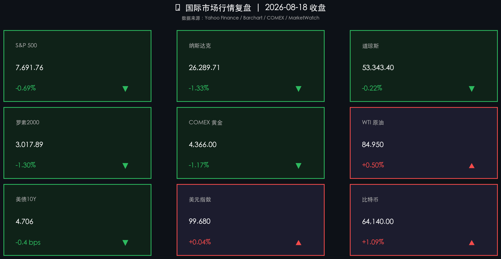

# 美股高位全线回撤，科技芯片股获利盘集中抛售，地缘局势推高油价引发通胀担忧

**日期：2026年08月19日 (星期三)** &nbsp; **时段：周三早报 (常规交易日·国际市场)**

> **核心摘要**：隔夜美股三大指数从历史高位震荡回落，前期领涨的AI与半导体产业链遭遇获利盘集中抛压，纳斯达克下挫1.33%至26,289.71点，标普500下跌0.69%，道指微跌0.22%。受美伊地缘局势升级及霍尔木兹海峡航运风险重燃影响，国际油价高位震荡推升通胀粘性预期，10年期美债收益率稳居4.70%上方高位。避险与高位资金再平衡共振，黄金自高点回吐至4,366美元/盎司，美元指数微幅上行至99.68，加密资产在64,000美元上方保持窄幅整理。

## 核心行情复盘

周二（8月18日）美股市场呈现高位分化与估值消化态势，前期强势的科技成长板块领跌，大宗商品与利率高位震荡压制风险偏好：

*   **标普500高位回撤**：标普500指数下跌 **53.30点**，跌幅 **-0.69%**，收于 **7,691.76点**，在前期连续创新高后受到估值与利率敏感资金的阶段性压制。
*   **纳斯达克显著领跌**：纳斯达克综合指数下跌 **355.20点**，跌幅 **-1.33%**，收于 **26,289.71点**。半导体及AI硬件板块全线调整，美光科技（Micron）大跌超7%，英伟达、博通、AMD等权重龙头普遍回撤2%至4%以上。
*   **道琼斯工业指数相对抗跌**：道琼斯指数小幅下跌 **116.38点**，跌幅 **-0.22%**，收于 **53,343.40点**，传统价值与防守型消费板块表现相对平稳。
*   **罗素2000小盘股同步走弱**：罗素2000指数下跌 **39.65点**，跌幅 **-1.30%**，收报 **3,017.89点**，高利率中枢预期对小盘流动性形成挤压。
*   **COMEX黄金高位整固**：COMEX黄金期货下跌 **-1.17%**，收于 **4,366.00美元/盎司**，在前期连续突破4,400美元历史关口后出现多头获利了结。
*   **WTI原油延续强势走高**：WTI原油期货上涨 **0.42美元**，涨幅 **+0.50%**，收于 **84.95美元/桶**；布伦特原油站稳91美元/桶附近，地缘溢价持续升温。
*   **美债10年期收益率维持高位**：美国10年期国债收益率微降 **0.4 bps**，收报 **4.706%**，依然运行在4.70%关键压力线上方。
*   **美元指数窄幅企稳**：美元指数（DXY）微涨 **+0.04%**，收于 **99.68**，在100整数关口下方延续震荡筑底。
*   **比特币震荡回暖**：比特币上涨 **+1.09%**，收于 **64,140美元**，在主流股指回调时表现出一定的独立韧性。

## 核心解读与市场逻辑

> **AI商业化变现节奏受审视，芯片板块集中释放估值压力**：隔夜美股核心调整动力来自科技股尤其是半导体板块的获利了结。经历前期的巨幅拉升后，市场对大模型与AI基础设施巨额资本开支（Capex）的短期投资回报率（ROI）产生更严格的审视，叠加近期估值已处于历史极高分位，引发了以对冲基金为主的集中锁利减仓。

> **中东地缘海运隐忧与能源通胀联动**：霍尔木兹海峡航运安全事件与美伊紧张关系使得原油供给端风险溢价居高不下。高油价使得美联储面临的抗通胀下半场任务更为复杂，美债收益率居高不下直接制约了以成长股为主的估值扩张空间，引发跨资产类别的重新定价。

> **大宗商品分化与避险资金再平衡**：在黄金连续刷新纪录突破4,400美元后，部分资金选择阶段性止盈兑现，但中长期去美元化与地缘防风险配置逻辑并未破坏。美元指数在99.5-100区间徘徊，显示全球流动性并未出现紧缩性回流，整体市场属于牛市进程中的健康分歧与换手。

## 政策脉动

*   **美联储货币政策路径博弈持续**：在通胀黏性与零售就业数据走软交织的背景下，市场对美联储未来降息路径的预期分歧加大，焦点全面转向本周即将召开的全球央行年会（Jackson Hole）前瞻信号。
*   **霍尔木兹海峡地缘风险监控升级**：美国与国际能源机构密切跟踪中东原油运输通道通航安全，地缘停火协议不确定性令全球原油供应链处于高敏感状态。
*   **AI基础设施投资与资本市场监管动态**：头部投行正积极推进新一批大模型与算力基础设施服务商的上市辅导，资本市场对AI产业链从单纯概念炒作向实际盈利能力的筛选正在加速。

## 最新机构观点

*   **高盛 (Goldman Sachs)**：当前原油市场正承受显著的地缘政治风险溢价。若霍尔木兹海峡等关键航运通道持续受阻，国际油价可能面临更大幅度的上行压力；但对于美股大盘而言，基本面盈利增速依然稳健，科技股的急跌主要是仓位拥挤后的技术性降温，而非基本面反转。

*   **摩根士丹利 (Morgan Stanley)**：市场正在从“全面狂热”转向“精选确定性”。投资者对AI资本开支的关注点已从“买了多少芯片”转向“产生了多少边际收入与现金流”。在利率中枢维持在4.7%附近的宏观环境下，高估值成长资产的波动性将显著增加，建议均衡配置优质现金流资产与防御性高股息标的。

*   **中金公司 (CICC)**：美股阶段性休整与全球再平衡有助于资金向估值洼地溢出。人民币汇率在近期维持稳健升值格局，中国资产尤其是优质港股互联网、硬科技制造及高股息资产具备更强的性价比与防御属性，外部扰动下的回调将提供中长期增配契机。

## 今日市场情绪：芯片降温与能源暗涌

在一座黄铜基座之上，一枚散发着幽蓝光芒的几何半导体芯片晶体正在缓缓冷却，内部流转的蓝色数据微光渐趋沉静。在辽远昏暗的背景中，汹涌的波涛海面上数艘油轮在暮色与橙色雷暴中穿行，隐喻着科技资产在汹涌能源浪潮与地缘暗流中的理性降温与能量再平衡。

> Prompt: Surrealism style, Subject: A glowing geometric semiconductor crystal cooling down on a brass pedestal. Background: In the background, turbulent ocean waves and distant oil tankers move under a stormy twilight sky with flashing orange lightning. No humans, no text., masterpiece, high detail, intricate composition, cinematic lighting, 8k resolution

---

*免责声明：内容仅供参考，不构成投资建议。*

---
*Powered by Finance-Auto-Gen Pipeline (v3)*
