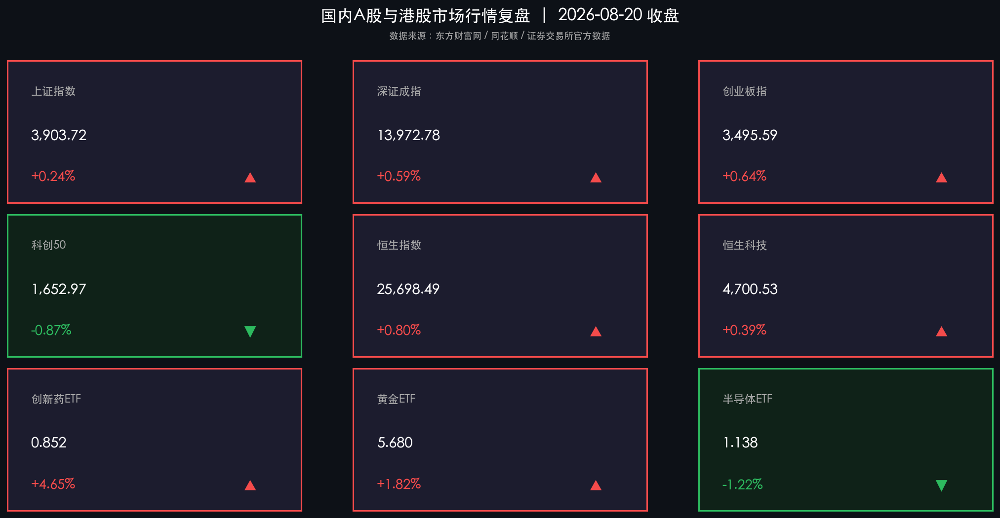

# A股缩量2.1万亿超4000股反弹，创新药与贵金属领涨，8月LPR维持不变

**日期：2026年08月20日 (星期四)** &nbsp; **时段：常规交易日 (模式A)**

> **核心摘要**：经历前一交易日放量急跌后，今日国内A股与港股迎来情绪修复，三大指数全线小幅收涨，全市场超4000只个股飘红。两市成交额缩量至2.09万亿元，呈现典型的急跌后缩量企稳特征。盘面上，创新药与生物疫苗板块在mRNA癌症疫苗临床突破等重磅利好催化下掀起涨停潮，贵金属板块受避险与外盘金价反弹提振大涨；前期高位先进制程芯片与高股息煤炭板块小幅休整。央行今日如期公布8月LPR报价维持不变，并连续8日逆回购零操作净回笼资金，凸显货币政策稳健定力；主流机构普遍认为短期外围冲击不改A股中长期修复逻辑，建议精选景气成长与估值合理的绩优核心资产。

## 核心行情复盘

今日国内A股与港股主要指数呈现企稳回升态势，个股涨多跌少，市场赚钱效应较前一日显著修复。

**A股/港股市场表现**

*   **上证指数 (SSEC)**：收报 **3903.72点**，单日上涨 **+0.24%** 🔴
    *   早盘小幅低开后迅速震荡回升，全天在3900点关口上方稳步运行，收复昨日部分失地。
*   **深证成指 (SZI)**：收报 **13972.78点**，单日上涨 **+0.59%** 🔴
    *   在生物医药与大消费核心权重回暖带动下震荡走高，收涨82.63点。
*   **创业板指 (CHINEXT)**：收报 **3495.59点**，单日上涨 **+0.64%** 🔴
    *   医药生物龙头集体大涨带动创业板指领跑主要宽基指数。
*   **科创50指数 (STAR50)**：收报 **1652.97点**，单日下跌 **-0.87%** 🟢
    *   受部分半导体材料、先进制程及电子化学品调整拖累，走势相对分化偏弱。
*   **恒生指数 (HSI)**：收报 **25698.49点**，单日上涨 **+0.80%** 🔴
    *   上涨203.42点，延续稳健韧性，消费与医疗保健类标的领衔上行。
*   **恒生科技指数 (HSTECH)**：收报 **4700.53点**，单日上涨 **+0.39%** 🔴
    *   大型互联网及软件平台股窄幅回暖，重返4700点上方。

**领涨/领跌板块分析**

*   **领涨板块**：
    *   **创新药与生物疫苗**：mRNA癌症疫苗III期临床阳性结果及行业出海预期共振，板块掀起涨停潮，多只医药ETF领涨全市场。
    *   **贵金属与黄金**：国际金价反弹叠加全球央行持续增持预期，黄金采选与贵金属标的强势上涨。
    *   **港股生物医疗**：港股创新药与医疗器械概念全天高位震荡，多只权重股涨超5%。
*   **领跌板块**：
    *   **半导体材料与电子化学品**：前期高位炒作资金逢高获利了结，科创板部分硬件标的短期调整。
    *   **煤炭与部分传统能源**：昨日避险资金在市场情绪回暖后出现再平衡分流，煤炭开采板块微幅收跌。

---

## 核心解读与市场逻辑

1.  **急跌后缩量修复，恐慌情绪快速释放迎来超跌反弹**
    > 经历了昨日放量深跌后，今日两市成交额缩减至2.09万亿元（缩量约17%），全市场超4000只个股反弹。缩量反弹表明短期恐慌盘出清较为彻底，市场快速进入筹码沉淀与结构重塑阶段。
2.  **创新药从“概念预期”走向“临床与出海双兑现”**
    > mRNA癌症疫苗临床重磅突破，叠加中国药企创新药出海授权合作规模创新高，医药板块上涨逻辑已从单纯题材炒作加速切换至“真实研发管线突破+全球商业化落地”，开启估值修复第二曲线。
3.  **大宗与避险资产显现长期配置底蕴**
    > 尽管权益市场出现企稳回暖，贵金属及黄金资产依然受到避险资金与配置资金的双重青睐，全球宏观复杂性背景下多资产均衡配置成为机构共识。

---

## 政策脉动

1.  **8月LPR报价出炉：1年期与5年期以上均维持不变**
    > 中国人民银行授权全国银行间同业拆借中心公布，2026年8月20日贷款市场报价利率（LPR）为：1年期3.0%，5年期以上3.5%，均与上月持平，符合市场预期，体现了货币政策在降成本与稳息差之间的精准平衡。
2.  **央行逆回购连续8日零操作，净回笼3274亿元**
    > 央行公开市场今日继续实施“零操作”，因有3274亿元逆回购到期，实现单日净回笼3274亿元。银行间流动性充裕平稳，央行调控注重精准滴灌与跨周期调节。
3.  **新型政策性金融工具加速投放，扩大民间有效投资**
    > 国家发改委等部门加快推进2026年新型政策性金融工具投放落地，重点支持新质生产力、绿色低碳基础设施与新型算力中心建设，激发民间投资内生动力。

---

## 最新机构观点

*   **中金公司**：**“修复行情有望延续，关注景气成长与供需改善行业”**
    > 中金公司认为，虽然外部短期扰动带来波动，但相关叙事偏阶段性，A股中长期修复趋势未改；科技板块调整后拥挤度回落，建议重点关注光通信、PCB等AI基础环节以及进入临床数据验证阶段的创新药优质标的。
*   **中信证券**：**“白酒基本面筑底回暖，国产算力与零碳基建预期明确”**
    > 中信证券研报指出，白酒板块历经前期情绪错杀后底部企稳，中秋旺季动销预期改善；同时巨头资本开支超预期为国产算力产业链注入确定性，建议把握具备核心竞争力的优质龙头。
*   **华泰证券**：**“县域消费构筑增量引擎，左侧布局大宗与周期改善板块”**
    > 华泰证券指出，下沉市场与县域经济正成为快消与消费复苏的核心动力；同时民航客运与部分纸品、周期品底部信号显著，具备较高的中长期配置性价比。
*   **高盛 (Goldman Sachs)**：**“多元化配置抵御波动，持续聚焦新质生产力与股东回报”**
    > 高盛强调，在当前全球宏观利率转换与地缘复杂背景下，建议通过多资产主动配置应对市场波动，并持续看好具备高股东回报意识（如注销式回购）及新质生产力赛道的优质中国资产。

---

## 今日市场情绪：生机重塑，金曙破霾

在经历昨日狂暴风雨的金融遗迹中，一座晶莹剔透的生命科学结晶实验室与灿烂绽放的金树拔地而起。翠绿色的DNA双螺旋光带与温暖的金色光芒交织流转，驱散了天空中残存的阴云与雷暴；远方天际线上，破晓的晨曦照亮了宏伟的现代生物医疗塔群与稳步攀升的金色行情图谱，象征着医药生机与避险价值在历经洗礼后的强劲复苏与希望破晓。

> Prompt: Surrealism style, Subject: A crystalline laboratory of biological vitality and glowing golden trees blossoming amidst ancient ruins, where green DNA spirals and golden light dissolve lingering dark storm clouds. Background: In the background, a luminous dawn breaking over futuristic biomedical towers and rising financial charts. No humans. No text., masterpiece, high detail, intricate composition, cinematic lighting, 8k resolution

---

*免责声明：内容仅供参考，不构成投资建议。*

---
*Powered by Finance-Auto-Gen Pipeline (v3)*
