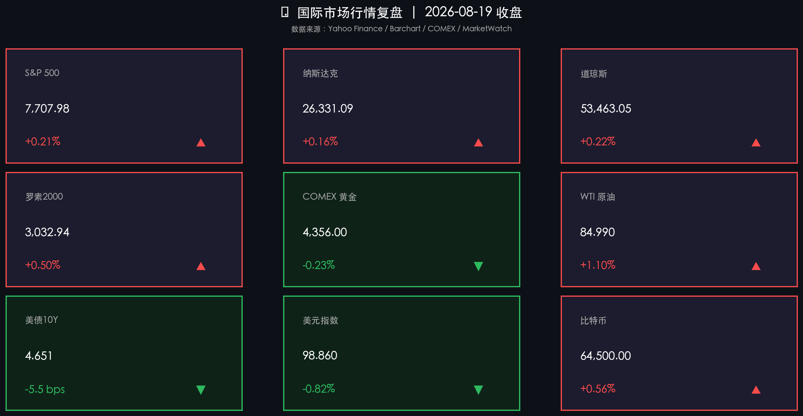

# 美财政部加码长债回购平抑收益率，美股三大指数止跌微涨，霍尔木兹海峡地缘溢价推高油价

**日期：2026年08月20日 (星期四)** &nbsp; **时段：周四早报 (常规交易日·国际市场)**

> **核心摘要**：隔夜美股三大指数集体止跌企稳并小幅收涨，道指上涨0.22%至53,463.05点，标普500上涨0.21%，纳指微涨0.16%，罗素2000小盘股反弹0.50%。美国财政部宣布将从9月起翻倍扩大长债流动性支持回购规模至单次至少40亿美元，显著平抑了近期暴涨的“长债发烧”行情，10年期美债收益率应声回落5.5个基点至4.651%，美元指数重挫0.82%失守99关口。尽管美联储7月会议纪要仍透露部分官员对通胀黏性的加息担忧，但财政部释放流动性与优质财报（如Target、雅诗兰黛、Moderna）为市场托底。霍尔木兹海峡航运危机悬而未决推升地缘溢价，WTI原油涨1.10%至84.99美元/桶，布油逼近92美元，黄金在4,356美元处震荡蓄势。

## 核心行情复盘

周三（8月19日）美股市场迎来流动性企稳驱动的修复反弹，长端利率大幅回落减轻资产估值压力，主要指数全面收红：

*   **标普500指数止跌企稳**：标普500上涨 **16.22点**，涨幅 **+0.21%**，收于 **7,707.98点**，终结连续三日的回调走势，重返7,700点上方。
*   **纳斯达克温和反弹**：纳斯达克综合指数上涨 **41.38点**，涨幅 **+0.16%**，收于 **26,331.09点**。半导体及AI硬件板块表现分化，受制于前期高估值消化，科技权重涨幅受限，但Moderna临床试验积极推动生物医药板块大幅领涨。
*   **道琼斯指数延续抗跌走强**：道琼斯工业指数上涨 **119.65点**，涨幅 **+0.22%**，收于 **53,463.05点**，消费与防御龙头财报表现强劲，带动传统蓝筹板块稳步上行。
*   **罗素2000弹性领跑**：罗素2000小盘股指数上涨 **15.05点**，涨幅 **+0.50%**，收报 **3,032.94点**，受益于美债收益率下行带来的中小企业融资成本缓解预期。
*   **COMEX黄金低位蓄势**：COMEX黄金期货微跌 **-0.23%**，收于 **4,356.00美元/盎司**，美元指数显著回落限制了金价下行空间，在4,350美元上方获得强劲支撑。
*   **国际原油地缘溢价走升**：WTI原油期货上涨 **0.93美元**，涨幅 **+1.10%**，收于 **84.99美元/桶**；布伦特原油上涨 **+1.00%**，收报 **91.91美元/桶**，中东咽喉航道安全局势再度趋紧。
*   **美债10年期收益率大幅下行**：美国10年期国债收益率回落 **5.5 bps**，收报 **4.651%**，脱离近期逼近4.80%的高位危险区。
*   **美元指数快速下挫**：美元指数（DXY）下跌 **-0.82%**，收于 **98.86**，创下自5月下旬以来的阶段新低。
*   **比特币企稳震荡**：比特币上涨 **+0.56%**，收于 **64,500美元**，全球宏观流动性预期回暖对数字资产构成边际支撑。

## 核心解读与市场逻辑

> **美财政部精准“拆弹”长端债市，流动性预期扭转市场悲观情绪**：此前30年期及10年期美债收益率持续冲高引发全市场对“无风险利率扼杀估值”的恐慌。财政部长贝森特（Scott Bessent）宣布将长期国债回购操作规模扩大逾一倍至单次至少40亿美元，直接在供给与流动性层面为长端债券市场注入强心剂，有效遏制了收益率失控风险，为美股估值反弹提供了核心动力。

> **美联储会议纪要显分歧，鲍威尔杰克逊霍尔年会成关键转折**：最新公布的美联储7月FOMC纪要显示，尽管票决结果维持利率在3.50%-3.75%区间，但内部对通胀黏性的忧虑依然突出，甚至有委员倾向继续加息。但在当前经济数据边际放缓与财政部主动调节流动性的背景下，市场逐步消化短期鹰派言论，将目光聚焦于下周（8月27-29日）由美联储主席主持的杰克逊霍尔（Jackson Hole）全球央行年会指引。

> **霍尔木兹地缘阴霾不散，能源通胀对冲与资产再平衡**：霍尔木兹海峡局势不确定性令全球原油运输风险溢价重回市场前列。原油价格连续走强虽加剧了通胀预期的粘性，但在美元大幅走弱与美债收益率下行的双重缓冲下，资金从单一科技成长向消费、医药及防御性蓝筹扩散，市场整体广度明显改善。

## 政策脉动

*   **美财政部大幅扩大长债回购操作**：自9月9日起，美国财政部将把针对长期名义付息国债的流动性支持回购规模翻倍至单次至少40亿美元，以平抑近期长端国债收益率的过度溢价并保障市场流动性平稳。
*   **美联储7月FOMC会议纪要公布**：纪要显示多数决策者对通胀回落至2%目标的进程持审慎态度，政策立场维持“依赖数据”，市场对9月政策决议预期维持中性博弈。
*   **中东霍尔木兹海峡安全态势升级**：国际航运及能源监管机构对波斯湾及霍尔木兹海峡海运安全维持高度戒备，油运保费与地缘风险溢价持续处于年内高位区间。

## 最新机构观点

*   **高盛 (Goldman Sachs)**：美国财政部扩大长债回购是极为关键的微观流动性干预举措，此举将有效平滑长端美债的供需失衡与尾部流动性风险。随着长端利率阶段性见顶，标普500指数估值压力将得到显著释放，科技与周期龙头的基本面盈利韧性依然是支撑下半年美股的核心支柱。

*   **摩根士丹利 (Morgan Stanley)**：市场当前正处于“从估值博弈走向业绩兑现”的精细化阶段。虽然美联储纪要偏鹰，但宏观经济并未出现断崖式风险，企业端自由现金流充裕的消费、医疗与工业龙头在利率回落期展现出更优的风险收益比，建议投资者保持成长与防御的杠铃配置策略。

*   **中金公司 (CICC)**：海外流动性边际缓和叠加美元指数跌破99关口，显著减轻了新兴市场及非美货币的汇率贬值压力。人民币汇率在外部约束放宽背景下具备更强弹性，中国资产估值性价比与政策支持力度双重凸显，全球配置资金有望加快向港股优质核心资产与A股结构性成长赛道回流。

## 今日市场情绪：流动性定海神针与债市退烧

在幽深翻腾的金融数据波涛之上，一枚由流动光芒铸就的巨大黄金之锚破浪沉入深海，将汹涌的红色波动抚平为静谧的蓝色微澜；远方暮色阴云中，高耸的灯塔光束刺破浓雾，几盏散发着微光的悬浮沙漏静静悬停，隐喻着财政流动性干预为市场注入定海神针，长端债市退烧促使全球风险资产重获喘息与平衡。

> Prompt: Surrealism style, Subject: A grand golden anchor forged of liquid light plunging into a stormy sea of glowing financial charts and calm waves. Background: In the background, distant lighthouse beams cut through dark clouds with floating luminous hourglasses. No humans, no text., masterpiece, high detail, intricate composition, cinematic lighting, 8k resolution

---

*免责声明：内容仅供参考，不构成投资建议。*

---
*Powered by Finance-Auto-Gen Pipeline (v3)*
