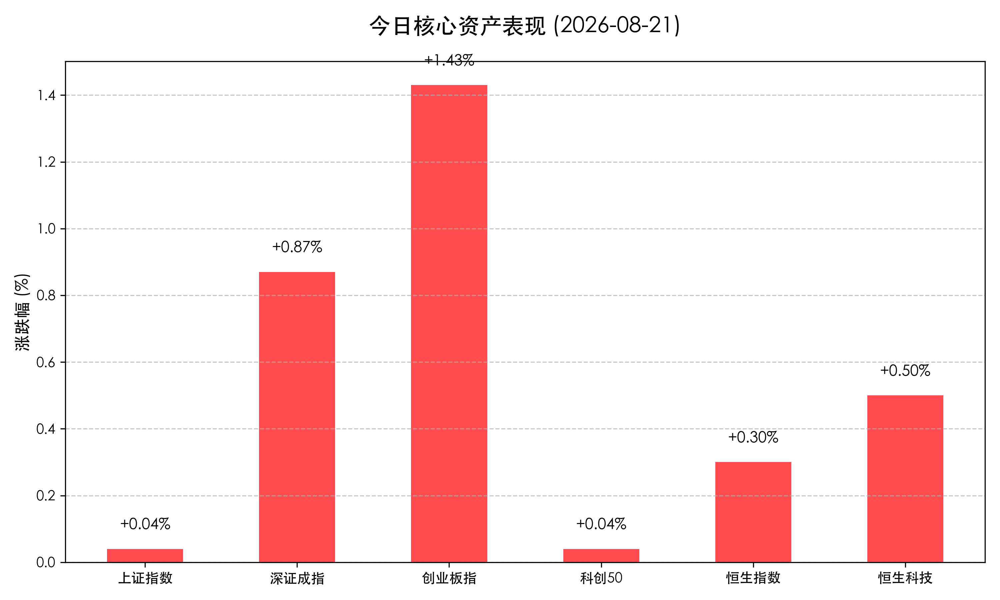

# 创业板指强势反弹领涨1.43%，两市缩量至1.89万亿，贵金属与半导体活跃

**日期：2026年08月21日 (星期五)** &nbsp; **时段：常规交易日 (模式A)**

> **核心摘要**：今日国内A股与港股主要指数呈现企稳回暖态势，其中创业板指表现最为亮眼，全天上涨1.43%。两市成交额为1.89万亿元，较前一交易日有所缩量。盘面上，贵金属、半导体、锂矿及通信设备等板块强势领涨，而部分医药、农林牧渔及房地产板块表现较弱。主力资金方面，北向资金净买入20亿元，南向资金净买入35亿元。港股市场亦同步回暖，恒生指数微涨。在宏观政策端，上海房地产新政施行及海外美债回购政策与金价走强共振。机构普遍认为，缩量不改中期震荡上行格局，科技与顺周期双主线有望并进。

## 核心行情复盘

今日国内A股与港股主要指数整体收涨，但个股跌多涨少，全市场超过2800只个股下跌，市场呈现一定的结构性行情特征。

**A股/港股市场表现**

*   **上证指数 (SSEC)**：收报 **3905.20点**，单日上涨 **+0.04%** 🔴
    *   全天维持平盘线附近震荡，最终微幅收红，走势相对平稳。
*   **深证成指 (SZI)**：收报 **14094.17点**，单日上涨 **+0.87%** 🔴
    *   在科技与顺周期权重板块带动下震荡走高，表现优于沪指。
*   **创业板指 (CHINEXT)**：收报 **3545.58点**，单日上涨 **+1.43%** 🔴
    *   新能源与部分科技龙头集体发力，带动创业板指全天单边上扬领跑宽基指数。
*   **科创50指数 (STAR50)**：收报 **1653.63点**，单日上涨 **+0.04%** 🔴
    *   半导体板块活跃带动指数探底回升，微幅收涨。
*   **恒生指数 (HSI)**：收报 **25775.58点**，单日上涨 **+0.30%** 🔴
    *   延续昨日反弹势头，市场情绪保持稳定，部分业绩异动个股表现抢眼。
*   **恒生科技指数 (HSTECH)**：收报 **4724.03点**，单日上涨 **+0.50%** 🔴
    *   大型互联网平台及科技股持续回暖。

**领涨/领跌板块分析**

*   **领涨板块**：
    *   **贵金属与黄金**：受益于海外美债回购政策及国际金价持续走强的影响，黄金股及贵金属板块全天强势。
    *   **半导体与通信设备**：科技主线活跃度不减，半导体材料及通信设备等新质生产力核心方向受资金追捧。
    *   **锂矿概念与能源金属**：超跌反弹迹象显著，资金左侧布局新能源上游资源品。
*   **领跌板块**：
    *   **部分医药细分**：前期连续上涨的医药板块出现分化，部分细分领域获利盘回吐。
    *   **房地产与种植业**：上海新政落地后部分资金兑现利好，房地产及关联板块回调。
    *   **酒类**：白酒及饮料制造板块表现偏弱。

---

## 核心解读与市场逻辑

1.  **缩量回暖彰显韧性，科技成长风格占优**
    > 两市成交额缩减至1.89万亿元，时隔多个交易日再度跌破2万亿关口。缩量环境下的指数反弹（特别是创业板指领涨）表明市场抛压已显著减轻，资金向具有业绩弹性与成长确切性的科技板块汇聚。
2.  **海外宏观共振，避险与大宗商品逻辑强化**
    > 美债回购政策叠加金价上行，使得贵金属及相关能源金属板块不仅具备避险属性，同时拥有强劲的全球大宗商品周期改善预期。
3.  **政策博弈进入验证期，结构性行情延续**
    > 随着上海等一线城市房地产新政的落地，市场进入政策效果验证阶段。资金的获利了结与板块轮动使得“涨指数、跌个股”的结构性分化现象较为突出。

---

## 政策脉动

1.  **上海房地产新政正式施行**
    > 备受关注的上海房地产优化新政今日起落地施行，政策旨在进一步优化住房限购、信贷等方面，促进房地产市场平稳健康发展，市场正密切关注其后续供需两端的传导效果。
2.  **海外美债回购政策扰动全球市场定价**
    > 伴随美联储及相关机构的美债回购操作预期，全球无风险利率曲线面临重塑，直接推升了包括黄金在内的避险资产吸引力。

---

## 最新机构观点

*   **中信建投**：**“科技与顺周期双主线并进，缩量不改中期震荡上行格局”**
    > 中信建投认为，近期交投缩量属于急跌后的正常修复特征。市场风格正逐渐在科技创新与顺周期（如大宗资源）之间形成双主线共振，中期震荡向上格局稳固。
*   **国泰君安**：**“贵金属受益于美债回购，建议继续关注高股息与大宗商品防御价值”**
    > 国泰君安研报指出，海外宏观复杂性依然较高，贵金属配置逻辑愈发顺畅。在结构性行情中，建议投资者坚守高股息红利资产与大宗商品的防御性价值。
*   **华泰证券**：**“创业板指领涨显现成长风格弹性，紧抓新能源车与半导体修复契机”**
    > 华泰证券表示，创业板指的强势表现凸显了资金对成长风格弹性的偏好，建议投资者紧抓新能源汽车产业链底部企稳以及半导体国产替代的修复性投资契机。

---

## 今日市场情绪：赛博余辉，数据启明

在这座由发光集成电路构筑的未来城市上空，一轮巨大的数字骄阳正冉冉升起。耀眼的霓虹数据流在夜色未尽的摩天大楼间穿梭，与下方黯淡的医疗设施、逐渐褪色的金色雕像形成鲜明对比。这象征着科技与成长的光芒正重新照亮市场，而传统的避险与医药板块在光影交错中悄然隐去。

> Prompt: Cyberpunk style, Subject: A futuristic glowing integrated circuit city skyline where bright neon data streams illuminate the night, contrasting with dim medical facilities and fading golden statues. Background: A vast digital sun rising over skyscrapers, projecting holographic stock charts upwards. No humans. No text., masterpiece, 8k resolution

---

*免责声明：内容仅供参考，不构成投资建议。*

---
*Powered by Finance-Auto-Gen Pipeline (v3)*
