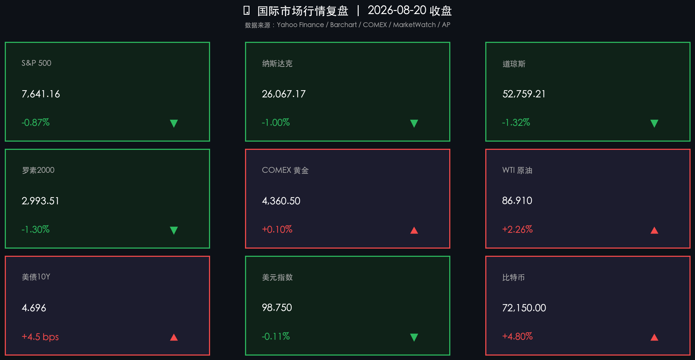

# 美债长端回购利好消退利率回升，零售不及预期拖累美股全线回调，地缘紧张推动油价暴涨与比特币逆势冲高

**日期：2026年08月21日 (星期五)** &nbsp; **时段：周五早报 (常规交易日·国际市场)**

> **核心摘要**：隔夜美股三大指数全线回落，此前由财政部扩大国债回购激发的反弹动能逐步衰退。道琼斯指数大跌703.84点（-1.32%）收于52,759.21点，标普500指数下跌0.87%至7,641.16点，纳斯达克指数下跌1.00%至26,067.17点，罗素2000小盘股重挫1.30%。美国国债总规模突破40万亿美元引发市场对财政赤字与长期通胀粘性的再度审视，10年期美债收益率反弹4.5个基点至4.696%。零售巨头沃尔玛（Walmart）等财报疲软加剧了对消费者支出的担忧，中东地缘对抗升级推升WTI原油急升2.26%至86.91美元/桶。避险与流动性再配置推动比特币逆势大涨4.80%突破72,000美元关口，黄金维持在4,360美元上方高位震荡。

## 核心行情复盘

周四（8月20日）美股市场遭遇通胀担忧与零售承压的双重打压，长端债券收益率反弹加剧估值分歧，主要资产呈现防御与分化格局：

*   **道琼斯指数深度回调**：道琼斯工业指数下挫 **703.84点**，跌幅 **-1.32%**，收报 **52,759.21点**，权重零售股与传统工业板块领跌大盘。
*   **标普500指数承压失守7,700点**：标普500指数下跌 **66.82点**，跌幅 **-0.87%**，收报 **7,641.16点**，消费品与周期性板块整体疲弱，但AI硬件及光通信板块相对抗跌。
*   **纳斯达克高位震荡回踩**：纳斯达克综合指数下跌 **263.92点**，跌幅 **-1.00%**，收报 **26,067.17点**。科技巨头多数随大盘调整，不过半导体存储与光模块产业链在强劲资本开支预期下逆市走强。
*   **罗素2000小盘股跌幅居前**：罗素2000指数下跌 **39.43点**，跌幅 **-1.30%**，收报 **2,993.51点**，长端借贷成本重回高位削弱中小企业估值弹性。
*   **国际油价受地缘刺激飙升**：WTI原油期货上涨 **1.92美元**，涨幅 **+2.26%**，收报 **86.91美元/桶**；布伦特原油站稳93美元上方，伊朗局势及经济制裁风险持续发酵。
*   **COMEX黄金坚挺蓄势**：COMEX黄金期货微涨 **+0.10%**，收于 **4,360.50美元/盎司**，全球地缘与债务扩张背景下央行及ETF购金需求为金价提供坚实底部支撑。
*   **美债10年期收益率重回升势**：美国10年期国债收益率上涨 **4.5 bps**，收于 **4.696%**，显示市场对财政部单方面微观流动性干预的长期效果仍持谨慎态度。
*   **美元指数窄幅震荡整理**：美元指数（DXY）微跌 **-0.11%**，收于 **98.75**，在降息博弈与避险情绪交织下维持低位盘整。
*   **加密资产强劲拉升突破**：比特币大涨 **+4.80%**，收报 **72,150.00美元**，全球宏观对冲资金对去中心化流动性资产配置力度明显提升。

## 核心解读与市场逻辑

> **财政干预边际效应递减，40万亿国债规模重燃赤字忧虑**：虽然财政部长贝森特宣布扩大回购规模短期平抑了恐慌，但全美公共债务突破40万亿美元的现实迫使债券交易员重新定价长期供给压力与通胀溢价。10年期美债收益率再度逼近4.70%，压制了风险资产的整体估值天花板。

> **零售龙头发出消费预警，滞胀担忧加剧市场避险偏好**：以沃尔玛为代表的核心零售巨头业绩表现逊于预期，揭示中低收入群体在长期高通胀与高利率挤压下的消费动能放缓。消费端疲软与原油等上游大宗商品价格暴涨形成“滞胀”共振，引发资金从周期消费板块流出。

> **杰克逊霍尔全球央行年会临近，美联储政策框架成博弈焦点**：美联储定于8月27-29日召开杰克逊霍尔年会，美联储主席关于货币政策框架与中性利率的表态备受关注。在7月会议纪要显现抗通胀分歧的背景下，市场静待央行年会为四季度降息路径定调。

## 政策脉动

*   **美国国债总额突破40万亿美元大关**：国会预算办公室及财政部最新数据显示联邦债务加速攀升，国债供给结构与赤字扩张问题成为两党与金融市场核心焦点。
*   **中东地缘态势升级与能源封锁风险**：美国针对伊朗强化经济制裁与海上运输管控，霍尔木兹海峡及中东能源通道地缘风险溢价急剧升温。
*   **杰克逊霍尔全球央行年会日程敲定**：全球主要央行行长与顶尖学者将于8月27-29日共聚怀俄明州，围绕“金融创新：对支付与政策的启示”展开深入探讨，全球降息周期节奏面临关键校准。

## 最新机构观点

*   **高盛 (Goldman Sachs)**：尽管大盘因宏观赤字与零售数据回调，但AI算力基础设施的资本开支周期并未终结。企业在先进封装、高带宽内存及光通信领域的订单可见度依然强劲，建议在市场对宏观担忧引发的波动中逢低布局结构性成长龙头。

*   **摩根士丹利 (Morgan Stanley)**：长端美债收益率在4.70%附近的反复震荡表明单纯依靠财政流动性回购无法彻底消除供需基本面矛盾。在大宗商品地缘溢价上升与消费趋紧的环境下，黄金、能源基础设施及高自由现金流标的具备最佳的防御与收益平衡属性。

*   **中金公司 (CICC)**：海外市场在“高通胀粘性+财政赤字担忧”交织下震荡加剧，全球资金寻求非美独立alpha收益与低估值避险资产的动力增强。A股与港股在内部政策托底及估值修复双重催化下，具备较好的相对收益与配置韧性。

## 今日市场情绪：通胀回潮与资产博弈

在昏暗翻腾的赤色天幕之下，一座由星轨环绕的巨大天平在苍茫山脉之上沉重摇晃；黄金铸就的悬浮沙漏缓缓倾斜，黑色原油与璀璨的数字晶币在重力与引力之间激荡流淌，漫天雷云与交织的红绿色行情星图映射出通胀再起与资产避险的激烈角逐。

> Prompt: Surrealism style, Subject: A massive celestial balance scale with a glowing golden hourglass tipping as dark liquid oil and digital crystal coins cascade through its glass chambers. Background: In the background, stormy crimson clouds and glowing neon constellation charts illuminate a vast surreal mountain range under cosmic lighting. No humans, no text., masterpiece, high detail, intricate composition, cinematic lighting, 8k resolution

---

*免责声明：内容仅供参考，不构成投资建议。*

---
*Powered by Finance-Auto-Gen Pipeline (v3)*
