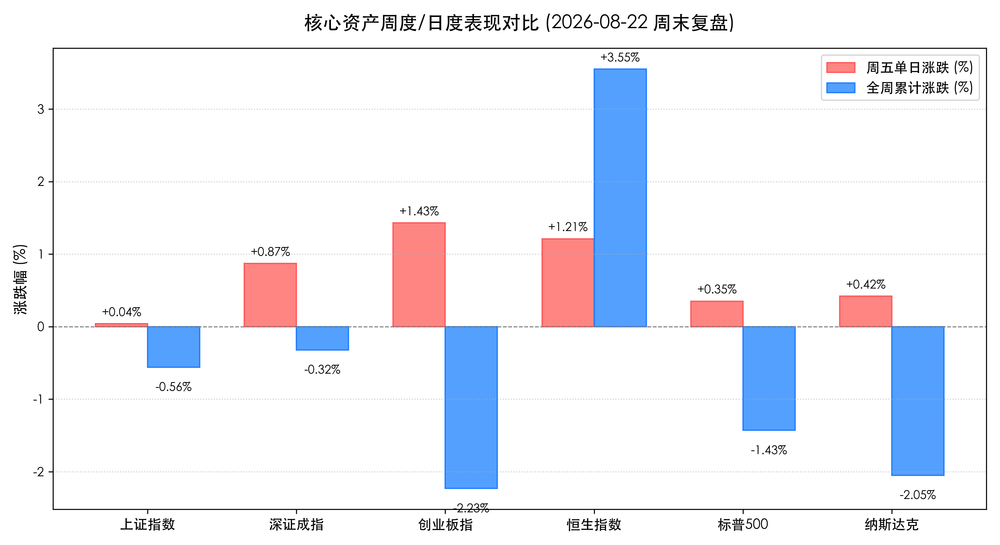

# 港股周涨3.55%领跑全球，A股缩量企稳迎周末，黄金破新高与5000亿内需利好共振

**日期：2026年08月22日 (星期六)** &nbsp; **时段：周末复盘 (模式B)**

> **核心摘要**：本周全球资本市场呈现结构性分化与流动性博弈特征。A股经历周中震荡蓄势后于周五企稳回升，上证指数全周微跌0.56%，创业板指周跌2.23%但周五单日大涨1.43%；港股表现尤为强势，恒生指数全周大涨3.55%重返26000点关口。海外方面，受美国财政部扩大长债流动性回购与避险买盘推动，现货黄金强势突破4600美元/盎司历史新高。宏观政策端，国常会听取新一代通信网建设汇报，5000亿新型内需金融工具蓄势待发。中信、中金等顶级机构在周末策略中指出，市场正由“超跌反弹”向“均衡配置”过渡，科技主线与出海、资源品配置价值进一步凸显。

---

## 核心资产周度/日度表现回顾

本周全球权益资产经历了美债利率扰动与宏观经济数据博弈，呈现明显的结构性分化。A股与港股在周五迎来一致性反弹修复，港股全周录得显著超额收益。

*   **上证指数 (SSEC)**：收报 **3905.20点**，周五单日 **+0.04%** 🔴，全周累计 **-0.56%** 🟢
    *   全周呈现围绕3900点整数关口的拉锯震荡，周五在有色金属与大金融护盘下微幅收红，回踩企稳信号初现。
*   **深证成指 (SZI)**：收报 **14094.17点**，周五单日 **+0.87%** 🔴，全周累计 **-0.32%** 🟢
    *   周五在高端制造与新能源权重股带动下探底回升，周线跌幅显著收窄。
*   **创业板指 (CHINEXT)**：收报 **3545.58点**，周五单日 **+1.43%** 🔴，全周累计 **-2.23%** 🟢
    *   虽然全周受前期获利盘回吐影响调整2.23%，但周五凭借锂电、算力硬件与光模块赛道放量拉升，单日领涨宽基指数。
*   **恒生指数 (HSI)**：收报 **26009.46点**，周五单日 **+1.21%** 🔴，全周累计 **+3.55%** 🔴
    *   港股资产本周成为全球资金避险与进攻的绝佳载体，蓝筹权重与互联网巨头周内持续走强，成功站上26000点关口。
*   **恒生科技指数 (HSTECH)**：收报 **4766.16点**，周五单日 **+1.40%** 🔴，全周累计 **+1.24%** 🔴
    *   AI应用、大模型概念及消费电子板块周内活跃度高企，周五全线飘红。
*   **标普500指数 (S&P 500)**：周五单日 **+0.35%** 🔴，全周累计 **-1.43%** 🟢
*   **纳斯达克指数 (NASDAQ)**：周五单日 **+0.42%** 🔴，全周累计 **-2.05%** 🟢
    *   美股受零售巨头业绩分化与长端美债收益率反弹冲击，终结此前连涨态势，周五在PMI商业活动数据支撑下微幅反抽。
*   **现货黄金 (XAU/USD)**：周五单日 **+1.15%** 🔴，全周累计 **+3.80%** 🔴
    *   避险情绪升温叠加流动性回购预期，金价一举冲破4600美元/盎司大关，刷新历史纪录。

**全周核心板块轮动梳理**：
*   **周度领涨方向**：**贵金属与工业金属**（避险与通胀预期共振，黄金概念龙头周涨幅超10%）、**算力硬件与液冷服务器**（智算中心需求持续放量）、**锂电与能源金属**（周五展开强劲超跌反弹）。
*   **周度承压方向**：**农业种植与养殖**（商品粮价格承压）、**部分生物医药与创新药**（短期资金获利了结）、**传统白酒与地产产业链**（政策出台后资金博弈进入效果验证期）。

---

## 过去 48 小时重磅事件深度复盘

1.  **国常会重点部署新一代通信网建设与清欠纾困**
    > 国务院常务会议听取新一代通信网建设汇报，强调要抢抓数字经济与算力基建发展机遇；同时部署进一步清理拖欠企业账款工作，切实改善民营及中小企业现金流预期。此外，针对数字经济、人工智能和低空经济的新型政策性金融工具（规模达5000亿元）逐步明朗，部分优质项目将获得财政贴息支持。
2.  **美国财政部加码长债回购，黄金价格破天荒突破4600美元**
    > 为缓解长端美债收益率攀升带来的市场流动性紧绷，美财政部宣布将10年至30年期国债的流动性支持回购规模至少扩大一倍。该政策虽然在短期内平抑了无风险利率飙升，但也加深了全球市场对美元信用和巨额债务可持续性的担忧，触发全球主权基金和避险资本加速涌入黄金等硬资产。
3.  **上海“沪八条”楼市新政正式落地，一线资产估值进入验证期**
    > 上海房地产优化新政在信贷、购房补贴、以旧换新等维度全面发力。市场反馈显示周末看房热度有所升温，资金正密切观察后续成交量能否实现跨周期复苏，这将直接影响下半年顺周期与大金融板块的估值中枢。
4.  **7月全社会用电量单月突破万亿千瓦时，AI算力与先进制造能耗激增**
    > 国家能源局最新披露7月全社会用电量达1.02万亿千瓦时（同比高增8.6%），创历史单月新高。除极端天气降温负荷外，高技术制造业用电与智算中心算力集群能耗大幅增长，印证国内新质生产力与科技硬件产业链正处于真实扩产周期。

---

## 下周全球宏观大事预警

1.  **2026年杰克逊霍尔全球央行年会（8月27日-29日）**
    > **核心关注点**：美联储主席凯文·沃什（Kevin Warsh）将于8月28日（周五）发表其就任后的首次主旨演讲。在当前抗通胀与防衰退的复杂平衡中，全球投资者将从演讲中捕捉美联储秋季降息幅度、资产负债表策略及中性利率预期的关键信号。
2.  **A股与港股中报披露进入“终局攻坚周”**
    > 截至下周五，上市公司2026年中期业绩披露将全部收官。科技硬件（光模块、半导体、液冷）、新能源车产业链、出海制造龙头的中报盈利兑现度将成为资金调仓换股的最核心锚点。
3.  **中国8月LPR报价与央行跨月流动性投放**
    > 央行下周公开市场到期与逆回购操作节奏值得关注，市场普遍预期货币政策将继续保持流动性合理充裕，以支持实体经济与新型政策性金融工具落地。

---

## 顶级机构周末策略内参摘要

1.  **中信证券：从“超跌反弹”迈向“均衡配置”，聚焦科技核心资产与出海龙头**
    > 中信证券最新策略报告认为，市场经历前期的震荡洗牌后，底部支撑进一步夯实，正从单纯的流动性超跌反弹转向注重基本面确立的“均衡配置”阶段。建议投资者逐步剔除边缘低质资产，向具备核心护城河的科技龙头（AI算力基础设施、光模块、具身智能）以及受益于全球大宗商品定价与出海潜力的优势制造企业集中。
2.  **中金公司：中报非金融盈利双位数增长可期，2026年确立为“液冷放量元年”**
    > 中金公司研报预计，2026年中报A股非金融板块有望录得双位数同比增长，AI资本开支对科技硬件盈利的传导正在从预期变为确定性业绩。随着超高功耗芯片加速渗透，全球智算中心液冷市场规模将迎来爆发式增长。在多主线交织的环境下，建议坚定把握科技创新主线，并兼顾有色、电新与互联网优质标的。
3.  **中信建投：流动性蓄水池充盈，缩量调整后关注新一轮主升浪契机**
    > 两市成交虽然在周后期降至1.89万亿，但充沛的居民储蓄转移与机构仓位回补逻辑未变。短期缩量蓄势通常是上攻阻力位前的健康整固，重点关注下周央行政策信号与业绩超预期赛道的共振。

---

## 今日市场情绪：稳健博弈与预期重塑

> Prompt: A majestic celestial balance scale forged from solid gold standing upon a crystalline plateau above the earth, holding glowing AI circuits on one side and radiant gold bullion on the other, bathed in dawn starlight

---

免责声明：内容仅供参考，不构成投资建议。
