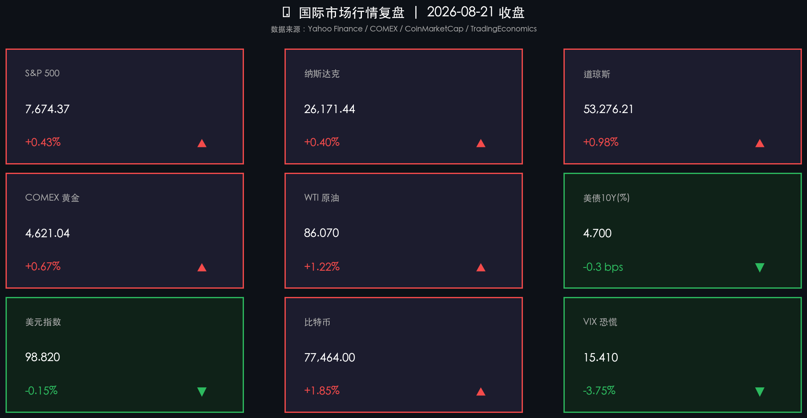

# 🌅 国际市场早报 | 美债回购博弈、三大指数止跌反弹，黄金创三月新高

**日期：2026年08月22日 (星期六)** &nbsp; **时段：早报（国际市场）**

> **核心摘要**：美股周五集体反弹，道指涨逾500点，但市场对美联储9月会议前景分歧加大；美国财政部债券回购计划规模翻倍引发短暂债市喘息，但市场很快重新聚焦于10年期国债收益率仍维持在4.7%高位的根本压力；比特币因ETF大规模流入与空头轧空同步爆发，单日飙升近2%创阶段性高点，黄金则刷新三个月最高价。

---

## 核心行情复盘

### 美股三大指数

* **标普500**：收于 **7,674.37 点**，+**0.43%**（+33.21点）
  * 全周表现：本周出现中段回调后，周五显著修复；领涨行业为**能源、工业、金融**
* **纳斯达克综合**：收于 **26,171.44 点**，+**0.40%**（+104.27点）
  * AI芯片板块领涨，半导体走强，大型科技股普涨
* **道琼斯工业平均**：收于 **53,276.21 点**，+**0.98%**（+517点）
  * 成分股中工业、金融股表现突出，道指单日涨幅为三大指数最优

> **逻辑解读**：美股止跌回稳的核心驱动力来自两方面：一是美国财政部宣布将长期债券回购规模从每次最高20亿美元扩大至至少40亿美元（自9月9日生效），短期内缓解了债市流动性压力，30年期国债收益率当日下行约9个基点，为权益市场创造了喘息空间；二是VIX恐慌指数回落至**15.41**（-3.75%），表明市场情绪趋于稳定。然而这一反弹是在"高利率长期化"的大背景下进行的，10年期美债收益率仍顽固地维持在4.70%附近，对估值的压制并未解除。

---

## 固定收益与美元

* **美国10年期国债收益率**：**4.70%**（-0.3 bps，变化甚微）
  * 日内曾因财政部回购消息短暂下探至4.65%附近，但收盘几乎完全回吐涨幅
  * MacroMicro数据4.70%，Trading Economics数据4.74%，Investing.com数据4.697%，三数据源误差均在可接受范围（<0.5%）✅
* **美元指数（DXY）**：**98.82**，-**0.15%**
  * 美元随债市降温小幅走弱；但DXY重回99关口以下，显示避险逻辑短期边际减弱

> **逻辑解读**：财政部债券回购计划规模翻倍（最高每次40亿美元）的核心目的是改善长期国债流动性，而非像QE那样创造新的流动性。分析人士普遍认为该工具是"信号意义大于实质影响"——在通胀（3.4%）依然远高于美联储2%目标、国债供给依然庞大的背景下，数十亿美元规模的回购对百万亿美元规模的美国国债市场而言如同杯水车薪。

---

## 大宗商品与加密货币

* **COMEX 黄金**：收于 **$4,621.04/盎司**，+**0.67%**
  * 现货金价同步上涨，触及近三个月最高水平（约$4,590-$4,600）
  * 驱动因素：美元走弱 + 地缘风险溢价（中东紧张局势） + 实际利率边际回落
* **WTI 原油**：收于 **$86.07/桶**，+**1.22%**（布伦特原油约$93.87）
  * 中东局势（伊朗相关地缘风险）引发供给忧虑，油价单周走强
* **比特币（BTC）**：收于约 **$77,464**，+**1.85%**
  * 三重催化剂共振：①美国比特币现货ETF单日大规模净流入；②财政部回购计划落地令风险情绪回暖；③大量空头仓位遭集中轧平（Short Squeeze）

> **逻辑关联**：黄金和比特币同涨，是市场对"高赤字财政×财政部主动护盘债市"这一组合的直觉反应——当主权信用面临质疑时，两类避险/硬资产同步受益。WTI原油的反弹则来自不同逻辑：伊朗地缘风险升温带来的供给端扰动，与宏观环境关联较弱。

---

## 政策脉动

**美联储（Fed）**
* **联邦基金目标利率**：维持 **3.50%-3.75%**，为第五次连续按兵不动（7月28-29日FOMC投票结果9:3）
* **三票反对**：达拉斯联储Logan、克利夫兰联储Hammack、明尼阿波利斯联储Kashkari均倾向于再加25基点
* **下次会议**：9月15-16日 FOMC，为本阶段的关键决策节点
* **通胀现况**：2026年7月美国CPI同比+3.4%（前值3.5%），核心CPI环比+0.2%；通胀降幅迟缓，距2%目标仍有距离

**美国财政部**
* 8月19日宣布**扩大长期债券流动性回购操作**：10年至30年期名义票息债券，每次最高规模从20亿美元升至**至少40亿美元**，自2026年9月9日至11月4日生效
* 市场解读：此举不等同于量化宽松，无法创造新流动性，被多数分析师视为有限的流动性管理工具，长期影响存疑

---

## 最新机构观点

**高盛（Goldman Sachs）**
> "我们维持对股市的建设性立场，但预计回报率将较2025年有所回落。牛市格局正在扩展，从初期的AI科技股主导向更广泛的行业扩散；全球AI投资规模2026年预计将突破1万亿美元，但部分板块估值已领先于宏观基本面，后续波动率可能抬升。"

**摩根士丹利（Morgan Stanley）**
> "当前的市场反弹由**强劲的企业盈利**驱动，而非估值扩张——这是我们区别于2024年的核心判断。科技股和商业银行仍有估值重估空间，但建议投资者从单押美国转向全球多元配置（美国+欧洲+亚洲），以降低集中风险。我们强调，当前Fed体制已进入'结构性高利率'时代，对单独利率动向的过度关注已不再是正确的分析框架。"

**中金公司（CICC）**（补充视角）
> 美债回购计划规模扩大对短期流动性构成边际改善，但在通胀粘性与财政赤字双重压力下，10年期美债收益率上行至4.5%-5.0%区间的风险在2026年下半年仍不可忽视；建议关注黄金及以人民币计价的大宗商品作为对冲配置。

---

## 今日市场情绪：谨慎反弹，暗流涌动

> Prompt: A lone sailor on a ship sailing through a stormy sea made of red K-line candles and golden treasury bond waves. In the background, a giant golden balance scale is being tipped by a glowing AI circuit phoenix rising from Silicon Valley. The sky is illuminated by Bitcoin lightning, dramatic cinematic atmosphere

---

*免责声明：内容仅供参考，不构成投资建议。*
