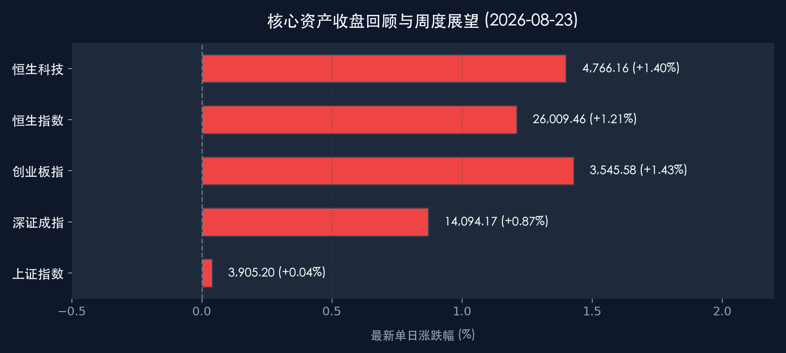

# 🏮 周日晚报：超级周重磅来袭，促内需政策加码与全球央行年会前瞻

**日期：2026年08月23日 (星期日)** &nbsp; **时段：下午 (新周展望)**

> **核心摘要**：本周末国内迎来“财政金融协同促内需”组合拳落地，六大行集体提升消费贷与信用卡贴息额度；海外市场即将迎来英伟达财报与杰克逊霍尔全球央行年会的“双重超级考验”。在政策暖风与基本面验证交织下，下周 A 股与港股有望在科技成长与顺周期消费双主线中寻找突破。

## 周末财经要闻终极汇总

过去 48 小时，国内外宏观与产业政策迎来多项重磅进展，为新一周行情奠定基调：

*   **财政金融协同促内需政策全面落地**：8月21日财政部等三部门联合发文，8月22日工、农、中、建、交、邮储六大国有行集体公告，明确个人消费贷及信用卡分期贴息上限由 3,000 元上调至 **5,000 元**，贴息比例为年化 1 个百分点，并将车位、装修等专项分期全面纳入支持范畴。
*   **财政部定调“投资于人”与万亿发债预期**：财政部明确“十五五”时期将更加聚焦公共服务支出，同时披露下半年尚有 **2万多亿元** 地方政府专项债与超长期特别国债待发行使用，稳增长弹药充足。
*   **人民币买卖活动系统性规范**：央行与市场监管总局联合发文，自 2026 年 9 月 1 日起规范人民币买卖活动，将网络平台纳入重点监管，维护国家法定货币信誉与金融交易秩序。
*   **公开市场流动性平稳**：本周央行持续开展逆回购维稳资金面，下周面临 950 亿元逆回购及 6,000 亿元 MLF 到期，市场预期流动性格局将维持合理充裕。

## 新一周市场核心博弈逻辑

回顾上周五（8月21日）收盘表现，国内核心资产呈现探底回升的温和反弹态势：
*   **上证指数**：收报 **3,905.20点** (+0.04%)。
*   **深证成指**：收报 **14,094.17点** (+0.87%)。
*   **创业板指**：收报 **3,545.58点** (+1.43%)，领涨宽基指数。
*   **恒生指数**：收报 **26,009.46点** (+1.21%)，重回 26,000 点关口。
*   **恒生科技**：收报 **4,766.16点** (+1.40%)。

> **核心解读与博弈逻辑**：
> 1. **AI 资本开支终极验证**：下周英伟达财报不仅直接关系到纳指与美股科技巨头走势，更将深刻影响 A 股算力硬件、光模块（CPO）及液冷板块的风险偏好。
> 2. **全球降息路径再定价**：美联储主席沃什在杰克逊霍尔年会的首秀将定调全球抗通胀与降息节奏，美债收益率与美元指数的波动将牵动全球资金再平衡。
> 3. **国内促消费与产业升级共振**：贴息政策扩大覆盖面，有助于修复居民端消费信用；同时科技创新与“十五五”新质生产力规划将持续提供结构性行情支撑。

## 本周重磅经济数据与会议前瞻

*   **8月26日（周三）**：美国 7 月核心 PCE 物价指数及二季度 GDP 修正值公布，验证美国通胀回落趋势。
*   **8月27日（周四）凌晨**：英伟达 (NVIDIA) 发布 2027 财年 Q2 财报，重点关注 Blackwell 出货进展与数据中心收入预期。
*   **8月27日 - 8月29日**：2026 杰克逊霍尔全球央行年会（主题：“金融创新：对支付与政策的启示”）。
*   **8月28日（周五）22:00**：美联储主席沃什发表年会主旨演讲，市场关注其中期利率路径指引。

## 头部券商/投行开盘策略点睛

*   **中金公司 (CICC)**：市场正处于从“三重支撑”转向“三重约束”（AI趋势、美元流动性、中国经济）的验证期。策略上建议向基本面阻力较小的方向均衡配置，流动性宽裕背景下科技成长仍是核心底色。
*   **中信证券 (CITIC)**：随着“十五五”规划开局，内需修复将带动基本面持续改善。建议重点布局 **“AI+能化”** 的新杠铃结构，同时在通胀温和回升背景下关注具备抗波动能力的红利高股息与龙头消费标的。
*   **中信建投**：市场定价逻辑正回归中报基本面。随着海外科技事件与财报扰动逐步落地，建议积极把握超跌但景气度向上的科技成长反弹窗口。

## 今日市场情绪：超级周前的期待与博弈

> Prompt: Cyberpunk style, A grand financial summit arena with glowing golden scales and AI neural networks, representing Jackson Hole central bank outlook and tech earnings, in the background a magnificent bull gazing at a futuristic market horizon, masterpiece, high detail, intricate composition, cinematic lighting, 8k resolution

---
免责声明：内容仅供参考，不构成投资建议。
