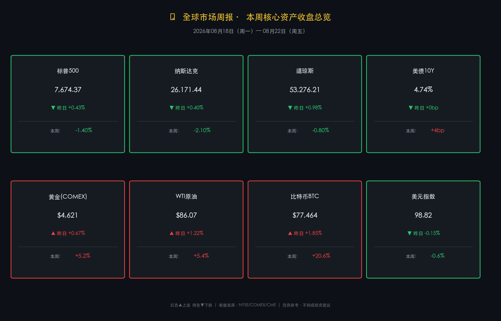

# 🌐 国际市场周末复盘 | 债市高压、再通胀主线，黄金破位 $4600、下周 Jackson Hole 成关键

**日期：2026年08月23日 (星期日)** &nbsp; **时段：早报（周末复盘·模式B）**

> **核心摘要**：截至本周五（8月22日）收盘，美股三大指数集体收跌（纳指周跌 -2.1%、标普 -1.4%），美债10年期收益率上行至 4.74% 接近近20个月高位，"高利率长期化"叙事主导权益市场；与此同时，黄金强势突破 $4,600/盎司（全周累涨逾5.2%），WTI原油全周大涨超5.4%，比特币则上演先飙升 +30%、后高位回落的过山车行情，收于 $77,464；下周市场焦点高度集中于**英伟达财报（8/26）**与**杰克逊霍尔年会（8/27-29）**，新主席沃什（Warsh）的首秀演讲将成为定义年内货币政策路径的关键变量。

---

## 核心资产周度/日度表现回顾

### 🇺🇸 美股三大指数

* **标普500（S&P 500）**：周五收于 **7,674.37 点**，单日 **+0.43%**；**全周累计 -1.40%**，终结三周连涨势头
  * 领涨行业（周五）：能源、工业、金融；领跌行业（全周）：科技（纳指权重股遭抛压）
* **纳斯达克综合（Nasdaq）**：周五收于 **26,171.44 点**，单日 **+0.40%**；**全周累计 -2.10%**，连续第三周承受最大压力
  * AI 芯片板块周五个别反弹，但全周遭受利率敏感性估值调整
* **道琼斯工业平均（DJIA）**：周五收于 **53,276.21 点**，单日 **+0.98%**；**全周累计 -0.80%**，连续第二周下跌

> **逻辑解读**：本周美股下跌的主逻辑是"债市定价重置传导至权益"——10 年期美债收益率持续上行，直接压制以纳指科技股为代表的高估值资产。周五反弹具有明显的"周末平仓驱动"特征，并叠加美国服务业 PMI 超预期（创近两年最强），但这一正面催化不足以改变全周下跌的格局。

---

### 🏦 固定收益与美元

* **美国10年期国债收益率**：**4.74%**，全周累计上行约 **+4 个基点**（逼近2025年初以来高位）
  * 财政部宣布将长期债券回购规模从 20 亿美元提升至每次至少 40 亿美元，仅制造短期波动，未能扭转收益率上行大趋势
* **美元指数（DXY）**：**98.82**，单日 -0.15%，**全周小幅收跌约 -0.60%**
  * 美元走弱为黄金、大宗商品提供支撑，但在"高利率长期化"背景下，美元下行空间有限

> **逻辑解读**：市场已从"利率见顶交易"全面切换至"higher-for-longer"重定价。当前美联储基准利率区间为 3.50%-3.75%，通胀（3.4%）依然高于 2% 目标，劳动力市场韧性犹存，使市场降息预期大幅降温。多数分析师现将"年内维持不变"作为基准情形，甚至有小概率押注"再加息风险"。

---

### 🥇 大宗商品与加密货币

* **COMEX 黄金**：周五收于 **$4,621.04/盎司**，单日 **+0.67%**；**全周累计涨幅高达 +5.17%~+5.22%**，连续第三周上涨，突破并站稳 $4,600 历史重要整数关口
  * 三重驱动：①美元走软；②霍尔木兹海峡油轮封锁风险升温带动地缘溢价；③全球央行持续购金 + "去美元化"叙事强化，使金价对高利率钝化
* **WTI 原油**：周五收于 **$86.07/桶**，单日 **+1.22%**；**全周累计 +5.15%~+5.66%**（布伦特原油全周涨约 +6.4%）
  * 伊朗/霍尔木兹海峡通航受限风险 + OPEC+ 维持减产 = 供给端扰动定价主线
* **比特币（BTC）**：周五收于约 **$77,464**，单日 **+1.85%**；但本周整体大起大落
  * 全周戏剧性轨迹：周初于 $64,000 附近横盘 → 5日内飙升近 **+30%** 至 $80,000 峰值 → 周五高位回落至 $77,000，触发约 **5.47 亿美元** 多空双向清算
  * 日 RSI 曾突破 80（自 2024 年 11 月以来最高），为技术性回调埋下伏笔
* **美元指数（DXY）**：98.82（见上文）

> **逻辑关联（再通胀交易叙事）**：本周金融市场呈现标准的"再通胀"交易特征——油价大涨（供给扰动）推升通胀预期，债市收益率随之上行，而黄金在"财政信用担忧+通胀预期+去美元化"的三重叙事下脱离传统"高利率压金价"框架，独立走强。比特币的剧烈波动则体现了加密市场特有的"短多轧空 → 高位兑现"机制。

---

## 过去 48 小时重磅事件深度复盘

### 1. 美国财政部债券回购计划扩容（周五）
美国财政部宣布自 9 月 9 日起，将长期国债回购规模从每次最高 20 亿美元提升至**至少 40 亿美元**。市场初期反应为：30年期国债收益率当日下行约 9 bps、VIX 恐慌指数回落至 15.41（-3.75%），带动美股出现周五技术性反弹。

> **深度评估**：多数机构分析人士将该举措定性为"信号意义大于实质影响"。在美国财政赤字规模庞大、国债供给持续高企、通胀（3.4%）远超美联储目标的背景下，数十亿美元规模的回购对百万亿美元规模的美债市场如同杯水车薪，无法从根本上压制收益率上行趋势。

### 2. 美国服务业 PMI 数据（周五）
美国 8 月服务业 PMI 初值超预期强劲，创近两年新高。这为美联储"不急于降息"提供了最新论据，但也短期推升了美股（经济韧性 = 企业盈利保障）。

### 3. 比特币高位大规模清算（周四-周五）
BTC 在周四冲击 $80,000 后遭遇大规模多头平仓，单日清算规模约 **4.75 亿美元**（多头），合约市场 OI 大幅收缩。$76,000-$77,000 区间现被市场视为关键支撑位。

### 4. 中东地缘风险升级（全周持续）
霍尔木兹海峡油轮封锁紧张局势贯穿全周，OPEC+ 维持减产立场。布伦特原油逼近 $94 关口，国际能源市场情绪趋于紧张，亦成为黄金上涨的协同因素。

---

## 下周全球宏观大事预警

| 时间 | 事件 | 重要程度 | 关注焦点 |
|------|------|---------|---------|
| **8/26（周三）盘后** | 🔥 **英伟达 Q2 FY27 财报** | ⭐⭐⭐⭐⭐ | 数据中心/AI 芯片需求是否维持超预期增长；指引是否足以支撑当前高估值 |
| **8/27（周四）** | 🔥🔥 **杰克逊霍尔年会开幕·沃什主旨演讲** | ⭐⭐⭐⭐⭐ | 新主席"首秀"：是否释放通胀路径明确指引？是否继续"低信息/模糊沟通"策略？ |
| **8/27-29** | 美联储年会（堪萨斯城联储主办）| ⭐⭐⭐⭐ | 主题："金融创新：对支付与政策的影响"；注意其他委员的边际表态 |
| **8/26-29** | 多国 PMI 终值、欧元区通胀数据 | ⭐⭐⭐ | 欧洲滞胀风险持续监测 |

> **⚠️ 风险提示**：英伟达财报（8/26）与沃什演讲（8/27）形成双重事件叠加，市场隐含波动率（VIX）或在周初重新攀升。如果沃什维持"模糊沟通"而非给出明确政策路径，市场短期可能遭遇"鹰派解读"冲击。

---

## 顶级机构周末策略内参摘要

**🏦 高盛（Goldman Sachs）**
> "美股回报正从初期 AI 主题股向更广泛板块扩散。全球 GDP 增速因能源价格顺风减弱将有所放缓，但 AI 投资周期持续支撑商业资本开支。黄金长期做多逻辑完整：全球央行持续增持为核心基本面锚，目前虽适度调整目标价，但结构性看多立场未变。"

**🏦 摩根士丹利（Morgan Stanley）**
> "我们维持'建设性但不自满'的策略定调。超大规模数据中心运营商（Hyperscalers）与大型商业银行是当前财报季中表现突出的两条主线。我们继续偏向股票超配、相对低配核心固定收益；AI 仍是当前资本开支周期的第一驱动力，需关注 Nvidia 财报对该主线的持续验证或证伪。"

**🏦 摩根大通（JPMorgan）**
> "当前市场的核心挑战是：在公开市场中寻找有效分散配置愈发困难。我们认为，美联储加息的'幅度'比'时间节点'更重要——只要加息力度温和，风险资产整体有望维持韧性。同时，我们注意到企业并购（M&A）活动明显加速，这是企业主体信心上升的积极信号，可抵消部分宏观层面的不确定性。"

---

## 今日市场情绪：再通胀焦虑与杰克逊霍尔前夜

> Prompt: A colossal ancient scale in the cosmos, one pan filled with gleaming golden ingots tipping downward, the other pan holding crumbling Treasury bond scrolls being consumed by flame; in the far background, the snow-capped peaks of Jackson Hole mountains glow under a blood-red sky streaked with rising oil prices as dark numbers. The scene is rendered in dramatic chiaroscuro.

---

*免责声明：内容仅供参考，不构成投资建议。*
