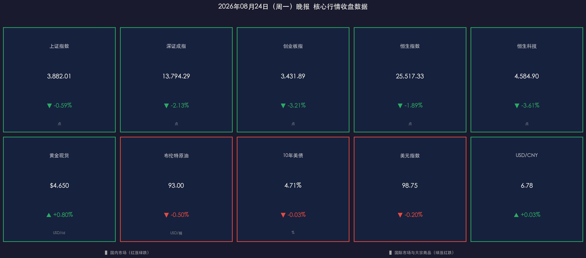

# 🌆 周一晚报：超级周开局承压，科技成长普跌、红利防御逆势抗跌

**日期：2026年08月24日 (星期一)** &nbsp; **时段：下午（收盘复盘）**

> **核心摘要**：A 股与港股今日遭遇全线调整，创业板指重挫逾 3%，算力硬件、CPO、半导体等高位成长赛道遭主力大规模撤离；阿里巴巴宣布 800 亿港元配售稀释预期压垮恒科；黄金站上 4650 美元创三个月新高，煤炭、银行、保险等红利板块逆势守住阵地。市场正进入"超级周"前的深度博弈：英伟达财报与美联储沃什杰克逊霍尔首秀，将决定全球资产重新定价的方向。

## 核心行情复盘

### 🇨🇳 国内 A 股（模式 A：常规交易日）

*   **上证指数**：收报 **3,882.01 点**，下跌 **0.59%**（跌幅相对温和，权重板块托底）
*   **深证成指**：收报 **13,794.29 点**，下跌 **2.13%**（中小盘成长拖累显著）
*   **创业板指**：收报 **3,431.89 点**，下跌 **3.21%**（跌幅最大，高位筹码松动）
*   **成交额**：沪深京三市全天成交约 **2.02-2.05 万亿元**，较前一交易日明显放量，半日即达 1.37 万亿，显示多空博弈激烈
*   **个股分布**：全市场约 4,000+ 只个股下跌，仅约 1,500 只个股上涨，跌多涨少格局明显

> **核心解读（A 股）**：
> 今日行情呈典型"存量虹吸"特征。外部压力端，美债 10 年期收益率仍维持在 4.71% 高位，对科技成长股估值形成压制；内部触发端，A 股中报密集披露期与前期高位拥挤交易的共同作用下，算力硬件（CPO/PCB/服务器）、芯片半导体、医药 CRO 等成长板块主力净流出规模居前，中际旭创、天孚通信、新易盛等龙头股领跌。资金避险转向贵金属、煤炭、银行、保险等红利高股息资产，形成明显风格切换。

### 🇭🇰 港股

*   **恒生指数**：收报 **25,517.33 点**，下跌 **1.89%**，失守 26,000 点整数关口
*   **恒生科技**：收报 **4,584.90 点**，下跌 **3.61%**，科网股全线走弱

> **核心解读（港股）**：
> 阿里巴巴宣布向美国境外投资者配售 **7.1 亿股新股，筹资约 800 亿港元（约 102 亿美元）**，资金 100% 用于全栈 AI 基础设施建设，尽管获得近 3 倍超额认购（中东/欧洲/亚洲主权基金积极参与），但股权稀释预期令阿里港股盘中跌幅一度超 9%，成为拖累恒指与恒科的核心砝码。中际旭创、中芯国际等算力产业链个股亦承压下跌。

### 🌍 外盘与大宗商品

*   **黄金（现货）**：报 **$4,650/盎司**，涨约 **+0.80%**，刷新三个月新高，受美债可持续性担忧及美元走弱双重支撑
*   **布伦特原油**：报约 **$93/桶**，小幅回调 **-0.50%**（上周连涨六日后获利回吐），美伊制裁风险维持高位
*   **10 年期美债收益率**：约 **4.71%**，较前日略降 **-3bp**，仍处近 20 年高位，压制全球成长股估值
*   **美元指数（DXY）**：报约 **98.75**，跌约 **-0.20%**，处弱势整理区间（98.55-98.80）
*   **美元/人民币中间价**：**6.7841**，较前日下调 24 个基点，人民币上周曾盘中破 6.72（三年半新高）

---

## 核心解读与市场逻辑

> 今日市场下跌的逻辑链条清晰：
>
> **① 美债收益率高位（数据）** → 美国通胀粘性 + 杰克逊霍尔前政策不确定性（事件）→ 全球科技成长股估值折现率上升，A 股/港股算力赛道估值承压（逻辑）。
>
> **② 阿里 800 亿港元配售（数据）** → AI 军备竞赛进入"重资产"阶段，短期 EPS 稀释 + 自由现金流压力（事件）→ 港股科技板块情绪连带下挫，国内算力标的获利了结加速（逻辑）。
>
> **③ 中报密集披露期（事件）** → 部分成长赛道业绩不及预期 + 高位筹码松动（数据）→ 拥挤交易强制出清，防御性红利资产成为资金避风港（逻辑）。
>
> **前瞻**：本周三英伟达财报是终极试金石——若 Blackwell 出货与数据中心收入超预期，算力链有望止跌反弹；若指引平淡，则当前调整或将进一步蔓延至全球科技板块。周五沃什杰克逊霍尔演讲将对美债走势和降息路径预期产生决定性影响。

---

## 政策脉动

*   **美联储沃什"超级周"首秀在即**：杰克逊霍尔全球央行年会 8月27-29日召开，沃什将于 **8月28日（周五）** 发表其就任以来首次主旨演讲。市场对沃什的"少说多做"风格高度不适应，此次讲话若仍回避明确降息路径，将进一步加剧债市波动。
*   **美国 7 月核心 PCE 数据**（8月26日，周三）：将进一步验证美国通胀回落趋势，是美联储政策定价的核心参照。
*   **人民银行流动性管理**：下周面临 950 亿元逆回购与 **6,000 亿元 MLF 到期**，市场预期央行将通过 MLF 续作维稳跨月资金面，保持流动性合理充裕。
*   **地缘风险**：美国对伊朗"最严厉制裁"措辞升温，支撑原油供应收缩预期，也对全球风险偏好形成抑制。

---

## 最新机构观点

*   **高盛（Goldman Sachs）**：维持对中国资产的建设性判断，预测 2026 年全球 AI 投资将超 1 万亿美元。认为短期波动不改 A 股科技产业链的全球估值吸引力，AI 相关中国标的仍具备长线配置价值。
*   **摩根大通（J.P. Morgan）**：建议聚焦"高质量成长"配置策略，重点关注 AI 生态、能源安全与机器人赛道；强调中国制造业韧性是国际资本配置中国资产的核心信心来源，地缘与债市压力属阶段性扰动。
*   **中信证券 + 中信建投**：本轮调整更多是前期拥挤交易的修正，而非趋势性转折。建议以中报为"发令枪"，聚焦业绩确定性。推荐"哑铃型"配置：一端布局半导体自主可控/高端制造（业绩支撑），另一端配置红利高股息（银行/电力/贵金属）以对冲波动。

---

## 今日市场情绪：超级周前夕的阵痛与蜕变

> Prompt: A small boat woven from glowing green K-line candlesticks navigates treacherous seas made of blood-red collapsing candles and crashing market curves; in the background a golden mountain peak (symbolizing gold and dividend assets) stands firm above stormy clouds; shattered AI chips and circuit board fragments drift through the air, signaling the pain before the Super Week showdown; epic cinematic composition, surrealist digital art, 8k

---
免责声明：内容仅供参考，不构成投资建议。
