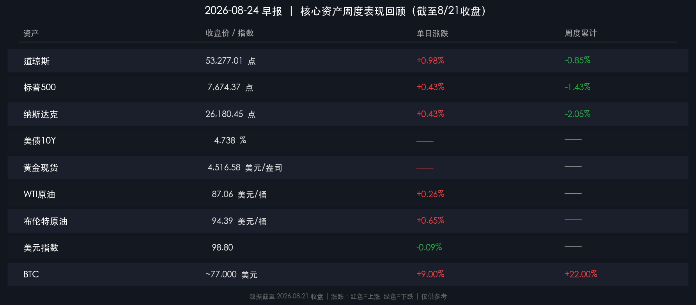

# 🌅 全球市场早报：新周展望——债市压力、AI检验与央行博弈

**日期：2026年08月24日 (星期一)** &nbsp; **时段：早报（新周展望）**

> **核心摘要**：美股上周结束三连涨，纳指单周重挫逾2%，美债收益率高企（10Y 4.738%、30Y 5.27%）是主因；本周市场面临三重考验：**英伟达财报**（8月27日凌晨，AI资本开支终极验证）、**核心PCE与Q2 GDP修正值**（8月26日，通胀与增长双锚）、**Fed主席沃什Jackson Hole首秀**（8月28日，货币政策新框架信号）。BTC周涨22%逆势突围至约7.7万美元，是本周少有的亮色。

---

## 周末财经要闻终极汇总

### 🇺🇸 美股——缓涨难掩周线收跌

* **道琼斯工业平均指数**：收于 **53,277.01 点**，周五单日 **+0.98%**；全周累计 **-0.85%**
* **标普500指数**：收于 **7,674.37 点**，周五单日 **+0.43%**；全周累计 **-1.43%**
* **纳斯达克综合指数**：收于 **26,180.45 点**，周五单日 **+0.43%**；全周累计 **-2.05%**

> **核心解读**：三大指数周五尾盘小幅反弹，但仍未能扭转全周颓势，纳指终结此前三周连涨。压力核心在**债市**——美国长债收益率维持高位（30Y逼近5.27%，创2007年以来新高），迫使高估值科技股持续承压（"rate-driven"估值压缩逻辑）。与此同时，8月PMI初值显示美国服务业PMI飙升至52个月高位（56.8），经济韧性反而削弱了市场对Fed降息的预期，反向打压股债双杀风险。

---

### 🏦 固定收益——高收益"危险区"

* **美国10年期国债收益率**：**4.738%**（全周整体上行）
* **美国30年期国债收益率**：约 **5.27%**（2007年以来最高）
* **美联储动作**：财政部宣布将流动性支持回购操作规模翻番（至每次至少40亿美元）

> **核心解读**：长债收益率持续高企的背后，是市场对**"结构性高通胀+财政赤字"双轮驱动**的定价。财政部大幅扩大回购规模虽属救市托底，但并未改变10Y/30Y收益率的上行趋势。这一信号对成长股估值模型而言是持续逆风。

---

### 🪙 加密市场——BTC逆势突围

* **比特币（BTC）**：周末约 **77,000 美元**（周中一度突破79,000美元）；全周累计 **+22%**

> **核心解读**：比特币的大幅反弹由多重催化剂共振：①美国现货BTC ETF资金回流；②美债高收益率反而吸引部分投资者将BTC视为"抗财政赤字"资产；③宏观避险情绪推动加密替代叙事。但需警惕：75,000美元一线的多空关口仍是技术面关键支撑，能否守住该位或决定后续方向。

---

### 🌍 大宗商品与汇市

* **现货黄金**：**4,516.58 美元/盎司**（盘中创历史新高，全周强势上行）
* **WTI原油**：**87.06 美元/桶**（+0.26%）；**布伦特原油**：**94.39 美元/桶**（+0.65%）
* **美元指数**：**98.80**（-0.09%，小幅走弱）

> **核心解读**：黄金在美债高收益率环境下持续创新高，印证其"财政危机+地缘风险"双重避险属性。原油接近95美元，霍尔木兹海峡地缘张力持续提供油价支撑，能源通胀威胁不容忽视。

---

## 新一周市场核心博弈逻辑

本周市场将在以下**三大博弈轴**上震荡：

### ① AI资本开支链能否继续兑现？——英伟达财报（8月27日凌晨）

英伟达将于北京时间8月27日发布FY27 Q2财报。分析师共识预期：
* **营收预期**：约 **91-92亿美元**
* **EPS预期**：约 **$2.09**
* **毛利率预期**：约 **75%**

> 这场财报是AI超级周期进入中场的终极压测。主要云厂商2.3万亿美元的AI基础设施积压订单为英伟达提供顺风，但市场更关注：①次世代芯片Rubin Ultra的进度与潜在延期风险；②中国市场出口限制的最新情况；③是否有新的大规模AI基础设施融资/合作（类似OpenAI模式）。"Beat-and-raise"已是底线，指引语气才是决定多空的核心变量。

### ② 通胀与增长"双锚"验证——Q2 GDP修正值 + 7月核心PCE（8月26日）

* **美国Q2 GDP年化增速（修正值）**：市场聚焦经济韧性，若修正值上调将进一步支撑"不降息"逻辑
* **7月核心PCE**：预期年率维持在 **约3.3%**，若超预期将直接强化9月加息（或维持高利率）预期

### ③ Fed主席沃什"新框架"首秀——Jackson Hole演讲（8月28日 22:00 北京时间）

> 这是2026年最受瞩目的央行事件。沃什自5月接任Fed主席以来，已明确抛弃传统前瞻指引（"我们不受市场价格约束"），本次演讲被视为其货币政策哲学与新框架的正式宣示。7月FOMC会议罕见出现9-3分裂表决（3票倾向加息25bp），本次演讲能否统一市场预期、给出9月会议路线图，将是美债/美元定价的最大分叉点。

---

## 本周重磅经济数据与会议前瞻

| 时间 | 事件 | 市场关注点 |
|------|------|----------|
| 周一 (8/24) | 拼多多财报 | 中国消费景气度 |
| 周三 (8/26) | 美国Q2 GDP修正值 | 经济韧性、不降息概率 |
| 周三 (8/26) | 美国7月核心PCE | 通胀轨迹、9月FOMC预判 |
| 周三 (8/26) 盘后 | **英伟达财报** ⭐ | AI资本开支周期验证 |
| 周四 (8/27) | Salesforce、CrowdStrike、哔哩哔哩 | 企业软件与中概 |
| 周五 (8/28) 22:00 | **Fed主席沃什Jackson Hole演讲** ⭐⭐ | 货币政策新框架 |
| 周六 (8/29) | Jackson Hole闭幕 | 全球央行联合信号 |

---

## 头部券商/投行开盘策略点睛

**摩根士丹利** — *"保持建设性，而非自满"*
> 宏观与微观基本面仍支持风险资产，但AI重仓集中风险上升。建议将部分仓位向欧洲及亚洲股市平衡配置，分散AI过度集中风险。相对固定收益，仍超配股票。

**摩根大通** — *"市场多维极化"*
> AI与非AI板块的估值鸿沟持续扩大；美国经济呈现"强资本开支 + 软劳动需求"的结构性分化。欧洲银行及工业板块是对冲科技集中风险的优选轮动方向。

**高盛** — *"商品与欧洲机会"*
> 持续看多大宗商品（供给端约束+需求韧性）；霍尔木兹地缘风险令能源配置维持超配。欧洲股市企业盈利超预期，与多数人预期背离，构成机会。

---

## 今日市场情绪：债市压制 · BTC逆行 · AI决战在即

> Prompt: A masked oracle figure stands atop a throne built from giant glowing bond-yield K-line pillars, raising two energy beams: one beam suppresses a grid of falling stock indices, the other ignites a soaring Bitcoin comet and golden bullion in the starry void. In the background, the Jackson Hole mountain range transforms into towering GPU chip circuits ablaze with green circuit light. Ultra-detailed cyberpunk cosmic epic scene. Style: dramatic chiaroscuro.

---

*免责声明：内容仅供参考，不构成投资建议。*
