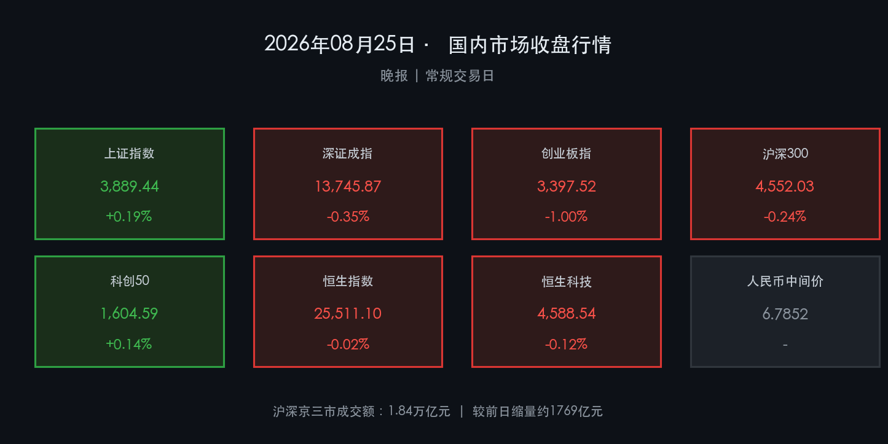

# 🌆 国内市场晚报：沪强深弱筑底观察期，央行MLF稳流动性，防御消费领涨

**日期：2026年08月25日 (星期一)** &nbsp; **时段：晚报（常规交易日）**

> **核心摘要**：A股今日呈现典型"沪强深弱"分化格局，上证综指小幅收涨0.19%，创业板指跌逾1%，沪深京三市成交额仅1.84万亿元较前日大幅缩量，市场观望情绪浓厚；央行当日实施5000亿元MLF操作，精准对冲月末资金缺口，为市场流动性提供明确支撑；防御性医药、消费板块逆势走强，而贵金属、有色及科技硬件遭遇主力资金流出，全市场进入"筑底观察期"，等待新一轮催化。

---

## 核心行情复盘

### 🇨🇳 A股主要指数

* **上证综合指数**：收于 **3,889.44 点**，涨 **+7.44 点** (**+0.19%**)
* **深证成分指数**：收于 **13,745.87 点**，跌 **-48.42 点** (**-0.35%**)
* **创业板指数**：收于 **3,397.52 点**，跌 **-34.46 点** (**-1.00%**)
* **沪深300指数**：收于 **4,552.03 点**，跌 **-10.98 点** (**-0.24%**)
* **科创50指数**：收于 **1,604.59 点**，涨 **+2.25 点** (**+0.14%**)

> **核心解读**：今日A股的结构性分化印证了当前市场所处的"存量博弈"状态。上证综指在大盘蓝筹、防御性价值股的支撑下小幅收红，而创业板指跌逾1%，反映出成长风格的调整尚未结束。沪深京三市合计成交额仅1.84万亿元，较前日大幅缩量约1769亿元，跌破2万亿元"地量警戒线"，增量资金入场意愿明显减弱，市场正在以"以时间换空间"的方式消化前期涨幅，等待新的方向性催化剂。

---

### 🇭🇰 港股市场

* **恒生指数**：收于 **25,511.10 点**，跌 **-5.14 点** (**-0.02%**)（几近平盘）
* **恒生科技指数**：收于 **4,588.54 点**，跌 **-5.51 点** (**-0.12%**)
* **恒生国企指数**：收于 **8,445.37 点**，跌 **-26.42 点** (**-0.31%**)

> **核心解读**：港股今日表现较A股更为稳定，恒生指数几近平盘，显示出外资对港股估值的认可度相对稳定。科技指数小幅回调受全球科技情绪传导影响，国企指数表现偏弱，资金倾向于结构性配置而非系统性加仓。

---

### 💱 汇率与资金面

* **人民币对美元中间价**：**6.7852**（人民币持续强势区间）
* **离岸人民币（CNH）**：日内波动运行于约 **6.72** 附近
* **北向资金**：沪深股通合计呈**净流出**态势
* **沪深京三市成交额**：**1.84万亿元**，较前日缩量约 **1769亿元**

---

### 📊 行业板块涨跌

**领涨板块**：地面兵装 🔴 · 装修装饰 🔴 · 酒店餐饮 🔴 · 医药商业 🔴 · 创新药/CRO 🔴 · 农业 🔴

**领跌板块**：贵金属 🟢 · 能源金属（锂矿）🟢 · 稀土 🟢 · 半导体/CPO算力 🟢

---

## 核心解读与市场逻辑

今日A股及港股所呈现的"防御领涨、成长承压、量能萎缩"格局，背后有清晰的三重逻辑驱动：

1. **中报业绩验证期带来的风格切换压力**：8月下旬进入半年报密集披露末期，部分前期热门科技、算力、半导体标的因业绩兑现不及预期或估值过高，触发主力资金阶段性止盈。市场已从"预期驱动"切换至"业绩验证"模式，业绩超预期板块（如创新药、部分消费）相对受益。

2. **缩量信号揭示多空分歧加剧**：成交额跌破2万亿元是值得高度警惕的量能信号。从历史规律看，当成交额连续低于1.8万亿元时，市场往往面临方向选择节点——要么政策层面出现超预期催化带动量能回升，要么进入新一轮指数调整。当前正处于关键抉择前的"静默期"。

3. **防御配置逻辑浮现**：资金向医药商业、酒店餐饮、农业等内需消费防御板块集结，体现出机构在震荡市中降低组合波动率的主动意图。"哑铃型"配置策略（硬科技 + 防御消费）正在成为市场共识。

---

## 政策脉动

### 🏦 央行流动性操作

* **5000亿元 MLF 续作**：中国人民银行今日开展了5000亿元1年期中期借贷便利（MLF）操作，精准对冲月末及跨月流动性缺口，被市场解读为明确的宽松维稳信号。
* **逆回购组合管理**：央行同步通过"短端+长端"工具组合，在隔夜逆回购与MLF之间形成协同，确保资金利率平稳运行，为实体融资创造适宜货币环境。
* **政策基调**：《2026年第二季度货币政策执行报告》确认继续实施**适度宽松货币政策**，强调逆周期调节力度，提升结构性货币工具额度支持科技创新与绿色金融。

### 📋 监管动态

* **证监会恢复摊余成本法债基申报**：15家中小公募机构获准上报，有利于丰富市场流动性管理工具。
* **市值管理引导强化**：监管持续引导上市公司通过回购、注销机制提升股东回报，向"回报导向"转型。
* **陆港金融合作十项新措施**：8月初发布的跨境合作措施（涵盖ETF、期货、绿色金融）持续落地，提升中国资产国际吸引力。

---

## 最新机构观点

> **高盛（Goldman Sachs）**：维持A股"增持"评级。首席中国股票策略师刘劲津表示，AI硬科技板块前期的投机性溢价在近期回调中已得到有效释放，基本面支撑依然稳健，继续保持对AI核心资产的战略性偏好，建议借调整逐步布局。

> **中信证券**：建议采用"双主线"配置策略：一方面关注银行板块息差与资产质量韧性带来的稳健配置价值；另一方面聚焦具有真实订单和业绩兑现能力的硬科技核心链条（半导体设备、AI算力），借本轮调整进行更精准的位置布局。

> **中金公司**：中国策略首席李求索强调，随着保险资金等中长期资金入市机制推进，险资将成为震荡市的"稳定器"和"压舱石"，叠加创新药行业迎来业绩拐点，看好医药与稳定类权益资产的中期配置价值。

---

## 今日市场情绪：筑底观望

> Prompt: A colossal ancient stone scale stands at the edge of a misty financial district under a twilight sky. On the left pan, glowing red candles of declining tech stocks slowly sink; on the right pan, golden ingots labeled pharmaceuticals and defense gleam with rising green light. A lone dragon made of market data streams circles the fulcrum, maintaining delicate balance. In the background, shadowy skyscrapers display trading volume ticker falling. Cinematic, hyperrealistic, dramatic volumetric lighting.

---

*免责声明：内容仅供参考，不构成投资建议。市场有风险，投资需谨慎。*
