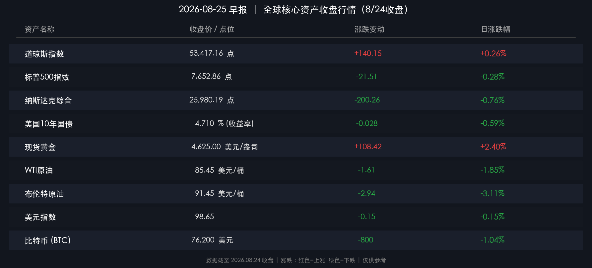

# 🌅 全球市场早报：科技承压道指护盘，市场静候英伟达财报与杰克逊霍尔决议

**日期：2026年08月25日 (星期二)** &nbsp; **时段：早报（常规交易日）**

> **核心摘要**：隔夜美股三大指数走势分化，道琼斯指数涨0.26%逆势走强，纳斯达克跌0.76%、标普500跌0.28%，半导体与大型科技股遭遇获利了结与估值压缩；美债10年期收益率小幅回落至4.710%，30年期仍高悬于5.23%附近，财政部流动性回购托底但长端利率压力未退；避险资产受宠，现货黄金大涨逾2%报4,625美元/盎司，原油受地缘博弈降温预期下挫逾2%；全市场目光全面聚焦周中英伟达财报与周五美联储主席沃什杰克逊霍尔演讲。

---

## 核心行情复盘

### 🇺🇸 美股主要指数

* **道琼斯工业平均指数**：收于 **53,417.16 点**，涨 **+140.15 点** (**+0.26%**)
* **标普500指数**：收于 **7,652.86 点**，跌 **-21.51 点** (**-0.28%**)
* **纳斯达克综合指数**：收于 **25,980.19 点**，跌 **-200.26 点** (**-0.76%**)

> **核心解读**：美股呈现典型的“价值防御强、成长科技弱”的结构性分化。道指在金融、工业及传统防御龙头的支撑下逆势上扬；纳指与标普500则受半导体芯片、高估值软件股调整拖累。投资者在关键宏观与微观催化剂前夕主动降低风险暴露，市场交投情绪偏于审慎防守。

---

### 🏦 债券与外汇市场

* **美国10年期国债收益率**：收于 **4.710%**（跌 2.8 bp，-0.59%）
* **美国30年期国债收益率**：报 **5.22%–5.24%**（维持在多年高位危险区间）
* **美元指数（DXY）**：收于 **98.65**（微跌 -0.15%）

> **核心解读**：长端美债收益率依然高位盘整，虽然10年期国债收益率日内微幅回吐，但30年期收益率稳居5.2%上方，反映出全球固定收益市场对美国长期财政赤字扩张及通胀粘性的持续深度定价。

---

### 🪙 大宗商品与加密资产

* **现货黄金**：收于 **4,625.00 美元/盎司**，大涨 **+108.42 美元** (**+2.40%**)
* **WTI原油期货**：收于 **85.45 美元/桶**，下跌 **-1.61 美元** (**-1.85%**)
* **布伦特原油期货**：收于 **91.45 美元/桶**，下跌 **-2.94 美元** (**-3.11%**)
* **比特币（BTC）**：报 **76,200 美元**，单日微调 **-1.04%**（上周大涨22%后高位整固）

> **核心解读**：黄金强势突破4,620美元关口，地缘博弈风险与主权债务信任重构共同强化了硬资产的配置溢价；原油价格在近期冲高后出现显著回调，反映出市场对短期供应中断风险的过度定价开始修正。

---

## 核心解读与市场逻辑

当前全球宏观与资产交易处于“高波动预备期”，核心驱动逻辑集中于以下三点：

1. **科技股估值遭遇长端利率压制**：在30年期美债收益率徘徊于5.2%以上、10年期维持在4.7%上方的高利率环境下，以DCF（现金流折现）模型衡量的科技巨头估值容错空间极小。在英伟达财报出炉前，部分量化对冲基金与主动多头选择了结获利以控制回撤。
2. **硬资产避险逻辑强化**：黄金与比特币在高利率环境中展现出超强的抗跌与上行动能，凸显市场资金对主权信用扩张背景下法币购买力稀释的深层担忧。
3. **资金轮动防御板块**：传统周期与高股息资产在震荡市中充当了“避风港”，推动道指与纳指走势背离，市场广度分化加剧。

---

## 政策脉动

* **美联储（Fed）动向**：杰克逊霍尔（Jackson Hole）全球央行年会即将召开，美联储主席凯文·沃什（Kevin Warsh）将于周五发表重要讲话。市场高度关注其是否会进一步阐述“削减前瞻指引、重塑政策自主性”的货币政策新范式。
* **美国财政部行动**：财政部近期将流动性支持回购操作规模翻倍至每次至少40亿美元，持续向国债二级市场注入流动性，平抑长端收益率急涨带来的系统性摩擦。
* **地缘与贸易**：美方对伊朗经济制裁预期持续发酵，同时美加贸易博弈与供应链重构动向仍处于谈判与观察阶段。

---

## 最新机构观点

**摩根大通（JPMorgan）** — *“寻找结构性轮动机会”*
> 尽管科技权重股短期面临财报考核与利率估值压力，但高质量成长股（Quality Growth）与超大规模云厂商的基本面并未变质。近期半导体板块的估值回调为战术性买入创造了更具吸引力的风险收益比。

**高盛（Goldman Sachs）** — *“聚焦确定性与分散化”*
> 建议投资者避免过度单一押注AI单赛道，应通过大宗商品（尤其是黄金与能源）以及估值合理的欧洲优质工业龙头进行多资产对冲，在流动性再平衡过程中保持组合韧性。

**摩根士丹利（Morgan Stanley）** — *“英伟达是全周情绪分水岭”*
> 英伟达即将披露的财报与下一代芯片指引是检验AI资本开支闭环的决定性考验。在业绩揭晓前，市场维持高敏感度和避险倾向属于健康去杠杆行为。

---

## 今日市场情绪：估值审判 · 避险升温 · 决战前夕

> Prompt: A towering golden clockwork colossus stands resilient amid turbulent energy currents, holding a shining golden compass. In the background, streams of neon circuit code cascade from shadowy semiconductor monoliths into a chasm, while an ancient golden scale balances blazing sun-gold against glowing treasury parchment under a dramatic twilight sky.

---

*免责声明：内容仅供参考，不构成投资建议。*
