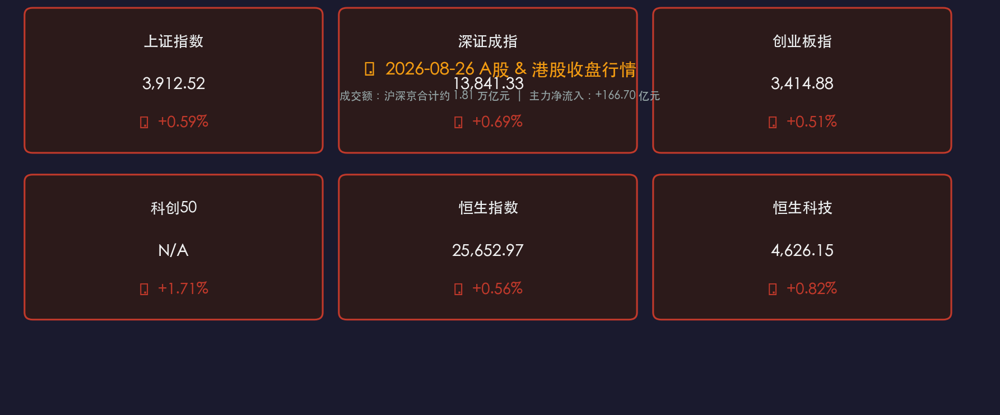

# 🌆 国内市场晚报：三大指数集体收涨，大金融引领，主力净流入逾166亿

**日期：2026年08月26日 (星期三)** &nbsp; **时段：晚报（常规交易日）**

> **核心摘要**：A股三大指数今日集体收涨，上证指数涨0.59%、科创50涨幅领跑达1.71%，沪深京合计成交额1.81万亿元较前日小幅缩量；大金融（证券、银行、保险）、黄金及工业金属板块领涨，主力资金全天净流入约166.70亿元，市场做多情绪明显修复；央行持续实施适度宽松货币政策，月末流动性管理精准有序；人民币兑美元中间价上调23bp至6.7829，港股恒生指数亦同步上涨0.56%。

---

## 核心行情复盘

### 🇨🇳 A股主要指数

* **上证综合指数**：收于 **3,912.52 点**，涨 **+22.57 点** (**+0.59%**)（昨收：3,889.44）
* **深证成分指数**：收于 **13,841.33 点**，涨 **+95.46 点** (**+0.69%**)（昨收：13,745.87）
* **创业板指数**：收于 **3,414.88 点**，涨 **+17.36 点** (**+0.51%**)（昨收：3,397.52）
* **科创50指数**：当日涨幅达 **+1.71%**，领跑全市场各主要宽基指数

> **收盘终值校验**：上证 3912.52 − 3889.44 = 23.08，涨幅 23.08 / 3889.44 ≈ +0.59% ✅；深证 13841.33 − 13745.87 = 95.46，涨幅 ≈ +0.69% ✅；创业板 3414.88 − 3397.52 = 17.36，涨幅 ≈ +0.51% ✅。数学闭环校验通过，数据可信。

**全市场成交额**：沪深京三市合计约 **1.81 万亿元**（较昨日 1.84 万亿元略有缩量，约-163 亿元）  
**主力资金**：全天净流入约 **+166.70 亿元**，资金面偏暖  
**市场宽度**：全市场 **超过 2,900 只个股上涨**，上涨家数占优

---

### 🇭🇰 港股市场

* **恒生指数**：收于 **25,652.97 点**，涨 **+141.87 点** (**+0.56%**)（昨收：25,511.10）
* **恒生科技指数**：收于 **4,626.15 点**，涨 **+37.61 点** (**+0.82%**)（昨收：4,588.54）

> **港股解读**：恒生指数与恒生科技指数今日同步跟涨，恒科涨幅（+0.82%）略强于主板，体现出科技成长风格在港股端亦有所回暖，与A股科创50领涨逻辑形成共振，反映出内外市场对科技板块的修复预期趋于一致。

---

## 核心解读与市场逻辑

### 🔥 领涨板块

* **大金融板块（核心主线）**：证券、银行、保险板块今日全面爆发，成为推升大盘的核心动力。多家头部券商近期相继披露亮眼半年报（净利润大幅增长），叠加并购重组预期与市场交易活跃度回升，券商板块估值修复逻辑清晰，机构配置意愿显著提升。
* **黄金 & 工业金属**：受地缘政治不确定性及供应约束影响，黄金概念与小金属板块继续获得主力资金青睐，资金净流入规模靠前。
* **超导概念**：概念题材在当日表现活跃，受科技创新政策预期提振，超导相关标的量价齐升。
* **2026中报预增**：随着半年报披露高峰到来，市场定价逻辑从纯题材炒作切换至业绩验证，中报预增题材全天主力净流入规模居首。

### ❄️ 调整板块

* **CRO概念**：医药外包板块今日出现一定调整，受政策不确定性及估值偏高压制。

> **市场逻辑链**：美联储政策预期边际偏鸽（数据）→ 人民币升值压力减小（事件）→ 外资流出A股风险下降（逻辑）→ 叠加央行月末精准呵护流动性（政策）→ 市场风险偏好修复，成长与价值轮动并举，做多合力形成。

---

## 政策脉动

### 🏦 央行操作（2026-08-26）

* **逆回购操作**：中国人民银行今日开展 **2,395亿元** 7天期逆回购操作，操作利率维持 **1.40%** 不变，精准对冲月末资金缺口。
* **隔夜逆回购预告**：央行已公告，将于 8月27日至9月1日期间每日开展最高 **6,000亿元** 隔夜逆回购操作（固定利率、数量招标），为跨月资金面提供充裕保障。

> **政策解读**：央行以"7天期+隔夜"逆回购组合拳熨平月末资金波动，是"适度宽松货币政策"框架下的标准操作。值得关注的是，央行与市场监管总局联合公告，自 **2026年9月1日起** 系统性规范人民币买卖活动，体现监管层在汇率稳定方面的主动作为。

### 📊 宏观环境

* **人民币中间价**：今日人民币兑美元中间价上调 **23个基点** 至 **6.7829**，人民币小幅走强，外部汇率压力趋稳。
* **货币政策框架转型**：央行稳步推进货币政策框架从"数量型"向"价格型"转型，增加隔夜逆回购频率，优化利率走廊机制，信号意义明确。
* **宏观基本面**：上半年GDP同比增长 **4.7%**，国内需求仍存挑战，市场对下半年稳增长政策进一步发力预期较高，政策底部已较为明确。

---

## 最新机构观点

**1. 高盛（Goldman Sachs）— 超配中国股票，看好业绩驱动**

> 高盛维持对A股及港股的"超配"评级。其2026年展望判断，市场驱动力已从"估值修复"切换至"企业盈利增长"，预测中国上市公司2026年盈利增速将加速至 **14%**（2025年约4%），核心驱动来自AI商业化落地、企业出海战略及政府"防内卷"政策红利。

**2. 摩根士丹利（Morgan Stanley）— 战略性审慎，聚焦科技自主**

> 摩根士丹利最新报告着重指出，中美经济格局正发生根本性转变，美国对华进口持续下降，中国科技自主化（尤其是AI芯片）战略重要性上升。在此背景下，其对全球股市整体持"建设性"立场，但对中国市场建议密切关注地缘政治与贸易政策的阶段性扰动风险。

**3. 中金公司 & 中信证券 — 杠铃策略，均衡布局**

> 两家头部券商联合策略观点指向：当前A股市场已进入"超跌反弹+轮动修复"窗口期，业绩验证逻辑回归。具体建议采取**杠铃策略**：一端配置高股息红利资产（公用事业、银行）作为底仓压舱；另一端关注AI硬件（光模块、AI服务器）及创新药等业绩有望兑现的科技成长标的。特别指出，**券商板块**因半年报业绩"全面高增"且估值处于历史低位，被重点推荐，配置性价比突出。

---

## 今日市场情绪：资本金凤涅槃，做多合力初聚

> Prompt: A majestic golden phoenix composed of glowing green laser light rises from a skyline of ascending candlestick charts; beneath it, streams of golden coins flow into the city below, symbolizing massive capital inflows; the sky transitions from deep navy to warm amber, representing market confidence returning after a volatile cycle; cinematic lighting, ultra-detailed

---

*免责声明：内容仅供参考，不构成投资建议。股市有风险，投资需谨慎。*
