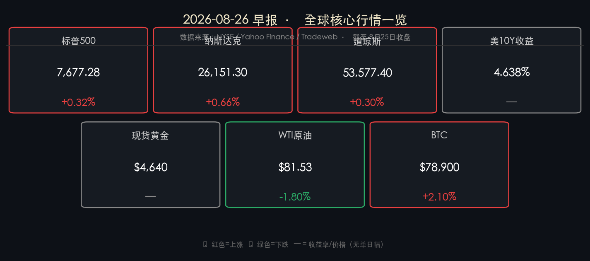

# 🌅 全球市场早报：科技触底反弹，油价回落托底美债，市场全面聚焦英伟达财报与沃什杰克逊霍尔首秀

**日期：2026年08月26日 (星期三)** &nbsp; **时段：早报（常规交易日）**

> **核心摘要**：隔夜美股三大指数全线收涨，科技板块领衔反弹，纳斯达克涨0.66%、标普500涨0.32%、道琼斯涨0.30%；油价因中东紧张态势缓和迹象大幅下挫，WTI跌逾1.8%至$81.53，带动美债10年期收益率小幅回落至4.638%；现货黄金在$4,630-4,650区间高位整理；BTC强势触探$80,000关口后回落至$78,900；全市场焦点锁定今日收盘后英伟达Q2财报及本周五美联储主席沃什的杰克逊霍尔首度演讲。

---

## 核心行情复盘

### 🇺🇸 美股主要指数

* **标普500指数**：收于 **7,677.28 点**，涨 **+24.42 点** (**+0.32%**)
* **纳斯达克综合指数**：收于 **26,151.30 点**，涨 **+171.11 点** (**+0.66%**)
* **道琼斯工业平均指数**：收于 **53,577.40 点**，涨 **+160.24 点** (**+0.30%**)

> **核心解读**：美股在前一日大幅调整后迎来技术性反弹，科技与半导体板块是核心驱动力。油价回落直接压低通胀预期，债市买盘回归，10年期美债收益率从高位小幅松动，为高估值成长股提供喘息空间。然而，整体成交量并未放量，市场情绪仍处于"审慎观望"而非"全面做多"的状态，反弹更多是对超卖状态的修复而非方向性扭转。

**个股亮点：**
* **Moderna (MRNA)**：暴涨 **+14.36%**，黑马！III期临床数据显示其个性化癌症疫苗（联合Keytruda）在黑色素瘤中大幅降低复发风险，打开想象空间。
* **DICK'S Sporting Goods (DKS)**：暴跌 **-30.68%**，财报不及预期，叠加消费降级担忧，单日腰斩。

### 🏦 美债与外汇市场

* **美国10年期国债收益率**：收于 **4.638%**（Tradeweb FTSE官方收盘值），较前日有所回落
* **美国30年期国债收益率**：维持 **5.20%** 附近高位运行
* **美元指数（DXY）**：小幅震荡，整体维持强势

> **核心解读**：油价下行是本轮债市喘息的直接导火索——油价降温 → 通胀预期回落 → 债市买盘归位 → 长端利率承压减轻 → 科技股估值修复。这条逻辑链是当日市场运行的主轴。然而，30年期利率仍高悬5.2%上方，说明财政赤字与供给压力的深层忧虑并未消散。

### 🥇 大宗商品

* **现货黄金（XAU/USD）**：报 **$4,640/盎司**（日内高位$4,650，低位$4,630）
* **WTI原油（近月合约）**：收于 **$81.53/桶**，跌幅约 **-1.80%**
* **布伦特原油（Brent）**：收于 **$87.27/桶**

> **核心解读**：原油下跌的导火索是中东冲突降温的外交信号，市场对供应紧张的溢价被迅速消化。黄金依然在历史高位横盘，显示全球"避险+去美元化"需求的结构性韧性，高盛策略报告也指出当前黄金期权市场存在"双向价格放大"效应，波动性在酝酿。

### ₿ 加密货币

* **比特币（BTC）**：日内触探 **$80,000** 关口后回落，收于 **$78,900** 附近，日涨幅约 **+2.10%**

> **核心解读**：BTC冲击$80K关口的背后，是风险资产整体回暖、机构增量配置需求持续以及对传统金融避险叙事的抢跑布局三重力量叠加。$80,000是近期强阻力位，能否有效突破取决于宏观情绪能否进一步好转。

---

## 核心解读与市场逻辑

**【数据→事件→逻辑】三层闭环解析：**

1. **美债收益率小幅回落（数据）** → 中东紧张态势出现外交缓和迹象，WTI原油大跌逾1.8%（事件）→ 通胀预期降温，债市买盘回归，10年期收益率从4.70%边际回落至4.638%，为高估值科技股减压（逻辑）

2. **纳斯达克反弹0.66%（数据）** → 前一交易日科技股超卖+油价下行提供喘息空间（事件）→ 做空盘回补叠加抄底资金进场，但成交量偏淡，本质是"修复性反弹"而非趋势逆转（逻辑）

3. **Moderna单日暴涨14.36%（数据）** → III期临床试验数据支持个性化癌症疫苗进入里程碑式进展（事件）→ 生物制药板块情绪局部被点燃，但属于个股驱动，对大盘贡献有限（逻辑）

---

## 政策脉动

### 🏛️ 美联储 · 杰克逊霍尔倒计时

> **关键事件**：美联储主席 **凯文·沃什** 将于 **8月28日（本周五）** 发表就任后首次杰克逊霍尔主旨演讲。本届年会主题为"金融创新：对支付与政策的影响"，但市场关注焦点远超主题本身。

**核心信号解读：**
* 沃什明确宣示将抛弃前任"前瞻指引"风格，不会对短期利率路径"喂食"市场
* 其"货币哑铃策略（Monetary Barbell）"=短端灵活管理 + 激进量化紧缩（QT），显示其对"超长端利率必须服务于实体定价而非金融套利"的态度
* 关键一句话："Fed不受市场价格约束"——市场解读为：即便市场震荡，他不会轻易转鸽
* **最大不确定性**：他是否会给出"通胀回2%是可行的"明确表态？若是，债市将大幅回暖；若否，长端利率仍有上行压力

### 🇨🇳 境外联动

今日早报聚焦国际市场，国内政策消息以简讯形式记录：
* 人民银行（PBOC）本周维持MLF操作利率不变，资金面维持合理充裕
* 离岸人民币（CNH）受美元强势压制，短期关注7.25关键支撑

---

## 最新机构观点

> **高盛（Goldman Sachs）**：维持2026年全球增长"强韧"预期，看好美国受关税摩擦减少和减税政策支撑而继续跑赢其他经济体；全球AI基础设施投资2026年预计突破**1万亿美元**，半导体供应链将持续受益；近期报告提示黄金期权市场"双向价格放大"效应增强，波动性正在积累。

> **摩根士丹利（Morgan Stanley）**：首席美股策略师 **Michael Wilson** 对股市整体维持"中性偏多"，但旗帜鲜明地警示**油价飙升是近期最大的下行尾部风险**；该行已上调布伦特原油价格预测，因中东供应端恢复慢于预期；同时指出黄金已提前超越其年底目标价，后续涨幅或伴随波动率显著提升。

> **中信证券**：（联动A股前瞻）在"外资北向资金持续净流入"背景下，预计今日A股科创50及半导体板块情绪将受美国科技反弹正向传导，英伟达财报将是本周对A股科技板块情绪影响最大的单一事件，建议关注国内算力主线。

---

## 今日市场情绪：诸神前夜

> Prompt: A colossal mechanical Prometheus breaks open a glowing server vault in a cathedral-like data center, stealing cascading streams of golden light labeled AI. In the background, towering stone titans inscribed with FED and NVIDIA face each other across a storm-lit chasm of red candlestick spires, while bitcoin coins rain from fractured clouds above. cyberpunk style, masterpiece, high detail, intricate composition, cinematic lighting, 8k resolution

---

## ⚠️ 今日关注雷达

| 时间（北京时间） | 事件 | 重要程度 |
|---|---|---|
| **今日盘后（约8月27日04:00）** | **英伟达 FY2Q27 财报** | ⭐⭐⭐⭐⭐ |
| **8月28日（周五）凌晨** | **美联储主席沃什 Jackson Hole 首次主旨演讲** | ⭐⭐⭐⭐⭐ |
| 本周 | 美国PCE通胀数据（8月29日） | ⭐⭐⭐⭐ |

---

*免责声明：内容仅供参考，不构成投资建议。*
