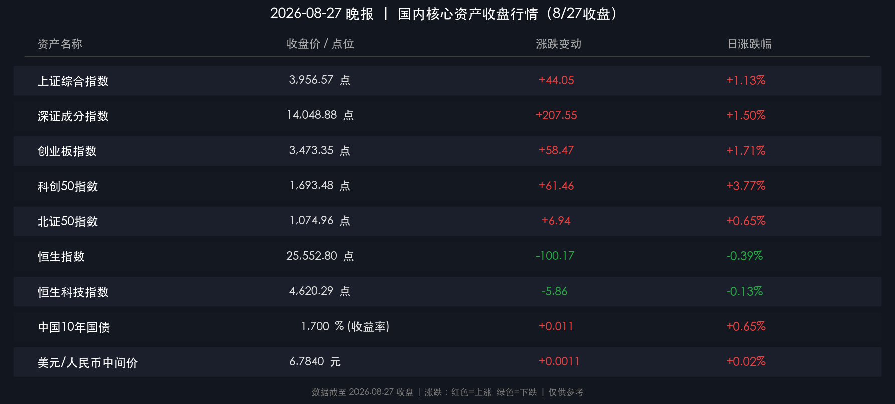

# 🌆 国内市场晚报：A股放量突破突破2.1万亿，科创50飙升3.77%，硬科技与算力芯片领跑反弹

**日期：2026年08月27日 (星期四)** &nbsp; **时段：晚报（常规交易日）**

> **核心摘要**：A股今日迎来强劲放量大涨行情，沪深两市全天成交额突破2.14万亿元；三大指数全线走高，科创50指数单日飙涨3.77%，存储芯片、半导体光刻及算力硬件产业链全线爆发；央行单日开展6065亿元逆回购操作投放流动性，10年期国债收益率回升至1.70%，市场资金从传统防御性板块向高景气科技成长主线坚决切换。

---

## 核心行情复盘

### 🇨🇳 A股主要指数

* **上证综合指数**：收于 **3,956.57 点**，涨 **+44.05 点** (**+1.13%**)
* **深证成分指数**：收于 **14,048.88 点**，涨 **+207.55 点** (**+1.50%**)
* **创业板指数**：收于 **3,473.35 点**，涨 **+58.47 点** (**+1.71%**)
* **科创50指数**：收于 **1,693.48 点**，涨 **+61.46 点** (**+3.77%**)
* **北证50指数**：收于 **1,074.96 点**，涨 **+6.94 点** (**+0.65%**)

> **核心解读**：经历前期的震荡蓄势后，A股多头动能在今日集中释放。全市场超3300只个股上涨，赚钱效应极为突出。科创50与创业板指领跑全场，显示高弹性科技赛道成为增量资金进攻的核心抓手。沪深两市全天成交额放大至2.14万亿元，较前一交易日明显放量，增量资金跑步进场推动结构性反弹升级为主线突破。

---

### 🇭🇰 港股市场

* **恒生指数**：收于 **25,552.80 点**，跌 **-100.17 点** (**-0.39%**)
* **恒生科技指数**：收于 **4,620.29 点**，跌 **-5.86 点** (**-0.13%**)

> **核心解读**：港股今日早盘高开后出现冲高震荡回落，整体表现略弱于A股。外资对美债收益率韧性与地缘流动性扰动保持审慎观察，但港股半导体与AI核心龙头仍展现较强抗跌性，恒生科技指数跌幅明显收窄。

---

### 💱 汇率与资金面

* **人民币对美元中间价**：**6.7840**，较前一交易日微调 **11个基点**（保持在6.78稳健区间）
* **中国10年期国债收益率**：收于 **1.700%**（+1.1bp），时隔十个工作日重返1.70%关口
* **央行公开市场操作**：开展7天期逆回购1030亿元（利率1.40%）与隔夜逆回购5035亿元，合计投放 **6,065亿元**
* **沪深两市成交额**：**2.14万亿元**，较上一交易日显著放量超3000亿元

---

### 📊 行业板块涨跌

**领涨板块**：存储芯片 🔴 · 半导体与集成电路 🔴 · CPO光通信与算力硬件 🔴 · 消费电子 🔴 · 券商与金融科技 🔴

**领跌板块**：白酒与食品饮料 🟢 · 银行与高股息红利 🟢 · 农林牧渔 🟢 · 煤炭石油 🟢

---

## 核心解读与市场逻辑

今日A股呈现出极为坚决的“弃守转攻”主线逻辑，核心驱动因素体现在以下三个维度：

1. **AI算力产业链景气共振与芯片突破**：全球AI算力基础设施建设提速，海外巨头业绩超预期带动全球产业链预期上修。国内算力枢纽重大项目集中落地，推动存储芯片、先进封装、CPO光模块等硬科技环节迎来业绩与估值双击。

2. **增量资金风格切换，告别防御走向成长**：盘面成交量激增至2.14万亿元，场内资金完成从“中特估”、银行等纯防守板块向高贝塔硬科技板块的良性轮动，市场风险偏好快速拉升。

3. **流动性协同护航，收益率企稳反馈经济预期**：央行单日公开市场投放超6000亿元流动性平抑资金面波动，10年期国债收益率重回1.70%以上，反映市场对经济中长期企稳与权益资产性价比的信心增强。

---

## 政策脉动

* **央行公开市场大额投放**：人民银行8月27日开展合计6065亿元逆回购操作（包括7天期1030亿元、隔夜5035亿元），有效对冲税期与月末流动性需求，释放维护资金面充裕平稳的明确信号。
* **算力基建与国家数据基础设施推进**：多地算力枢纽重大项目进入全面实施阶段，政策支持上游芯片自主化与算力网络一体化建设，硬科技产业支持政策持续加码。

---

## 最新机构观点

* **中金公司（CICC）**：认为AI、新能源及新兴战略领域正加速催生新一轮硬件需求，看好全产业链一体化布局的硬科技与新材料龙头；在宏观与海外资产配置上，建议在不确定性环境中保持对黄金及核心成长赛道的战略配置。
* **中信证券（CITIC Securities）**：指出国内算力产业链迎来明确增长机遇，上游芯片、板卡及整机全链条需求持续放量，建议重点关注供给端存在瓶颈的高壁垒环节；短期内美债利率保持高位背景下，国内成长板块的内生增长动能更具确定性。
* **华泰证券（Huatai Securities）**：指出当前A股处于完成筑底后的放量修复阶段，科技主线主动爆发是市场情绪实质性回暖的核心标志，建议投资者保持战略耐心，重点聚焦具备技术壁垒与商业化落地能力的优质科技成长标的。

---

## 今日市场情绪：硬科技爆发与算力突破

> Prompt: A towering quantum crystal lighthouse radiating golden light over an ocean of circuit boards, glowing semiconductors and ascending green charts in the background, cinematic lighting

---

*免责声明：内容仅供参考，不构成投资建议。*
