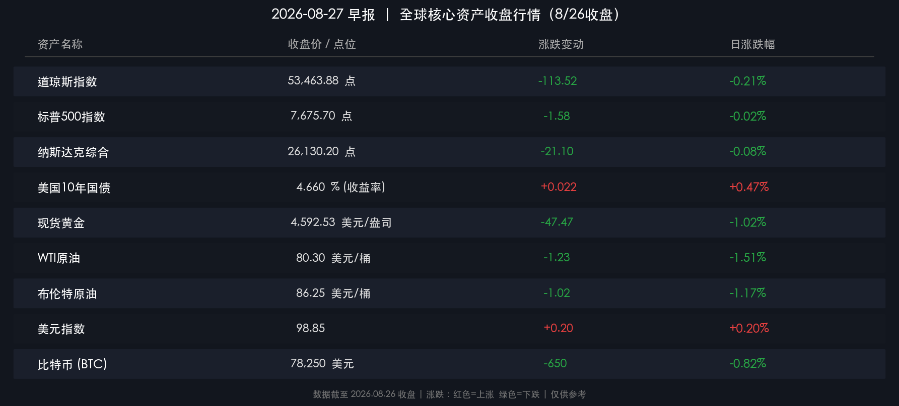

# 🌅 全球市场早报：英伟达Q2营收翻倍超预期，油价四连跌缓和通胀，全市场屏息静待杰克逊霍尔沃什定调

**日期：2026年08月27日 (星期四)** &nbsp; **时段：早报（常规交易日）**

> **核心摘要**：隔夜美股三大指数在通胀微超预期及重大事件前夕窄幅整理，标普500微跌0.02%，纳指微跌0.08%，道指跌0.21%；盘后英伟达公布FY2Q27重磅财报，营收狂飙106%至962亿美元大幅击败市场预期，AI算力需求持续井喷推动盘后股价拉升；地缘局势缓和预期令国际油价再度下挫超1.5%，WTI收跌至$80.30/桶；美债10年期收益率小幅上行至4.66%；现货黄金回落至$4,592/盎司附近；杰克逊霍尔年会今日正式启幕，全市场屏息静待周五美联储主席沃什的政策首秀。

---

## 核心行情复盘

### 🇺🇸 美股主要指数

* **标普500指数**：收于 **7,675.70 点**，跌 **-1.58 点** (**-0.02%**)
* **纳斯达克综合指数**：收于 **26,130.20 点**，跌 **-21.10 点** (**-0.08%**)
* **道琼斯工业平均指数**：收于 **53,463.88 点**，跌 **-113.52 点** (**-0.21%**)

> **核心解读**：常规交易时段市场整体呈现典型的“重大事件前夕谨慎防守”特征。上月核心通胀数据略高于预期引发债市收益率小幅走高，压制了多头进攻意愿。然而，盘后英伟达交出惊艳财报，彻底打消了市场对AI基础设施开支放缓的疑虑，科技板块盘后迅速回暖。整体来看，美股估值在高位具备极强盈利支撑，但在杰克逊霍尔主旨演讲前，机构资金大多保持底仓观望。

**盘后焦点与个股亮点：**
* **英伟达 (NVIDIA / NVDA)**：盘后发布FY2Q27财报，总营收达 **$96.2B**（同比暴增 **+106%**，高于预期的$92.0B），调整后EPS为 **$2.22**（预期$2.09），其中数据中心营收达 **$89.0B**（同比暴增 **+117%**）。CEO黄仁勋明确表态AI已到达“超级拐点，算力即收入”，乐观指引带动股价盘后强势上涨。

### 🏦 美债与外汇市场

* **美国10年期国债收益率**：收于 **4.660%**，较前日上行约 **+2.2 bps**
* **美国30年期国债收益率**：报 **5.22%** 附近
* **美元指数（DXY）**：小幅上行至 **98.85** 附近（涨幅约 **+0.20%**）

> **核心解读**：通胀数据略显粘性推动长端美债收益率温和上行，限制了成长股日内的估值扩张空间。尽管油价持续回落有助于中长期平抑物价，但在美联储新任主席沃什公开明确其降息与缩表时间表之前，长端利率仍处于高波动筑顶区间。

### 🥇 大宗商品

* **现货黄金（XAU/USD）**：报 **$4,592.53/盎司**，日跌幅约 **-1.02%**
* **WTI原油（近月合约）**：收于 **$80.30/桶**，跌幅约 **-1.51%**
* **布伦特原油（Brent）**：收于 **$86.25/桶**，跌幅约 **-1.17%**

> **核心解读**：原油连续多个交易日下挫，主因阿曼与伊朗就霍尔木兹海峡通行及地区局势开启新一轮外交斡旋，供应溢价迅速消退。黄金在创下历史阶段新高后迎来正常获利了结与技术性回调，但央行长期购金与地缘去美元化底座依然稳固。

### ₿ 加密货币

* **比特币（BTC）**：收于 **$78,250** 附近，日内小幅震荡整理（**-0.82%**）

> **核心解读**：比特币在冲刺$80,000心理整数关口后进入高位蓄势，机构资金在宏观重大风险事件前夕节奏有所放缓，关键技术支撑位依然坚实。

---

## 核心解读与市场逻辑

**【数据→事件→逻辑】三层闭环解析：**

1. **英伟达数据中心营收暴增117%（数据）** → 全球云巨头与主权AI资本开支持续加码，Blackwell架构芯片供不应求（事件）→ 彻底击碎“AI投资泡沫破裂”伪命题，为美股乃至全球科技半导体产业链注入最强基本面强心剂（逻辑）

2. **WTI原油跌破$81关口（数据）** → 中东外交接触释放缓和信号，海峡封锁溢价被大幅挤出（事件）→ 能源通胀输入型压力持续骤降，为下半年全球央行货币政策留出宽松操作空间（逻辑）

3. **10年期美债利率微升至4.66%（数据）** → 短期通胀黏性与杰克逊霍尔政策博弈（事件）→ 市场正在为沃什可能秉持的“数据依赖、非机械前瞻指引”强硬风格做压力测试，资产定价波动性蓄势（逻辑）

---

## 政策脉动

### 🏛️ 美联储 · 杰克逊霍尔全球央行年会启幕

> **关键事件**：2026年美联储杰克逊霍尔经济政策研讨会于今日（8月27日）正式开幕，主题为“金融创新：对支付与政策的影响”。美联储主席 **凯文·沃什（Kevin Warsh）** 将于 **8月28日（周五）** 带来其执掌美联储以来的首次全球主旨演讲。

**核心焦点前瞻：**
* **摒弃旧式前瞻指引**：沃什多次主张回归“绩效与数据驱动”，拒绝提前向华尔街承诺明确的利率轨迹。
* **货币哑铃策略与资产负债表**：重点关注其对长端国债供求失衡与量化紧缩（QT）节奏的最新表述。
* **抗通胀决心与中性利率评估**：市场密切观察其是否会就“2%通胀目标归途”释放偏鹰或偏鸽信号。

### 🇨🇳 境外联动与宏观速览

* 离岸人民币汇率整体保持稳健，在美元指数窄幅震荡背景下展现出较强韧性。
* 随着英伟达财报大幅超预期，今日亚太及A股科技算力、光模块、先进封装等硬科技主线有望迎来情绪与估值共振。

---

## 最新机构观点

> **高盛（Goldman Sachs）**：重申看好AI硬件与算力基础设施的超级周期。高盛指出，英伟达的强劲表现印证了超大规模云厂商的资本开支周期仍在扩张初期，预计2026年全球生成式AI相关软硬件总投资将迈向万亿美元台阶；同时，建议投资者在宏观事件明朗后继续超配高盈利增长的半导体龙头。

> **摩根士丹利（Morgan Stanley）**：大摩首席策略师认为，油价回落对美股消费和中下游利润率构成了坚实的隐性支撑，消除了短期最主要的下行尾部风险。尽管杰克逊霍尔会议可能带来短暂的利率噪音，但基本面盈利向上趋势未变。

> **中信证券**：英伟达业绩超预期将直接提振A股算力产业链风险偏好。当前国内AI基础设施建设同样进入加速落地期，建议把握算力芯片、光通信及高端服务器等核心龙头的估值修复机会。

---

## 今日市场情绪：算力神庙与重磅交锋

> Prompt: A golden server monolith rises like an ancient temple in a neon-lit cyberpunk metropolis, radiating glowing green data streams labeled NVIDIA. Surrounding it, robotic figures and traders watch an hourglass draining black crude oil while distant storm clouds crackle over Wall Street. cyberpunk style, masterpiece, high detail, intricate composition, cinematic lighting, 8k resolution

---

## ⚠️ 今日关注雷达

| 时间（北京时间） | 事件 / 指标 | 重要程度 |
|---|---|---|
| **8月27日-29日** | **2026 杰克逊霍尔全球央行年会举行** | ⭐⭐⭐⭐⭐ |
| **8月28日（周五）晚** | **美联储主席沃什发表主旨演讲** | ⭐⭐⭐⭐⭐ |
| **8月28日晚间** | **美国7月核心PCE物价指数** | ⭐⭐⭐⭐ |

---

*免责声明：内容仅供参考，不构成投资建议。*
