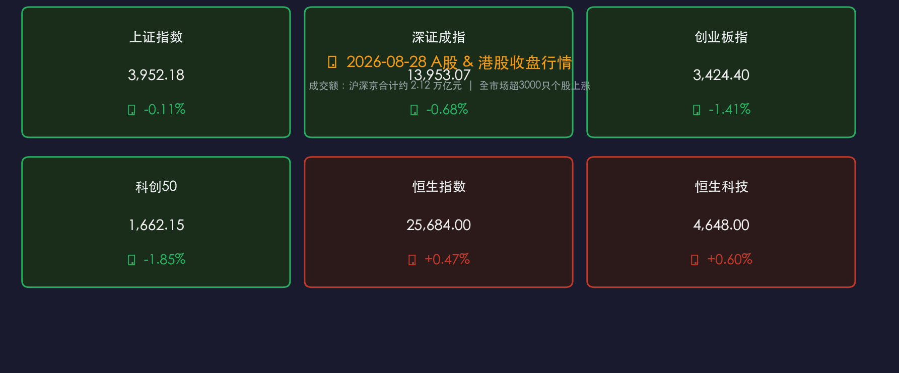

# 🌆 国内市场晚报：A股冲高回落沪指微跌0.11%，港股逆势收红，种植业地产走强与半导体回调

**日期：2026年08月28日 (星期五)** &nbsp; **时段：晚报（常规交易日）**

> **核心摘要**：A股今日呈现冲高回落震荡再平衡态势，上证指数微跌0.11%收报3952.18点，蓝筹权重表现坚韧；沪深京三市全天成交总额达2.12万亿元保持高流动性，全市场超3000只个股上涨；种植业、房地产及化学原料板块领涨，高位成长板块如CRO与半导体迎来阶段性筹码洗牌；港股恒生指数上涨0.47%收报25684点，财政逆周期调节与深化预算改革部署稳定宏观预期。

---

## 核心行情复盘

### 🇨🇳 A股主要指数

* **上证综合指数**：收于 **3,952.18 点**，跌 **-4.39 点** (**-0.11%**)，成交额 **9,703.65 亿元**
* **深证成分指数**：收于 **13,953.07 点**，跌 **-95.84 点** (**-0.68%**)，成交额 **11,313.50 亿元**
* **创业板指数**：收于 **3,424.40 点**，跌 **-49.00 点** (**-1.41%**)，成交额 **5,442.55 亿元**
* **科创50指数**：收于 **1,662.15 点**，跌 **-31.33 点** (**-1.85%**)
* **沪深京三市总成交额**：**2.12 万亿元**，持续维持在2万亿元上方的高流动性区间

> **核心解读**：经历前期连续上攻后，今日A股指数在周五呈现冲高回落的分化特征。尽管创业板指与科创50等成长指数调整幅度超过1%，但全市场上涨个股数量仍超过3000只，个股赚钱效应与宽基指数形成分化，反映主力资金在周末前主动进行调仓换沫，从高位题材向估值低位及防御类板块转移。

---

### 🇭🇰 港股市场

* **恒生指数**：收于 **25,684.00 点**，涨 **+119.00 点** (**+0.47%**)
* **恒生科技指数**：收于 **4,648.00 点**，涨 **+27.00 点** (**+0.60%**)

> **核心解读**：港股早盘低开后震荡走高，展现出较强的抗跌韧性。有色金属、内房股及部分大型科网权重股活跃，外资长线资金在香港市场维持配置信心，推动恒指与恒生科技双双红盘报收。

---

### 📊 行业板块涨跌

**领涨板块**：种植业与林业 🔴 · 房地产开发/内房股 🔴 · 化学原料与制品 🔴 · 有色金属 🔴 · 商业百货 🔴

**领跌板块**：CRO概念/医疗服务 🟢 · 半导体芯片 🟢 · 消费电子 🟢 · 军工电子 🟢

---

## 核心解读与市场逻辑

今日A股与港股整体呈现“主板权重抗跌、题材高低切换、港股韧性托底”的博弈格局，核心逻辑如下：

1. **成长赛道获利盘兑现与风格再平衡**：科创50与创业板指近期累积较大涨幅，在周末政策面与外围不确定性预期下，高弹性成长股（半导体、CRO）出现部分获利筹码兑现。
2. **顺周期与低位传统板块防御价值凸显**：种植业、化工原料及房地产板块在低估值优势与政策托底预期下逆势走强，支撑全市场个股整体涨多跌少。
3. **资金面与成交量能维持充裕**：三市成交连续突破2.1万亿元，充沛的流动性意味着市场并非缺乏买盘，而是存量博弈向“配置差”和估值洼地加速扩散。

---

## 政策脉动

### 🏛️ 财政与预算管理改革深化
* **积极财政政策强化逆周期调节**：财政部部署下半年扎实实施积极财政政策，深化零基预算改革，加强地方政府债务管理，进一步提高财政资金使用效益与宏观调控精准度。

### 🏢 地方产业与资本市场改革
* **上市公司市值管理考核机制推进**：地方监管部门（如云南省）提出研究将上市公司市值管理纳入企业考核评价体系，鼓励上市公司积极分红，强化投资者回报。
* **算力与前沿产业创新支持**：上海发布2026年度“智算光网”新一代光通信技术项目申报指南，持续推动关键算力通信技术自主研发。

### 🌐 经贸与外部环境动态
* **坚决维护对外经贸秩序**：商务部就外部经贸限制与额外关税动向重申坚决反对立场，强调中方将依法依规坚决捍卫自身合法正当权益。

---

## 最新机构观点

> **华泰证券**：A股当前处于典型的“震荡再平衡”阶段。在结构分化加剧背景下，配置策略建议从前期过度拥挤的单一赛道，转向具备明显“配置差”的细分领域（如通信设备、半导体材料/设备、船舶、电池及农业板块），同时将高股息红利资产作为长期底仓配置。

> **中金公司**：中长期看好AI算力成长主线。虽然短期硬件板块出现技术性调整，但以国产大模型、高端服务器、先进液冷及海外光互联升级为代表的核心成长主线依然是未来科技周期的主引擎，回调即提供更优的中期布局窗口。

> **中信建投**：公募REITs与低估值红利类资产底部配置价值显著凸显，受益于稳增长政策预期与长线增量资金入市，高分派属性资产有望在市场震荡期持续发挥压舱石作用。

---

## 今日市场情绪：博弈分化中寻找再平衡

> Prompt: A grand financial scale balancing golden wheat and industrial gears against glowing digital screens, with a backdrop of Shanghai skyline and green market pulses, dramatic volumetric lighting, cinematic

---

*免责声明：内容仅供参考，不构成投资建议。市场有风险，投资需谨慎。*
