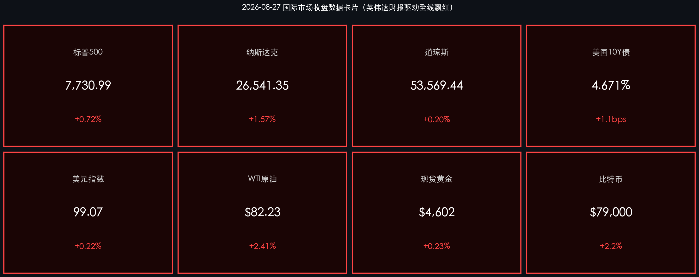

# 🌅 全球市场早报：英伟达驱动AI算力叙事狂欢，纳指单日飙升1.57%，全市场屏息等待美联储新主席沃什杰克逊霍尔首秀

**日期：2026年08月28日 (星期五)** &nbsp; **时段：早报（常规交易日）**

> **核心摘要**：8月27日美股在英伟达FY2Q27爆炸性财报（营收$96.2B、同比暴增106%）的提振下全线飙升，纳斯达克大涨1.57%收于26,541点，标普500升0.72%至7,731点，道指微涨0.20%；英伟达"AI算力超级拐点"的定调彻底扭转了市场对AI投资放缓的疑虑；美债10年期收益率小幅上行至4.671%，DXY美元指数升至99.07；今日（8月28日）杰克逊霍尔年会进入最关键时刻——美联储主席沃什将发表首次公开主旨演讲，市场押注其"不前瞻引导"风格或引发巨幅波动。

---

## 核心行情复盘

### 🇺🇸 美股主要指数

* **标普500指数**：收于 **7,730.99 点**，涨 **+55.29 点** (**+0.72%**)
* **纳斯达克综合指数**：收于 **26,541.35 点**，涨 **+411.16 点** (**+1.57%**)
* **道琼斯工业平均指数**：收于 **53,569.44 点**，涨 **+105.56 点** (**+0.20%**)

> **核心解读**：英伟达财报作为本轮反弹的最强催化剂，正式宣告AI基础设施大规模建设周期的延续——数据中心营收单季达$89.0B（同比+117%），CEO黄仁勋称"AI已到达超级拐点，算力即收入"。这一表态打消了市场上关于科技资本开支将在2026下半年降温的核心疑虑，直接推动纳指当日暴拉逾400点。市场呈现"英伟达利好全面渗透"模式：芯片设计、云服务、数据中心REIT及AI应用赛道全线受益。道指相对滞涨，显示本轮行情本质是科技主题驱动而非广泛经济复苏。

**盘后焦点与个股亮点：**
* **英伟达 (NVDA)**：FY2Q27营收 **$96.2B**（同比 **+106%**，远超预期$92.0B），EPS **$2.22**（预期$2.09），数据中心营收 **$89.0B**（+117%）。管理层指引FY28年增速仍有 **+70%**，黄仁勋明确表示供给端是当前唯一瓶颈而非需求端。

### 🏦 美债与外汇市场

* **美国10年期国债收益率**：收于 **4.671%**，较前日上行约 **+1.1 bps**
* **美元指数（DXY）**：升至 **99.07** 附近（涨幅约 **+0.22%**）

> **核心解读**：在英伟达盈利超预期的背景下，美债市场却保持相对平静，10年期收益率仅小幅上行1.1个基点，体现了"盈利驱动风险偏好提升"与"通胀黏性支撑长端利率"两股力量的微妙平衡。DXY的温和走强与美股上涨并行，说明本轮风险情绪改善来自实体盈利端（而非单纯流动性驱动），美债市场在杰克逊霍尔前夕进入高度警觉状态，任何沃什关于通胀或缩表的新信号都可能引发收益率方向性突破。

### 🛢️ 大宗商品

* **WTI 原油**：结算价 **$82.23/桶**，较前日涨 **+2.41%**
* **现货黄金**：报 **$4,602.85/盎司**，涨约 **+0.23%**

> **核心解读**：WTI油价单日大涨2.4%，从此前连续四日下跌中强势反弹，主因是OPEC+内部消息显示当前减产协议执行力度有望维持至年末，叠加市场对中国工业活动复苏的预期提振。黄金在强势美元面前仍维持高位，$4,600关口得到支撑，高盛维持年底$4,900/盎司目标价，体现黄金作为"央行超购+地缘对冲"的双重逻辑并未消退。

### 💰 加密货币

* **比特币 (BTC)**：报 **$79,000** 附近，较月中低点$64,500强力反弹，当日涨约 **+2.2%**

> **核心解读**：BTC从月中剧烈调整中恢复动能，与纳指科技情绪高度共振。机构持仓数据显示现货ETF资金持续净流入，BTC的"数字黄金+科技情绪放大器"双重属性在英伟达财报发布后均获强化。

---

## 核心解读与市场逻辑

> **英伟达财报的"系统性意义"**：这不只是一份财报，而是整个AI产业链的信心重建。$96.2B的收入意味着单季度算力消耗规模已超过全球传统服务器市场的年营收，且黄仁勋明确指出增长瓶颈在供给而非需求——这意味着只要TSMC/SK海力士的产能能跟上，英伟达的收入上限远未到达。市场正在重新定价"AI基础设施10年周期"的早期阶段。
>
> **"沃什时刻"的超高风险溢价**：今日（8月28日）杰克逊霍尔主旨演讲是2026年迄今最重要的货币政策事件。沃什以"不前瞻引导、让数据说话"的鹰派审慎风格著称。市场期权市场已给标普500今晚价格运动定价了±1.8%的隐含波动区间，是今年最高水平之一。核心关注：①他对通胀"最后一公里"的表态；②对缩表节奏的新信号；③是否给出2026年降息的任何条件性引导。

---

## 政策脉动

* **美联储（Fed）**：杰克逊霍尔年会（8月27-29日）进入最关键阶段。主席沃什今日14:00 EDT发表主旨演讲，题为《价格稳定与中性利率的再思考》。市场预期其措辞将偏审慎，不太可能明确释放降息信号，但任何软化表述都可能引发市场大幅反应。
* **美国财政部**：本周三公布7月核心PCE通胀为 **+2.7%** 同比（预期+2.6%），略超预期，强化了"通胀黏性"的判断，支持美联储在2026年保持利率不变的基线预期。
* **OPEC+**：内部消息显示主要产油国倾向将当前自愿减产协议延伸，WTI随即反弹，地缘供给风险溢价阶段性回升。

---

## 最新机构观点

* **高盛（Goldman Sachs）**：维持2026年美国经济增长 **+2.6%** 预测，认为AI驱动的企业资本开支将持续为标普500盈利提供支撑。维持黄金年底 **$4,900/盎司** 目标价，强调全球央行购金需求具有结构性。对美股的看法从"纯AI拉动"转向"盈利广泛化"，认为非AI板块有望在下半年接力。
* **摩根大通（JPMorgan）**：对短期股市保持谨慎，指出8-10月是历史上标普500表现最弱的季节性区间（下跌年份平均跌幅达7.35%）。技术策略师警示市场内部结构恶化（市场宽度收窄、领涨轮换缺乏持续性），建议投资者向防御性高息板块适当切换。旗帜鲜明地提示：英伟达财报利好或已Price-in，关注今日沃什演讲后的回调风险。
* **中金公司（CICC）**：发布报告指出，英伟达爆表财报将直接利好A股AI算力及半导体设备板块，可关注国产GPU及AI芯片生态链标的的补涨机会；同时提示港股恒生科技指数与纳指的高Beta相关性，今日港股科技板块有望高开。

---

## 今日市场情绪：算力盛宴

> Prompt: Prometheus, a powerful titan made of glowing circuit boards, steals a blazing torch of golden AI data streams from a massive server tower. In the background, towering mountain peaks of Jackson Hole pierce a crimson dawn sky filled with cascading green financial data and stock tickers. The scene is epic and dramatic, ultra-detailed, digital art, cinematic lighting.

---

*免责声明：内容仅供参考，不构成投资建议。*
