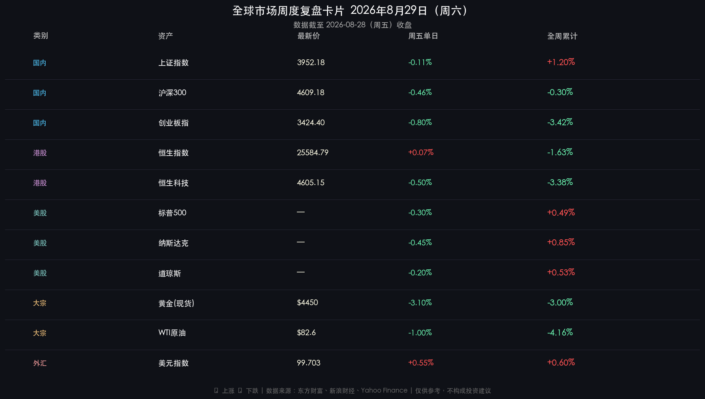
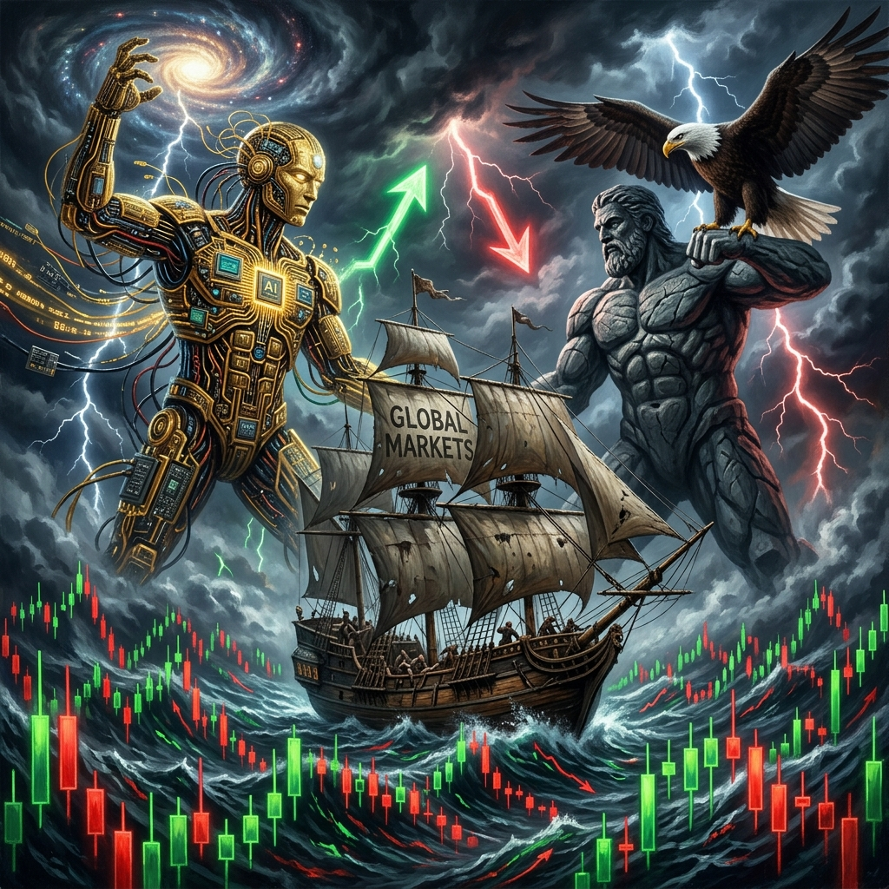

# 全球市场周末复盘·2026年第35周

**日期：2026年08月29日 (星期六)** &nbsp; **时段：周末复盘（模式 B）**

> **核心摘要**：本周全球市场上演"AI引擎 vs. 鹰派美联储"的分裂博弈——英伟达财报炸场、全周营收同比翻倍，AI算力需求确定性获大幅强化；然而杰克逊霍尔年会上沃什发出强烈鹰派信号，9月加息概率从35%飙升至60%，美元指数走强，黄金单日重挫逾3%。A股上证指数逆势收涨+1.20%，但创业板及港股在美元走强与风险偏好收缩下均明显承压。

---

## 核心资产周度/日度表现回顾

### 🇨🇳 A股市场

* **上证指数**：收报 **3952.18 点**，周五单日 **-0.11%**，**全周累计 +1.20%**（为近4周最大单周涨幅）
* **沪深300**：收报 **4609.18 点**，周五单日 **-0.46%**，全周累计约 **-0.30%**
* **创业板指**：收报 **3424.40 点**，周五单日约 **-0.80%**，**全周累计 -3.42%**（跌幅居前）
* **深证成指**：全周累计 **-1.00%**
* 日均成交额约 **1.9万亿元**，活跃度有所回落

> **核心解读**：上证指数本周成功"以价值护盘"——非银金融、有色金属、美容护理板块领涨，市场资金向低估值蓝筹切换。然而成长风格与科技板块（电子、综合）受外部美元走强及加息预期冲击，全周持续承压，导致创业板大幅落后大盘3.42个百分点。A股与美科技股的相关性在杰克逊霍尔冲击下被再次打破，价值/成长的分化是本周最显著的主题。

### 🇭🇰 港股市场

* **恒生指数**：收报 **25,584.79 点**，周五单日 **+0.07%**，**全周累计 -1.63%**
* **恒生科技指数**：收报 **4,605.15 点**，全周累计 **-3.38%**
* **恒生国企指数**：收报 **8,490.39 点**，全周累计 **-1.67%**

> **核心解读**：港股在25,500–26,000点区间窄幅震荡，整体跟随全球风险情绪走弱。恒生科技指数的-3.38%周跌幅反映出市场对"高估值成长"资产在紧缩预期下的系统性重估。部分清盘消息及权重股回调亦形成额外拖累。港股的走势实质上成为外资在亚太地区情绪的"风向标"，本周信号明显偏空。

### 🇺🇸 美股市场

* **标普500**：全周累计 **+0.49%**，周五小幅收跌（受沃什讲话冲击）
* **纳斯达克**：全周累计 **+0.85%**
* **道琼斯**：全周累计 **+0.53%**

> **核心解读**：美股全周呈现"先扬后抑"走势。周初至周中，英伟达超预期财报（营收962亿美元，同比+106%）引爆AI产业链，科技股强势拉动指数走高。周五，沃什鹰派演讲令市场加息预期陡升，三大指数集体小幅回落，但全周仍守住了正收益，体现出市场对AI叙事的韧性认同。

### 🏅 大宗商品 & 外汇

* **黄金（现货）**：收报约 **$4,450/盎司**，周五单日暴跌 **-3.1%**，全周 **-3.0%**
* **WTI原油**：收报约 **$82.6/桶**，全周 **-4.16%**（布伦特周跌约6.49%）
* **美元指数**：收报 **99.703**，周五 **+0.55%**，稳固在99点上方

> **核心解读**：金价的-3.1%单日跌幅是本周最惨烈的"受害者"——美元走强（收益率上升）直接压制黄金的无息资产属性。WTI原油虽有中东地缘政治（美伊谈判前景不明）支撑，但周内整体跌幅超过4%，反映需求预期在利率上升背景下承压。美元指数本周的强势是整个大宗商品跌势的"元凶"。

---

## 过去 48 小时重磅事件深度复盘

### 🎤 杰克逊霍尔年会：沃什首秀的鹰派震撼

美联储主席凯文·沃什于2026年8月27-29日在杰克逊霍尔年会首次发表重量级政策演讲，引发全球市场剧烈反应：

**核心立场：**
* 强调2%通胀目标"坚定且固定"，警告通胀降温幅度不足
* 明确拒绝前瞻指引，主张美联储"更加安静"
* 认为当前金融条件"难言具有限制性"——被解读为为加息留空间

**市场反应：**
* CME"美联储观察"工具显示：9月加息概率 **35% → 60%**（大幅飙升）
* 年底前加息概率升破 **70%**
* 美元指数周五单日 **+0.55%**，美债收益率同步上行

> **逻辑链**：沃什鹰派表态（事件）→ 加息预期陡升（数据）→ 美元走强、美债收益率上行（传导）→ 黄金重挫、成长股承压、大宗商品走弱（结果）。这是本周全球风险资产跌幅的核心解释变量。

### 🤖 英伟达 2026 财报炸场：AI 算力新纪元

英伟达（NVDA）于美东时间8月26日盘后发布2027财年Q2财报：

* **营收：$962亿美元**（同比 +106%，超预期$920亿）
* **数据中心营收：$890亿美元**（同比 +117%）
* **净利润：$596.88亿美元**（同比 +126%）
* **GAAP/非GAAP毛利率：75%**
* **Q3指引：$1,080亿美元**（上下浮动2%）
* **超远期指引：2028财年营收增长约70%**（大幅超预期的45%）

> **机构一致逻辑**：高盛、摩根士丹利、摩根大通、花旗等华尔街巨头财报后密集上调目标价，普遍认定AI已从"概念验证"迈入"商业变现"拐点。算力需求"供不应求"格局短期难破，Rubin新架构产能爬坡快于预期，进一步锁定未来数季度的高增长确定性。

---

## 下周全球宏观大事预警

| 日期（北京时间）| 事件 | 重要性 |
|---|---|---|
| 9月1日（周一）| 美国8月ISM制造业PMI | ⭐⭐⭐ |
| 9月2日（周二）| 美国8月ADP就业报告 | ⭐⭐⭐ |
| 9月3日（周三）| 美国8月ISM非制造业PMI | ⭐⭐⭐ |
| **9月4日（周四）20:30** | **美国8月非农就业报告** | ⭐⭐⭐⭐⭐ |
| 9月10日前后 | 美国8月PPI | ⭐⭐⭐⭐ |
| 9月11日前后 | 美国8月CPI | ⭐⭐⭐⭐⭐ |
| **9月16日（周三）** | **美联储FOMC利率决议 + 点阵图** | ⭐⭐⭐⭐⭐ |
| 9月18日 | 美国季度"三重巫日" | ⭐⭐⭐⭐ |

> **⚠️ 核心风险**：**9月4日非农 + 9月11日CPI** 是决定美联储9月16日是否加息的两大关键数据节点。若非农与CPI均强于预期，60%的9月加息概率可能进一步升至80%+，届时全球风险资产将面临新一轮剧烈冲击。市场波动窗口正在打开。

---

## 顶级机构周末策略内参摘要

1. **高盛（Goldman Sachs）**：在杰克逊霍尔前曾提示加息预期过激，但财报后上调英伟达目标价。整体对AI基础设施板块维持强烈看多立场，但提醒需关注电力配套速度及大型云厂商盈利能力能否支撑长期资本开支。

2. **摩根士丹利（Morgan Stanley）**：上调英伟达目标价，同时发布报告指出"AI应用端商业化进程"已成新的关注焦点，不再单纯关注季报是否超预期；对新兴市场资产谨慎，因美元走强对亚太资本流出构成压力。

3. **中金公司（CICC）**：指出沃什鹰派信号短期对A股外资流出有压力，但认为A股"政策底 + 估值底"的双重支撑仍在，价值蓝筹的防御属性有望在下周延续。看好非银金融、有色金属、内需消费方向。建议投资者在非农数据前降低仓位，等待明确信号后再布局。

---

## 今日市场情绪：AI巨浪与鹰击长空的对决

> Prompt: A lone ancient sailing ship navigates a stormy sea made entirely of red and green candlestick charts (K-lines), its tattered sails bearing the words "GLOBAL MARKETS". In the background, two colossal titans face each other: one made of golden circuit boards (representing AI/tech) reaching toward the heavens, and one of stone holding a giant eagle (representing the Fed/monetary policy). Lightning strikes shaped like upward arrows and downward arrows illuminate a dark sky filled with storm clouds. The ship is caught between the titans' clash. Dramatic, hyper-detailed, cinematic oil painting style, dark dramatic atmosphere.

---

*免责声明：内容仅供参考，不构成投资建议。*
