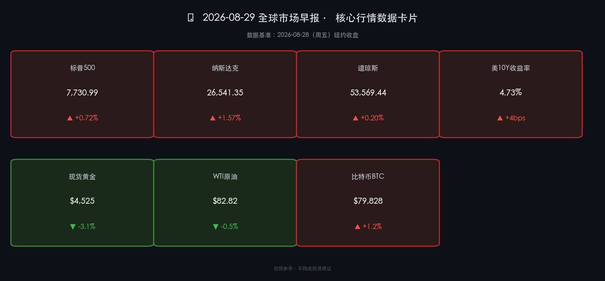

# 🌅 全球市场早报：沃什鹰语重击黄金跌逾3%，纳指科技韧性撑盘，"更长更高"利率定价重塑全市场风险偏好

**日期：2026年08月29日 (星期六)** &nbsp; **时段：早报（常规交易日）**

> **核心摘要**：美联储主席沃什在杰克逊霍尔年会的首次公开演讲中释放鲜明鹰派信号，明确表示通胀"最后一公里"仍存粘性，不支持近期降息，"更高更久"利率路径重获市场定价；10年期美债收益率跳升至4.73%（+4bps），黄金大跌逾3%至约$4,525/盎司；但美股在英伟达AI算力叙事持续发酵的支撑下展现强劲韧性，纳指周五收涨1.57%至26,541点，标普500升0.72%至7,731点；比特币站稳$79,828，与科技情绪高度共振。本日为周六，美股已休市，A股及港股将于周一（9月1日）开盘。

---

## 核心行情复盘

### 🇺🇸 美股主要指数（2026-08-28 周五收盘）

* **标普500指数**：收于 **7,730.99 点**，涨 **+55.29 点** (**+0.72%**)
* **纳斯达克综合指数**：收于 **26,541.35 点**，涨 **+411.15 点** (**+1.57%**)
* **道琼斯工业平均指数**：收于 **53,569.44 点**，涨 **+105.56 点** (**+0.20%**)

> **核心解读**：美股在双重利空（沃什鹰派+黄金暴跌）背景下逆势收涨，展现了显著的市场韧性。纳指大涨1.57%，主因英伟达财报余热持续辐射整个AI算力赛道——芯片设计、云服务、AI应用全线受益。道指相对滞涨仅+0.20%，金融、工业等传统板块受到高利率预期压制，凸显本轮行情的纯科技驱动属性。市场呈现出一个罕见格局：货币政策趋紧（沃什鹰派）与盈利基本面改善（NVDA爆表）同时共存，投资者选择在结构性成长赛道上押注而非全面回避风险。

### 🏦 美债与外汇市场

* **美国10年期国债收益率**：收于 **4.73%**，较前日上行约 **+4 bps**
* **美元指数（DXY）**：升至 **99.4** 附近（涨幅约 **+0.3%**）

> **核心解读**：沃什在杰克逊霍尔的演讲是导致本日长端利率跳升的核心触发点。4.73%的10年期收益率已接近2026年内高点区间，意味着市场已将"2026年内不降息"的预期大幅前置。DXY随即走强，美元作为高息货币的吸引力得到强化。长端利率上行对估值较高的成长股构成潜在压力，但科技股凭借超强盈利预期目前仍能消化这一压力。关键风险：若10年期收益率突破4.8%，届时科技股估值压缩或将显著化。

### 💛 大宗商品

* **现货黄金**：结算价约 **$4,525/盎司**，跌约 **-3.1%**（当日最大跌幅一度超过3%）
* **WTI 原油**：结算价约 **$82.82/桶**，跌约 **-0.5%**，油价周度延续回调趋势
* **布伦特原油**：结算价约 **$88.22/桶**

> **核心解读**：黄金遭遇本月最大单日跌幅，根本逻辑在于：沃什演讲（数据/事件）→ 降息预期大幅后移（机制）→ 持有黄金的机会成本显著上升（逻辑）→ 金价承压。这一逻辑链条清晰完整。然而，高盛仍维持年底$4,900/盎司目标，理由是全球央行购金的结构性力量并未因利率上行而消退。WTI轻微下跌受制于中东地缘风险溢价边际消退（霍尔木兹海峡局势阶段性缓和），但摩根士丹利预计Q4 Brent将触及$100/桶。

### 💰 加密货币

* **比特币 (BTC)**：收于 **$79,828**，日涨约 **+1.2%**

> **核心解读**：BTC在沃什鹰派信号的背景下仍能收涨，与纳指科技情绪高度共振，验证了BTC"数字黄金+科技情绪放大器"的双重属性。值得注意的是，与实物黄金同日暴跌形成鲜明对比，表明资金正在将加密市场视为科技赛道而非纯避险资产。现货比特币ETF持续净流入，机构配置需求稳固。

---

## 核心解读与市场逻辑

> **沃什鹰派演讲的全市场影响**：杰克逊霍尔年会是2026年迄今最重要的货币政策事件，沃什的演讲正式为下半年货币政策路径定调。他明确指出通胀"最后一公里"具有顽固粘性，不支持在数据未达标前前瞻性降息，并暗示"中性利率已结构性上移"——这一表态具有深远含义：它意味着即便未来降息，联邦基金利率的终点也将高于2020年前的水平。市场对此反应分化：利率敏感型资产（黄金、长债）遭遇重击；而科技股凭借NVDA财报的超强α逻辑相对抗压。
>
> **英伟达效应的持续辐射**：FY2Q27的$96.2B营收（同比+106%）已彻底重塑市场对AI基础设施投资周期的定价。管理层指引2026财年增速仍有+70%，实际上将AI资本开支的高峰期从"可能的2026年见顶"直接后推至2027-2028年。这一叙事将持续支撑半导体、数据中心、AI应用全链条的估值溢价。

---

## 政策脉动

* **美联储（Fed）**：主席沃什在杰克逊霍尔发表《价格稳定与中性利率的再思考》主旨演讲，明确表达：①通胀粘性犹存，抗通胀任务未竟；②不支持"前瞻引导"式降息路径；③中性利率已结构上移，利率回落空间有限。市场随即将2026年首次降息预期推迟至2027年Q1。
* **美国财政部**：7月核心PCE同比 **+2.7%**（预期+2.6%），略超预期，为沃什鹰派表态提供了数据支撑。
* **OPEC+**：内部倾向维持当前自愿减产协议至年末，为油价提供底部支撑，但地缘风险溢价边际减弱抵消了该利好。

---

## 最新机构观点

* **高盛（Goldman Sachs）**：维持美股"谨慎乐观"立场，强调AI驱动的企业资本开支将持续为标普500盈利提供结构性支撑。维持黄金年底 **$4,900/盎司** 目标，认为央行购金需求使得单日跌幅构成短线买入机会。预计2026年美国ETF总流入将创下**$2万亿**历史纪录，凸显被动配置资金的持续涌入。
* **摩根士丹利（Morgan Stanley）**：最新观点指出市场正进入"更烫更短"的宏观周期——通胀、利率、收益率将在比历史均值更高的水平上运行。警示传统债券已失去对股市的对冲功能，建议投资者重新审视大类资产配置逻辑。上调布伦特原油目标至 **$90/桶（Q3）** 和 **$100/桶（Q4）**，认为中东供给恢复速度慢于预期。
* **中金公司（CICC）**：指出本周沃什演讲及NVDA财报后，A股面临"外部利率压制+科技情绪提振"的双重博弈，建议关注国内AI算力产业链中受益于英伟达带动的弹性标的；同时提示美债收益率上行对港股高估值成长股构成短期压力，需关注9月1日港股开盘后的外资调仓动向。

---

## 今日市场情绪：鹰翼压金，算力撑天

> Prompt: A massive golden scale tips violently as a glowing torch of AI circuit-fire blazes on one side, while on the other side iron chains of inflation data and Treasury yield numbers drag it downward. In the background, the silhouette of the Jackson Hole mountains rises against a stormy sky split between crimson hawkish clouds and a hopeful Nasdaq green dawn. Ultra-detailed, cinematic, digital surrealism.

---

*免责声明：内容仅供参考，不构成投资建议。*
