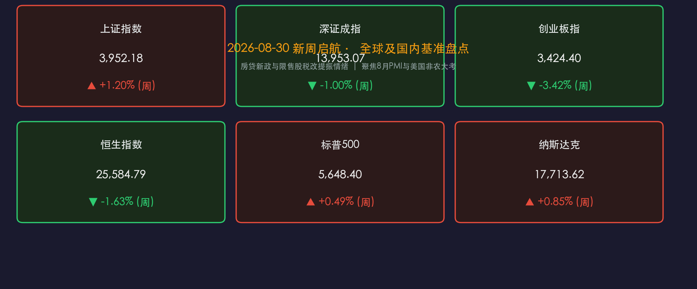

# 新周前瞻·政策组合拳筑底，静待中美宏观大考

**日期：2026年08月30日 (星期日)** &nbsp; **时段：新周展望（模式 C）**

> **核心摘要**：本周末国内迎来重磅政策组合拳——央行与金监总局推动房贷最长延至40年并优化存量利率协商机制，财政部与税务总局明确限售股转让个税按20%征收，政策底与制度红利持续夯实。展望新一周（8月31日-9月4日），全球市场将迎来中国8月PMI与美国8月非农就业报告的终极检验，A股中报披露收官后盈利因子重新主导定价，结构性慢牛修复窗口正在开启。

---

## 周末财经要闻终极汇总

### 🏛️ 宏观与房地产政策：房贷管理迎历史性改革
* **40年房贷与存量调整**：中国人民银行、国家金融监督管理总局联合发布意见，明确推进房地产信贷体制改革。政策支持**个人住房贷款最长期限延长至40年**；允许借贷双方基于LPR波动协商调整存量浮动利率贷款加点幅度或进行贷款置换；借款人收入下降还款困难时，可协商延长贷款期限或调整还款计划。
* **限售股税收新规**：财政部、税务总局、证监会联合公告，个人转让上市公司限售股所得，按照“财产转让所得”适用20%比例税率征收个人所得税，进一步规范资本市场财富分配与税收征管。

### 🤖 产业与前沿科技：数据要素与半导体突破
* **数据要素商业化先行**：国家数据局局长刘烈宏在2026中国国际大数据产业博览会上表示，将积极探索词元增值订阅等新型商业模式，并将在全国32个重点城市布局新一批数据标注先行先试基地。
* **高端制造与算力出海**：国内存储龙头长鑫LPDDR6内存芯片正式进入大规模量产阶段；中国石油上半年净利润突破千亿元大关；AI服务器带动的算力铜箔等材料维持高景气度。

### 🌐 国际与地缘局势：中东局势与海外货币博弈
* **地缘与能源震荡**：伊朗外交部高级官员表态霍尔木兹海峡处于严格管控与部分航道关闭状态，国际油运与避险情绪受扰动；英国政府探讨对暴利油气企业征收额外调节税。
* **美联储鹰派余波**：杰克逊霍尔年会上沃什的偏鹰首秀继续被外盘消化，美元指数稳固在99.7上方，9月降息节奏与非农数据挂钩程度空前提升。

---

## 新一周市场核心博弈逻辑

### 1. 盈利定价重回主导，中报收官去伪存真
* 2026年中报披露正式收官，全A“两非”（非金融、非石油石化）净利润与营收同比增速呈现企稳回升态势。
* 市场定价逻辑正从前期的“流动性驱动/主题博弈”彻底切换至**“基本面与业绩兑现”**。前期依靠纯估值拉升的高位题材承压，而业绩超预期的中游制造、资源品与顺周期板块迎来估值重构。

### 2. 政策托底 vs. 外部流动性分化
* **国内利好共振**：房贷新政大幅减轻居民端长期现金流压力，配合限售股税收规范，对资本市场风险偏好形成直接支撑。
* **外部汇率与利率压制**：美联储降息预期因鹰派发言有所修正，中美利差短期仍维持相对高位，北向资金与亚太成长股整体风格偏向防御与高质量红利。

### 3. “哑铃型”配置仍是最优解
* 一端锚定**低波高股息与顺周期核心资产**（银行、公用事业、能化、有色金属），作为防御和收益底仓；
* 另一端布局**具备实质订单和产业爆发力的科技成长**（国产算力链、半导体替代、创新药及AI端侧应用）。

---

## 本周重磅经济数据与会议前瞻

| 日期 (北京时间) | 国家/地区 | 重磅事件 / 经济数据 | 市场影响及关注核心 |
| :--- | :--- | :--- | :--- |
| **08月31日 (周一)** | 🇨🇳 中国 | **8月官方制造业 / 非制造业 PMI** | 检验制造业景气度及内需修复动能 |
| **08月31日 - 09月01日** | 🌐 国际 | **G20 财长与央行行长会议** | 全球宏观政策协调与汇率货币合作信号 |
| **09月01日 (周二)** | 🇨🇳/🇺🇸 中美 | 中国财新制造业PMI / 美国8月ISM制造业PMI | 中小企业景气度与美国制造业扩张收缩线 |
| **09月02日 (周三)** | 🇺🇸 美国 | 美国8月ADP就业人数（“小非农”） | 周五大非农的前哨战，校验私营部门就业韧性 |
| **09月03日 (周四)** | 🇺🇸 美国 | 美国至8月29日初请失业金 / 美联储褐皮书 | 联储9月FOMC议息会议前全美经济全景描摹 |
| **09月04日 (周五)** | 🇺🇸 美国 | **美国8月季调后非农就业人口 / 失业率** | **全周最大焦点**：直接锁定9月降息25bp或50bp的定价 |

---

## 头部券商/投行开盘策略点睛

### 🏛️ 中信证券：筑底基本完成，9月修复行情可期
> 本轮A股市场的宽幅震荡更多是微观交易拥挤度的技术性修正，而非系统性流动性危机。随着二季报业绩利空出尽与房地产金融政策进一步发力，市场将迎来9月份的修复窗口。建议采取均衡配置策略，重点关注能化、有色、创新药和非银金融。

### 📈 申万宏源：“二次探底”兑现，掘金超跌业绩修复链
> 8月下旬市场的“二次探底”基本完成，指数反弹有望延续至9月下旬。在行业选择上，建议重视超跌反弹中修复能力强、且中报得到业绩印证的方向，特别是具备自主可控逻辑的国产算力链、半导体以及低位高景气成长股。

### 💡 中金公司：向新致远，紧扣产业周期与业绩确定性
> 当前A股估值仍处于历史均值下方，下行风险有限。配置上建议“向新致远”，关注具备高产业确定性的AI硬件与终端落地、具备出海竞争力的先进制造，以及能够稳定提供现金流回报的高股息核心资产。

---

## 今日市场情绪：希望之光与审慎博弈

> Prompt: A grand golden lighthouse standing firm on a coastal cliff illuminating a vast digital ocean of financial charts and macroeconomic compasses, dawn breaking on the horizon with radiant warm light

---

*免责声明：内容仅供参考，不构成投资建议。*
