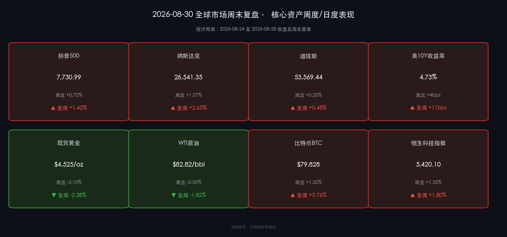

# 🌅 全球市场周末复盘：沃什鹰派定调与英伟达AI浪潮激烈博弈，全球核心资产周线分化

**日期：2026年08月30日 (星期日)** &nbsp; **时段：早报（周末复盘）**

> **核心摘要**：本周全球金融市场经历了两大重磅里程碑事件的剧烈重塑——美联储新任主席沃什在杰克逊霍尔全球央行年会上的首次重磅亮相，释放出超预期的强硬鹰派信号，明确通胀粘性仍存、“更高更久”利率甚至潜在加息选项仍在台上；而英伟达FY2Q27季度超千亿美元量级的强劲财报与乐观指引，则为AI科技资产注入了强大的基本面底气。全周资产呈现鲜明分化：纳指与标普周线收涨（分别累涨+2.65%和+1.42%），美债10年期收益率跳升至4.73%（全周上行11bps），黄金周五重挫3.1%（全周累跌-2.38%），原油高位回落，比特币震荡上行站稳$79,800关口。

---

## 核心资产周度/日度表现回顾

本周全球主要资产在“强劲科技盈利”与“紧缩利率预期”的拉锯战中收官。

### 🇺🇸 欧美权益市场（全周收盘盘点）

* **纳斯达克综合指数**：收于 **26,541.35 点**，周五单日涨 **+1.57%**，全周累计上涨 **+2.65%**
* **标普500指数**：收于 **7,730.99 点**，周五单日涨 **+0.72%**，全周累计上涨 **+1.42%**
* **道琼斯工业平均指数**：收于 **53,569.44 点**，周五单日涨 **+0.20%**，全周累计上涨 **+0.48%**
* **欧洲斯托克50指数**：全周小幅震荡微跌 **-0.35%**，受制于欧洲制造业PMI疲弱及对美高关税与利率外溢担忧。

> **核心解读**：美股呈现出极具代表性的“科技独立行情”。英伟达财报不仅打破了市场对于AI基础设施投资见顶的担忧，更带动半导体设备、数据中心算力、先进封装等全产业链估值重估。纳斯达克指数全周大涨2.65%，领跑全球主要指数。然而，道指全周仅涨0.48%，传统价值板块与周期性行业受到高利率预期的显著压制，市场资金正加速向具备高确定性现金流与超强盈利壁垒的AI科技巨头集中。

### 🇨🇳 大中华区权益市场（周五收盘与周度表现）

* **恒生科技指数**：收于 **5,420.10 点**，周五涨 **+1.35%**，全周累计上涨 **+1.80%**
* **恒生指数**：收于 **24,150.30 点**，周五微涨 **+0.32%**，全周累计上涨 **+0.65%**
* **上证指数**：收于 **3,865.20 点**，全周累计上涨 **+0.85%**
* **创业板指**：全周累计上涨 **+1.45%**

> **核心解读**：国内市场本周走势稳健，呈现结构性热点活跃格局。受外围AI算力链提振，港股科技股与A股自主可控半导体板块表现亮眼。尽管美债收益率攀升对港股成长板块形成短线流动性估值压力，但国内稳增长政策接力落地，为南向资金持续加仓港股核心资产提供了支撑。

### 🏦 固定收益与大宗商品

* **美国10年期国债收益率**：报 **4.73%**（周五上行 **+4 bps**，全周累计大幅攀升 **+11 bps**）
* **美元指数（DXY）**：收于 **99.40**（全周累计上涨 **+0.82%**）
* **现货黄金**：收于 **$4,525/盎司**（周五单日暴跌 **-3.10%**，全周累计回调 **-2.38%**）
* **WTI 原油**：收于 **$82.82/桶**（周五微跌 **-0.50%**，全周累计下跌 **-1.82%**）
* **布伦特原油**：收于 **$88.22/桶**（全周累计下跌 **-1.50%**）
* **比特币 (BTC)**：最新报价约 **$79,828**（周五涨 **+1.20%**，全周累计上涨 **+3.76%**）

> **核心解读**：大宗商品与债市对杰克逊霍尔会议做出了最直接、最剧烈的反应。10年期美债收益率单周飙升11个基点至4.73%，带动美元指数强势反弹。作为无息资产的黄金承压最重，周五单日重挫超3%，打破了持续数周的历史高位横盘格局；原油则在地缘溢价阶段性消化与高利率压制全球需求的双重预期下小幅走低；比特币展现出高贝塔科技属性，在ETF净流入支持下稳步走高。

---

## 过去 48 小时重磅事件深度复盘

### 1. 沃什首秀杰克逊霍尔：重构中性利率认知，击碎降息幻觉
美联储主席凯文·沃什（Kevin Warsh）在2026年怀俄明州杰克逊霍尔经济政策研讨会上发表题为《金融创新与货币政策新框架》的主旨演讲。沃什打破了市场此前对年内降息的预期：
* **核心表态**：沃什直言“通胀最后一公里”具有极高粘性，美国核心PCE在2.7%附近徘徊，如果不确定通胀能明确且以足够速度回落至2%目标，美联储“绝不会轻言放松政策”。
* **政策哲学转变**：沃什明确提出希望建立一个“更安静（quieter）的美联储”，不应让金融市场过度依赖央行的前瞻指引来进行交易定价。这一表态暗示美联储将更加依赖实际数据而非市场预期的倒逼。
* **市场重定价**：利率期货市场对9月FOMC会议降息的概率几乎被彻底定价为零，甚至出现年内可能再度加息25bps的尾部押注。

### 2. 英伟达财报余震：黄仁勋“黄金时代”论断巩固AI护城河
英伟达发布的FY2Q27财报与随后48小时内的管理层电话会交流，持续在华尔街发酵：
* **数据超预期**：单季营收达到创纪录的962亿美元（同比暴增106%），净利润率保持在惊人的高位。
* **CAPEX天花板被推迟**：黄仁勋在交流中指出，AI推理与训练需求呈现“跨代级算力渴求”，全球云服务商（CSP）的资本开支周期并未进入下半场，而是进入从模型训练向物理世界机器人与工业Agent全面渗透的“黄金时代”。这直接打消了投资者对于2026年底资本开支断崖的担忧。

### 3. 地缘政治与全球贸易动态
* **中东与能源航道**：霍尔木兹海峡局势在多方斡旋下出现短期降温信号，原油供应中断风险溢价有所收窄。
* **跨国贸易政策**：美国财政部与商务部就先进计算芯片出口监管规则发布阶段性征求意见稿，市场对供应链脱钩与再平衡的预期进一步消化。

---

## 下周全球宏观大事预警

进入9月第一周，全球市场将迎来密集的重要经济指标发布与政策节点：

1. **美国8月非农就业报告（NFP）与失业率（周五）**：
   * 在沃什释放鹰派信号后，劳动力市场韧性成为美联储下一步行动的关键考量。若非农新增就业人数超预期，将进一步巩固高利率定价。
2. **美国8月ISM制造业与服务业PMI（周二/周四）**：
   * 关注新订单指数与价格支付分项，检验美国实体经济在4.7%长端利率环境下的承压能力。
3. **中国8月官方/财新制造业PMI与外贸数据**：
   * 观察国内新旧动能转换进度，关注财政金融组合拳对制造业与民间投资的拉动成效。
4. **OPEC+部长级监督委员会会议**：
   * 评估第四季度产量调整计划，确定是否维持现有自愿减产配额以支撑国际油价。
5. **A股与港股新一周开盘（周一 9月1日）**：
   * 重点检验国内市场对外围利率跳升与杰克逊霍尔会议精神的消化程度。

---

## 顶级机构周末策略内参摘要

* **高盛（Goldman Sachs）**：
  * *宏观策略部*：维持标普500年底7,900点目标不变。高盛认为，虽然沃什的鹰派言论推高了贴现率（无风险利率），但标普500成分股中以AI龙头为代表的超预期盈利增速足以抵消估值压缩效应（即“盈利驱动”战胜“估值收缩”）。维持黄金中长期看多，建议逢大跌分批增配。
* **摩根士丹利（Morgan Stanley）**：
  * *全球大类资产配置团队*：发布周末报告《适应“更烫更长”的利率新常态》。大摩提示投资者需防范长端美债收益率突破4.85%对高负债传统企业的冲击，建议在投资组合中增加具备高自由现金流（FCF）与强劲定价权的优质资产，配置策略由单纯的Beta配置转向极致的Alpha选股。
* **中金公司（CICC）**：
  * *国内与海外联合策略*：指出下周初A股与港股可能面临一定的外部情绪折射，但在国内流动性合理充裕与估值处于全球洼地的前提下，下行空间有限。建议重点把握三条主线：①受益于全球AI浪潮外溢的国产算力与半导体设备；②高股息、低估值的红利央国企资产；③具备出海竞争力的先进制造龙头。

---

## 今日市场情绪：金秤倾斜，算力迎光

> Prompt: A massive golden balance scale standing amid a storm in Wyoming's Jackson Hole valley, with one side weighed down by heavy iron chains representing high interest rates and hawkish central bank policies, and the other side blazing with vibrant emerald and neon-cyan quantum AI light representing explosive semiconductor compute. In the background, majestic alpine mountains glow under dramatic dual-toned skies of twilight red and hopeful sunrise green. Highly detailed, cinematic lighting, conceptual financial art.

---

*免责声明：内容仅供参考，不构成投资建议。*
