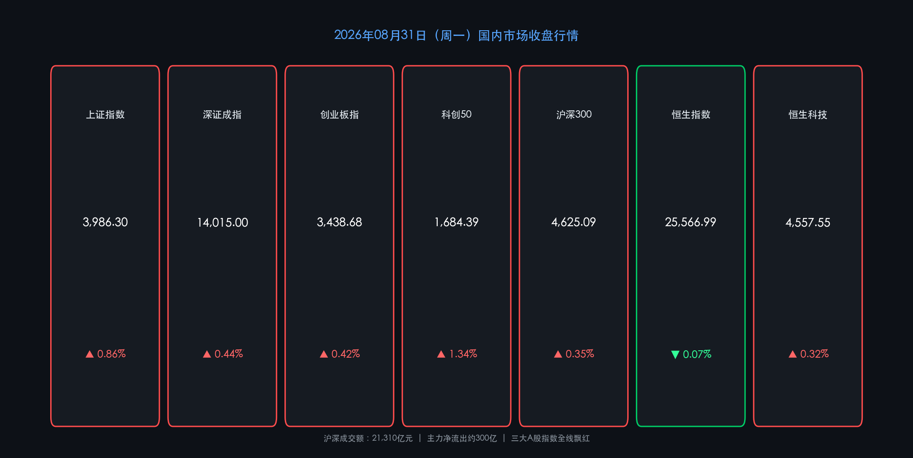

# 月末收官·政策组合拳落地，PMI触底回升A股月末收红

**日期：2026年08月31日 (星期一)** &nbsp; **时段：收盘晚报（模式 A）**

> **核心摘要**：2026年8月最后一个交易日，A股三大指数全线收涨，上证指数报3986.30点（+0.86%），成交额破2.1万亿元，延续高人气。当日重磅政策密集落地：国统局公布8月制造业PMI 49.8%（较上月+0.6pp，内需回暖）；央行+金监总局推出40年房贷新政+存量利率优化；证监会同步配套资本市场支持房地产新规。文化传媒、银行、液冷服务器三线领涨，市场风险偏好明显修复。

---

## 核心行情复盘

### 🇨🇳 A股主要指数

* **上证指数**：收报 **3,986.30点**，上涨 **+0.86%**（+34.12点）；昨收（8月28日）3,952.18点，涨跌幅验证通过（34.12÷3952.18≈0.863%）
* **深证成指**：收报 **14,015.00点**，上涨 **+0.44%**（+61.93点）
* **创业板指**：收报 **3,438.68点**，上涨 **+0.42%**
* **科创50**：收报 **1,684.39点**，上涨 **+1.34%**，为宽基指数涨幅最强
* **沪深300**：收报 **4,625.09点**，上涨 **+0.35%**

| 量能指标 | 数值 |
| :--- | :--- |
| 沪深两市成交总额 | **21,310 亿元** |
| 主力资金净流向 | 净流出约 **300 亿元** |
| 北向资金 | 季度披露制（实时数据暂停公布） |

### 🇭🇰 港股市场

* **恒生指数**：收报 **25,566.99点**，微跌 **-0.07%**
* **恒生科技指数**：收报 **4,557.55点**，上涨 **+0.32%**
* **国企指数（H股）**：上涨 **+0.27%**

> **港股盘面解析**：恒生指数全天低开高走，最终小幅翻绿，8月全月录得跌幅（月跌逾1%），反映外部流动性压力仍存。内银股（邮储银行+6%、中银/建行/招行跟涨）在降息降准预期与国内房贷新政下强势领涨；MINIMAX（+16%）、智谱（+10%）带动AI板块活跃；内房股（绿城中国-17%）因当日房贷新政对存量开发贷款影响不明朗而大幅下挫。

### 📊 板块轮动

* **领涨**：文化传媒（短剧+AI语料概念，多股涨停）、银行（防御龙头逆势新高）、液冷服务器（浪潮信息、金富科技、宏盛股份涨停）、房地产（政策直接利好）、电子元器件
* **领跌**：贵金属（避险情绪消退）、光伏设备（供给侧压力持续）、部分创新药（高位获利回吐）

---

## 核心解读与市场逻辑

> **月末行情逻辑链**：今日A股延续"政策底+信心底"共振修复的主线。核心驱动力有三：①**PMI超预期回升**（49.8%，从49.2%升至近荣枯线）验证制造业需求端边际改善，市场情绪催化剂到位；②**房贷40年新政**拉长居民负债周期、降低月供压力，房地产金融系统性风险向下台阶迈进一步，房地产板块产生联动；③**8月中报收官叠加月末效应**，机构资金对科技硬件（算力、液冷）持续加仓，驱动科创50强势领涨。

> **资金结构分析**：尽管主力资金净流出约300亿，但成交额超2.1万亿代表散户情绪与存量资金快速轮动旺盛。文化传媒短剧概念的涨停潮（中文在线、芒果超媒）属于事件驱动的题材共振，可持续性待追踪后续催化剂。银行股的逆势走强则是险资与偏稳健配置资金的主动防御选择。

---

## 政策脉动

### 🏦 房地产信贷管理历史性改革（央行+金监总局）

* **40年房贷**：个人住房贷款最长期限由30年延长至**40年**，月供成本可大幅下降（同额贷款月供约降12-15%）。
* **存量利率协商机制**：允许借款人与银行基于LPR波动协商调整加点幅度或置换贷款，缓解存量利率倒挂痛点。
* **开发贷主办行制**：预售项目贷款最长5年，现房最长7年，与销售模式衔接，防范交付风险。

### 📊 证监会：资本市场全面支持房地产新模式

* 支持上市房企再融资（股票+定向可转债+CMBS/ABS），推动不良债券出清，允许私募基金设立不动产私募投资基金。

### 💰 税收新规（财政部+税务总局+证监会）

* **限售股个税**：个人转让上市公司限售股按"财产转让所得"**适用20%税率**，规范资本市场财富分配。
* **电池消费税**：2026年9月1日起，钠离子电池、固态电池等**免征消费税**，普通电池按2%税率征收，利好新型储能产业链。
* **增值税新规**：非应税交易等增值税衔接细则9月1日起施行。

### 📈 央行流动性操作

* 当日逆回购：7天期50亿元（利率1.40%）+隔夜逆回购4470亿元，维护银行体系流动性合理充裕。

---

## 最新机构观点

### 🏛️ 中信证券："AI + 能化"杠铃策略，聚焦业绩验证方向

> AI板块短期处于震荡调整期，建议精选算力硬件（液冷、光模块、电子元件）等有实质订单支撑的细分赛道。同时，能化链条（能源、化工）景气度逐步升温，是应对市场波动的重要另一端配置。当前快速轮动行情下，关注具备业绩支撑的估值修复机会。

### 📈 中金公司："稳进致远"，三条主线掘金9月

> 9月建议沿三条主线布局：一是**AI产业链精选**（光通信基础设施、电子元件、服务器）；二是**能源瓶颈与转型**（储能、电网改造、能源金属）；三是**周期反转**（工程机械、化工、创新药超跌修复）。A股估值仍处于历史均值下方，下行风险有限。

### 💡 高盛：维持中国股票超配，看好AI应用与出海战略

> 延续对中国资产的积极展望，认为人工智能应用落地、"出海"战略持续推进以及反内卷政策支撑下，企业盈利增长预期向好。建议在区域资产配置中保持对中国A股/H股的超配比例。

---

## 今日市场情绪：根深叶茂，政策生长

> Prompt: A colossal steel tree bursting through the concrete of a financial district, its roots made of golden bank vaults and policy documents, branches blooming with glowing green leaves shaped like rising stock charts, the sky filled with swirling nebula of PMI numbers and economic data, dawn light breaking through, ultra-detailed, epic scale

---

*免责声明：内容仅供参考，不构成投资建议。*
