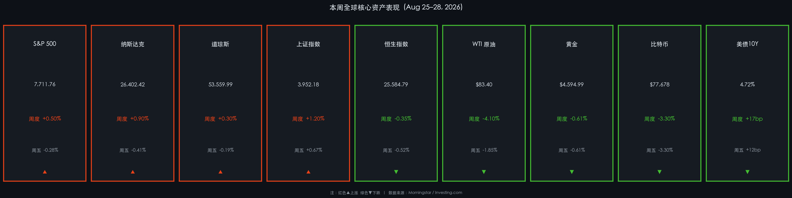

# 🌐 全球市场周末复盘简报

**日期：2026年08月31日 (星期日)** &nbsp; **时段：早报（周末复盘）**

> **核心摘要**：Nvidia 财报超预期点燃 AI 行情，推动本周美股整体小幅收涨；但美联储主席 Warsh 在杰克逊霍尔发表鹰派讲话，9月加息概率骤升至60%，重挫大宗商品与加密货币，美债10年期收益率升至4.72%，多空博弈高度胶着。A股逆势收涨+1.2%，为技术与AI供应链的结构性机会提供了难得窗口。

---

## 核心资产周度/日度表现回顾

### 🇺🇸 美国股市（周度：小幅收涨，周五受压回落）

* **S&P 500**：收盘 **7,711.76**，本周累计 **+0.50%**，周五单日 **-0.28%**
* **纳斯达克综合**：收盘 **26,402.42**，本周累计 **+0.90%**，周五单日 **-0.41%**
* **道琼斯工业**：收盘 **53,559.99**，本周累计 **+0.30%**，周五单日 **-0.19%**

> **核心解读**：本周美股呈现典型的"过山车"节奏。周三 Nvidia 发布 FY27Q2 业绩，营收高达 **$962 亿**（同比+106%），数据中心营收 $890 亿创历史新高，CEO 黄仁勋宣称 AI 进入"黄金时代"，拉动半导体板块周四大幅冲高；然而周五杰克逊霍尔年会上，联储主席 Warsh 明确表态"通胀改善尚不足够"，市场对9月加息预期从35%骤升至60%，导致科技及周期股承压回落，全周胜率被压缩至微弱正值。AI算力需求拉动（事件）→ 半导体领涨（逻辑），Warsh 鹰派表态（数据）→ 成长股估值承压（逻辑）。

---

### 🇨🇳 中国 A股 & 港股

* **上证综指**：收盘 **3,952.18**，本周累计 **+1.20%**（近两周首次转正），周五单日 **+0.67%**
* **恒生指数**：收盘 **25,584.79**，本周累计 **-0.35%**，周五单日 **-0.52%**

> **核心解读**：A 股延续技术与 AI 供应链结构性行情，本周成功扭转两周连跌局面。科技与 AI 供应链板块为主要拉动力，但市场流动性整体偏紧，新股上市及板块高速轮动制约了指数进一步走高。港股则因美联储鹰派预期升温、人民币汇率及中美贸易摩擦等外部压力，全周小幅走弱。

---

### 🛢️ 大宗商品 & 加密货币

* **WTI 原油**：$83.40/桶，本周 **-4.10%**，周五单日 -1.85%
* **布伦特原油**：$89.31/桶，本周 **-5.00%**
* **黄金**：$4,594.99/盎司，本周 **-0.61%**（此前曾触及 $4,700 附近15周高位）
* **比特币**：$77,678，周五单日 **-3.30%**（周中一度突破 $80,000 高位，ETF净流入创纪录）

> **核心解读**：原油本周重挫逾4%-5%，系霍尔木兹海峡外交进展缓和地缘溢价、叠加 Fed 加息预期压制需求预期的双重打压。黄金从 $4,700 高位回落，美元强势是核心杀手。比特币则经历"冲顶后杀跌"：ETF创纪录净流入一度推升至 $80K+，但 Warsh 鹰派讲话令"降息预期"彻底逆转，带动 BTC 大幅回调。

---

### 📊 债券市场

* **美债10年期收益率**：**4.72%**，本周 **+17bp**，周五单日 +12bp
* **美债2年期收益率**：周五上行超10bp

> **逻辑关联**：Warsh 讲话（事件）→ 短端利率预期大幅上修（数据）→ 2年期美债收益率飙升10bp+，10年期升至4.72%（后果）→ 成长股估值折现率抬升（市场逻辑）→ 纳斯达克/黄金/BTC 同步承压。9月16日 FOMC 会议成为当前最核心的市场锚点。

---

## 过去 48 小时重磅事件深度复盘

### 1. Nvidia FY27Q2 财报（8月26日）

* 营收 $962 亿，同比+106%，超华尔街预期
* 数据中心收入 $890 亿，同比+117%，创历史纪录
* Non-GAAP EPS $2.22，GAAP EPS $2.46，双双超预期
* Q3指引 $1,080 亿，FY28全年预计同比增长70%
* CEO黄仁勋：Vera Rubin 平台需求加速，AI是"生产性、有盈利的"，全产业链进入黄金时代

> 这是 AI 硬件周期的又一次"超级验证"：需求曲线没有放缓，供给侧也在持续扩张。Nvidia的业绩为整个科技产业链（云计算、服务器、电力、冷却）提供了坚实底部支撑。

### 2. 杰克逊霍尔年会：Warsh 鹰派转向（8月28日）

* Warsh 在主旨演讲中明确："除非通胀显著且持续地向目标靠拢，否则我们有进一步工作要做"
* 9月加息概率从35%跳升至**60%**（CME FedWatch）
* 采用"克制式沟通"风格，市场解读为刻意模糊以保留灵活性
* 9月16日 FOMC 会议前，CPI、PCE 数据为最后一道关卡

> Warsh 的讲话标志着美联储在鸽派主导约18个月后首次明确鹰派转向。这不是短期噪音，而是政策框架的潜在重置。

---

## 下周全球宏观大事预警

| 日期 | 事件 | 重要性 |
|------|------|--------|
| 9月1日 (周一) | 美国供应管理协会制造业 PMI (8月) | ⭐⭐⭐ |
| 9月3日 (周三) | 美国 ADP 私人就业报告 | ⭐⭐⭐⭐ |
| 9月4日 (周四) | 欧洲央行利率决议 | ⭐⭐⭐⭐ |
| 9月5日 (周五) | **美国非农就业报告（8月）** | ⭐⭐⭐⭐⭐ |
| 9月5日 (周五) | 美国8月PCE物价指数 | ⭐⭐⭐⭐⭐ |
| 全周 | 中国8月 PMI 数据 | ⭐⭐⭐⭐ |

> **⚠️ 本周市场焦点：** 9月5日非农 & PCE 数据将直接决定 9月16日 FOMC 加息与否。若非农超预期强劲、PCE 偏高，9月加息概率将进一步从60%冲向75%+，届时美股可能面临更大幅度回调。

---

## 顶级机构周末策略内参摘要

### 高盛（Goldman Sachs）
> 中国三季度初 GDP 增速降至约 **4%**，低于官方目标区间 4.5%-5%。7月需求侧弱势比此前更令人担忧，因其波及了此前具有韧性的区域。预计四季度央行将出台 RRR 下调等进一步货币宽松举措，以支撑年度增长目标达成。

### 摩根士丹利（Morgan Stanley）
> 中美关系已进入以"战略竞争"为主轴的新阶段，投资者不宜押注广泛性贸易突破。建议聚焦半导体自给化、供应链重构等结构性趋势，采用**自下而上、个股精选**策略，重点筛选具备可持续增长能力的 AI 基础设施与先进制造公司。

### 中信证券（CITIC Securities）
> A股8月板块轮动速度创历史极端水平，源于持续主题稀缺与中美摩擦等外部压力。建议从"反弹交易"转向**均衡配置**，偏好 PB-ROE 低估值策略与困境反转机会。维持"AI + 能源/化工"哑铃结构，视其为当前市场环境下的弹性担当。

---

## 今日市场情绪：鹰影压顶·AI支柱

> Prompt: A lone lighthouse keeper standing at the edge of a stormy sea made of crashing red candlestick waves, clutching a flickering lantern as two titanic stone figures—one bearing the NVIDIA logo and one bearing the Federal Reserve seal—battle overhead in the thunderclouds. In the background, a small green phoenix rises from the horizon, hinting at next week's hope. Style: cyberpunk

---

> **免责声明：** 本报告内容仅供参考，不构成投资建议。市场存在风险，投资需谨慎。
