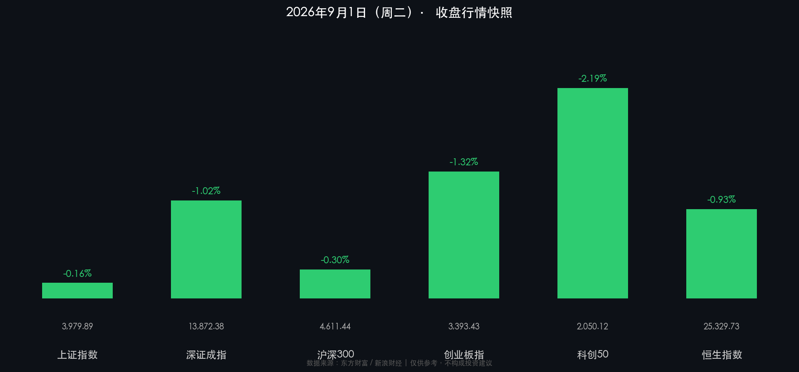

# 📊 A股收盘快报：轮动寻底，农业消费力撑结构性行情

**日期：2026年09月01日 (星期二)** &nbsp; **时段：晚报（国内市场·收盘复盘）**

> **核心摘要**：三大指数集体收跌，上证横盘守稳3980点，创业板与科创50领跌，算力硬件高位退潮；商务部7部门消费扩容政策落地，农业、大消费板块逆势领涨，资金轮动特征显著。市场整体成交2.05万亿、个股3300余只飘红，做多意愿依然坚韧。

---

## 核心行情复盘

### 🇨🇳 A股主要指数

| 指数 | 收盘点位 | 涨跌幅 |
|------|---------|-------|
| **上证指数** | **3,979.89** | **-0.16%** |
| **深证成指** | **13,872.38** | **-1.02%** |
| **沪深300** | **4,611.44** | **-0.30%** |
| **创业板指** | **3,393.43** | **-1.32%** |
| **科创50** | **2,050.12** | **-2.19%** |

### 🇭🇰 港股

| 指数 | 收盘点位 | 涨跌幅 |
|------|---------|-------|
| **恒生指数** | **25,329.73** | **-0.93%** |
| **恒生科技指数** | — | **-1.49%** |
| **国企指数** | — | **-0.59%** |

### 📊 量价与资金流向

* **沪深京三市成交额**：约 **2.05万亿元**，较前一交易日 **缩量约934亿元**，但整体仍处高位活跃水平
* **个股表现**：全市场超 **3,300只** 个股飘红，涨停共 **86只**，封板率约93%；连板焦点股：万向德农（6连板）、海鸥住工（7连板）、捷荣技术（6连板）
* **主力净流入板块**：农林牧渔 🔴、非银金融 🔴、医药 🔴、电力公用事业 🔴、一般零售 🔴
* **主力净流出板块**：电子/半导体 🟢（净流出超204亿）、元件 🟢、电力设备 🟢、有色金属 🟢、电池 🟢
* **个股主力净买入首位**：中际旭创；净卖出前列：长鑫科技、东山精密、兆易创新、生益科技

---

## 核心解读与市场逻辑

### 领涨板块：政策驱动的低位防御反攻

> **农业种植板块**大幅领涨，背后逻辑是超强厄尔尼诺预期升温，市场炒作粮食供应扰动主线。神农种业（20CM）、万向德农、新赛股份等多股涨停，板块呈现脉冲式爆发特征。

> **大消费板块**受政策直接催化——商务部等7部门当日联合印发《关于推动商品消费扩容升级的实施意见》，目标到2030年社零总额达60万亿，重点推动汽车、家电、纺织服装等万亿级品类消费。乳业、零售、白酒等方向走强，新华百货、东百集团、古井贡酒涨停。

### 领跌板块：算力硬件资金兑现压力

> **算力硬件（存储芯片/PCB/CPO）** 集体回调，南亚新材、英诺激光、国瓷材料等跌幅居前，主力资金净流出超200亿。这并非AI周期的终结，而是高位获利盘在政策催化的消费板块兑现、再轮动至软件应用端（AI短剧、传媒）。摩根大通亦将此次回调定性为"健康的板块轮动"。

### 关键宏观背景

* **8月制造业PMI 49.8%**（环比+0.6pct），生产指数50.4%、新订单50.6%均重回扩张，新出口订单50.1%显示外需具备韧性；装备制造业51.4%、高技术制造业52.9%持续扩张。
* **10年期国债收益率**：约 **1.687%**，处于历史低位，显示市场对经济仍存弱复苏预期；财政部将于9月4日续发超长期特别国债（20年期，票面利率2.24%）。
* **人民币汇率**（在岸）：**约6.72**，离岸（CNH）在6.71~6.72区间波动，整体保持稳定。
* **光伏装机创历史**：截至7月底，我国光伏装机12.86亿千瓦，**首次超越煤电成为全国第一大电源**。

---

## 政策脉动

* 🏛️ **商务部等7部门**：发布《关于推动商品消费扩容升级的实施意见》，目标2030年社零60万亿，重点拉动汽车/家电/纺织服装。（直接影响：大消费板块当日领涨）
* 🤖 **工信部**：开展人工智能应用服务商培育专项行动，通过首购首用、风险补偿推动大模型/智能体/Token服务采购。（逻辑延伸：AI应用端>硬件端成为短期资金偏好）
* 🏦 **人民银行 & 市场监管总局**：自9月1日起禁止非法买卖流通人民币。
* 💱 **中国外汇交易中心**：新修订《离岸人民币外汇业务指引》，自9月1日起实施。
* 🔋 **税收新政**：锂原电池、锂离子蓄电池自9月1日起恢复征收2%消费税（利空电池板块短期情绪）。
* 🌐 **外交**：习近平出席上合组织峰会并提出四点主张，中方将面向成员国建设国际AI应用合作中心。
* 📈 **上市公司半年报**：2026H1全市场净利润3.58万亿，**同比增长19.5%**，盈利修复提供基本面支撑。
* 🏗️ **国务院常务会议**：研究促进招商引资高质量发展，强调优化营商环境。

---

## 最新机构观点

> **摩根大通** 维持中国股票**超配**评级，沪深300年底目标点位 **5,200点**（悲观情景4,000点）。认为此次算力硬件回调是健康的板块轮动，AI仍是下半年核心主线；外资最关注国内增量政策落地节奏。

> **瑞银** 认为A股正进入修复重估新阶段，当前更看好A股（资金面相对充裕），建议重新买入科技股，采取"哑铃型"配置：有色板块 + 出海主题 + 银行股。

> **中信证券** 策略强调"AI+能化"杠铃结构，聚焦AI液冷、测试设备、消费电子新品；在快速轮动环境下回归业绩支撑品种估值修复，短期看好物流政策落地红利。综合券商：9月作为政策落地验证期，维持均衡配置基调，关注红利+AI+创新药三条主线。

---

## 今日市场情绪：轮动寻底，消费农业逆势接棒

> Prompt: A colossal jade millstone grinding silicon chips into green rice seedlings, glowing circuit traces flow down through ancient Chinese terraced fields into a digital trading screen, teal and crimson data streams swirl in the mist below, surreal scale contrast, vivid colors

---

> **免责声明**：内容仅供参考，不构成投资建议。市场有风险，投资需谨慎。数据来源：东方财富、新浪财经、国家统计局等公开渠道。
