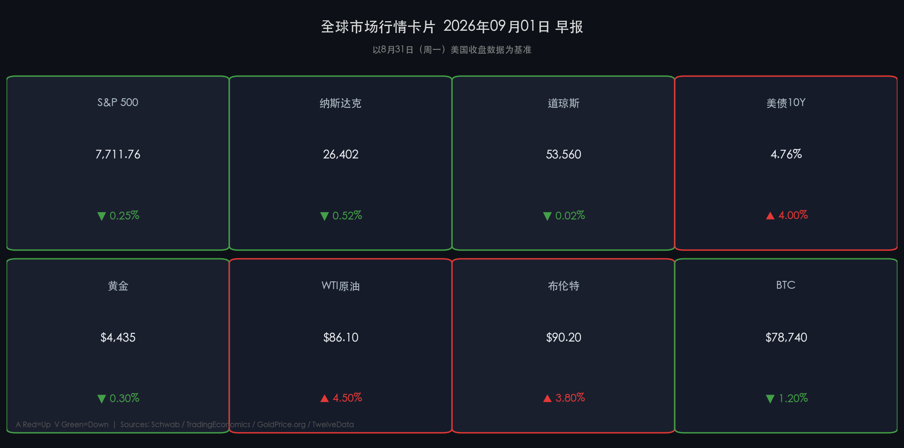

# 🌐 全球市场早报

**日期：2026年09月01日 (星期二)** &nbsp; **时段：早报（国际市场）**

> **核心摘要**：美伊冲突骤然升级——美军对霍尔木兹岛礁实施精准打击，布伦特原油强势收复90美元关口，全球地缘溢价重新定价；与此同时，美联储主席 Warsh 杰克逊霍尔讲话持续发酵，9月加息概率升至60%，美债10年期收益率突破4.76%，压制科技股估值，三大指数全线微跌。"油价战"与"加息博弈"成为本周最核心的两条主线。

---

## 核心行情复盘

### 🇺🇸 美国股市（8月31日周一收盘）

* **S&P 500**：收盘 **7,711.76**，**-0.25%**（-19.23点）
* **纳斯达克综合**：收盘 **26,402.42**，**-0.52%**（-138.93点）
* **道琼斯工业**：收盘 **53,559.99**，**-0.02%**（-9.45点）

> **核心解读**：三大指数低位震荡收跌，分化明显——科技成长（纳斯达克-0.52%）跑输价值蓝筹（道指-0.02%），符合"加息预期升温 → 高估值成长股承压"的经典逻辑。能源板块是全天最亮眼的赢家，大幅跑赢大盘，美伊冲突引发的原油飙升（WTI+4.5%）直接驱动埃克森美孚、雪佛龙等个股走强。整体来看，市场处于"双重压力"叠加态：地缘风险溢价↑（利空成长）+ 通胀再燃预期↑（利空债券与科技）。

---

### 📊 债券市场

* **美债10年期收益率**：**4.76%**（+4bp，升至近18个月高位）
* **美债2年期收益率**：**4.95%**（+3bp）

> **逻辑关联**：Warsh 杰克逊霍尔演讲（事件）→ 市场对9月16日FOMC加息概率从35%骤升至60%（数据）→ 短端2年期美债率飙升（后果）→ 美债收益率曲线倒挂加深 → 科技股和黄金估值折现率抬升（市场逻辑）。10年期收益率4.76%是2025年1月以来的最高水平，市场正重新定价"higher for longer"路径。

---

### 🛢️ 大宗商品

* **WTI 原油**：**$86.10/桶**，**+4.50%**（+3.70美元）
* **布伦特原油**：**$90.20/桶**，**+3.80%**（+3.30美元）
* **黄金（现货）**：**$4,435/盎司**，**-0.30%**（-13美元）

> **核心解读**：
> * **油价大涨**：驱动因素清晰——美军8月30日对拉腊克岛（霍尔木兹海峡）伊朗火箭发射装置实施打击，伊朗随即反制袭击约旦美军基地。霍尔木兹海峡（全球约1/5原油通道）日均通行船只从历史正常的100+艘骤降至约5艘，"物理封锁"预期重燃。布伦特重新站上90美元，创本轮冲突新高，地缘溢价主导定价。
> * **黄金小幅回落**：美元指数随加息预期走强构成压制，但黄金下跌有限——地缘避险需求形成底部支撑，呈现典型的"美元强 vs 地缘避险"博弈均衡。高盛维持年末$4,900/盎司预测不变。

---

### 💰 加密货币

* **比特币（BTC）**：**$78,740**，**-1.20%**

> **核心解读**：BTC跌至近期震荡区间下沿，加息预期压制风险资产整体情绪，加密市场同步调整。当前$78,000-$80,000区间为短期关键支撑位，ETF持续净流入形成下方承托。

---

## 核心解读与市场逻辑

### 🔑 主线一：霍尔木兹危机——能源重定价

2026年2月爆发的美伊冲突已持续六个月，本次为约一个月以来首次直接军事交火。核心链条：

**美军打击拉腊克岛（8月30日）→ 伊朗报复袭击约旦美军基地 → 霍尔木兹日均通行船5艘（vs历史100+）→ 油轮遭袭确认 → 布伦特+3.8%突破$90 → 全球通胀预期再燃 → 美联储9月加息可能性升至60%**

这条逻辑闭环意味着，即便油价短期因外交斡旋有所回落，"霍尔木兹风险溢价"已成为系统性定价因子，不会在冲突解决前完全消退。

### 🔑 主线二：Warsh 鹰派信号持续发酵

杰克逊霍尔讲话的后续影响正在充分定价：市场隐含路径从"9月暂停+Q4降息"转向"9月加息25bp+维持高利率至2027年Q1"。关键观察：9月16日FOMC利率决议将是下一个市场锚点，届前所有超预期通胀数据（如9月3日PCE、9月5日非农）都可能放大波动。

---

## 政策脉动

* **美联储（Fed）**：主席 Warsh 杰克逊霍尔讲话明确"通胀改善不足，政策尚有工作要做"，拒绝提供前瞻指引，9月16日FOMC加息概率达60%。
* **美国财政部**：能源价格飙升引发通胀忧虑，财政部官员暗示关注战略石油储备（SPR）释放可能性，但尚无官方声明。
* **伊朗与OPEC+**：伊朗冻结对OPEC+产量配合，中东产油国局势持续动荡，市场担忧沙特等国立场转变对供给端影响。

---

## 最新机构观点

> **摩根大通（JPMorgan）**：维持S&P 500年末目标价 **8,000点**，强调"AI资本开支超级周期"仍是最大驱动力，但警告市场"动量因子拥挤"，需防范非线性波动风险，建议适当向能源与防御板块分散。

> **高盛（Goldman Sachs）**：维持美国GDP增速2.6%预测，看好"牛市扩散"（超大市值外的普通股盈利改善）。商品策略维持年末金价$4,900/盎司，黄金多头的核心论据是全球央行持续增持、对冲地缘与金融系统风险。

> **摩根士丹利（Morgan Stanley）**：建议全球股票均衡配置（美股+欧股+亚股），私募市场（PE/信用）已成投资"对话中心"。对Warsh鹰派信号持谨慎态度，认为若9月真实加息，Q4市场波动将大于当前预期。

---

## 今日市场情绪：石巨人博弈，利剑悬于霍尔木兹

> Prompt: Two stone giants locked in cosmic struggle above a stormy sea made of red candlestick charts. In the background, an oil tanker navigates a narrow strait between walls of flame. On the horizon, a giant hourglass drains black crude oil onto a trembling golden scale. Dramatic chiaroscuro lighting, sense of imminent tension.

---

*免责声明：内容仅供参考，不构成投资建议。*
