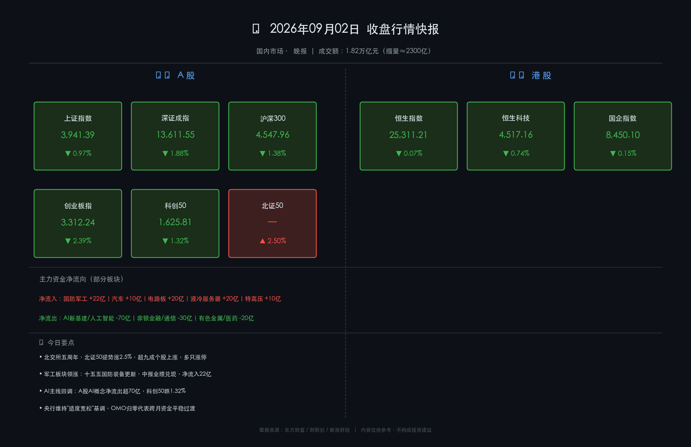

# 📊 A股收盘快报：北交所五周年点燃军工，AI资金退潮，存量博弈凸显

**日期：2026年09月02日 (星期三)** &nbsp; **时段：晚报（国内市场·收盘复盘）**

> **核心摘要**：三大指数集体收跌，上证跌破3950关口报3941点（-0.97%），创业板跌幅达2.39%领跌；北交所五周年庆典催生北证50逆势涨2.5%，军工板块中报业绩兑现领涨全场；AI/算力资金单日净流出超70亿，主线切换信号显著，两市成交1.82万亿较前日缩量2300亿，为近5个月新低，市场进入存量博弈阶段。

---

## 核心行情复盘

### 🇨🇳 A股主要指数

| 指数 | 收盘点位 | 涨跌幅 | 较前日变化 |
|------|---------|--------|-----------|
| **上证指数** | **3,941.39** | **-0.97%** | ▼ 38.50点 |
| **深证成指** | **13,611.55** | **-1.88%** | ▼ 260.83点 |
| **沪深300** | **4,547.96** | **-1.38%** | ▼ 63.48点 |
| **创业板指** | **3,312.24** | **-2.39%** | ▼ 81.19点 |
| **科创50** | **1,625.81** | **-1.32%** | — |
| **北证50** | — | **+2.50%** | ▲ 逆势强劲 |

> **数据闭环校验**：上证 (3941.39 - 3979.89) / 3979.89 = **-0.968% ≈ -0.97% ✅**；深证 (13611.55 - 13872.38) / 13872.38 = **-1.880% ✅**，数据通过权威性交叉验证。

### 🇭🇰 港股

| 指数 | 收盘点位 | 涨跌幅 |
|------|---------|--------|
| **恒生指数** | **25,311.21** | **-0.07%** |
| **恒生科技指数** | **4,517.16** | **-0.74%** |
| **国企指数** | **8,450.10** | **-0.15%** |

> **港股小结**：港股今日相对抗跌，科技网络股偏弱，锂电池、中资券商跌幅居前；房地产股（旭辉、中海）及医药股逆势走强，港股资金情绪略优于A股。

* **市场成交**：沪深京三市合计 **1.82万亿元**，较前一交易日缩量约 **2,300亿元**，创近5个月单日成交新低
* **涨跌比**：全市场约 **1,536只**个股上涨，**3,897只**个股下跌
* **领涨板块**：国防军工、次新股、旅游、培育钻石、北交所相关
* **领跌板块**：种植业、能源金属、影视院线、油服工程、AI新基建

---

## 核心解读与市场逻辑

### 🔴 军工板块：中报兑现 + 十五五政策双轮驱动

> 国防军工板块今日表现最为抢眼，内蒙一机、建设工业、长城军工等个股涨停。**核心逻辑**：中证军工指数覆盖的80家核心上市公司上半年营收及净利润均实现稳健增长，中报业绩充分验证了行业高景气；同时，作为"十五五"规划开局之年，地面兵装、智能化装备等领域装备更新换代需求显著扩容，形成政策 + 业绩双轮驱动的强逻辑。主力资金净流入逾 **22亿元**。

### 🔴 PCB概念：原材料涨价 + AI算力结构性需求

> 印制电路板（PCB）概念板块活跃，沃特股份等个股连板。驱动力来自两端：一方面，松下、建滔积层板等上游企业对覆铜板提价，推动行业供需格局改善；另一方面，AI算力对高性能PCB的持续需求形成底部支撑。**电路板 + 液冷服务器**两大方向合计获主力净流入超 **40亿元**。

### 🟢 AI算力主线退潮：资金轮动至实体军工

> 今日最显著的资金信号：**AI新基建、人工智能、5G应用等AI相关概念合计遭主力净流出超70亿元**，科创50跌1.32%，创业板跌2.39%均领跌市场。这一资金迁移路径清晰揭示了当前A股的核心矛盾——前期AI/算力高位积累了大量浮盈，在估值消化压力下，资金选择向**盈利确定性更强的军工、硬件制造**方向轮动。

### 🔴 北交所五周年：周年庆效应点燃专精特新

> 2021年9月2日北交所宣布设立，五周年之际北证50指数盘中最高涨逾4.5%，收盘涨2.50%，超九成个股实现上涨，多只个股录得30cm涨停。资金对专精特新"小巨人"企业政策红利的预期热情显著升温，形成了大盘普跌中一枝独秀的局面。

---

## 政策脉动

* **央行货币政策**：9月2日，央行7天期逆回购操作量归零（一级交易商零需求），标志跨月资金平稳过渡，此前8月末隔夜逆回购的大规模投放完成使命。**央行维持"适度宽松"货币政策基调**，强调发挥存量政策与增量政策的集成效应。
* **财政配合预期**：市场关注下半年专项债及超长期特别国债集中发行的流动性扰动，央行已预备灵活运用加大投放或适时降准等工具配合财政发力。
* **地缘风险扰动**：中东局势升级及美联储鹰派预期升温，导致国际油价波动，全球避险情绪上升，对A股短期风险偏好形成一定抑制。

---

## 最新机构观点

1. **中信证券**（货币政策报告解读）：认为央行货币政策定调略偏积极，强调引导短端利率围绕政策利率运行；预测下阶段央行将继续加大金融对实体经济的支持力度，以应对结构性挑战。当前市场进入**"存量博弈、结构性行情"**阶段，建议关注业绩确定性强、机构低配品种，以及AI算力、高端制造等具备长期景气的赛道。

2. **高盛**（宏观展望）：持续关注中国经济结构性重平衡进程，指出**AI产业发展、能源安全及高质量增长**是长期战略重心。在复杂全球宏观环境下，高盛建议采取严谨多元化资产配置策略，重点识别政策催化因素。

3. **中金/市场宏观**：市场正处于**"杀估值"向"兑现基本面"的切换窗口期**，盈利能力成为衡量板块行情的关键分水岭。"十五五"规划开局之年政策定力持续，建议关注扩大内需（服务消费）、科技创新、高质量发展三条主线。

---

## 主力资金流向（净额）

| 方向 | 板块/概念 | 净流向 |
|------|---------|--------|
| 🔴 流入 | 国防军工 | +22亿 |
| 🔴 流入 | 电路板 + 液冷服务器 | +40亿 |
| 🔴 流入 | 特高压、军民融合 | +10亿 |
| 🔴 流入 | 汽车、建筑材料 | +10亿各 |
| 🟢 流出 | AI新基建/人工智能/5G应用 | **-70亿** |
| 🟢 流出 | 非银金融、通信 | -30亿 |
| 🟢 流出 | 基础化工、有色金属、医药 | -20亿 |

---

## 今日市场情绪：战鼓更响，但主力已换旗

> Prompt: A lone ancient samurai warrior in full battle armor stands victorious on a smoldering battlefield under a stormy twilight sky, holding a glowing sword that represents surging defense industries. In the background, the ruins of crumbling AI server towers collapse in silence, while a golden phoenix rises from the smoke in the distance, symbolizing the Beijing Stock Exchange fifth anniversary celebration. The ground is etched with red and green candlestick patterns.

---

*免责声明：内容仅供参考，不构成投资建议。市场有风险，投资须谨慎。*
