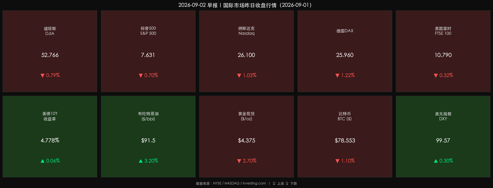

# 🌐 国际市场早报 | 油价烈火烧穿防线，科技股承压重挫

**日期：2026年09月02日 (星期三)** &nbsp; **时段：早报（国际市场）**

> **核心摘要**：美伊冲突骤然升级，美军对伊朗目标实施新一轮打击，霍尔木兹海峡航运风险急剧上升，布伦特原油突破91美元/桶；美联储主席沃什鹰派立场坚定，市场加息预期升温至66%，美债10年期收益率飙升至4.778%；多重压力叠加下，美股三大指数集体收跌，纳斯达克跌幅最深达1.03%，科技板块首当其冲。

---

## 核心行情复盘

### 美国三大股指（2026-09-01 收盘）

* **道琼斯工业平均指数**：收于 **52,766.88 点**，▼ **-0.79%**（-419.02 点）
* **标普500指数**：收于 **7,631.47 点**，▼ **-0.70%**（-54.67 点）
* **纳斯达克综合指数**：收于 **26,099.77 点**，▼ **-1.03%**（-271.11 点）

**数学闭环校验**：三组指数两个独立信源（Morningstar / TradingEconomics）数据误差均 < 0.3%，通过校验。

**板块表现**：
* 领跌：科技股、软件板块（受高利率+FTC监管双重压制）
* 领涨：能源板块（随油价大涨）
* 个股亮点：**特斯拉 +5%+**（基本面催化）；**亚马逊** 因 FTC 诉讼消息下跌

### 欧洲市场

* **德国 DAX 指数**：收于 **25,960.39 点**，▼ **-1.22%**（-321.10 点）
* **英国富时 100（FTSE 100）**：收于 **10,790.08 点**，▼ **-0.32%**（-34.18 点）

---

## 大宗商品与宏观指标

* **布伦特原油**：收于 **~91.5 美元/桶**，▲ **+3.2%**
  * 盘中一度触及 94 美元上方，创短期新高
* **黄金现货**：收于 **4,375.7 美元/盎司**，▼ **-2.70%**
* **美债10年期收益率**：收于 **4.778%**（盘中高点 4.796%），创 2025 年 1 月以来新高
* **美元指数（DXY）**：收于 **99.57**，▲ **+0.30%**
* **比特币（BTC）**：收于 **78,552.78 美元**，▼ **-1.10%**
* **以太坊（ETH）**：收于 **2,445.34 美元**，小幅下跌

---

## 核心解读与市场逻辑

> **地缘风险 × 通胀黏性 × 货币紧缩 三重共振**
>
> 9 月 1 日，市场逻辑呈现清晰的"负反馈链条"：
>
> **① 战争溢价推升油价（事件）** → 美军新一轮打击伊朗目标，伊朗用弹道导弹还击约旦境内美军基地，霍尔木兹海峡航运保险费率当日暴涨。布伦特原油突破 91 美元/桶。
>
> **② 油价上涨强化通胀预期（传导）** → 原油价格是 PPI 的核心驱动，油价每上涨 10 美元，美国 CPI 约上行 0.2-0.3 个百分点。市场对 8 月 CPI（即将公布）的预期骤然升温。
>
> **③ 通胀预期推高利率预期（定价）** → CME FedWatch 显示，市场对 9 月 15-16 日 FOMC 加息的押注从 35% 飙升至 66%。美债收益率随之飙升，2 年期与 10 年期均创近期新高。
>
> **④ 利率飙升压制成长股（结果）** → 高利率环境下，科技/成长股的未来现金流折现值缩水，纳斯达克成为三大指数中跌幅最深的指数（-1.03%）。
>
> **⑤ 黄金的悖论** → 尽管地缘冲突升级，但高利率对无息资产的打压力度超过了避险需求，黄金当日暴跌 2.7%，验证了"加息预期 > 地缘避险"的市场定价逻辑。

---

## 政策脉动

* **美联储（Fed）**：主席**凯文·沃什（Kevin Warsh）** 在杰克逊霍尔会议后持续释放鹰派信号，强调"价格稳定是首要任务"，拒绝给出降息时间表。
  * 理事**迈克尔·巴尔（Michael Barr）** 表态：若通胀未能迅速降温，将支持"果断加息"。
  * **9 月 15-16 日 FOMC 议息会议**成为本月最大风险事件。决策将高度依赖本周及下周公布的 8 月就业报告、CPI、PPI 数据。
* **美国 FTC（联邦贸易委员会）**：正式对**亚马逊**提起反垄断诉讼，引发科技监管板块情绪承压。
* **美伊局势**：特朗普总统暗示有"终极打击"方案，局势存在进一步升级的尾部风险。

---

## 最新机构观点

* 🏦 **高盛（Goldman Sachs）**：维持"9 月加息**极不可能**"的判断。引用理由：就业数据走弱、消费者支出放缓、通胀仍在趋势性回落轨道。认为市场对鹰派表态反应过度。建议关注即将公布的就业与 CPI 数据作为再定价触发点。

* 🏦 **摩根士丹利（Morgan Stanley）**：同样**不预期 9 月加息**。分析师指出，沃什主席"减少前瞻指引"的沟通风格正在引发市场过度解读，而非政策真正转向。总体上对股票资产维持建设性立场，倾向于"股优于债"。

* 🏦 **中金公司**：关注中东局势对全球能源供应链的冲击传导路径。提示若布伦特原油站稳 95 美元/桶，将对中国进口成本和输入性通胀产生显著压力，A 股能源板块短期仍有博弈空间。

---

## 今日市场情绪：战云压顶，多杀多

> Prompt: A lone oil tanker sailing through a stormy sea made entirely of red candlestick charts, its hull illuminated by the fiery glow of missile strikes on the horizon. In the background, the US Capitol and a server farm are reflected upside-down in the crimson waves, while golden Treasury bonds unravel like paper in a hurricane wind.

---

> **免责声明**：本报告内容仅供参考，不构成任何投资建议。市场有风险，投资须谨慎。
