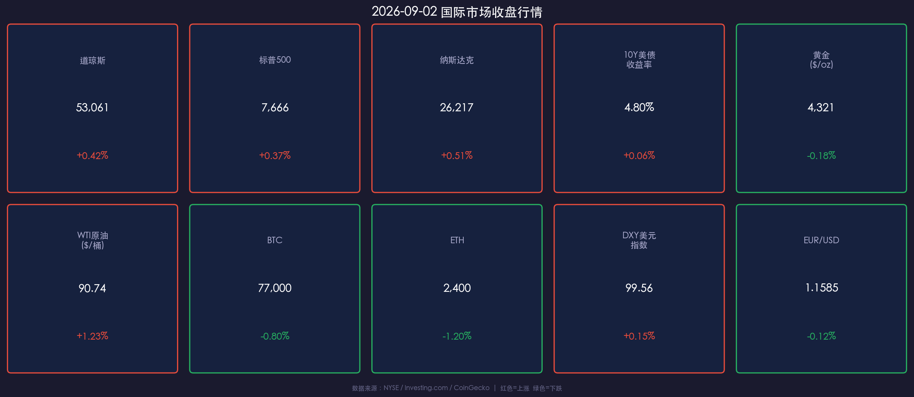
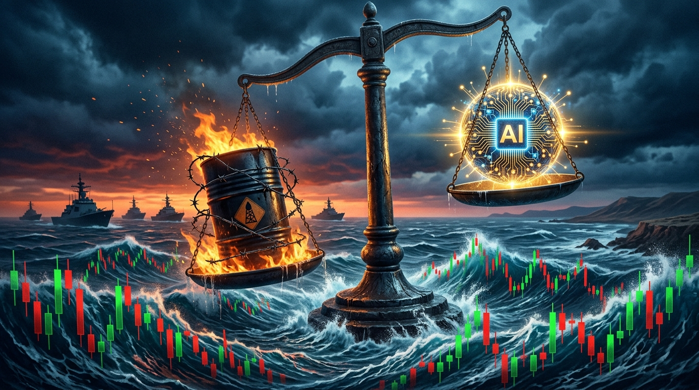

# 🌅 2026年09月03日 全球市场早报

**日期：2026年09月03日 (星期四)** &nbsp; **时段：早报（国际市场）**

> **核心摘要**：美股三大指数昨日（9月2日）全线小幅收涨，AI需求信号提振科技板块；但美伊地缘局势持续升温推动WTI原油突破$90关口，通胀忧虑叠加加息预期（9月FOMC加息概率>60%）压制黄金与加密货币；10年期美债收益率收于4.80%，市场进入"滞胀交叉"敏感区域。

---

## 核心行情复盘

### 🇺🇸 美国股市（2026-09-02 收盘）

* **道琼斯工业平均指数**：**53,061.95** 点 &nbsp;**+0.42%**
* **标普500指数**：**7,666.60** 点 &nbsp;**+0.37%**
* **纳斯达克综合指数**：**26,217.83** 点 &nbsp;**+0.51%**

> **核心解读**：三大指数小幅走高，核心驱动来自科技/AI板块。市场对人工智能基础设施需求的前景保持乐观，抵消了地缘风险带来的情绪压制。纳指领涨反映市场对 AI 相关半导体及超大规模算力企业的持续押注。然而，成交量未见明显放量，多头动能偏谨慎。领涨行业为**信息技术、通讯服务**；领跌行业为**能源板块上游勘探**（受WTI高企后获利回吐影响）、**公用事业**（受债券收益率上升替代效应压制）。

### 📈 核心行情数据卡片

---

### 💵 外汇市场

* **DXY 美元指数**：**99.560** &nbsp;**+0.15%**
* **EUR/USD**：**1.1585** &nbsp;**-0.12%**

> **核心解读**：美元指数小幅走强，主因地缘风险避险情绪与加息预期共同支撑。欧元承压，市场担忧中东能源危机对欧洲经济体的二次冲击（欧洲进口能源依赖度更高）。

---

### 🛢️ 大宗商品

* **WTI 原油**：**$90.74/桶** &nbsp;🔴 **+1.23%** — 创近期多周新高
* **黄金（现货）**：**$4,321/oz** &nbsp;🟢 **-0.18%** — 受债息上升压制

> **核心解读**：WTI 原油突破 $90 关口，核心驱动为**美伊军事对峙升级**——美军对霍尔木兹海峡附近伊朗军事目标实施打击后，伊朗随即反制，海峡过境船只数量已较历史均值明显下降。能源供应中断预期强烈。黄金在油价大涨背景下未能上涨，折射出通胀预期驱动的加息恐慌对黄金形成压制（实际利率上行 → 黄金吸引力下降）。

---

### 🏦 美国国债

* **10年期美债收益率**：**4.80%** &nbsp;🔴 **+0.06 pct** — 盘中高见 4.82%

> **核心解读**：收益率持续高位徘徊，逻辑链为：油价飙升（数据）→ 通胀超预期担忧（事件）→ 市场押注 Fed 9月加息（逻辑）→ 美债抛售、收益率攀升。4.80% 是近期关键心理关口，若 9月11日 CPI 数据超预期，收益率有进一步上行至 5% 的风险。

---

### ₿ 加密货币

* **比特币（BTC）**：**$77,000** &nbsp;🟢 **-0.80%** — 在 $76,800–$81,600 区间横盘震荡
* **以太坊（ETH）**：**$2,400** &nbsp;🟢 **-1.20%** — Rainbow Chart 预测9月积累区间约 $2,551

> **核心解读**：加密市场受宏观压力拖累小幅下行。BTC 连续数日于 $77,000 附近形成支撑，当前处于多空拉锯阶段；ETH 跌破彩虹图预测的积累价位，短期情绪偏弱。两者均受 10Y 美债收益率高企（风险资产整体承压）以及地缘风险情绪拖累。

---

## 核心解读与市场逻辑

> 当前市场正处于**"AI 牛市叙事 vs 滞胀风险"的关键博弈节点**。多头依赖科技企业持续超预期的盈利增长，而空头则指向通胀黏性回升 + 能源价格外生冲击构成的双重威胁。核心矛盾在于：若 Fed 在 9 月 FOMC 真的启动新一轮加息，高估值科技股将面临折现率上升的估值重压。历史上，加息初期科技股往往先跌后稳，关键看盈利增速能否覆盖利率成本。

**数据-事件-逻辑 核心链路梳理：**
* 🔗 **能源冲击链**：美伊军事对峙 → 霍尔木兹海峡风险溢价 → WTI $90+ → CPI 上行压力 → Fed 被动收紧 → 美债收益率飙升 → 科技股估值承压
* 🔗 **AI 对冲链**：AI 需求信号强劲 → 科技股盈利预期上调 → 纳指小涨 → 部分对冲利率上行的负面影响

---

## 政策脉动

**🏛️ 美联储（Fed）**
* **当前利率区间**：3.50%–3.75%（7月会议维持，但投票为 9-3，鹰派异见票数增加）
* **下一次 FOMC 会议**：2026年9月15-16日，将同步发布最新"点阵图"（SEP）
* **加息概率**：杰克逊霍尔会议后市场定价 9 月加息概率 **>60%**；CommBank 等机构已将加息纳入基准预测，并预计 12月及2027年3月将续加
* **关键数据节点**：⚠️ **9月11日 CPI** 为最重要的决策参考指标，将直接左右 Fed 最终表决

---

## 最新机构观点

**🏦 高盛（Goldman Sachs）**
> 短期（3个月）对各类资产保持**战术性中性**，但12个月维度维持**温和亲风险立场**，看好股票优于信用和债券。认为当前市场为"扩散型牛市"——AI 领涨股带动已向更广泛板块扩散。黄金目标价上调至 **$4,900/盎司**（年底前），核心逻辑为央行持续增储对冲地缘与金融风险。关注：AI/数据中心电力需求周期、美国中期选举前财政政策演变。

**🏦 摩根士丹利（Morgan Stanley）**
> 定性当前多头行情为"建设性、非自满性"。支撑来自 AI 资本支出周期从主题演化为企业盈利基本面驱动力。建议**美/欧/亚均衡配置**，而非押注单一美国市场；偏好工业、超大规模算力、金融、消费可选。对信用市场持谨慎立场——AI 基建债务大量发行可能引发供给压力，迫使投资者要求更高回报。

---

## 今日市场情绪：能源 vs AI 的天平危局

> Prompt: A dramatic surrealist financial illustration. In the foreground, a massive ancient balance scale stands in a stormy sea. On one side of the scale, a glowing AI neural network orb radiates gold light, representing the tech bull market. On the other side, a black oil barrel wrapped in barbed wire and flames sits heavily, tilting the scale dangerously. In the turbulent ocean below, the waves are formed by red and green candlestick chart patterns. In the far background (background only), the Strait of Hormuz is visible with dark storm clouds and warships silhouetted against a blood-orange horizon. The overall mood is tense, high-stakes, and epic. Cinematic lighting, deep blue and orange color palette, ultra-detailed digital art style.

---

*免责声明：内容仅供参考，不构成投资建议。*
