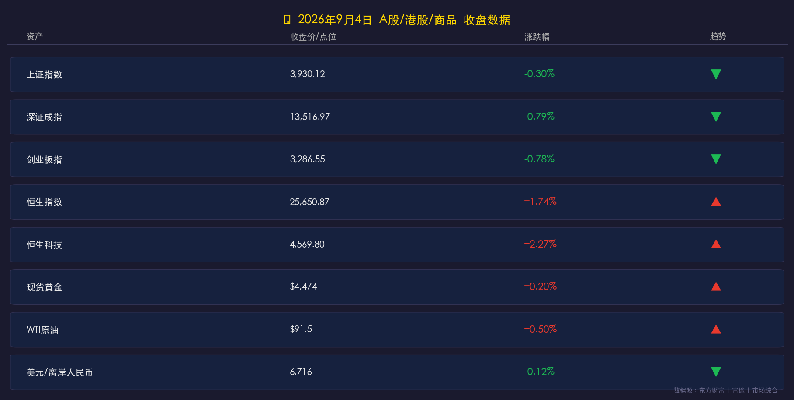

# 金融简报 | 2026年9月4日 A股·港股·商品 收盘复盘

**日期：2026年09月04日 (星期五)** &nbsp; **时段：晚报（16:30 收盘后）**

> **核心摘要**：A股今日高开低走，三大指数全线收跌，资金大规模由高位科技赛道切换至农业、地产、白酒等防御板块；港股则逆势走强，恒生指数大涨1.74%，恒生科技指数涨2.27%，AI应用股表现抢眼；外部环境方面，黄金维稳高位4474美元，WTI原油稳守91美元上方，离岸人民币小幅走强至6.716附近。

---

## 核心行情复盘

### A 股三大指数

* **上证指数**：**3,930.12 点**，跌 **-0.30%**
* **深证成指**：**13,516.97 点**，跌 **-0.79%**
* **创业板指**：**3,286.55 点**，跌 **-0.78%**

> 市场呈现"高开低走、冲高回落"走势。早盘一度高开，午后集体翻绿收跌。两市合计成交额达 **2.03 万亿元**，较前一交易日大幅放量约 **2,718 亿元**，成交量的大幅扩张反映了多空双方的剧烈博弈与筹码换手。

### 港股

* **恒生指数**：**25,650.87 点**，涨 **+1.74%**（+437.56 点）
* **恒生科技指数**：**4,569.80 点**，涨 **+2.27%**
* **国企指数（H股）**：涨 **+2.02%**

> 港股与 A 股今日形成罕见的"跷跷板"效应。在 A 股科技赛道承压的同时，南下及外资资金借助港股较低的估值优势，集中涌入科技网络股，AI 应用概念股表现尤为亮眼。港股当日走势印证了机构对中国 AI 应用落地的持续看好。

---

## 核心解读与市场逻辑

### 📌 科技赛道高位回调的三重逻辑

> **第一重：获利兑现压力**。8 月以来，AI、半导体等科技赛道累积了较大的阶段性涨幅，周五市场触发了机构及游资的集中止盈离场，科创 50 指数成分股（半导体设备、存储芯片、算力硬件）成为拖累指数的核心力量。
>
> **第二重：外部利率扰动**。美联储议息会议临近，市场对美债收益率的潜在波动保持高度敏感。外资在美债利率风险尚未出清的背景下，对高估值成长板块形成了一定压制，北向资金日内情绪偏向谨慎。
>
> **第三重：资金风格"高低切换"**。主力资金在高位止盈后，选择流入农林牧渔（猪肉养殖）、房地产、白酒（大消费）、银行等低位防御板块，形成了明显的"跷跷板"效应，一定程度上支撑了沪指不深跌。

### 📌 "金九"预期下的结构性轮动

> 当日放量下跌并不代表系统性风险，而是市场在"金九银十"季节性预期下，资金主动进行结构调仓的体现。成长与价值的切换，正是市场从"情绪驱动"向"业绩驱动"转型的典型信号。

---

## 板块轮动详情

**领涨板块** 🔴（资金流入，防御承接）：
* 农林牧渔（猪肉概念、养殖板块）
* 房地产、建材
* 白酒（大消费）
* 银行、保险（高分红）
* 文化传媒

**领跌板块** 🟢（获利兑现，资金流出）：
* 半导体、存储芯片
* 算力硬件（AI 服务器、PCB）
* 光模块、CPO
* 科创 50 指数成分股整体

---

## 商品与汇率

* **现货黄金**：**$4,474 /盎司**，小幅走强 **+0.20%**
* **WTI 原油**：**$91.5 /桶**，小涨 **+0.50%**（布伦特约 $95.5）
* **美元/离岸人民币（USD/CNH）**：**6.716**，人民币小幅升值 **-0.12%**

> **黄金**在美元走弱、美债收益率下行及中东地缘政治风险持续升温的多重支撑下，维持高位强势。**原油**受美伊地缘冲突升级及霍尔木兹海峡航运风险推动，继续在高位区间运行。**人民币**则受国内政策托底与外资谨慎情绪之间拉锯，维持在 6.71-6.72 的区间窄幅震荡。

---

## 政策脉动

* 🏦 **央行（PBOC）**：行长潘功胜在 G20 财长央行行长会议上重申，中国将持续推进货币政策框架转型，坚持"**适度宽松**"的政策基调，综合运用逆回购、国债买卖等工具保持流动性充裕。明确下半年将进一步加大逆周期调节力度，适时推出增量政策。
* 🏛️ **发改委**：9月2日召开会议，研究完善"六张网"重大项目政银企协作机制，强调"投贷联动"，鼓励多元主体参与。专项债及超长期特别国债进入发行高峰期，财金协同稳增长格局明确。
* 📋 **证监会**：多部门联合制定的《**金融产品网络营销管理办法**》将于 **2026年9月30日** 正式实施，规范金融产品网络营销，保护消费者与投资者权益。
* 🏠 **房地产信贷**：央行与金融监管总局联合印发《关于改革完善房地产信贷管理的意见》，优化商品房开发贷款与个人住房贷款制度，满足合理信贷需求，托底楼市。

---

## 最新机构观点

**中信证券**：强调科技板块"再平衡"策略。AI 及硬科技板块（半导体设备、国产存储）尽管面临估值压制，但强劲的业绩表现支撑了核心逻辑。建议投资者从"涨价叙事"回归到"盈利兑现"，关注 AI 重构商业模式带来的长线机会。

**中金公司**：建议9月行业配置紧扣"景气线索"，把握结构性机会。特别看好在 AI 算力集群持续扩容背景下，**光通信、散热**等细分赛道的确定性成长机会。

**摩根大通（张晓宁策略团队）**：继续超配中国股票。认为 AI 硬件供给约束将持续，当前科技板块回调属于"AI 周期内健康的结构性轮动"，不改变年底沪深300目标位的积极看法，维持超配。

---

## 今日市场情绪：筹码大挪移，港股超车

> Prompt: A giant golden scales balanced on the tip of a glowing circuit board. On one side, towering silicon chips and server racks are crumbling and sliding off into darkness; on the other side, wheat, piglets, and bank pillars are piling up, glowing softly green. In the background, the neon skyline of Hong Kong blazes upward in red defiance. Dramatic chiaroscuro lighting, cinematic realism, hyperdetailed.

---

> 免责声明：内容仅供参考，不构成投资建议。
