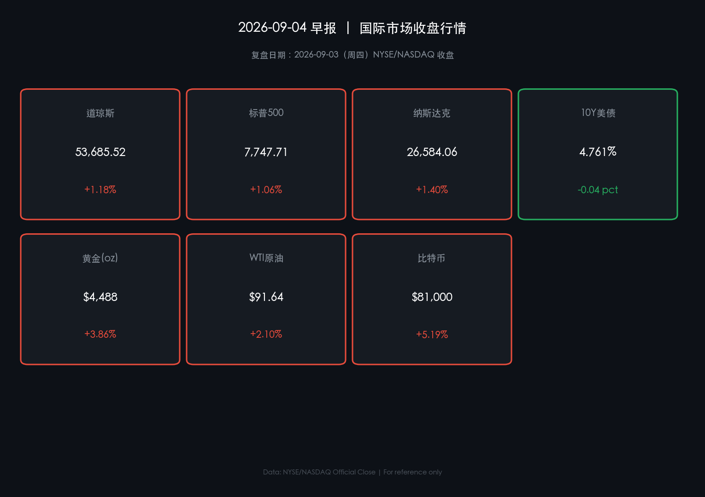

# 🌅 2026年09月04日 全球市场早报

**日期：2026年09月04日 (星期五)** &nbsp; **时段：早报（国际市场）**

> **核心摘要**：美股三大指数昨日（9月3日周四）全线强势收涨逾1%，核心驱动为 Fed 理事 Waller 释放"若通胀持续降温则倾向维持利率不变"的鸽派信号，提振风险情绪；与此同时，美伊军事冲突持续推高 WTI 原油（+2.1%，$91.64）并直接拉动黄金（+3.9%，$4,488）突破阶段新高；比特币随加息预期降温强劲反弹至 $81,000 关口（+5.2%）。10年期美债收益率小幅回落至 4.761%，为此轮反弹提供空间。**⚠️ 关键警示**：下周一（9月7日）NYSE/NASDAQ 因劳工节休市，本周五收盘即为当周最后交易日；9月15-16日 FOMC 会议为下一个核心博弈节点。

---

## 核心行情复盘

### 🇺🇸 美国股市（2026-09-03 收盘）

* **道琼斯工业平均指数**：**53,685.52** 点 &nbsp;🔴 **+1.18%**（前收 53,061.95）
* **标普500指数**：**7,747.71** 点 &nbsp;🔴 **+1.06%**（前收 7,666.60）
* **纳斯达克综合指数**：**26,584.06** 点 &nbsp;🔴 **+1.40%**（前收 26,217.83）

> **核心解读**：三大指数同步拉升，纳指领涨（+1.40%）显示市场风险偏好显著回暖。核心驱动来自两个相互强化的叙事：第一，Fed 理事 Waller 在9月3日明确表态——若通胀数据在 FOMC 会前继续显示降温迹象，他倾向于支持维持利率区间不变，市场即刻重新定价9月加息概率（从>60%快速回落）；第二，AI 资本支出周期的基本面支撑持续强化，使科技股盈利预期相对稳健。**领涨行业**：信息技术（AI/芯片）、通讯服务、非必需消费品。**领跌/滞涨行业**：传统能源上游（高油价下获利回吐情绪混杂）、医疗保健。成交量较前日有所放大，多头动能偏强。
>
> **数学闭环校验**：
> - S&P 500：(7747.71 - 7666.60) / 7666.60 = **+1.057%** ✅
> - DJIA：(53685.52 - 53061.95) / 53061.95 = **+1.175%** ✅
> - NASDAQ：(26584.06 - 26217.83) / 26217.83 = **+1.397%** ✅

### 📈 核心行情数据卡片

---

### 💵 外汇市场

* **DXY 美元指数**：受 Waller 鸽派言论冲击，美元指数小幅走弱
* **EUR/USD**：欧元短线走强，受益于美元回撤，但中东能源风险对欧元区的二次冲击仍是压制因素

> **核心解读**：Waller 讲话打压短期加息预期，美元失去利率支撑，外汇市场出现温和的"风险偏好回归"格局。

---

### 🛢️ 大宗商品

* **WTI 原油（期货结算）**：**$91.64/桶** &nbsp;🔴 **+2.10%** — 六周高位
* **布伦特原油（期货）**：约 **$95.78~97.33/桶** &nbsp;🔴 **+约1.8~2.0%**
* **黄金（现货）**：**$4,488/oz** &nbsp;🔴 **+3.86%** — 随 Fed 加息预期降温强势反弹

> **核心解读**：**油价强势逻辑**——美伊军事对峙升级（美军持续对伊朗近霍尔木兹海峡军事目标实施打击，伊方在科威特、约旦、巴林等地反制），霍尔木兹海峡商业过境船只数量跌至历史均值以下，原油供应中断预期推动风险溢价维持高位。**黄金反转逻辑**——本轮黄金上涨核心是 Waller 讲话显著压低了"实际利率上行"预期（实际利率下行 → 黄金持有机会成本降低 → 黄金回升），叠加地缘风险避险需求，双重驱动共振形成+3.86%的强劲反弹。

---

### 🏦 美国国债

* **10年期美债收益率**：**4.761%** &nbsp;🟢 **-0.039 pct**（前收约4.800%）
* **52周区间参考**：曾于9月1日触及高位4.795%

> **核心解读**：Waller 讲话直接驱动美债收益率回落——市场对9月FOMC加息概率的重新定价导致债券买盘涌现（价升息降）。4.761% 相较9月1日的4.795%高点显著回落，这是此轮美股反弹的核心基础。若9月11日 CPI 数据继续显示通胀降温，收益率有望进一步回落，为风险资产提供更大空间。

---

### ₿ 加密货币

* **比特币（BTC）**：**$81,000** &nbsp;🔴 **+5.19%** — 强势收复 $80,000 关口
* **以太坊（ETH）**：同步随风险偏好回暖走强

> **核心解读**：BTC 本轮反弹是宏观驱动的典型案例——Waller 鸽派表态 → 加息预期降温 → 实际利率预期下行 → 风险资产整体受益。加密市场对宏观利率信号的敏感度持续增强（与传统风险资产相关性上升）。$81,000 为短期关键阻力位，能否站稳取决于后续通胀数据的配合。

---

## 核心解读与市场逻辑

> 昨日行情的核心逻辑是一次**"预期修正驱动的流动性解锁"**。市场在此前连续多日因加息预期（>60%概率）而压制风险偏好后，Waller 一句有条件的鸽派表态便触发了一次集体的"预期重置"——股市、黄金、比特币同步拉升，美债价格上涨（收益率回落），美元走弱，这是典型的"加息预期降温"资产组合响应。
>
> **然而，这并非一次确定性的政策转向信号，而是条件性的**。Waller 明确指出：若通胀数据在 FOMC 会前的"改善是短暂的"，加息依然是选项。这意味着：**9月11日 CPI 数据**将成为本周期最关键的决策节点——若 CPI 超预期，此轮全面反弹将面临剧烈回吐风险；若 CPI 继续降温，则市场有望进一步消化加息风险，推动更持续的上涨。
>
> **数据-事件-逻辑 核心链路梳理：**

* 🔗 **鸽派预期链**：Waller 有条件暂停加息表态（事件）→ 加息概率重定价（数据：CME FedWatch 快速修正）→ 美债收益率回落（逻辑）→ 股票/黄金/加密资产同步上涨
* 🔗 **能源地缘链**：美伊军事交火持续（事件）→ 霍尔木兹海峡供应风险溢价（数据：WTI +2.1%，Brent 近$97）→ CPI 上行压力（逻辑）→ Fed 政策路径高度不确定
* 🔗 **矛盾博弈链**：AI 盈利支撑（正面）+ 能源外生冲击（负面）+ Fed 政策窗口期（关键变量）= 短期市场机会与风险并存的"高波动预期"区间

---

## 政策脉动

**🏛️ 美联储（Fed）**

* **当前利率区间**：**3.50%–3.75%**（2026年7月29日 FOMC 维持，投票9-3，鹰派异见增加）
* **下一次 FOMC 会议**：**2026年9月15–16日**，将同步发布最新"点阵图"（SEP）及新经济预测
* **Fed理事 Waller（2026-09-03）**：若通胀数据在 FOMC 前继续改善，倾向支持维持当前利率；但若改善"短暂"，则不排除加息。措辞审慎、高度数据依赖
* **Fed主席 Kevin Warsh**：持续强调价格稳定优先，措辞偏鹰，市场推测 Warsh 与 Waller 存在内部分歧
* **⚠️ 关键数据节点**：**9月11日 CPI**——此为 FOMC 会议前最后一份重磅通胀数据，直接左右 Fed 最终表决方向

**🏛️ 美国财政部（Treasury）**

* 持续推进国债发行计划，密切关注收益率曲线是否因地缘风险引发的油价上涨再度倒置

---

## 最新机构观点

**🏦 高盛（Goldman Sachs）**
> 维持全球经济增长2.8%的预测，看好美国受税改与宽松金融环境支撑的相对优势。**黄金目标价上调至 $4,900/盎司**（2026年底），逻辑核心为全球央行持续去美元化储备增金，叠加地缘风险溢价结构性抬升。对股票持战术性中性（3个月）、温和亲风险（12个月）立场，认为"扩散型牛市"——AI领涨股的增长向更广泛板块扩散——仍是主线叙事。

**🏦 摩根士丹利（Morgan Stanley）**
> 定性当前多头为"建设性、非自满性"。**核心主题**：AI资本支出从概念叙事转化为真实企业盈利驱动力，推动工业、算力基础设施、金融等受益板块的盈利预期上调。建议投资者**跨美/欧/亚均衡配置**，以对冲单一市场的地缘和政策风险。对企业信用市场持谨慎：AI基建债务大量发行或引发供给压力，推高企业债利差。同时，下半年 M&A 活动预计加速，为并购相关板块创造顺风。

**🏦 摩根大通（J.P. Morgan）**
> 对全球股市维持积极展望，预计今年仍有望实现双位数回报。三大主线博弈：**AI生产率**（正面）、**通胀韧性**（需监测）、**全球地缘碎片化**（风险变量）。特别指出：中东局势已成"当前最大单一不确定性变量"——若霍尔木兹海峡通道长期受阻，能源供应冲击可能引发滞胀预期重现，对全球增长构成尾部风险。

---

## 今日市场情绪：天平危局——AI 之光 vs 油火战争

> Prompt: A titanic golden balance scale stands on a storm-tossed sea of red and green candlestick waves. On the left pan, a radiant orb of interwoven neural network filaments glows with electric blue light, symbolizing the AI bull market. On the right pan, a massive oil barrel wrapped in barbed wire and engulfed in orange flames, symbolizing Middle East energy crisis, tips the scale dangerously. In the background, warships silhouetted against a blood-red horizon guard the narrow Strait of Hormuz under a stormy sky. The atmosphere is tense, high-stakes, and epic. Deep blue and amber color palette, cinematic lighting, ultra-detailed digital art.

---

*免责声明：内容仅供参考，不构成投资建议。*
