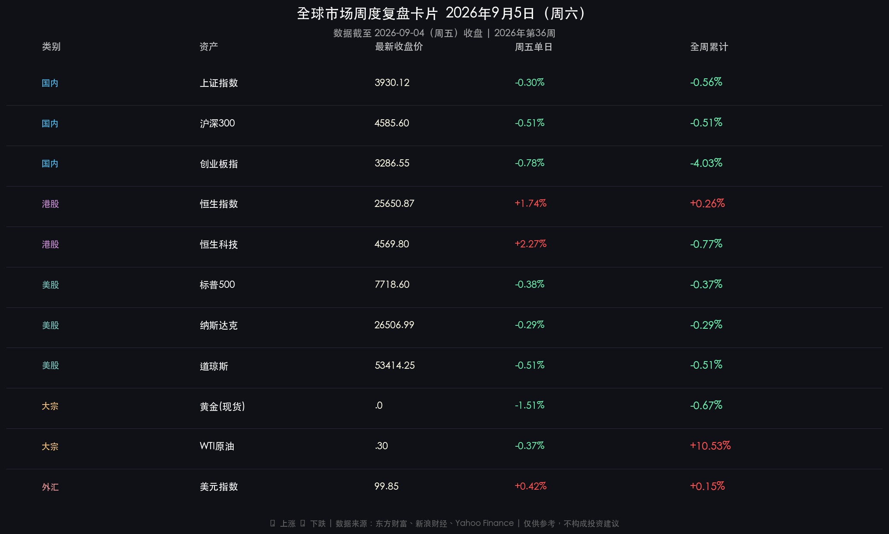

# 全球市场周末复盘·2026年第36周

**日期：2026年09月05日 (星期六)** &nbsp; **时段：周末复盘（模式 B）**

> **核心摘要**：本周（第36周）全球市场上演剧烈的“宏观数据冲撞与风格大迁徙”——周五公布的美国8月非农就业新增16.2万人远超预期，瞬间浇灭短期降息幻想并重新推高9月加息预期，美债收益率反弹至4.780%，美股三大指数承压回调，黄金单日跌破4420美元；国内市场呈现鲜明的结构性调仓，A股资金从高位半导体与算力硬件集中获利了结，大举回流农林牧渔、地产与大消费防御板块，两市成交额放量突破2万亿元；而港股展现估值韧性，恒生科技单日大涨+2.27%，AI应用端龙头受资金抢筹。

---

## 核心资产周度/日度表现回顾

### 🇨🇳 A股市场

* **上证指数**：收报 **3,930.12 点**，周五单日 **-0.30%**，**全周累计 -0.56%**
* **沪深300**：收报 **4,585.60 点**，周五单日 **-0.51%**，全周累计 **-0.51%**
* **创业板指**：收报 **3,286.55 点**，周五单日 **-0.78%**，**全周累计 -4.03%**
* **深证成指**：收报 **13,516.97 点**，周五单日 **-0.79%**，全周累计 **-1.62%**
* **成交量能**：周五两市成交额达 **2.03 万亿元**（放量逾2700亿元），全周日均成交额维持在1.9万亿元以上。

> **核心解读**：A股本周呈现出强烈的“高低切换与筹码换手”特征。8月以来累积丰厚涨幅的科创50与成长赛道（半导体芯片、光模块、AI服务器）在周五触发集中获利回吐，导致创业板指全周重挫-4.03%。但与此同时，猪肉养殖、房地产、白酒消费、高股息银行等低位防御板块承接力极强，有力托举了上证综指，使其全周仅微跌-0.56%。两市放量突破2万亿，显示场内资金并非系统性撤退，而是在“金九”窗口期展开积极的攻防重构。

### 🇭🇰 港股市场

* **恒生指数**：收报 **25,650.87 点**，周五单日 **+1.74%**（+437.56点），**全周累计 +0.26%**
* **恒生科技指数**：收报 **4,569.80 点**，周五单日 **+2.27%**，全周累计 **-0.77%**
* **恒生中国企业指数**：收报 **8,510.20 点**，周五单日 **+2.02%**，全周累计 **+0.23%**

> **核心解读**：港股本周五走出独立行情，与A股形成显著的“跷跷板效应”。在A股硬科技板块承压之际，南向资金与海外长线资金借道港股低估值优势，大举扫货互联网平台及AI应用龙头。港股AI商业化落地预期升温，估值性价比优势再次凸显，全周恒生指数成功翻红，成为亚太区域极具韧性的避风港。

### 🇺🇸 美股市场

* **标普500指数**：收报 **7,718.60 点**，周五单日 **-0.38%**，**全周累计 -0.37%**
* **道琼斯指数**：收报 **53,414.25 点**，周五单日 **-0.51%**，**全周累计 -0.51%**
* **纳斯达克指数**：收报 **26,506.99 点**，周五单日 **-0.29%**，**全周累计 -0.29%**

> **核心解读**：美股全周震荡盘整。周五盘前公布的8月非农就业数据“爆表”（新增16.2万人），彻底颠覆了前一日联储官员沃勒偏鸽讲话带来的乐观情绪，降息交易遭遇急刹车。公用事业、房地产等利率敏感型板块领跌，但大型科技股与AI算力巨头凭借强劲的基本面与稳健现金流展现抗跌韧性，使得纳指跌幅相对受限。

### 🏅 大宗商品、外汇与固收

* **黄金（现货）**：收报 **$4,420.00/盎司**，周五单日 **-1.51%**，全周累计 **-0.67%**
* **WTI原油**：收报 **$91.30/桶**，周五单日 **-0.37%**，**全周累计 +10.53%**（地缘溢价驱动）
* **美元指数（DXY）**：收报 **99.85**，周五 **+0.42%**，重返99.8关口
* **10年期美债收益率**：报 **4.780%**，周五单日上行近2个基点，对政策利率保持紧绷
* **比特币（BTC）**：收报 **$79,220**，跌破8万美元整数关口，流动性敏感资产回撤明显

> **核心解读**：非农数据的强劲直接重塑了跨资产定价逻辑——美元反弹与美债收益率攀升形成了对无息资产黄金与加密资产的双重挤压，黄金单日承压下挫逾1.5%；原油市场则深陷“地缘供给溢价 vs 紧缩抑制需求”的拉锯战，虽然周五微幅回调，但受中东局势与霍尔木兹海峡通行风险支撑，全周仍录得逾10%的惊人涨幅。

---

## 过去 48 小时重磅事件深度复盘

### ⚡ 美国8月非农大超预期：“紧缩阴影”重返宏观舞台

美东时间9月4日，美国劳工统计局公布8月非农就业报告：
* **8月新增非农就业人数**：**16.2 万人**（远超市场预期的11.5万人）
* **失业率**：**4.2%**（维持历史低位区间）
* **时薪环比增速**：维持坚韧

**传导链路与市场冲击：**
* **加息概率急升**：CME利率掉期显示，美联储9月FOMC维持甚至再加息25bps的预期从20%迅速反弹至45%以上，年内宽松预期被大幅后移。
* **资产连锁反应**：就业强韧（事件）→ 紧缩担忧与长端利率反弹（数据）→ 美元走强、美债收益率升破4.78%（传导）→ 压制全球风险资产估值中枢与大宗黄金（结果）。

### 🇨🇳 宏观调控适度宽松：A股“攻防再平衡”

国内政策面持续释放稳增长托底暖意：
* **货币政策定调**：央行行长潘功胜重申坚持“**适度宽松**”基调，综合利用逆回购与国债买卖保持流动性充裕，适时推出增量政策。
* **重大项目与信贷**：发改委推进“六张网”政银企投贷联动机制，专项债与超长期国债发行提速；央行及金管总局优化房地产信贷管理。
* **市场风格剧变**：在宏观政策利好与外部利率波动的双重作用下，A股资金在周五果断展开“高低切换”，将前期高获利的半导体算力资金撤出，精准承接农业、地产、食品饮料与高分红蓝筹，形成了“指数抗跌、内部洗盘”的良性格局。

---

## 下周全球宏观大事预警

| 日期（北京时间）| 市场 / 区域 | 事件与数据公布 | 重要性 |
|---|---|---|---|
| **9月7日（周一）** | **美股全天** | **美国劳工节（NYSE / NASDAQ 休市一天）** | ⭐⭐⭐⭐ |
| 9月8日（周二） | 欧洲 / 日本 | 日本Q2实际GDP终值、欧元区9月Sentix投资者信心 | ⭐⭐⭐ |
| **9月9日（周三）** | **中国** | **中国8月CPI、PPI 通胀数据** | ⭐⭐⭐⭐⭐ |
| 9月10日（周四） | 美国 | 美国8月PPI（生产者物价指数）、当周初请失业金人数 | ⭐⭐⭐⭐ |
| **9月11日（周五）** | **美国** | **美国8月CPI通胀报告（FOMC决议前终极决战）** | ⭐⭐⭐⭐⭐ |
| 9月15-16日 | 美国 | 美联储9月FOMC议息会议（公布利率决议与SEP点阵图） | ⭐⭐⭐⭐⭐ |

> **⚠️ 核心风险提示**：
> 1. **9月11日美国CPI报告**：在8月非农超预期的前提下，该份CPI通胀报告将是决定美联储9月议息会议是否再度紧缩的“最后一张底牌”。若核心通胀超预期反弹，全球市场恐面临新一轮估值杀跌。
> 2. **流动性节律**：下周一美股因劳工节休市，亚太市场将在无外部指引下独立定价，关注A股风格切换的持续性及港股科技股的跟涨动能。

---

## 顶级机构周末策略内参摘要

1. **高盛（Goldman Sachs）**：
   > 8月非农数据显示美国经济基本面韧性犹存，软着陆仍是基准情景。短期虽然加息预期回潮引发跨资产震荡，但企业盈利韧性将构筑底部。建议在劳工节后的市场回调中，逢低布局具备稳健现金流与AI变现能力的全球科技龙头及能源对冲资产。

2. **摩根大通（J.P. Morgan）**：
   > 提示“油价高位震荡+劳动力韧性”带来的二次通胀潜在风险。美联储政策转向阻力加大，全球股债在9月中旬前将保持高波动状态。策略上建议提升防御配置比例，战术性超配低估值、高股息资产，并继续看好中国股票的估值修复空间。

3. **中信证券（CITIC Securities）**：
   > A股在2万亿成交量下的“高低切换”是健康的调仓行为，而非行情的终结。科技赛道短期获利了结后，估值泡沫得到良性释放，中长期“AI+自主可控”的核心逻辑并未受损。建议投资者均衡配置：一手抓消费复苏与低估值蓝筹防御，一手在科技成长股回调中分批低吸优质筹码。

4. **中金公司（CICC）**：
   > 强调“政策底与流动性宽松”对A股的托底效应。国内稳增长政策加码与适度宽松流动性格局明确，下周重点关注8月物价数据对内需修复力度的验证。维持对港股科技网络及高分红板块的超配评级。

---

## 今日市场情绪：非农惊涛与资产天平的再平衡

> Prompt: A magnificent golden lighthouse stands tall on a cliff amidst turbulent storm waves made of cascading candlestick charts. In the sky above, a glowing balance scale tilts slightly between a radiant microchip and a sack of golden grain. Deep in the background, dark storm clouds part to reveal a rising sun casting crimson and emerald rays across the endless financial ocean. Highly detailed, cinematic lighting, hyper-detailed digital art style, epic scale.

---

*免责声明：内容仅供参考，不构成投资建议。*
