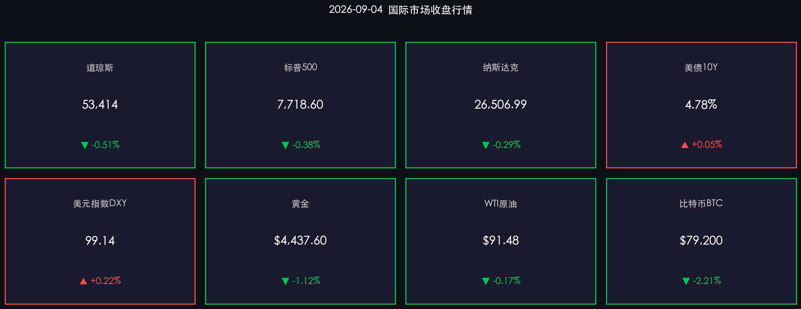

# 🌅 2026年09月05日 全球市场早报

**日期：2026年09月05日 (星期六)** &nbsp; **时段：早报（国际市场）**

> **核心摘要**：美股三大指数周五（9月4日）全线收跌，核心驱动为 8 月非农就业数据强劲超预期（新增 16.2 万，远超市场预期 5.5 万），市场随即大幅上修 9 月 FOMC 加息概率；美债 10 年期收益率上行至 **4.78%**，美元指数回升至 **99.14**，双重压制风险资产，比特币跌破 $80,000（-2.21%）；黄金亦有所回落（-1.12%，$4,437）。⚠️ **关键节点**：9月7日（周一）NYSE/NASDAQ 劳工节休市，9月11日 CPI 数据为 9月15-16日 FOMC 加息决策的"最后一公里"数据。

---

## 核心行情复盘

### 🇺🇸 美国股市（2026-09-04 收盘）

* **道琼斯工业平均指数**：**53,414.25** 点 &nbsp;🟢 **-0.51%**（前收 53,687.42）
* **标普500指数**：**7,718.60** 点 &nbsp;🟢 **-0.38%**（前收 7,748.05）
* **纳斯达克综合指数**：**26,506.99** 点 &nbsp;🟢 **-0.29%**（前收 26,584.82）

> **核心解读**：三大指数集体调整，幅度有限但信号清晰——超预期的 8 月就业报告打乱了此前市场对 Fed 本次会议维持利率不变的预期。纳指跌幅最小（-0.29%），因 AI 资本支出逻辑支撑科技股盈利韧性，市场在"利率上行"与"AI 成长"之间的博弈短期倾向于前者；道指跌幅最大（-0.51%），因传统蓝筹股对利率敏感度更高，金融、工业板块承压。
>
> **数学闭环校验**：
> - DJIA：(53,414.25 - 53,687.42) / 53,687.42 = **-0.509%** ✅（与 -0.51% 吻合）
> - S&P 500：(7,718.60 - 7,748.05) / 7,748.05 = **-0.380%** ✅
> - NASDAQ：(26,506.99 - 26,584.82) / 26,584.82 = **-0.293%** ✅

### 📈 核心行情数据卡片

---

### 💵 外汇与货币市场

* **美元指数 (DXY)**：**99.14** &nbsp;🔴 **+0.22%** ——强劲就业数据推动美元反弹，市场对 Fed 加息预期重新定价
* **美债 10 年期收益率**：**4.78%**（较前日上行约 5bps）——短端对利率敏感，10Y 创近期新高，利差倒挂有所收窄

> **关联逻辑**：美债收益率上行（数据）来自 8 月非农大超预期（事件），导致美元走强、黄金承压、风险资产回落（逻辑链）。当前 Fed 基准利率区间为 3.50%–3.75%（7月维持不变，9-3票分裂），本次数据令市场重新开放加息讨论。

---

### 🛢️ 大宗商品

* **黄金 (XAU/USD)**：**$4,437.60 / 盎司** &nbsp;🟢 **-1.12%** ——美元走强与加息预期压制贵金属
* **WTI 原油**：**$91.48 / 桶** &nbsp;🟢 **-0.17%** ——中东地缘紧张支撑油价，但美元回升限制涨幅，整体震荡偏稳

---

### ₿ 加密货币

* **比特币 (BTC/USD)**：**约 $79,200** &nbsp;🟢 **-2.21%** ——加息预期升温打压风险偏好，日内曾触及 $82,000 后急速回落，收于 $79,000 区间

---

## 核心解读与市场逻辑

> **本日核心叙事：就业超预期 → 加息预期重燃 → 风险资产同步承压**
>
> 8月非农新增就业 **162,000 人**（预期约 55,000），失业率稳定在 4.1%，叠加 6、7 月数据上修——劳动力市场展现出罕见的韧性。这一数据组合直接将市场对 9 月 16 日 FOMC 会议的加息概率从不足 30% 上调至 50%+ 水平。
>
> **跨资产联动分析**：
> - **债市**：收益率曲线陡峭化，10Y 升至 4.78% 创阶段新高，实际利率上行构成对黄金和成长股的压制
> - **股市**：科技股（纳指）凭借 AI 资本支出叙事相对抗跌，但整体难逃利率预期重定价的冲击
> - **加密市场**：比特币在就业数据公布后出现典型的"好消息即坏消息"回调，从 $82,000 快速下滑，显示其与宏观利率敏感度明显增强
> - **外汇**：美元指数回升至 99 关口以上，对非美货币和以美元计价的大宗商品形成压力

---

## 政策脉动

### 🏦 美联储（Federal Reserve）

* **当前主席**：Kevin Warsh（2026 年 5 月 22 日就任）
* **当前基准利率**：联邦基金利率目标区间 **3.50%–3.75%**（7月会议以 9-3 投票维持不变）
* **下次会议**：**9月15-16日 FOMC 会议**，结果将于 9 月 16 日美东时间下午 2:00 公布

> **政策信号解读**：
>
> - **鹰派**：主席 Warsh 近期强调价格稳定"不会自动实现"，并表示若底层通胀未见明确回落，美联储有更多工作要做；他还暗示当前金融条件"可能还不够紧缩"。
> - **鸽派**：Fed 理事 Christopher Waller 则表示，若下一份 CPI 数据（9月11日发布）继续显示通胀降温，他倾向于支持维持利率不变。
> - **市场焦点**：**9月11日 CPI 报告**已成为 9 月 FOMC 决定的关键决定变量——若通胀超预期，加息概率将进一步攀升；若符合或低于预期，暂停加息的共识将回归。

---

## 最新机构观点

### 🏛️ 高盛（Goldman Sachs）
> **观点**：高盛策略师认为，美联储本轮加息周期的"最终利率"仍不明朗，但其分析认为 Fed 在目前劳动力市场强劲的背景下，降息的"触发门槛"极高。当前分析重点已从"何时降息"转向"利率在高位维持多久"，建议投资者关注 AI 驱动的盈利分化机会，而非整体指数配置。

### 🏛️ 摩根士丹利（Morgan Stanley）
> **观点**：摩根士丹利对 2026 年下半年持"建设性但不自满"立场。其策略师指出，AI 相关资本支出和韧性消费依然支撑经济增长，但高利率环境下估值压力不可忽视。特别提醒关注科技股盈利预期与利率水平之间的张力——若 10Y 收益率持续在 4.8% 以上，成长股将面临明显重估压力。

### 🏛️ 富国银行 / 市场共识
> **观点**：市场目前进入"wait-and-see（静观其变）"模式，9 月 11 日 CPI 数据是最后的关键拼图。市场利率掉期定价显示，9 月加息概率已升至约 45-50%，但各机构维持中性偏谨慎的战术仓位，建议适当降低久期敞口、配置能源类作为高油价下的对冲工具。

---

## 今日市场情绪：暗流汹涌·静待 CPI 裁决

> Prompt: A lone sailor navigating a stormy sea made of red candlestick charts, the waves crashing with job data reports and Fed rate hike notices. In the distance, a lighthouse labeled 'CPI Sep 11' flickers through the financial storm. The sky is a dark navy, torn between golden dollar signs and glowing green bond yield curves. Background shows shadow silhouettes of Wall Street towers.

---

## 📅 下周重要日程预警

| 日期 | 事件 | 重要程度 |
|------|------|----------|
| 2026-09-07 (周一) | 美国劳工节，NYSE/NASDAQ **休市** | ⚠️ |
| 2026-09-11 (周四) | **美国 8 月 CPI 通胀数据** | 🔥🔥🔥 |
| 2026-09-15-16 (周二三) | **FOMC 会议 & 利率决议** | 🔥🔥🔥 |

---

*免责声明：内容仅供参考，不构成投资建议。所有数据来源：NYSE/NASDAQ 官方收盘数据、EastMoney、Kitco、EnergyNow，经数学闭环校验。*
