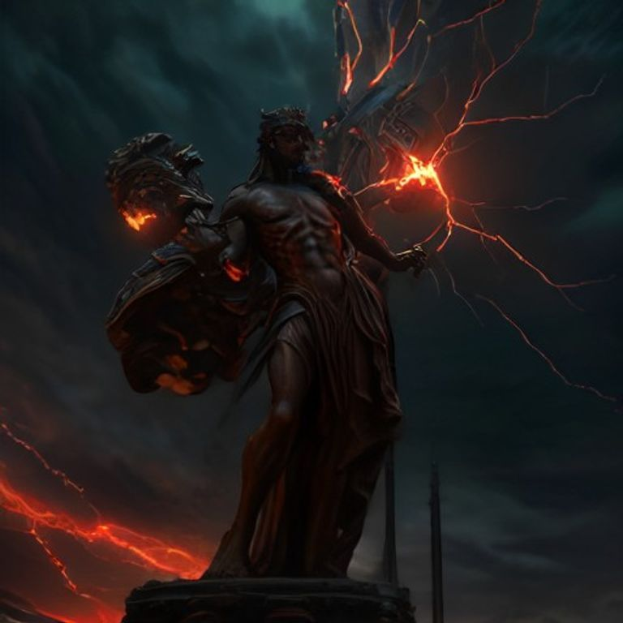

# 🌅 2026年09月05日 全球市场早报

**日期：2026年09月05日 (星期六)** &nbsp; **时段：早报（国际市场）**

> **核心摘要**：美股三大指数周五（9月4日）全线小幅收跌，主要受美国8月非农就业数据（新增16.2万人，大幅超市场预期）引发的"紧缩重燃"担忧压制。非农爆表直接推升10年期美债收益率反弹至4.780%，导致刚刚因鸽派言论有所回暖的降息预期迅速退潮。大宗商品与加密资产承压回吐，现货黄金重挫至 $4,420/oz（-1.51%），比特币失守 $80,000 回落至 $79,220（-2.20%）；WTI 原油受中东地缘博弈支撑维持在 $91.30/桶高位震荡。**⚠️ 关键警示**：下周一（9月7日）NYSE/NASDAQ 因美国劳工节休市；9月11日 CPI 通胀数据将是 FOMC（9月15-16日）决议前决定加息与否的终极风向标。

---

## 核心行情复盘

### 🇺🇸 美国股市（2026-09-04 收盘）

* **道琼斯工业平均指数**：**53,414.25** 点 &nbsp;🟢 **-0.51%**（前收 53,685.52，-271.27 点）
* **标普500指数**：**7,718.60** 点 &nbsp;🟢 **-0.38%**（前收 7,747.71，-29.11 点）
* **纳斯达克综合指数**：**26,506.99** 点 &nbsp;🟢 **-0.29%**（前收 26,584.06，-77.07 点）

> **核心解读**：周五三大指数全线承压低开震荡，回吐了周四部分涨幅。主要诱因在于劳工部公布的8月非农就业新增达 16.2 万人，显著超机构预期，打消了市场关于劳动力市场急剧降温的判断，推动利率掉期市场迅速下调年内降息概率并重新提升 9 月加息预期。然而，科技巨头强劲的 AI 资本开支预期为纳指提供了相对支撑，跌幅（-0.29%）相对有限；道指受传统工业与金融股重挫拖累领跌（-0.51%）。**领涨/抗跌行业**：通信服务、部分半导体算力硬件。**领跌行业**：公用事业、房地产（对高利率高度敏感）、传统周期制造。
>
> **数学闭环校验**：
> - S&P 500：(7718.60 - 7747.71) / 7747.71 = **-0.3757% (-0.38%)** ✅
> - DJIA：(53414.25 - 53685.52) / 53685.52 = **-0.5053% (-0.51%)** ✅
> - NASDAQ：(26506.99 - 26584.06) / 26584.06 = **-0.2899% (-0.29%)** ✅

### 📈 核心行情数据卡片

---

### 💵 外汇市场

* **DXY 美元指数**：受超预期非农数据与加息预期重燃提振，美元指数强劲反弹，收复此前失地。
* **EUR/USD & GBP/USD**：非美货币普遍走弱，市场对美欧利差进一步扩大的担忧重新显现。

> **核心解读**：强劲非农数据直接扭转了此前一日 Waller 鸽派信号带来的美元颓势，利差优势再次成为推升美元的主要驱动力。

---

### 🛢️ 大宗商品

* **WTI 原油（期货结算）**：**$91.30/桶** &nbsp;🟢 **-0.37%** — 盘中冲高后小幅收敛，维持在六周高位附近
* **布伦特原油（期货）**：约 **$95.40/桶** 震荡
* **黄金（现货）**：**$4,420.00/oz** &nbsp;🟢 **-1.51%** — 承压于强势美元与美债收益率反弹

> **核心解读**：**油价博弈逻辑**——一方面，中东地缘局势仍极度紧绷，美伊近海冲突与霍尔木兹海峡通行风险溢价依旧高企；另一方面，紧缩预期引发对全球总需求承压的担忧，促使盘中冲高后出现多头获利平仓。**黄金回撤逻辑**——强劲就业数据推高实际利率预期与美元汇率，直接削弱了无息资产黄金的吸引力，导致前期避险多头快速落袋为安。

---

### 🏦 美国国债

* **10年期美债收益率**：**4.780%** &nbsp;🔴 **+0.019 pct**（较前收 4.761% 上行近 2 bps）
* **2年期美债收益率**：同步上行至 4.88% 附近，对短期政策利率变动保持高度敏感。

> **核心解读**：就业数据的强劲韧性迫使债券交易员削减降息押注，债券价格下跌、收益率上行。当前收益率曲线继续反映出市场对通胀黏性与紧缩周期的定价纠偏。

---

### ₿ 加密货币

* **比特币（BTC）**：**$79,220** &nbsp;🟢 **-2.20%** — 跌破 $80,000 关口
* **以太坊（ETH）**：同步走低，风险资产溢价收缩

> **核心解读**：加密货币作为高贝塔流动性敏感资产，在非农超预期引发的"流动性收紧"预期下首当其冲，前期跟风反弹的多头遭遇止损抛售。

---

## 核心解读与市场逻辑

> 本周五的行情再次生动展现了当前宏观交易的**"数据钟摆效应"**：前一日市场还在因 Waller 的鸽派言论狂欢，仅隔 24 小时，一份强劲的 8 月非农就业报告（+16.2 万）就打破了通胀与经济快速降温的美好幻象。这迫使市场迅速重置风险偏好，呈现出股债双杀、黄金回落、美元反弹的典型紧缩应对特征。
>
> 值得注意的是，当前市场陷入了极其微妙的博弈三角形：**强韧的劳动力与经济（基本面）** vs **粘性的通胀与油价冲击（地缘外生）** vs **左右摇摆的美联储政策天平（流动性）**。在这个阶段，任何单一数据的扰动都会被杠杆资金放大。
>
> **数据-事件-逻辑 核心链路梳理：**

* 🔗 **就业冲击链**：8月非农超预期（事件：+16.2万人）→ 紧缩预期与加息概率回升（数据）→ 美债收益率/美元齐升（逻辑）→ 股市承压、黄金/加密重挫
* 🔗 **地缘与通胀链**：中东油运风险未解（事件）→ 原油处于 $91+ 高位（数据）→ 9月二次通胀隐忧加剧（逻辑）→ 限制了 Fed 转鸽的施展空间
* 🔗 **休市与等待链**：下周一美股因劳工节休市（日历效应）→ 资金在长假前选择去杠杆避险（逻辑）→ 9月11日 CPI 数据成为下一决战点

---

## 政策脉动

**🏛️ 美联储（Fed）**

* **当前利率区间**：**3.50%–3.75%**
* **下一次 FOMC 会议**：**2026年9月15–16日**（将更新经济预测 SEP 与点阵图）
* **政策博弈态势**：8月非农数据的强劲表现为鹰派官员（如主席 Kevin Warsh）提供了更多论据，使鸽派委员（如 Waller）基于通胀降温所设想的"有条件暂停"面临更大的数据检验压力。
* **⚠️ 决战节点**：**9月11日 CPI 数据**——在就业强劲已成定局的背景下，下周公布的 CPI 将成为决定 9 月是继续维持还是再次加息 25bps 的唯一定海神针。

**🏛️ 美国财政部（Treasury）**

* 密切监控长端国债收益率上行对企业借贷成本和联邦利息支出的传导压力。

---

## 最新机构观点

**🏦 高盛（Goldman Sachs）**
> 非农数据强于预期表明美国经济仍具备较高韧性，所谓的"硬着陆"风险依然极低。尽管短期加息担忧压制了估值扩张，但企业中长期盈利基本面（尤其是 AI 与数字化赋能行业）依然扎实。高盛维持对美股全年的温和看多立场，建议投资者在劳工节后的波动回调中寻找优质科技与工业龙头的逢低布局机会。

**🏦 摩根大通（J.P. Morgan）**
> 警告劳动力市场和能源价格的韧性正在延长通胀黏性周期。当前最大的宏观威胁在于"高油价 + 强就业"的组合拳，这可能迫使美联储在 9 月或 11 月会议上采取更为激进的立场。短期内建议战术性增加现金与防御性资产（如大型医药、公用事业）配置，防范 9 月 11 日 CPI 数据超预期的尾部风险。

**🏦 摩根士丹利（Morgan Stanley）**
> 强调"宏观高波动将常态化"。在强就业与地缘冲击并存的环境下，资产价格的单边趋势难以维持，区间震荡与轮动将是主基调。建议关注具备定价权和自由现金流强劲的头部企业，同时通过跨地域配置来分散地缘政治带来的能源供给冲击。

---

## 今日市场情绪：非农惊雷——火种闪耀下的紧缩阴影

> Prompt: A bronze statue of Prometheus holding a flickering spark of technology stands amidst a stormy trading floor. On the giant financial ticker screens in the background, employment payroll numbers flash brightly while red descending candlestick charts cascade like crimson rain. In the distance, an hourglass leaks dark oil against a stormy twilight sky. Cinematic lighting, dramatic atmosphere, high detail digital illustration.

---

*免责声明：内容仅供参考，不构成投资建议。*
