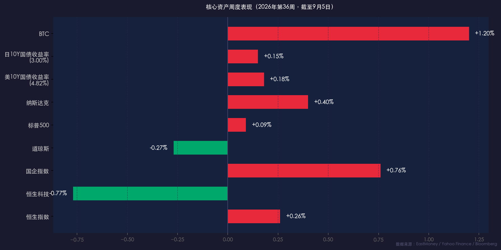

# 金融简报 · 新周展望：利率十字路口，两大央行博弈定调

**日期：2026年09月06日 (星期日)** &nbsp; **时段：周日下午（新周展望）**

> **核心摘要**：美联储9月15-16日议息会议前，8月非农超预期（+16.2万），加息概率升至60%，本周PPI（9/10）与CPI（9/11）将是最终定调数据；日债收益率突破3%创1996年来新高，全球债市承压；A股底部震荡中硬科技仍为主线，港股恒生指数全周微涨0.26%显示相对韧性，下周核心博弈在于通胀数据能否扭转鹰派预期。

---

## 周末财经要闻终极汇总

### 一、美联储鹰派信号持续强化

* **非农就业数据（8月）**：新增就业 **+16.2万人**，远超市场预期，强化了美联储9月继续收紧的论据
* **Fed主席 Kevin Warsh**：在杰克逊霍尔发表鹰派演讲，强调"通胀尚未完全驯服"，坚持数据依赖的货币政策路径
* **加息概率**：CME FedWatch 显示9月加息25bp概率已回升至 **~60%**，市场定价从"暂停"转向"可能加息"

> **核心解读**：本轮美联储政策信号的关键在于Warsh主席明确"通胀回落的趋势若受到干扰，将毫不犹豫重新出手"。这改变了市场此前对利率峰值的乐观预期，并推动美10年期国债收益率一度触及 **4.82%**，创近年新高。

### 二、全球债市全线承压

* 美国10年期国债收益率：**4.82%**（周内触及高点）
* 日本10年期国债收益率：**3.00%**，**创1996年以来新高**；日银"收益率曲线控制（YCC）"压力剧增
* 德国10年期Bund：跟随上行，欧债整体承压

> **核心解读**：美伊地缘冲突持续升温（双方发生武装交火），油价震荡上行，通胀预期难以降温，进而拖累全球长端利率同步上行。"高利率可能成为常态"的叙事正在被越来越多的机构所采用。

### 三、本周（第36周）核心资产表现回顾

| 资产 | 周涨跌幅 | 关键事件 |
|------|----------|---------|
| 恒生指数 | **+0.26%**（25,650.87点） | 先抑后扬，AI相关资产活跃 |
| 恒生科技指数 | **-0.77%** | 受美联储鹰派预期拖累 |
| 国企指数 | **+0.76%** | 南向资金持续流入支撑 |
| 道琼斯工业指数 | **-0.27%** | 美债收益率上行压制 |
| 标普500指数 | **+0.09%** | 基本持平，内部分化明显 |
| 纳斯达克综合指数 | **+0.40%** | 半导体板块非农后走强 |
| 美10Y国债收益率 | **4.82%**（高点） | 通胀预期重燃 |
| 日10Y国债收益率 | **3.00%** | 1996年以来新高 |

### 四、个股与板块亮点

* **亚马逊**：遭FTC起诉，股价承压明显
* **半导体板块**：非农后逆势走强，成为本周美股最亮眼板块
* **Snowflake等AI软件股**：因AI业务增长预期上调股价大幅跳涨
* **港股AI资产**：MiniMax、曦智科技等本周表现活跃

### 五、PBOC：定向宽松，稳字当头

* PBOC 坚持"适度宽松"立场，主推**定向支持**"新质生产力"（半导体、农业、小微企业）
* 刚发布的**金融五年规划（2026-2030）**强调人民币国际化与高水平金融开放
* 离岸人民币（CNH）保持相对稳定，PBOC 以逆回购工具精细调节流动性

---

## 新一周市场核心博弈逻辑

本周（9月7-11日）是美联储9月15-16日会议前的**最后窗口期**，市场将进入"数据真空期末段冲刺"。核心博弈主要围绕以下两条主线：

### 主线一：通胀数据能否扭转鹰派预期？

* **周四（9/10）美国8月PPI**（20:30 北京时间）：若核心PPI环比超0.3%，美债收益率将再度上行
* **周五（9/11）美国8月CPI**（20:30 北京时间）：**本周最核心事件**，市场预期核心CPI同比约3.1%
  * **超预期**（核心CPI环比>0.3%）→ 加息概率升至70%+ → 美债上行 → 科技股承压 → 黄金跌
  * **符合预期或低于预期** → 加息预期降温 → 美债回落 → 成长股喘息 → 人民币相对受益

### 主线二：A股能否凝聚做多共识？

> **逻辑**：A股目前呈现"底部有支撑、顶部有压力"的宽幅震荡格局。外围鹰派预期是主要扰动，但国内流动性充裕、PBOC定向宽松格局未变。

* **多头依据**：南向资金持续净流入港股（支撑港股底部）；A股两市成交额周末出现放量，分歧加剧后或迎来方向选择
* **空头风险**：若美CPI超预期，外资将加速从港股抽离，A股情绪连带承压
* **结构机会**：资金从前期拥挤的科技硬件板块流向低位防御资产（消费、养殖、农业、红利），"高低切换"逻辑延续

---

## 本周重磅经济数据与会议前瞻

| 日期 | 事件 | 重要程度 |
|------|------|---------|
| **周一（9/7）** | 美国劳动节假期，NYSE/NASDAQ休市 | ⚠️ 注意流动性 |
| **周二（9/8）** | 美联储官员密集发言窗口期 | ⭐⭐⭐ |
| **周四（9/10）** | 美国8月PPI（20:30 北京时间） | ⭐⭐⭐⭐ |
| **周五（9/11）** | 美国8月CPI（20:30 北京时间） | ⭐⭐⭐⭐⭐ 最关键 |
| **下下周（9/15-16）** | 美联储FOMC利率决议 + 点阵图 + 经济预测（SEP） | ⭐⭐⭐⭐⭐ |
| **9/17** | 日本央行金融政策决定会议 / 英国央行MPC决议 | ⭐⭐⭐⭐ |

> ⚠️ **特别提示**：**周一（9/7）为美国劳动节**，NYSE与NASDAQ全天休市，美股无收盘数据。A股与港股正常交易，但外资情绪可能偏保守。

---

## 头部券商/投行开盘策略点睛

**高盛（Goldman Sachs）**：
> 维持"中性偏谨慎"立场，认为市场正进入"数据主导期"。若CPI高于3.2%，将触发美股新一轮修正。建议配置防御性资产（医疗、公用事业）+ 高股息标的。

**中金公司（CICC）**：
> A股底部区间震荡格局已形成，2026年全年盈利修复逻辑未变。建议关注：1）受益于PBOC定向宽松的新质生产力（半导体、光模块）；2）被过度抛售的消费修复标的。对港股持"战术性看多"态度，目标区间25,000-27,000点。

**摩根大通（JPMorgan）**：
> 全球债市进入"痛苦测试"阶段。美10Y收益率若突破5%，将触发资产价格重定价链式反应。警惕"央行政策错误"尾部风险，建议持有现金比例高于历史均值。

---

## 今日市场情绪：鹰鸽博弈，乘风险浪

> Prompt: A lone ship navigates a stormy sea made of red candlestick charts and bond yield curves rising like sharp cliffs. In the background, two colossal stone titans labeled 'Fed' and 'PBOC' play chess on a cosmic board, their moves shaking the ocean waves. The sky is split between a hawkish eagle and a cautious dove.

---

*免责声明：内容仅供参考，不构成投资建议。*
